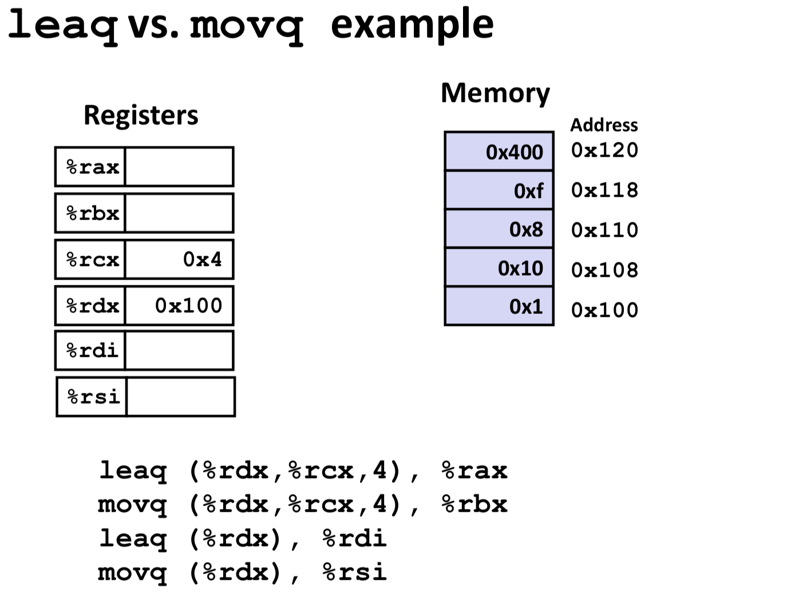
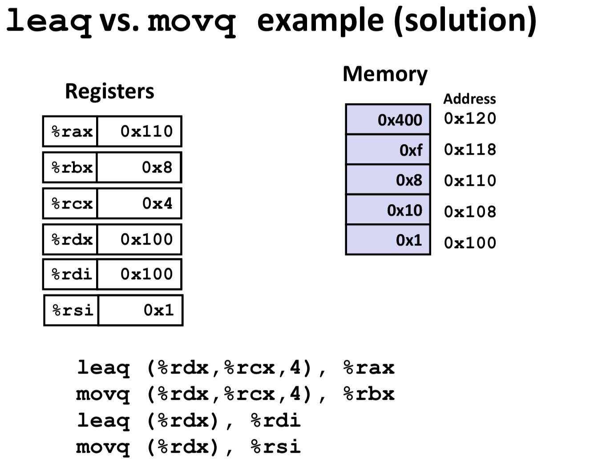

# HelloARMAssembly
[TOC]

---

### 1、汇编语法基础知识[^3]

（1） ;或者@开头是注释

```assembly
; BB#0:
	sub	sp, sp, #16             ; =16
```

（2）以冒号结尾是标号（label），一般以L开头

```assembly
Lcfi0:
	.cfi_def_cfa_offset 16
	str	w0, [sp, #12]
	str	w1, [sp, #8]
Ltmp1:
	.loc	1 13 13 prologue_end
```

（3）c函数一般以下划线开头

```assembly
	.globl	_addFunction
	.p2align	2
_addFunction:  
```

（4）以.开头的是汇编指令，不是汇编代码

```assembly
	.section	__TEXT,__text,regular,pure_instructions
	.ios_version_min 11, 2
	.file	1 "/Users/wesley_chen/GitHub_Projcets/HelloProjects/HelloARMAssembly" "/Users/wesley_chen/GitHub_Projcets/HelloProjects/HelloARMAssembly/HelloARMAssembly/addFunction.m"
	.globl	_addFunction
	.p2align	2
```

（5）栈的生长方式

栈的分配空间总是从高地址到低地址，例如

```assembly
_addFunction:                           ; @addFunction
Lfunc_begin0:
	sub	sp, sp, #16             ; =16
Lcfi0:
	str	w0, [sp, #12]
	str	w1, [sp, #8]
```

sp减去16个bytes，腾出16个bytes空间。`str`(store register)意思是将寄存器的值到指定位置。例如str	w0, [sp, #12]，将w0寄存器的值存到地址为sp+12处。`sp`（stack pointer）是栈指针，总是指向栈的顶部。

和str相反，`ldr`(load register)意思是将指定地址的值装载到寄存器中。例如

```assembly
ldr	w0, [sp, #12]
ldr	w1, [sp, #8]
```

上面将sp+12处的值装载到w0寄存器中

（6）add操作符

```assembly
add		w0, w0, w1
```
将w0和w1的值相加，然后存到w0中。

还有另外一种形式，只带两个操作数

```assembly
add	r0, r1
```
也是将r0和r1相加，然后存到r0中。

（7）push操作符

```assembly
push	{r7, lr}
```

将r7和lr压入栈中，sp自动减少8个字节，由于r7和lr占4个字节

（8）mov操作符

```assembly
@ 1
mov	r1, r0

@ 2
mov	r0, #12
```

@1，将r1的值覆盖到r0，r1的值不变

@2，将值12放到r0（注意，destination和@1不一样）

### 2、addFunction例子

```c
int addFunction(int a, int b)
{
    int c = a + b;
    return c;
}
```
Xcode中Destination选择Generic iOS Device，Product -> Perform Action -> Assemble "addFunction.m"，得到汇编代码（去掉了一些自动生成的注释），如下

```assembly
; Assembly output for addFunction.m
; Using Debug configuration, arm64 architecture for HelloARMAssembly target of HelloARMAssembly project

_addFunction:                           ; @addFunction
Lfunc_begin0:
	.cfi_startproc
; BB#0:
@ 1
	sub	sp, sp, #16             ; =16
Lcfi0:
@ 2
	str	w0, [sp, #12]
	str	w1, [sp, #8]
Ltmp1:
	ldr	w0, [sp, #12]
	ldr	w1, [sp, #8]
@ 3
	add		w0, w0, w1
@ 4	
	str	w0, [sp, #4]
	ldr	w0, [sp, #4]
@ 5
	add	sp, sp, #16             ; =16
@ 6
	ret
Ltmp2:
Lfunc_end0:
```

关于call convention

* r0-r3，用于存放函数传参
* r4-f11，用于存放函数内的本地变量
* r12，This is the intra-procedure-call scratch register. This register is special in that it can be changed across a function call.
* r13，stack pointer（sp）。这个寄存器存放指向栈顶的指针。
* r14，link register（lr）。存放当函数返回时，执行的下一条指令的地址
* r15，program counter（pc）。指向正在执行指令的地址，指令执行完后，pc自动加1

上面是ARM 32位的call convention，一共有16个寄存器

为了解释方便，添加@1-@6

@1，由于栈由高地址向低地址生长，使用sub指令分配栈空间，这里分配16个字节的栈空间

@2，str指令，将w0和w1分别存在栈上的sp+12和sp8处。而ldr指令，将栈上的sp+12和sp8处的值分别存到w0和w1中。由于是Debug，这里存在冗余的汇编代码。

@3，实际执行a+b的地方，注意结果存在w0中，w0也是返回值存放的寄存器。

@4，str指令和ldr指令，把w0存到sp+4处，又从sp+4存回到w0。也是冗余的汇编代码。

@5，清理分配的栈空间

@6，ret指令返回函数，这里返回值存在了w0中。有些这里不是ret，而是

```assembly
bx	lr
```

作用和ret是一样的。lr即link register，指向函数返回后的，下一条指向指令的地址

将build configuration设置成Release，Product -> Perform Action -> Assemble "addFunction.m"，重新得到汇编代码（去掉了一些自动生成的注释），如下

```assembly
; Assembly output for addFunction.m
; Using Release configuration, arm64 architecture for HelloARMAssembly target of HelloARMAssembly project

; BB#0:
	;DEBUG_VALUE: addFunction:a <- %W0
	;DEBUG_VALUE: addFunction:b <- %W1
	add		w0, w1, w0
Ltmp0:
	;DEBUG_VALUE: addFunction:c <- %W0
	ret
Ltmp1:
Lfunc_end0:
	.cfi_endproc
```

这里汇编代码的指令只有两条add		w0, w1, w0和ret。由于addFunction函数对应的汇编代码非常短，编译器有可能自动将其变成内联函数（inline function），这样不用调用addFunction函数，省去函数调用的开销。

为了方便学习，需要阻止这样的编译器优化，可以加上`__attribute__((noinline))。`

### 3、指令简化手册

```
mov r0, r1 => r0 = r1
mov r0, #10 => r0 = 10
ldr r0, [sp] => r0 = *sp
str r0, [sp] => *sp = r0
add r0, r1, r2 => r0 = r1 + r2
add r0, r1 => r0 = r0 + r1
push {r0, r1, r2} => Push r0, r1 and r2 onto the stack.
pop {r0, r1, r2} => Pop three values off the stack, putting them into r0, r1 and r2.
b _label => pc = _label
bl _label => lr = pc + 4; pc = _label
stp x29, x30, [sp, #16] => *(sp + 16) = x29, *(sp + 20) = x30
```

stp指令[^1]
adrp指令[^2]

### 4、x86_64的Call Convention

```
First Argument: RDI
Second Argument: RSI
Third Argument: RDX
Fourth Argument: RCX
Fifth Argument: R8
Sixth Argument: R9
```

```
NSString *name = @"Zoltan";
NSLog(@"Hello world, I am %@. I'm %d, and I live in %@.", name, 30, @"my father's basement");
```
=>

```
RDI = @"Hello world, I am %@. I'm %d, and I live in %@.";
RSI = @"Zoltan";
RDX = 30;
RCX = @"my father's basement";
NSLog(RDI, RSI, RDX, RCX);
```

`image lookup -rn '\ mouseDown:'`


### 5、leaq vs. movq的区别

举个例子[^4]，如下



执行leaq和movq指令后，寄存器的结果，如下



几点说明，如下

* leaq，不解引用地址，直接将地址赋值给dest；movq，解引用地址，将值赋值给dest
* (%rdx, %rcx, 4)的用法[^5]是，%rdx + %rcx * 4，得到0x110。


References
--

[^1]: http://infocenter.arm.com/help/index.jsp?topic=/com.arm.doc.dui0802a/STP_gen.html
[^2]: http://infocenter.arm.com/help/index.jsp?topic=/com.arm.doc.dui0802a/ADRP.html

[^3]: https://www.raywenderlich.com/2705-ios-assembly-tutorial-understanding-arm 
[^4]: https://courses.cs.washington.edu/courses/cse374/16wi/lectures/leaq-movq.pdf
[^5]: https://stackoverflow.com/questions/4534617/lea-instruction 


