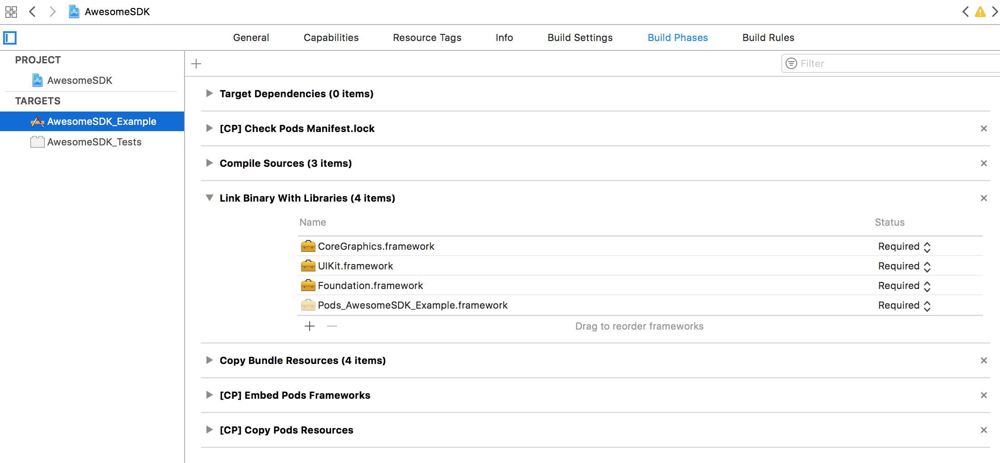
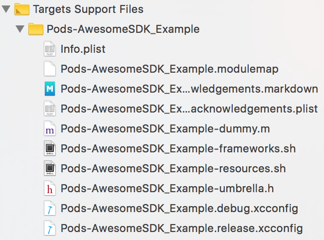
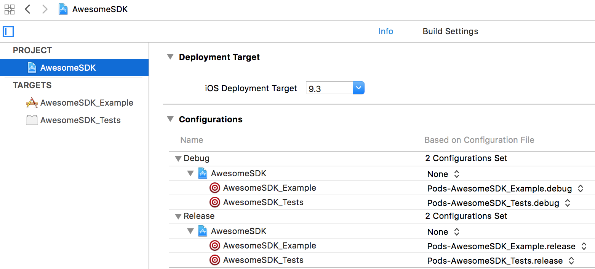

# CocoaPods 

---

### 1. Pod生成哪些文件

```
...
AwesomeSDK.xcworkspace
Podfile.lock
Pods
 |- Headers
 |- Local Podspecs
 |- Manifest.lock
 |- Pods.xcodeproj
 |- Target Support Files
     |- <Target 1>
     |- <Target 2>
```


### 2. Pod集成的原理

&nbsp;&nbsp;&nbsp;&nbsp;&nbsp;&nbsp;&nbsp;&nbsp;如果使用`pod lib create <Pod Name>`，而且创建了Example工程，那么这个Example工程实际就是一个集成工程。打开Example下的.xcworkspace，会有两个xcodeproj，一个是\<Pod Name\>.xcodeproj，一个是Pods.xcodeproj。前者是集成工程，后者是Pod工程。

&nbsp;&nbsp;&nbsp;&nbsp;&nbsp;&nbsp;&nbsp;&nbsp;Pods.xcodeproj，对应的targets主要有两种：Pod对应的动态库/静态库，一般有多个（后面简称<b>Pod Target</b>）；用于桥接的动态库/静态库（后面简称<b>桥接Target</b>），作用是链接到集成工程中，用于触发Pod动态库/静态库的编译，拷贝等动作。

&nbsp;&nbsp;&nbsp;&nbsp;&nbsp;&nbsp;&nbsp;&nbsp;举个例子，在集成工程的<b>Link Binary With Libraries</b> phase中，CocoaPods添加Pods.xcodeproj中一个target，Pods\_AwesomeSDK\_Example.framework。这样编译App Target之前，首先会编译这个桥接Target。

> 注意：Pods\_AwesomeSDK\_Example.framework的可执行文件是静态库，实际属于static framework



在上面集成工程中，CocoaPods对Build Phases添加了三个phase

* [CP] Check Pods Manifest.lock    
主要作用是，在执行编译Pod Target和App Target之前，用diff命令对比Podfile.lock和Manifest.lock。(TODO：作用是？)。执行pod install/update时，也会通过对比Podfile.lock和Manifest.lock，检查Podfile中哪些pod有改动，需要做Add/Remove/Update操作。

* [CP] Embed Pods Frameworks    
主要是执行一个脚本<b>\<Target Name\>-frameworks.sh</b>，用于
  * 拷贝framework（`install_framework`）
  * 拷贝dSYM文件（`install_dsym`）
  * framework签名（`code_sign_if_enabled`）
  * 分离framework的架构（`strip_invalid_archs`）

* [CP] Copy Pods Resources    
也是执行一个脚本<b>\<Target Name\>-resources.sh</b>，用于拷贝framework的资源（stroyboard、xib、xcdatamodel、xcassets等）。有些资源需要经过编译后拷贝到framework下面，脚本使用相应的命令行工具进行处理，例如ibtool用于编译stroyboard和xib。

&nbsp;&nbsp;&nbsp;&nbsp;&nbsp;&nbsp;&nbsp;&nbsp;值得注意的是，Pod.xcodeproj对应的target，包括桥接Target、Pod Target等所需的文件都放在<b>Target Support Files/\<Target Name\></b>文件夹下。例如，Example需要的桥接Target



&nbsp;&nbsp;&nbsp;&nbsp;&nbsp;&nbsp;&nbsp;&nbsp;除了上面两个脚本比较重要之外，上面的两个xcconfig文件用于定义一些脚本和Xcode所要的环境变量。

```
FRAMEWORK_SEARCH_PATHS = $(inherited) "$PODS_CONFIGURATION_BUILD_DIR/AwesomeSDK"
GCC_PREPROCESSOR_DEFINITIONS = $(inherited) COCOAPODS=1
LD_RUNPATH_SEARCH_PATHS = $(inherited) '@executable_path/Frameworks' '@loader_path/Frameworks'
OTHER_CFLAGS = $(inherited) -iquote "$PODS_CONFIGURATION_BUILD_DIR/AwesomeSDK/AwesomeSDK.framework/Headers"
OTHER_LDFLAGS = $(inherited) -framework "AwesomeSDK"
PODS_BUILD_DIR = $BUILD_DIR
PODS_CONFIGURATION_BUILD_DIR = $PODS_BUILD_DIR/$(CONFIGURATION)$(EFFECTIVE_PLATFORM_NAME)
PODS_PODFILE_DIR_PATH = ${SRCROOT}/.
PODS_ROOT = ${SRCROOT}/Pods
```

&nbsp;&nbsp;&nbsp;&nbsp;&nbsp;&nbsp;&nbsp;&nbsp;这些xcconfig文件，配置在集成工程的<b>Configurations</b>中，如下




