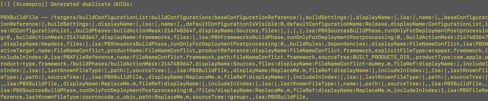
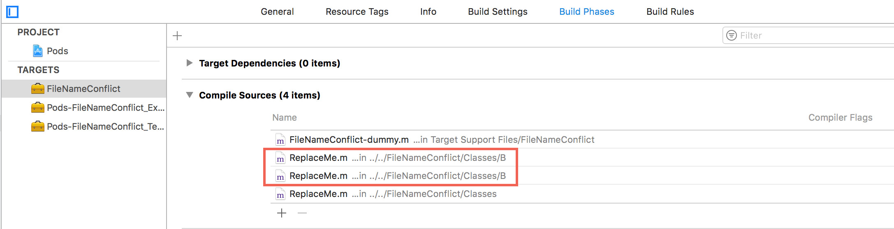

# CocoaPods Issues
[TOC]

## 1、文件名冲突

文件组织结构，如下

```
<Pod Name>
 |- Assets
 |- Classes
     |- ReplaceMe.m
     |- A
     |  |- ReplaceMe.m
     |
     |- B
        |- ReplaceMe.m 
```

问题1： pod install产生警告：[!] [Xcodeproj] Generated duplicate UUIDs



Pod中有相同命名的源文件，可能报此警告。不同Pod有相同文件名的文件，则不会有此警告。


问题2：有可能少编译的源文件

podspec文件

```
s.source_files = 'FileNameConflict/Classes/**/*'
```



上面B中的ReplaceMe.m重复链接两次，而A中ReplaceMe.m没有编译进来。


## 2、Framework命名冲突[^1]

```ruby
platform :ios, '9.0'
use_frameworks!

target 'ConflictFrameworkName' do
end

target 'FrameworkA' do
  pod 'AFNetworking'
end

target 'FrameworkB' do
  pod 'AFNetworking'
end
```


上面的Podfile，在使用CocoaPods 1.2.0版本时，报错如下

```shell
[!] The 'Pods-ConflictFrameworkName' target has frameworks with conflicting names: afnetworking.
```


解决方法1：

升级CocoaPods版本


解决方法2：嵌套target，来安装pod

```ruby
platform :ios, '9.0'
use_frameworks!

target 'ConflictFrameworkName' do
end

target 'FrameworkA' do
  pod 'AFNetworking'

  target 'FrameworkB' do
    inherit! :search_paths
  end
end
```


## References

[^1]:https://github.com/CocoaPods/CocoaPods/issues/6446

