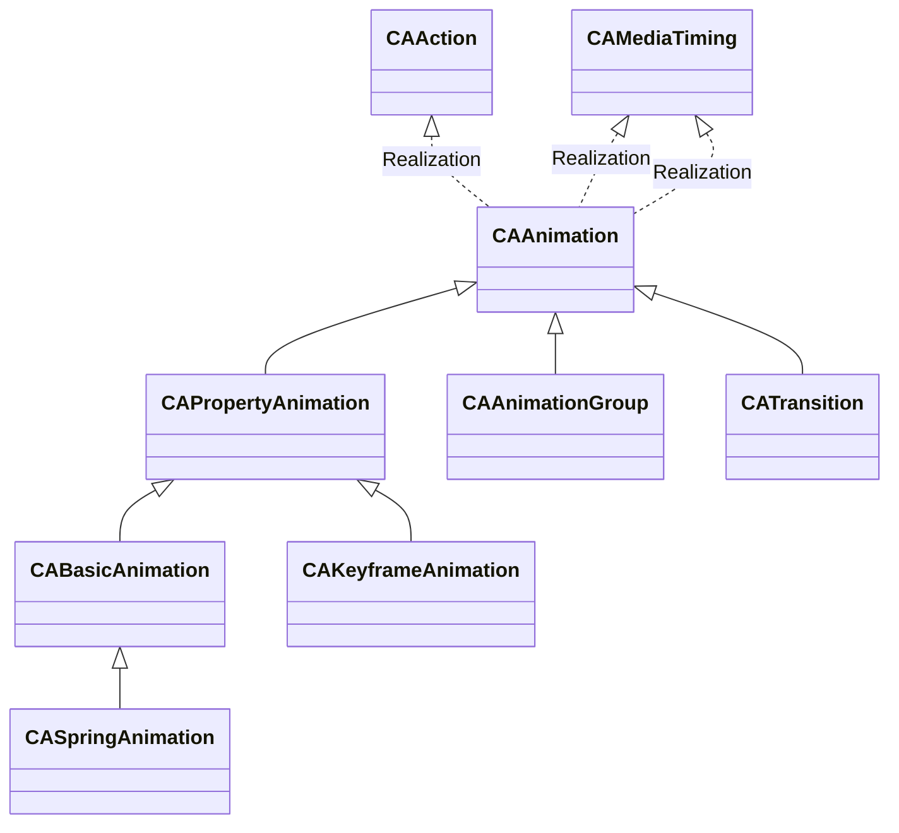

# HelloCoreAnimation

[TOC]

## 1、Class Hierarchy

https://www.objc.io/issues/12-animations/animations-explained/

https://www.calayer.com/core-animation/2017/12/25/cashapelayer-in-depth-part-ii.html

https://stackoverflow.com/questions/428110/how-can-i-replicate-the-trashing-animation-of-mail-app

https://stackoverflow.com/questions/11578841/genie-effect-ipad

## References

