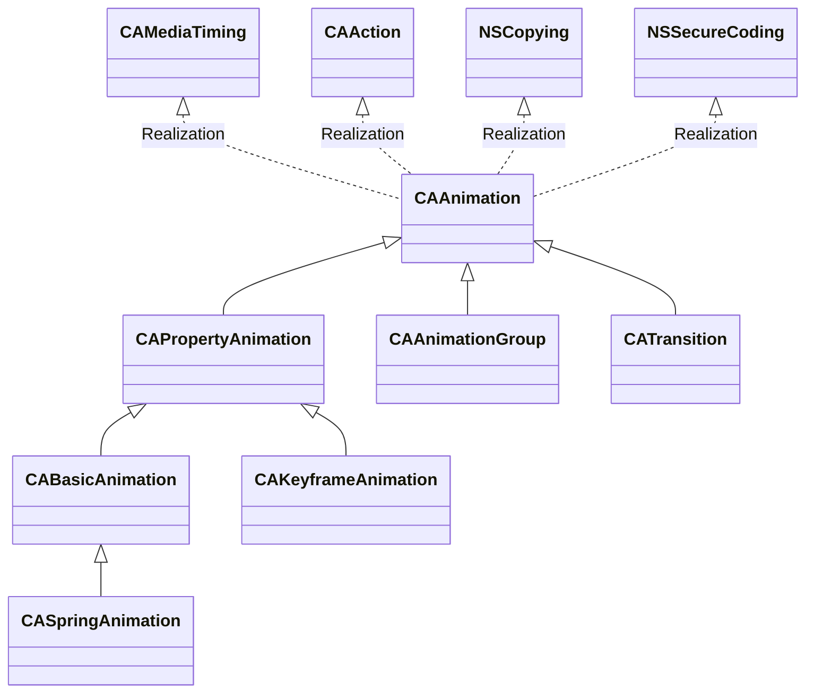

# HelloCoreAnimation

[TOC]

## 1、介绍CoreAnimation

CoreAnimation是iOS的动画框架，提供高性能的动画。官方对CoreAnimation的描述如下

> Core Animation provides high frame rates and smooth animations without burdening the CPU and slowing down your app. Most of the work required to draw each frame of an animation is done for you. You configure animation parameters such as the start and end points, and Core Animation does the rest, handing off most of the work to dedicated graphics hardware, to accelerate rendering. For more details, see [Core Animation Programming Guide](https://developer.apple.com/library/archive/documentation/Cocoa/Conceptual/CoreAnimation_guide/Introduction/Introduction.html#//apple_ref/doc/uid/TP40004514).


CALayer是动画操作的对象，每个CALayer对象内部维护有2个CALayer实例，一个是modelLayer（也是CALayer对象本身），一个presentationLayer。当执行动画时，实际是改变presentationLayer的状态。例如执行CALayer的透明度变化的动画，实际是修改presentationLayer的opacity属性[^1]。

可以通过下面两个API来获取这两个CALayer

```objective-c
- (instancetype)modelLayer;
- (instancetype)presentationLayer;
```


### （1）类继承和实现关系

​       CoreAnimation提供一些类用于配置动画，例如CABasicAnimation、CAKeyframeAnimation等。它们的基类都是CAAnimation，而CAAnimation实现了CAMediaTiming协议，以及其他协议（CAAction、NSCopying、NSSecureCoding）。类的继承和实现关系，如下





### （2）显示动画 (explicit animations) 和隐式动画 (implicit animations)

* 显示动画

​       需要调用执行动画的API都称为显示动画。例如UIView的`+animateWithDuration:animations:`方法，CALayer的`-addAnimation:forKey:key`方法。

* 隐式动画

​        而隐式动画，是指直接修改CALayer的属性，默认产生的动画效果。例如创建CALayer对象，在点击事件中，修改它的position，就可以触发一个动画。

官方文档[^2]，描述如下

> Implicit animations use the default timing and animation properties to perform an animation, whereas explicit animations require you to configure those properties yourself using an animation object.


注意

> 1. 从UIView获取它内部的CALayer，修改它的属性，并不没有隐式动画
> 2. 隐式动画的时间都是0.25，见下面“Animatable Properties”一节


#### a. Animatable Properties[^3]

可以执行隐式动画的属性，如下

| Property            | Default animation                                            |
| :------------------ | :----------------------------------------------------------- |
| `anchorPoint`       | Uses the default implied `CABasicAnimation` object, described in [Table B-2](https://developer.apple.com/library/archive/documentation/Cocoa/Conceptual/CoreAnimation_guide/AnimatableProperties/AnimatableProperties.html#//apple_ref/doc/uid/TP40004514-CH11-SW2). |
| `backgroundColor`   | Uses the default implied `CABasicAnimation` object, described in [Table B-2](https://developer.apple.com/library/archive/documentation/Cocoa/Conceptual/CoreAnimation_guide/AnimatableProperties/AnimatableProperties.html#//apple_ref/doc/uid/TP40004514-CH11-SW2). |
| `backgroundFilters` | Uses the default implied `CATransition` object, described in [Table B-3](https://developer.apple.com/library/archive/documentation/Cocoa/Conceptual/CoreAnimation_guide/AnimatableProperties/AnimatableProperties.html#//apple_ref/doc/uid/TP40004514-CH11-SW3). Sub-properties of the filters are animated using the default implied `CABasicAnimation` object, described in [Table B-2](https://developer.apple.com/library/archive/documentation/Cocoa/Conceptual/CoreAnimation_guide/AnimatableProperties/AnimatableProperties.html#//apple_ref/doc/uid/TP40004514-CH11-SW2). |
| `borderColor`       | Uses the default implied `CABasicAnimation` object, described in [Table B-2](https://developer.apple.com/library/archive/documentation/Cocoa/Conceptual/CoreAnimation_guide/AnimatableProperties/AnimatableProperties.html#//apple_ref/doc/uid/TP40004514-CH11-SW2). |
| `borderWidth`       | Uses the default implied `CABasicAnimation` object, described in [Table B-2](https://developer.apple.com/library/archive/documentation/Cocoa/Conceptual/CoreAnimation_guide/AnimatableProperties/AnimatableProperties.html#//apple_ref/doc/uid/TP40004514-CH11-SW2). |
| `bounds`            | Uses the default implied `CABasicAnimation` object, described in [Table B-2](https://developer.apple.com/library/archive/documentation/Cocoa/Conceptual/CoreAnimation_guide/AnimatableProperties/AnimatableProperties.html#//apple_ref/doc/uid/TP40004514-CH11-SW2). |
| `compositingFilter` | Uses the default implied `CATransition` object, described in [Table B-3](https://developer.apple.com/library/archive/documentation/Cocoa/Conceptual/CoreAnimation_guide/AnimatableProperties/AnimatableProperties.html#//apple_ref/doc/uid/TP40004514-CH11-SW3). Sub-properties of the filters are animated using the default implied `CABasicAnimation` object, described in [Table B-2](https://developer.apple.com/library/archive/documentation/Cocoa/Conceptual/CoreAnimation_guide/AnimatableProperties/AnimatableProperties.html#//apple_ref/doc/uid/TP40004514-CH11-SW2). |
| `contents`          | Uses the default implied `CABasicAnimation` object, described in [Table B-2](https://developer.apple.com/library/archive/documentation/Cocoa/Conceptual/CoreAnimation_guide/AnimatableProperties/AnimatableProperties.html#//apple_ref/doc/uid/TP40004514-CH11-SW2). |
| `contentsRect`      | Uses the default implied `CABasicAnimation` object, described in [Table B-2](https://developer.apple.com/library/archive/documentation/Cocoa/Conceptual/CoreAnimation_guide/AnimatableProperties/AnimatableProperties.html#//apple_ref/doc/uid/TP40004514-CH11-SW2). |
| `cornerRadius`      | Uses the default implied `CABasicAnimation` object, described in [Table B-2](https://developer.apple.com/library/archive/documentation/Cocoa/Conceptual/CoreAnimation_guide/AnimatableProperties/AnimatableProperties.html#//apple_ref/doc/uid/TP40004514-CH11-SW2). |
| `doubleSided`       | There is no default implied animation.                       |
| `filters`           | Uses the default implied `CABasicAnimation` object, described in [Table B-2](https://developer.apple.com/library/archive/documentation/Cocoa/Conceptual/CoreAnimation_guide/AnimatableProperties/AnimatableProperties.html#//apple_ref/doc/uid/TP40004514-CH11-SW2). Sub-properties of the filters are animated using the default implied `CABasicAnimation` object, described in [Table B-2](https://developer.apple.com/library/archive/documentation/Cocoa/Conceptual/CoreAnimation_guide/AnimatableProperties/AnimatableProperties.html#//apple_ref/doc/uid/TP40004514-CH11-SW2). |
| `frame`             | This property is not animatable. You can achieve the same results by animating the `bounds` and `position` properties. |
| `hidden`            | Uses the default implied `CABasicAnimation` object, described in [Table B-2](https://developer.apple.com/library/archive/documentation/Cocoa/Conceptual/CoreAnimation_guide/AnimatableProperties/AnimatableProperties.html#//apple_ref/doc/uid/TP40004514-CH11-SW2). |
| `mask`              | Uses the default implied `CABasicAnimation` object, described in [Table B-2](https://developer.apple.com/library/archive/documentation/Cocoa/Conceptual/CoreAnimation_guide/AnimatableProperties/AnimatableProperties.html#//apple_ref/doc/uid/TP40004514-CH11-SW2). |
| `masksToBounds`     | Uses the default implied `CABasicAnimation` object, described in [Table B-2](https://developer.apple.com/library/archive/documentation/Cocoa/Conceptual/CoreAnimation_guide/AnimatableProperties/AnimatableProperties.html#//apple_ref/doc/uid/TP40004514-CH11-SW2). |
| `opacity`           | Uses the default implied `CABasicAnimation` object, described in [Table B-2](https://developer.apple.com/library/archive/documentation/Cocoa/Conceptual/CoreAnimation_guide/AnimatableProperties/AnimatableProperties.html#//apple_ref/doc/uid/TP40004514-CH11-SW2). |
| `position`          | Uses the default implied `CABasicAnimation` object, described in [Table B-2](https://developer.apple.com/library/archive/documentation/Cocoa/Conceptual/CoreAnimation_guide/AnimatableProperties/AnimatableProperties.html#//apple_ref/doc/uid/TP40004514-CH11-SW2). |
| `shadowColor`       | Uses the default implied `CABasicAnimation` object, described in [Table B-2](https://developer.apple.com/library/archive/documentation/Cocoa/Conceptual/CoreAnimation_guide/AnimatableProperties/AnimatableProperties.html#//apple_ref/doc/uid/TP40004514-CH11-SW2). |
| `shadowOffset`      | Uses the default implied `CABasicAnimation` object, described in [Table B-2](https://developer.apple.com/library/archive/documentation/Cocoa/Conceptual/CoreAnimation_guide/AnimatableProperties/AnimatableProperties.html#//apple_ref/doc/uid/TP40004514-CH11-SW2). |
| `shadowOpacity`     | Uses the default implied `CABasicAnimation` object, described in [Table B-2](https://developer.apple.com/library/archive/documentation/Cocoa/Conceptual/CoreAnimation_guide/AnimatableProperties/AnimatableProperties.html#//apple_ref/doc/uid/TP40004514-CH11-SW2). |
| `shadowPath`        | Uses the default implied `CABasicAnimation` object, described in [Table B-2](https://developer.apple.com/library/archive/documentation/Cocoa/Conceptual/CoreAnimation_guide/AnimatableProperties/AnimatableProperties.html#//apple_ref/doc/uid/TP40004514-CH11-SW2). |
| `shadowRadius`      | Uses the default implied `CABasicAnimation` object, described in [Table B-2](https://developer.apple.com/library/archive/documentation/Cocoa/Conceptual/CoreAnimation_guide/AnimatableProperties/AnimatableProperties.html#//apple_ref/doc/uid/TP40004514-CH11-SW2). |
| `sublayers`         | Uses the default implied `CABasicAnimation` object, described in [Table B-2](https://developer.apple.com/library/archive/documentation/Cocoa/Conceptual/CoreAnimation_guide/AnimatableProperties/AnimatableProperties.html#//apple_ref/doc/uid/TP40004514-CH11-SW2). |
| `sublayerTransform` | Uses the default implied `CABasicAnimation` object, described in [Table B-2](https://developer.apple.com/library/archive/documentation/Cocoa/Conceptual/CoreAnimation_guide/AnimatableProperties/AnimatableProperties.html#//apple_ref/doc/uid/TP40004514-CH11-SW2). |
| `transform`         | Uses the default implied `CABasicAnimation` object, described in [Table B-2](https://developer.apple.com/library/archive/documentation/Cocoa/Conceptual/CoreAnimation_guide/AnimatableProperties/AnimatableProperties.html#//apple_ref/doc/uid/TP40004514-CH11-SW2). |
| `zPosition`         | Uses the default implied `CABasicAnimation` object, described in [Table B-2](https://developer.apple.com/library/archive/documentation/Cocoa/Conceptual/CoreAnimation_guide/AnimatableProperties/AnimatableProperties.html#//apple_ref/doc/uid/TP40004514-CH11-SW2). |


**Table B-2** Default Implied Basic Animation

| Description | Value                                                    |
| :---------- | :------------------------------------------------------- |
| Class       | `CABasicAnimation`                                       |
| Duration    | 0.25 seconds, or the duration of the current transaction |
| Key path    | Set to the property name of the layer.                   |


**Table B-3** Default Implied Transition

| Description    | Value                                                    |
| :------------- | :------------------------------------------------------- |
| Class          | `CATransition`                                           |
| Duration       | 0.25 seconds, or the duration of the current transaction |
| Type           | Fade (`kCATransitionFade`)                               |
| Start progress | `0.0`                                                    |
| End progress   | `1.0`                                                    |


https://www.objc.io/issues/12-animations/animations-explained/

https://www.calayer.com/core-animation/2017/12/25/cashapelayer-in-depth-part-ii.html

https://stackoverflow.com/questions/428110/how-can-i-replicate-the-trashing-animation-of-mail-app

https://stackoverflow.com/questions/11578841/genie-effect-ipad


## 2、CABasicAnimation

CABasicAnimation如其命名，是一个基础的动画类，也比较简单。它自身有3个属性，如下

| 属性名    | 作用                                              | 说明 |
| --------- | ------------------------------------------------- | ---- |
| fromValue | 动画开始状态的值                                  |      |
| toValue   | 动画结束状态的值                                  |      |
| byValue   | 动画的增量，即动画结束状态的值 - 动画开始状态的值 |      |


### （1）配置CABasicAnimation

一个滑动的动画为例，如下

```objective-c
CABasicAnimation *animation = [CABasicAnimation animation];
animation.keyPath = @"position.x";
animation.fromValue = @(startX + side / 2.0);
animation.toValue = @(CGRectGetWidth(demoView.bounds) - paddingH - side / 2.0);
animation.duration = 1;

[animatedView.layer addAnimation:animation forKey:@"basic"];
```

* keyPath

keyPath是CAPropertyAnimation的属性。支持的keyPath可以查询[官方文档](https://developer.apple.com/library/archive/documentation/Cocoa/Conceptual/CoreAnimation_guide/Key-ValueCodingExtensions/Key-ValueCodingExtensions.html)。

* duration

duration是CAMediaTiming协议中定义的属性

这里使用CALayer的`-addAnimation:forKey:key`方法，会立即执行动画。


> 示例代码，见BasicAnimationViewController


### （2）设置动画结束态

使用CALayer的`-addAnimation:forKey:key`方法执行动画后，如果没有额外的配置，CALayer会恢复初始状态，即modelLayer的状态。有两种方式[^1]，可以保持住最终状态

* 开始执行动画，设置CALayer最终状态

示例代码，如下

```objective-c
CABasicAnimation *animation = [CABasicAnimation animation];
animation.keyPath = @"position.x";
animation.fromValue = @(startX + side / 2.0);
animation.toValue = @(endPositionX);
animation.duration = 1;

[animatedView.layer addAnimation:animation forKey:@"basic"];

animatedView.layer.position = CGPointMake(endPositionX, animatedView.layer.position.y);
```

注意

> 不用担心这里立即设置CALayer动画结束后的位置，因为修改的是modelLayer的状态，而执行动画时系统会暂时隐藏modelLayer，通过presentationLayer来显示动画，等动画结束后，才显示modelLayer


* 设置kCAFillModeForwards和removedOnCompletion为NO

示例代码，如下

```objective-c
CABasicAnimation *animation = [CABasicAnimation animation];
animation.keyPath = @"position.x";
animation.fromValue = @(startX + side / 2.0);
animation.toValue = @(endPositionX);
animation.duration = 1;
animation.fillMode = kCAFillModeForwards;
animation.removedOnCompletion = NO;

[animatedView.layer addAnimation:animation forKey:@"basic"];
```


对于上面两种方式，objc.io[^1]推荐使用第一种方式，因为第二种方式有一定的性能开销。


## References

[^1]:https://www.objc.io/issues/12-animations/animations-explained/#first-things-first
[^2]:https://developer.apple.com/library/archive/documentation/Cocoa/Conceptual/CoreAnimation_guide/CreatingBasicAnimations/CreatingBasicAnimations.html
[^3]:https://developer.apple.com/library/archive/documentation/Cocoa/Conceptual/CoreAnimation_guide/AnimatableProperties/AnimatableProperties.html#//apple_ref/doc/uid/TP40004514-CH11-SW2


