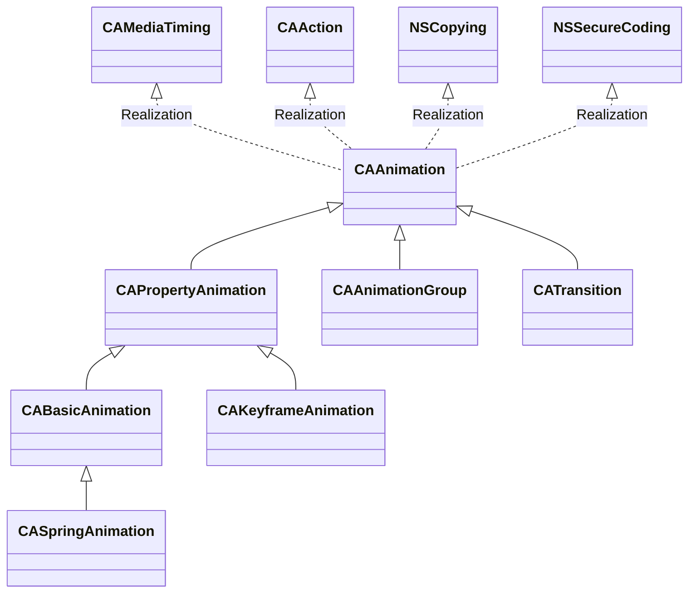

# HelloCoreAnimation

[TOC]

## 1、介绍CoreAnimation

CoreAnimation是iOS的动画框架，提供高性能的动画。官方对CoreAnimation的描述如下

> Core Animation provides high frame rates and smooth animations without burdening the CPU and slowing down your app. Most of the work required to draw each frame of an animation is done for you. You configure animation parameters such as the start and end points, and Core Animation does the rest, handing off most of the work to dedicated graphics hardware, to accelerate rendering. For more details, see [Core Animation Programming Guide](https://developer.apple.com/library/archive/documentation/Cocoa/Conceptual/CoreAnimation_guide/Introduction/Introduction.html#//apple_ref/doc/uid/TP40004514).


CALayer是动画操作的对象，每个CALayer对象内部维护有2个CALayer实例，一个是modelLayer（也是CALayer对象本身），一个presentationLayer。当执行动画时，实际是改变presentationLayer的状态。例如执行CALayer的透明度变化的动画，实际是修改presentationLayer的opacity属性[^1]。

可以通过下面两个API来获取这两个CALayer

```objective-c
- (instancetype)modelLayer;
- (instancetype)presentationLayer;
```


### （1）类继承和实现关系

​       CoreAnimation提供一些类用于配置动画，例如CABasicAnimation、CAKeyframeAnimation等。它们的基类都是CAAnimation，而CAAnimation实现了CAMediaTiming协议，以及其他协议（CAAction、NSCopying、NSSecureCoding）。类的继承和实现关系，如下





### （2）显示动画 (explicit animations) 和隐式动画 (implicit animations)

* 显示动画

​       需要调用执行动画的API都称为显示动画。例如UIView的`+animateWithDuration:animations:`方法，CALayer的`-addAnimation:forKey:key`方法。

* 隐式动画

​        而隐式动画，是指直接修改CALayer的属性，默认产生的动画效果。例如创建CALayer对象，在点击事件中，修改它的position，就可以触发一个动画。

官方文档[^2]，描述如下

> Implicit animations use the default timing and animation properties to perform an animation, whereas explicit animations require you to configure those properties yourself using an animation object.


注意

> 1. 从UIView获取它内部的CALayer，修改它的属性，并不没有隐式动画
> 2. 隐式动画的时间都是0.25，见下面“Animatable Properties”一节


#### a. Animatable Properties[^3]

可以执行隐式动画的属性，如下

| Property            | Default animation                                            |
| :------------------ | :----------------------------------------------------------- |
| `anchorPoint`       | Uses the default implied `CABasicAnimation` object, described in [Table B-2](https://developer.apple.com/library/archive/documentation/Cocoa/Conceptual/CoreAnimation_guide/AnimatableProperties/AnimatableProperties.html#//apple_ref/doc/uid/TP40004514-CH11-SW2). |
| `backgroundColor`   | Uses the default implied `CABasicAnimation` object, described in [Table B-2](https://developer.apple.com/library/archive/documentation/Cocoa/Conceptual/CoreAnimation_guide/AnimatableProperties/AnimatableProperties.html#//apple_ref/doc/uid/TP40004514-CH11-SW2). |
| `backgroundFilters` | Uses the default implied `CATransition` object, described in [Table B-3](https://developer.apple.com/library/archive/documentation/Cocoa/Conceptual/CoreAnimation_guide/AnimatableProperties/AnimatableProperties.html#//apple_ref/doc/uid/TP40004514-CH11-SW3). Sub-properties of the filters are animated using the default implied `CABasicAnimation` object, described in [Table B-2](https://developer.apple.com/library/archive/documentation/Cocoa/Conceptual/CoreAnimation_guide/AnimatableProperties/AnimatableProperties.html#//apple_ref/doc/uid/TP40004514-CH11-SW2). |
| `borderColor`       | Uses the default implied `CABasicAnimation` object, described in [Table B-2](https://developer.apple.com/library/archive/documentation/Cocoa/Conceptual/CoreAnimation_guide/AnimatableProperties/AnimatableProperties.html#//apple_ref/doc/uid/TP40004514-CH11-SW2). |
| `borderWidth`       | Uses the default implied `CABasicAnimation` object, described in [Table B-2](https://developer.apple.com/library/archive/documentation/Cocoa/Conceptual/CoreAnimation_guide/AnimatableProperties/AnimatableProperties.html#//apple_ref/doc/uid/TP40004514-CH11-SW2). |
| `bounds`            | Uses the default implied `CABasicAnimation` object, described in [Table B-2](https://developer.apple.com/library/archive/documentation/Cocoa/Conceptual/CoreAnimation_guide/AnimatableProperties/AnimatableProperties.html#//apple_ref/doc/uid/TP40004514-CH11-SW2). |
| `compositingFilter` | Uses the default implied `CATransition` object, described in [Table B-3](https://developer.apple.com/library/archive/documentation/Cocoa/Conceptual/CoreAnimation_guide/AnimatableProperties/AnimatableProperties.html#//apple_ref/doc/uid/TP40004514-CH11-SW3). Sub-properties of the filters are animated using the default implied `CABasicAnimation` object, described in [Table B-2](https://developer.apple.com/library/archive/documentation/Cocoa/Conceptual/CoreAnimation_guide/AnimatableProperties/AnimatableProperties.html#//apple_ref/doc/uid/TP40004514-CH11-SW2). |
| `contents`          | Uses the default implied `CABasicAnimation` object, described in [Table B-2](https://developer.apple.com/library/archive/documentation/Cocoa/Conceptual/CoreAnimation_guide/AnimatableProperties/AnimatableProperties.html#//apple_ref/doc/uid/TP40004514-CH11-SW2). |
| `contentsRect`      | Uses the default implied `CABasicAnimation` object, described in [Table B-2](https://developer.apple.com/library/archive/documentation/Cocoa/Conceptual/CoreAnimation_guide/AnimatableProperties/AnimatableProperties.html#//apple_ref/doc/uid/TP40004514-CH11-SW2). |
| `cornerRadius`      | Uses the default implied `CABasicAnimation` object, described in [Table B-2](https://developer.apple.com/library/archive/documentation/Cocoa/Conceptual/CoreAnimation_guide/AnimatableProperties/AnimatableProperties.html#//apple_ref/doc/uid/TP40004514-CH11-SW2). |
| `doubleSided`       | There is no default implied animation.                       |
| `filters`           | Uses the default implied `CABasicAnimation` object, described in [Table B-2](https://developer.apple.com/library/archive/documentation/Cocoa/Conceptual/CoreAnimation_guide/AnimatableProperties/AnimatableProperties.html#//apple_ref/doc/uid/TP40004514-CH11-SW2). Sub-properties of the filters are animated using the default implied `CABasicAnimation` object, described in [Table B-2](https://developer.apple.com/library/archive/documentation/Cocoa/Conceptual/CoreAnimation_guide/AnimatableProperties/AnimatableProperties.html#//apple_ref/doc/uid/TP40004514-CH11-SW2). |
| `frame`             | This property is not animatable. You can achieve the same results by animating the `bounds` and `position` properties. |
| `hidden`            | Uses the default implied `CABasicAnimation` object, described in [Table B-2](https://developer.apple.com/library/archive/documentation/Cocoa/Conceptual/CoreAnimation_guide/AnimatableProperties/AnimatableProperties.html#//apple_ref/doc/uid/TP40004514-CH11-SW2). |
| `mask`              | Uses the default implied `CABasicAnimation` object, described in [Table B-2](https://developer.apple.com/library/archive/documentation/Cocoa/Conceptual/CoreAnimation_guide/AnimatableProperties/AnimatableProperties.html#//apple_ref/doc/uid/TP40004514-CH11-SW2). |
| `masksToBounds`     | Uses the default implied `CABasicAnimation` object, described in [Table B-2](https://developer.apple.com/library/archive/documentation/Cocoa/Conceptual/CoreAnimation_guide/AnimatableProperties/AnimatableProperties.html#//apple_ref/doc/uid/TP40004514-CH11-SW2). |
| `opacity`           | Uses the default implied `CABasicAnimation` object, described in [Table B-2](https://developer.apple.com/library/archive/documentation/Cocoa/Conceptual/CoreAnimation_guide/AnimatableProperties/AnimatableProperties.html#//apple_ref/doc/uid/TP40004514-CH11-SW2). |
| `position`          | Uses the default implied `CABasicAnimation` object, described in [Table B-2](https://developer.apple.com/library/archive/documentation/Cocoa/Conceptual/CoreAnimation_guide/AnimatableProperties/AnimatableProperties.html#//apple_ref/doc/uid/TP40004514-CH11-SW2). |
| `shadowColor`       | Uses the default implied `CABasicAnimation` object, described in [Table B-2](https://developer.apple.com/library/archive/documentation/Cocoa/Conceptual/CoreAnimation_guide/AnimatableProperties/AnimatableProperties.html#//apple_ref/doc/uid/TP40004514-CH11-SW2). |
| `shadowOffset`      | Uses the default implied `CABasicAnimation` object, described in [Table B-2](https://developer.apple.com/library/archive/documentation/Cocoa/Conceptual/CoreAnimation_guide/AnimatableProperties/AnimatableProperties.html#//apple_ref/doc/uid/TP40004514-CH11-SW2). |
| `shadowOpacity`     | Uses the default implied `CABasicAnimation` object, described in [Table B-2](https://developer.apple.com/library/archive/documentation/Cocoa/Conceptual/CoreAnimation_guide/AnimatableProperties/AnimatableProperties.html#//apple_ref/doc/uid/TP40004514-CH11-SW2). |
| `shadowPath`        | Uses the default implied `CABasicAnimation` object, described in [Table B-2](https://developer.apple.com/library/archive/documentation/Cocoa/Conceptual/CoreAnimation_guide/AnimatableProperties/AnimatableProperties.html#//apple_ref/doc/uid/TP40004514-CH11-SW2). |
| `shadowRadius`      | Uses the default implied `CABasicAnimation` object, described in [Table B-2](https://developer.apple.com/library/archive/documentation/Cocoa/Conceptual/CoreAnimation_guide/AnimatableProperties/AnimatableProperties.html#//apple_ref/doc/uid/TP40004514-CH11-SW2). |
| `sublayers`         | Uses the default implied `CABasicAnimation` object, described in [Table B-2](https://developer.apple.com/library/archive/documentation/Cocoa/Conceptual/CoreAnimation_guide/AnimatableProperties/AnimatableProperties.html#//apple_ref/doc/uid/TP40004514-CH11-SW2). |
| `sublayerTransform` | Uses the default implied `CABasicAnimation` object, described in [Table B-2](https://developer.apple.com/library/archive/documentation/Cocoa/Conceptual/CoreAnimation_guide/AnimatableProperties/AnimatableProperties.html#//apple_ref/doc/uid/TP40004514-CH11-SW2). |
| `transform`         | Uses the default implied `CABasicAnimation` object, described in [Table B-2](https://developer.apple.com/library/archive/documentation/Cocoa/Conceptual/CoreAnimation_guide/AnimatableProperties/AnimatableProperties.html#//apple_ref/doc/uid/TP40004514-CH11-SW2). |
| `zPosition`         | Uses the default implied `CABasicAnimation` object, described in [Table B-2](https://developer.apple.com/library/archive/documentation/Cocoa/Conceptual/CoreAnimation_guide/AnimatableProperties/AnimatableProperties.html#//apple_ref/doc/uid/TP40004514-CH11-SW2). |


**Table B-2** Default Implied Basic Animation

| Description | Value                                                    |
| :---------- | :------------------------------------------------------- |
| Class       | `CABasicAnimation`                                       |
| Duration    | 0.25 seconds, or the duration of the current transaction |
| Key path    | Set to the property name of the layer.                   |


**Table B-3** Default Implied Transition

| Description    | Value                                                    |
| :------------- | :------------------------------------------------------- |
| Class          | `CATransition`                                           |
| Duration       | 0.25 seconds, or the duration of the current transaction |
| Type           | Fade (`kCATransitionFade`)                               |
| Start progress | `0.0`                                                    |
| End progress   | `1.0`                                                    |


https://www.objc.io/issues/12-animations/animations-explained/

https://www.calayer.com/core-animation/2017/12/25/cashapelayer-in-depth-part-ii.html

https://stackoverflow.com/questions/428110/how-can-i-replicate-the-trashing-animation-of-mail-app

https://stackoverflow.com/questions/11578841/genie-effect-ipad


## 2、CABasicAnimation

CABasicAnimation如其命名，是一个基础的动画类，也比较简单。它自身有3个属性，如下

| 属性名    | 作用                                              | 说明 |
| --------- | ------------------------------------------------- | ---- |
| fromValue | 动画开始状态的值                                  |      |
| toValue   | 动画结束状态的值                                  |      |
| byValue   | 动画的增量，即动画结束状态的值 - 动画开始状态的值 |      |

关于上面3个属性的组合设置，参考[官方文档](https://developer.apple.com/documentation/quartzcore/cabasicanimation#//apple_ref/doc/uid/TP40004496-CH1-SW4)。


### （1）配置CABasicAnimation

一个滑动的动画为例，如下

```objective-c
CABasicAnimation *animation = [CABasicAnimation animation];
animation.keyPath = @"position.x";
animation.fromValue = @(startX + side / 2.0);
animation.toValue = @(CGRectGetWidth(demoView.bounds) - paddingH - side / 2.0);
animation.duration = 1;

[animatedView.layer addAnimation:animation forKey:@"basic"];
```

* keyPath

keyPath是CAPropertyAnimation的属性。支持的keyPath可以查询[官方文档](https://developer.apple.com/library/archive/documentation/Cocoa/Conceptual/CoreAnimation_guide/Key-ValueCodingExtensions/Key-ValueCodingExtensions.html)。

* duration

duration是CAMediaTiming协议中定义的属性

这里使用CALayer的`-addAnimation:forKey:key`方法，会立即执行动画。


> 示例代码，见BasicAnimationViewController


### （2）设置动画结束态

使用CALayer的`-addAnimation:forKey:key`方法执行动画后，如果没有额外的配置，CALayer会恢复初始状态，即modelLayer的状态。有两种方式[^1]，可以保持住最终状态

* 开始执行动画，设置CALayer最终状态

示例代码，如下

```objective-c
CABasicAnimation *animation = [CABasicAnimation animation];
animation.keyPath = @"position.x";
animation.fromValue = @(startX + side / 2.0);
animation.toValue = @(endPositionX);
animation.duration = 1;

[animatedView.layer addAnimation:animation forKey:@"basic"];

animatedView.layer.position = CGPointMake(endPositionX, animatedView.layer.position.y);
```

注意

> 不用担心这里立即设置CALayer动画结束后的位置，因为修改的是modelLayer的状态，而执行动画时系统会暂时隐藏modelLayer，通过presentationLayer来显示动画，等动画结束后，才显示modelLayer


* 设置kCAFillModeForwards和removedOnCompletion为NO

示例代码，如下

```objective-c
CABasicAnimation *animation = [CABasicAnimation animation];
animation.keyPath = @"position.x";
animation.fromValue = @(startX + side / 2.0);
animation.toValue = @(endPositionX);
animation.duration = 1;
animation.fillMode = kCAFillModeForwards;
animation.removedOnCompletion = NO;

[animatedView.layer addAnimation:animation forKey:@"basic"];
```


对于上面两种方式，objc.io[^1]推荐使用第一种方式，因为第二种方式有一定的性能开销。


## 3、CAKeyframeAnimation

​        和CABasicAnimation相比，CAKeyframeAnimation提供多于两种状态（开始状态、结束状态）的设置，可以设置任意多的中间状态。

​        CAKeyframeAnimation的属性，介绍如下

| 属性名           | 作用                                                         | 说明                                                         |
| ---------------- | ------------------------------------------------------------ | ------------------------------------------------------------ |
| values           | 多个动画状态值。元素类型是NSNumber/NSValue/id，当需要设置CoreGraphics数据类型，例如CGColorRef要转成id类型 | 当calculationMode设置非kCAAnimationDiscrete时，values之间的值采用interpolation方式 |
| path             | 当values不能描述path时，可以设置path。如果path不为nil，优先使用path | TODO                                                         |
| keyTimes         | TODO                                                         |                                                              |
| timingFunctions  | TODO                                                         |                                                              |
| calculationMode  | TODO                                                         |                                                              |
| rotationMode     | TODO                                                         |                                                              |
| tensionValues    | TODO                                                         |                                                              |
| continuityValues | TODO                                                         |                                                              |
| biasValues       | TODO                                                         |                                                              |


### （1）values和keyTimes属性

​       CAKeyframeAnimation最常用的两个属性是values和keyTimes。这两个属性都是数组，而且两者是一一对应的，元素个数是相同的。

举个简单例子，如下

```objective-c
CAKeyframeAnimation *animation = [CAKeyframeAnimation animation];
animation.keyPath = @"position.x";
animation.values = @[ @0, @10, @-10, @10, @0 ];
animation.keyTimes = @[ @0, @(1 / 6.0), @(3 / 6.0), @(5 / 6.0), @1 ];
animation.duration = 0.4;

animation.additive = YES;

[animatedView.layer addAnimation:animation forKey:@"shake"];
```

> 示例代码，见KeyframeAnimationViewController

* additive

additive是CAPropertyAnimation的属性，默认是NO。如果设置为YES，则values中的值加到初始值上，得到动画需要的值。例如上面values，渲染树上position.x的值变化，如下

values值：0 > 10 > -10 > 10 > 0

当前值：0 > 10 > 0 > 10 > 0


### （2）path属性

​        除了使用values来指定动画值（keyframe value），还可以使用path。path描述一串连续的点构成的移动轨迹，其中path可以包含使用move-to、line-to、curve-to的线段，line-to、curve-to的线段的结束点定义keyframe的值，move-to线段不定义keyframe的值，其他点位于每个end point之间都被interpolated使用。

官方文档，描述如下

> Paths can contain points defining move-to, line-to, or curve-to segments. The end point of a line-to or curve-to segment defines the keyframe value. All other points between that end value and the previous value are then interpolated. Move-to segments do not define separate keyframe values.

描述沿着path的动画速率，通过calculationMode属性来确定。

* kCAAnimationPaced
* kCAAnimationCubicPaced
* kCAAnimationDiscrete
* kCAAnimationLinear

举个使用path的例子，如下

```objective-c
CAKeyframeAnimation *animation = [CAKeyframeAnimation animation];
animation.keyPath = @"position";
animation.path = CFAutorelease(CGPathCreateWithEllipseInRect(circleView.frame, NULL));
animation.duration = 4;
animation.repeatCount = HUGE_VALF;
animation.calculationMode = kCAAnimationPaced;
animation.rotationMode = kCAAnimationRotateAuto;

[animatedView.layer addAnimation:animation forKey:@"orbit"];
```

这里实现的动画是，animatedView的position沿着circleView构成的圆圈进行移动。

由于calculationMode指定为kCAAnimationPaced，因此不需要设置keyTimes属性。

> 示例代码，见KeyframeAnimationViewController


## 4、CAAnimation

​       CAAnimation是CoreAnimation类层次中最上层的基类，也是抽象类，不能实例化。

​       CAAnimation提供对CAMediaTiming和CAAction协议的支持，创建实例，需要使用子类，例如 CABasicAnimation, CAKeyframeAnimation, CAAnimationGroup或者CATransition来创建。

官方文档，描述如下

> `CAAnimation` provides the basic support for the [`CAMediaTiming`](dash-apple-api://load?topic_id=1427641&language=occ) and [`CAAction`](dash-apple-api://load?topic_id=1410759&language=occ) protocols. You do not create instance of [`CAAnimation`](dash-apple-api://load?topic_id=1412463&language=occ): to animate Core Animation layers or SceneKit objects, create instances of the concrete subclasses [`CABasicAnimation`](dash-apple-api://load?topic_id=1412477&language=occ), [`CAKeyframeAnimation`](dash-apple-api://load?topic_id=1412507&language=occ), [`CAAnimationGroup`](dash-apple-api://load?topic_id=1412483&language=occ), or [`CATransition`](dash-apple-api://load?topic_id=1412526&language=occ).

CAAnimation的属性，介绍如下

| 属性                | 作用                                                  | 说明   |
| ------------------- | ----------------------------------------------------- | ------ |
| removedOnCompletion | 决定是否在动画结束时移除动画对象。默认是YES           |        |
| timingFunction      | 定时函数，用于确定执行动画的速率。默认nil，即线性速率 |        |
| delegate            | TODO                                                  |        |
| usesSceneTimeBase   | TODO                                                  | iOS 8+ |
| fadeInDuration      | TODO                                                  | iOS 8+ |
| fadeOutDuration     | TODO                                                  | iOS 8+ |
| animationEvents     | TODO                                                  | iOS 8+ |


### （1）timingFunction属性

timingFunction属性的类型是CAMediaTimingFunction对象。系统默认提供下面5种函数名字[^4]，可以通过`functionWithName:`方法获取预定义的CAMediaTimingFunction对象。

| 函数名常量                          | 作用                                                         | Bézier控制点              |
| ----------------------------------- | ------------------------------------------------------------ | ------------------------- |
| kCAMediaTimingFunctionLinear        | 线性速率                                                     | (0.0,0.0) and (1.0,1.0)   |
| kCAMediaTimingFunctionEaseIn        | begin slowly and then speed up as it progresses.             | (0.42,0.0) and (1.0,1.0)  |
| kCAMediaTimingFunctionEaseOut       | begin quickly and then slow as it progresses                 | (0.0,0.0) and (0.58,1.0)  |
| kCAMediaTimingFunctionEaseInEaseOut | begin slowly, accelerate through the middle of its duration, and then slow again before completing. | (0.42,0.0) and (0.58,1.0) |
| kCAMediaTimingFunctionDefault       | The system default timing function. Use this function to ensure that the timing of your animations matches that of most system animations. | (0.25,0.1) and (0.25,1.0) |


如果上面5种满足不了自定义的速率变化方式，可以使用下面方法

```objective-c
+ (instancetype)functionWithControlPoints:(float)c1x :(float)c1y :(float)c2x :(float)c2y;
```

自定义定时函数。


> 示例代码，见TimingFunctionAnimationViewController


## 5、CAAnimationGroup

CAAnimationGroup继承自CAAnimation，它目前只有一个animations属性，用于设置多个并行执行的动画对象。

举个例子，如下

```objective-c
CABasicAnimation *zPosition = [CABasicAnimation animation];
zPosition.keyPath = @"zPosition";
zPosition.fromValue = @(self.zPosition);
zPosition.toValue = @(-self.zPosition);
zPosition.duration = 1.2;

CAKeyframeAnimation *rotation = [CAKeyframeAnimation animation];
rotation.keyPath = @"transform.rotation";
rotation.values = @[ @0, @0.14, @0 ];
rotation.duration = 1.2;
rotation.timingFunctions = @[
    [CAMediaTimingFunction functionWithName:kCAMediaTimingFunctionEaseInEaseOut],
    [CAMediaTimingFunction functionWithName:kCAMediaTimingFunctionEaseInEaseOut]
];

CAKeyframeAnimation *position = [CAKeyframeAnimation animation];
position.keyPath = @"position";
position.values = @[
    [NSValue valueWithCGPoint:CGPointZero],
    [NSValue valueWithCGPoint:CGPointMake(110, -20)],
    [NSValue valueWithCGPoint:CGPointZero]
];
position.timingFunctions = @[
    [CAMediaTimingFunction functionWithName:kCAMediaTimingFunctionEaseInEaseOut],
    [CAMediaTimingFunction functionWithName:kCAMediaTimingFunctionEaseInEaseOut]
];
position.additive = YES;
position.duration = 1.2;

CAAnimationGroup *group = [[CAAnimationGroup alloc] init];
group.animations = @[ zPosition, rotation, position ];
group.duration = 1.2;

[animatedView1.layer addAnimation:group forKey:@"shuffle"];
animatedView1.layer.zPosition = -self.zPosition;
```


> 示例代码，见AnimationGroupViewController


## 6、CALayer

由于CALayer是CoreAnimation操作的对象，因此熟悉CALayer的属性，是十分必要的。下面分为两个部分介绍CALayer。

### （1）CALayer显示

#### a. CALayer

​       CALayer主要管理图像内容和动画，一般CALayer是UIView的backing store，即UIView基于CALayer做了一层封装，但是CALayer也可以单独使用。CALayer的动画是基于CAMediaTiming协议来实现的。

这里介绍CALayer的常用属性。


#### b. CAGradientLayer


#### c. CAShapeLayer

CAShapeLayer也是CALayer的子类。这里介绍CAShapeLayer的常用属性。

| 属性            | 默认值                  | 作用                                                         | 说明                                                         |
| --------------- | ----------------------- | ------------------------------------------------------------ | ------------------------------------------------------------ |
| fillColor       | [UIColor black].CGColor | path的填充色                                                 | 如果path是直线，fillColor无效果                              |
| fillRule        |                         |                                                              |                                                              |
| lineCap         | kCALineCapButt          | 决定线条末端的形状，如下  | 如果path是closed，不存在线条的末端，则设置lineCap是无效的    |
| lineDashPattern | nil                     | 决定线条的dash模式                                           | 数组的按照[(painted segment length), (unpainted segment length), ...]顺序依次决定实线和虚线的长度，当数组匹配完成后，再重新从头开始匹配。（备注：如果是nil，则一直是实线）。注意：如果数组，只有一个元素，则按照实线-虚线-……的顺序，同时实线和虚线的长度是一样的。 |
| lineDashPhase   | 0                       | lineDashPattern起始的偏移量                                  | 举个例子，lineDashPattern = [10, 5, 5, 5], lineDashPhase = 10，则起始匹配按照5-5-5-10-5-5-5-...，但不影响实线-虚线-实线-虚线-...的顺序，即5(虚)-5(实)-5(虚)-10(实)-5(虚)-...。如果lineDashPhase = 2，则起始匹配按照8(实)-5(虚)-5(实)-5(虚)-10(实)-5(虚)-5(实)-5(虚)-... |
| lineJoin        | kCALineJoinMiter        | 决定两个线条交接的形状，如下 | kCALineJoinMiter kCALineJoinRound kCALineJoinBevel           |
| miterLimit      | 10                      | 当设置kCALineJoinMiter时，决定是否变成kCALineJoinBevel       | 当lineJoin设置kCALineJoinMiter时，miterLimit才生效。具体见“miterLimit”一节。 |
| strokeColor     | nil                     | path的线条颜色                                               |                                                              |
| strokeStart     | 0.0                     | stroke的百分比起始位置                                       | 如果path从头到尾是100%，则strokeStart指定起始点按照百分比算的位置。比如0.5，则起始点在path的中间。 |
| strokeEnd       | 1.0                     | stroke的百分比结束位置                                       | 如果path从头到尾是100%，则strokeEnd指定结束点按照百分比算的位置。比如0.5，则结束点在path的中间。 |
| path            | nil                     | CGPathRef类型。一般是UIBezierPath                            |                                                              |


> 示例代码，见HelloCoreGraphics工程


##### miterLimit[^5]

miterLimit实际是一个阈值，理解它还需要如下图的两个概念，miter length和stroke width。


- miter length，是指两条线条相交，构成两个衔接点之间的距离
- stroke width，是指线条的宽度

当比例miter length/stroke width大于miterLimit时（而且lineJoin=kCALineJoinMiter），尖角太尖，CAShapeLayer自动将尖角画成kCALineJoinBevel类型。公式如下


说明

> ratio比例miter length/stroke width，实际和角度φ有关，当φ=60°，ratio=2；当φ=90°，ratio=1.414


##### path[^6]

CAShapeLayer可以使用UIBezierPath对象自动画出矢量图片。这里不介绍UIBezierPath使用，参考HelloCoreGraphics工程。


### （2）CALayer动画

#### a. CAShapeLayer[^7]

CAShapeLayer支持Animate的属性，如下

* path
* fillColor
* lineDashPhase
* lineWidth
* miterLimit
* strokeColor
* strokeStart
* strokeEnd


> 示例代码，见CAShapeLayer Animation


## References

[^1]:https://www.objc.io/issues/12-animations/animations-explained/#first-things-first
[^2]:https://developer.apple.com/library/archive/documentation/Cocoa/Conceptual/CoreAnimation_guide/CreatingBasicAnimations/CreatingBasicAnimations.html
[^3]:https://developer.apple.com/library/archive/documentation/Cocoa/Conceptual/CoreAnimation_guide/AnimatableProperties/AnimatableProperties.html#//apple_ref/doc/uid/TP40004514-CH11-SW2

[^4]:https://developer.apple.com/documentation/quartzcore/camediatimingfunction/predefined_timing_functions?language=objc
[^5]: https://wiki.esko.com/pages/viewpage.action?pageId=184729203

[^6]: https://www.calayer.com/core-animation/2016/05/22/cashapelayer-in-depth.html
[^7]:https://www.calayer.com/core-animation/2017/12/25/cashapelayer-in-depth-part-ii.html