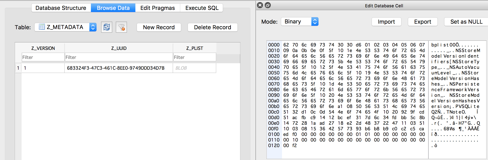

## TOC of CoreData

TOC

## 1. CoreData Stack

1\. CoreData stack是一组CoreData基础设施类，包含四个类

* NSManagedObjectModel    
>
Mapping to the .momd folder which is compiled from .xcdatamodel file

* NSPersistentStoreCoordinator
>
NSManagedObjectContext holds it, and it has one or multiple NSPersistentStore and NSManagedObjectModel

* NSManagedObjectContext
>
The public interface used for CRUD database

* NSPersistentStore
>
Stand for sqlite, xml, memory store, and so on

2\. NSManagedObjectModel、NSPersistentStore、NSPersistentStoreCoordinator、NSManagedObjectContext之间的关系图，如下


## 2. NSFetchedResultsController

NSFetchedResultsController使用的NSFetchRequest必须配置sortDescriptors属性，否则会报下面crash。

```
 *** Terminating app due to uncaught exception 'NSInvalidArgumentException', reason: 'An instance of NSFetchedResultsController requires a fetch request with sort descriptors'
```

## 3. Xcode `Codegen`选项

#### `Manual/None`    
Xcode不帮助生成NSManagedObject子类任何文件

#### `Class Definition`

Xcode负责生成NSManagedObject子类的全部文件，Objective-C类型有两组.h/.m文件
     
* EntityName+CoreDataClass{.h, .m}    
  实际不是分类文件，是一般的类定义和实现文件   
* EntityName+CoreDataProperties{.h, .m}     
  分类文件，NSManagedObject子类的属性都定义在这里
   
> 
注意：上面两组文件生成直接放在DerivedData中，不在Xcode工程下，而且Build Phases -> Compile Sources中没有上面的.m文件

使用方式：导入EntityName+CoreDataClass.h文件   
缺点：如果需要向NSManagedObject子类添加方法，则这种方式没有办法添加，因为所有文件都由Xcode管理和生成。

#### `Category/Extension`    
Xcode负责生成NSManagedObject子类的属性部分，类的定义文件需要手动生成。

* EntityName+CoreDataProperties{.h, .m}     
  分类文件，NSManagedObject子类的属性都定义在这里
* EntityName{.h, .m}    
  手动创建的文件，文件名必须是EntityName，因为EntityName+CoreDataProperties{.h, .m}引用的是EntityName.h

EntityName.h的内容，举个例子，如下

```
#import <Foundation/Foundation.h>
#import <CoreData/CoreData.h>

NS_ASSUME_NONNULL_BEGIN

@interface JournalEntry : NSManagedObject
- (NSString *)stringForDate; // 自己需要添加的方法
@end

NS_ASSUME_NONNULL_END

#import "JournalEntry+CoreDataProperties.h"
```

Xcode 8+自动生成NSManagedObject子类文件的工具，`Editor -> Create NSManagedObject Subclass...`    

* 可以选中xcdatamodeld文件，Editor -> Create NSManagedObject Subclass...，Xcode可以自动生成EntityName+CoreDataClass{.h, .m}文件和EntityName+CoreDataProperties{.h, .m} 文件。  
* 使用自动生成文件的方式   
  * 如果Codegen是`Manual/None` ，则手动添加全部文件。后续维护Entity属性和方法，手动修改文件
  * 如果Codegen是`Class Definition` ，则不能添加任何文件。后续维护Entity属性，修改xcdatamodeld文件
  * 如果Codegen是`Category/Extension`，则只能添加EntityName+CoreDataClass{.h, .m}文件，而且文件名需要修改为EntityName{.h, .m}。后续维护Entity属性部分，修改xcdatamodeld文件；Entity其他部分，手动修改EntityName{.h, .m}文件

Reference: https://useyourloaf.com/blog/core-data-code-generation/


## 4. Multiple Managed Object Context

1\. NSPersistentStoreCoordinator可以对应多个NSManagedObjectContext

例如导出CoreData数据，可以利用NSManagedObjectContext的队列执行导出操作。

```
NSManagedObjectContext *privateContext = [[NSManagedObjectContext alloc] initWithConcurrencyType:NSPrivateQueueConcurrencyType];
privateContext.persistentStoreCoordinator = self.context.persistentStoreCoordinator;
    
[privateContext performBlock:^{
    // do export data from database
    
    dispatch_async(dispatch_get_main_queue(), ^{
    	// do UI operations
    });
}];
```

创建一个临时的NSManagedObjectContext，将它关联到现有的NSPersistentStoreCoordinator，这样这个临时的NSManagedObjectContext能访问到数据。

2\. NSManagedObjectContext可以指定一个parentContext

例如创建某个草稿，可以临时创建一个NSManagedObjectContext用于记录草稿当前的数据，如果草稿保存，则child context保存，并且通知parent context保存，这时child context中的所有数据和parentContext合并并保存下来。

```
// create a temporary context as child context
NSManagedObjectContext *childContext = [[NSManagedObjectContext alloc] initWithConcurrencyType:NSPrivateQueueConcurrencyType];
childContext.parentContext = self.context;

// use child context to create a managed object
NSEntityDescription *entityDescription = [NSEntityDescription entityForName:@"JournalEntry" inManagedObjectContext:childContext];
JournalEntry *newJournalEntry = [[JournalEntry alloc] initWithEntity:entityDescription insertIntoManagedObjectContext:childContext];

// use the managed object to store some data
...

// child context save the managed object or just discard the child context
[childContext performBlock:^{
    if (childContext.hasChanges) {
        NSError *error = nil;
        [childContext save:&error];
        
        if (error) {
            NSLog(@"error: %@", error);
            abort();
        }
        
        [self.context save:nil];
    }
}];
```

## 5. CoreData Migration

### 5.1 什么是数据迁移

&nbsp;&nbsp;&nbsp;&nbsp;&nbsp;&nbsp;&nbsp;&nbsp;迁移过程是指把之前版本创建的数据模型更新到当前的数据模型。

&nbsp;&nbsp;&nbsp;&nbsp;&nbsp;&nbsp;&nbsp;&nbsp;当`NSPersistentStoreCoordinator`执行add store操作（例如，调用addPersistentStoreWithType:configuration:URL:options:error:方法），会进行必要的数据迁移过程。首先，检查现有数据库的data model版本，和coordinator指定的data model版本比较，如果版本不一致，并且迁移选项是开的，则执行迁移过程。

&nbsp;&nbsp;&nbsp;&nbsp;&nbsp;&nbsp;&nbsp;&nbsp;如果版本不一致，而且迁移选项是关的，则报错提示

```
CoreData: error: -addPersistentStoreWithType:SQLite configuration:(null) URL:file:///Users/wesley_chen/Library/Developer/CoreSimulator/Devices/3D03A26E-0E22-417D-9357-E89B687E5AE0/data/Containers/Data/Application/3C6CBA12-7422-450B-ABB6-8E0881CB15BF/Documents/UnCloudNotes.sqlite options:{
} ... returned error Error Domain=NSCocoaErrorDomain Code=134100 "(null)" UserInfo={metadata={
    NSPersistenceFrameworkVersion = 849;
    NSStoreModelVersionHashes =     {
        Note = <929fcd51 acfbc914 12bcef31 7d6c34fd bb5c8b14 72281aad 2718e22d 48372247>;
    };
    NSStoreModelVersionHashesVersion = 3;
    NSStoreModelVersionIdentifiers =     (
        ""
    );
    NSStoreType = SQLite;
    NSStoreUUID = "683324F3-47C3-461C-8EE0-9749DDD34D7B";
    "_NSAutoVacuumLevel" = 2;
}, reason=The model used to open the store is incompatible with the one used to create the store} with userInfo dictionary {
    metadata =     {
        NSPersistenceFrameworkVersion = 849;
        NSStoreModelVersionHashes =         {
            Note = <929fcd51 acfbc914 12bcef31 7d6c34fd bb5c8b14 72281aad 2718e22d 48372247>;
        };
        NSStoreModelVersionHashesVersion = 3;
        NSStoreModelVersionIdentifiers =         (
            ""
        );
        NSStoreType = SQLite;
        NSStoreUUID = "683324F3-47C3-461C-8EE0-9749DDD34D7B";
        "_NSAutoVacuumLevel" = 2;
    };
    reason = "The model used to open the store is incompatible with the one used to create the store";
}
```

上面的metadata，可以直接在sqlite文件的Z_METADATA表中的Z_PLIST字段找到，如下



Z_PLIST字段的内容是plist格式，可以导出保存为plist文件来查看内容，如下


### 5.2 数据迁移的类型

##### （1）Lightweight migrations

从Apple官方的角度，希望开发者的工作尽可能的少，因此Lightweight migrations只涉及到一些选项的配置，并且迁移过程是自动完成的。

```
NSDictionary *opts = @{
	NSMigratePersistentStoresAutomaticallyOption: @YES,
	NSInferMappingModelAutomaticallyOption: @YES,
};
NSError *error = nil;
[coordinator addPersistentStoreWithType:NSSQLiteStoreType configuration:nil URL:url options:opts error:&error];
```

提供`NSMigratePersistentStoresAutomaticallyOption`和`NSInferMappingModelAutomaticallyOption`选项，可以让CoreData自动完成数据迁移。

* `NSMigratePersistentStoresAutomaticallyOption`，指示CoreData如果发现data model版本不一致，可以尝试做数据迁移。
* `NSInferMappingModelAutomaticallyOption`，一般数据迁移需要一个mapping model，如果xcdatamodel文件的改动符合CoreData能够自动推断出来，则使用这个选项让CoreData自动生成mapping model，而不需手动创建。    

如果上面opts缺少`NSInferMappingModelAutomaticallyOption`，则CoreData执行add store操作报错。

```
CoreData: error: -addPersistentStoreWithType:SQLite configuration:(null) URL:file:///Users/wesley_chen/Library/Developer/CoreSimulator/Devices/3D03A26E-0E22-417D-9357-E89B687E5AE0/data/Containers/Data/Application/A5DAB7EA-F227-47FA-B918-E13074EE1482/Documents/UnCloudNotes.sqlite options:{
    NSMigratePersistentStoresAutomaticallyOption = 1;
} ... returned error Error Domain=NSCocoaErrorDomain Code=134140 "(null)" UserInfo={destinationModel=(<NSManagedObjectModel: 0x6080000864a0>) isEditable 0, entities {
    Note = "...";
}, fetch request templates {
}, sourceModel=(<NSManagedObjectModel: 0x60c000091350>) isEditable 1, entities {
    Note = "...";
}, fetch request templates {
}, reason=Can't find mapping model for migration} with userInfo dictionary {
    destinationModel = "...";
    reason = "Can't find mapping model for migration";
    sourceModel = "...";
}
```

&nbsp;&nbsp;&nbsp;&nbsp;&nbsp;&nbsp;&nbsp;&nbsp;一般来说，满足下面一些case就可以使用`NSInferMappingModelAutomaticallyOption`选项

- 删除entities、attributes或relationships
- 重命名entities、attributes或relationships
- 添加新的optional attribute
- 添加新的带默认值的required attribute
- 改变optional attribute为带默认值的required attribute
- 改变required attribute为optional attribute
- 添加新的parent entity，并调整attribute的顺序
- 改变relationship从to-one到to-many
- 改变relationship从非有序的to-many到有序的to-many
- ...

具体其他case，可以参考官方的[Lightweight Migration](https://developer.apple.com/library/content/documentation/Cocoa/Conceptual/CoreDataVersioning/Articles/vmLightweightMigration.html)


##### （2）Manual migrations

Manual migrations涉及到开发者一些工作，例如映射老的数据集到新的数据集，但是利用配置mapping model文件来完成这些事情。

##### （3）Custom manual migrations

Custom manual migrations在Manual migrations基础上，完成一些特定数据转换的逻辑，例如创建`NSEntityMigrationPolicy`子类，完成自定义的转换。

##### （4）Fully manual migrations

Fully manual migrations是最自定义的一种，例如完成版本检测逻辑、处理数据迁移过程。

### 5.3 如何配置一个data model新版本

&nbsp;&nbsp;&nbsp;&nbsp;&nbsp;&nbsp;&nbsp;&nbsp;选中Xcode工程中的xcdatamodeld文件，Editor -> Add Model Version...。输入Version name，一般带上版本号方便区分。选择Based on model，即基于哪个版本的xcdatamodel文件。Xcode会将新的xcdatamodel文件，放在xcdatamodeld文件下。这个新的xcdatamodel文件并不是当前使用的data model，所以还需要选中xcdatamodel文件，打开Utilities -> File Inspector，找到Model Version
，选择为刚才创建的xcdatamodel文件，这时绿色checkmark会变到新的xcdatamodel文件上。

&nbsp;&nbsp;&nbsp;&nbsp;&nbsp;&nbsp;&nbsp;&nbsp;在新的app包中，.momd文件夹下会多出一个.mom文件对应新添加的xcdatamodel文件以及一个.omo文件，并且VersionInfo.plist中NSManagedObjectModel_CurrentVersionName字段换成当前的xcdatamodel文件名。


