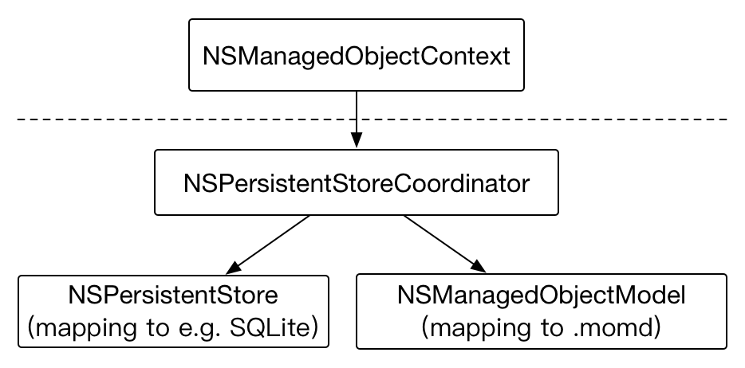

## TOC of CoreData

TOC

## CoreData Stack

1\. CoreData stack是一组CoreData基础设施类，包含四个类：`NSManagedObjectModel`、`NSPersistentStore`、`NSPersistentStoreCoordinator`、`NSManagedObjectContext`

* NSManagedObjectModel    
>
Mapping to the .momd folder which is compiled from .xcdatamodel file

* NSPersistentStoreCoordinator
>
NSManagedObjectContext holds it, and it has one or multiple NSPersistentStore and NSManagedObjectModel

* NSManagedObjectContext
>
The public interface used for CRUD database

* NSPersistentStore
>
Stand for sqlite, xml, memory store, and so on

2\. NSManagedObjectModel、NSPersistentStore、NSPersistentStoreCoordinator、NSManagedObjectContext之间的关系图，如下




## NSFetchedResultsController

* 需要配置sortDescriptors

(TODO)

## Xcode `Codegen`选项

#### `Manual/None`    
Xcode不帮助生成NSManagedObject子类任何文件

#### `Class Definition`

Xcode负责生成NSManagedObject子类的全部文件，Objective-C类型有两组.h/.m文件
     
* EntityName+CoreDataClass{.h, .m}    
  实际不是分类文件，是一般的类定义和实现文件   
* EntityName+CoreDataProperties{.h, .m}     
  分类文件，NSManagedObject子类的属性都定义在这里
   
> 
注意：上面两组文件生成直接放在DerivedData中，不在Xcode工程下，而且Build Phases -> Compile Sources中没有上面的.m文件

使用方式：导入EntityName+CoreDataClass.h文件   
缺点：如果需要向NSManagedObject子类添加方法，则这种方式没有办法添加，因为所有文件都由Xcode管理和生成。

#### `Category/Extension`    
Xcode负责生成NSManagedObject子类的属性部分，类的定义文件需要手动生成。

* EntityName+CoreDataProperties{.h, .m}     
  分类文件，NSManagedObject子类的属性都定义在这里
* EntityName{.h, .m}    
  手动创建的文件，文件名必须是EntityName，因为EntityName+CoreDataProperties{.h, .m}引用的是EntityName.h

EntityName.h的内容，举个例子，如下

```
#import <Foundation/Foundation.h>
#import <CoreData/CoreData.h>

NS_ASSUME_NONNULL_BEGIN

@interface JournalEntry : NSManagedObject
- (NSString *)stringForDate; // 自己需要添加的方法
@end

NS_ASSUME_NONNULL_END

#import "JournalEntry+CoreDataProperties.h"
```

Xcode 8+自动生成NSManagedObject子类文件的工具，`Editor -> Create NSManagedObject Subclass...`    

* 可以选中xcdatamodeld文件，Editor -> Create NSManagedObject Subclass...，Xcode可以自动生成EntityName+CoreDataClass{.h, .m}文件和EntityName+CoreDataProperties{.h, .m} 文件。  
* 使用自动生成文件的方式   
  * 如果Codegen是`Manual/None` ，则手动添加全部文件。后续维护Entity属性和方法，手动修改文件
  * 如果Codegen是`Class Definition` ，则不能添加任何文件。后续维护Entity属性，修改xcdatamodeld文件
  * 如果Codegen是`Category/Extension`，则只能添加EntityName+CoreDataClass{.h, .m}文件，而且文件名需要修改为EntityName{.h, .m}。后续维护Entity属性部分，修改xcdatamodeld文件；Entity其他部分，手动修改EntityName{.h, .m}文件

Reference: https://useyourloaf.com/blog/core-data-code-generation/


## Multiple Managed Object Context


