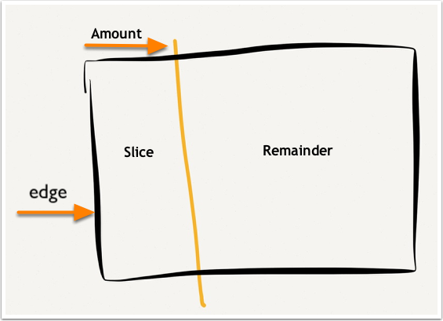
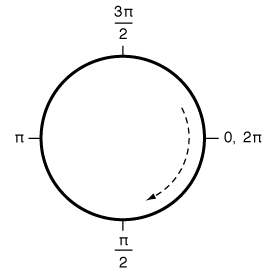

# CoreGraphics

[TOC]

## 1、CGGeometry[^1]

CGGeometry指2D几何（2D Geometry）中的各种结构体和相关函数。


### （1）CGRectDivide

`CGRectDivide`函数作用是将一个矩形切成两个矩形。函数签名，如下

```objective-c
void CGRectDivide (CGRect rect, CGRect *slice, CGRect *remainder, CGFloat amount, CGRectEdge edge);
```

* rect，源矩形
* slice，切出的矩形。不允许传NULL。
* remainder，剩余的矩形。不允许传NULL。
* amount，离edge的距离
* edge，指定的edge，用于确定amout距离从哪个边开始。`CGRectEdge`是枚举类型，枚举值有**CGRectMinXEdge**、**CGRectMinYEdge**、**CGRectMaxXEdge**和**CGRectMaxYEdge**

示意图[^2]，如下



说明

> 示意图中，edge指定的值为CGRectMinXEdge


### （2）CGRectStandardize

​        `CGRectStandardize`函数的作用是将矩形标准化，这里的标准化，实际上，是指不改矩形位置和大小的情况下，将负的width或者负的height都变成正的。

> Returns a rectangle with a positive width and height.

​       CGSize的width和height允许负数，因此CGRect的width和height也允许负数，因此基于origin点允许有正方向的width或height，也允许负方向的width或height。

举个例子，如下

```objective-c
rect = CGRectMake(1, 2, -4, -3);
output = CGRectStandardize(rect);
XCTAssertTrue(CGRectEqualToRect(output, CGRectFromString(@"{{-3, -1}, {4, 3}}")));
```


说明

> CGSize的width和height允许负数，常用于表示向量。实际上，在iOS 7+以后可以使用`CGVector`类型表示，语义上更加容易理解。


### （3）CGRectIntegral

​        `CGRectIntegral`函数的作用将矩形的origin以及width和height整数化，即origin的x和y都向下取整（使用`floor`函数），width和height向上取整（使用`ceil`函数）。返回的矩形包含源矩形。

举个例子，如下

```objective-c
rect = CGRectMake(0.1, 0.5, 3.3, 2.7);
output = CGRectIntegral(rect);
XCTAssertTrue(CGRectEqualToRect(output, CGRectFromString(@"{{0, 0}, {4, 4}}")));
```


### （4）CGRectOffset

`CGRectOffset`函数的作用将矩形进行偏移，即修改origin但不改变width和height。


### （5）CGRectInset

​        `CGRectInset`函数的作用是将矩形收缩（Contracting）或伸展（Expanding），即在矩形的水平方向或垂直方向添加间距（padding）。

举个例子，如下

```objective-c
// Case 1
rect = CGRectMake(1, 2, 4, 3);
output = CGRectInset(rect, 1.0, 0.0);
XCTAssertTrue(CGRectEqualToRect(output, CGRectFromString(@"{{2, 2}, {2, 3}}")));

// Case 2
rect = CGRectMake(1, 2, 4, 3);
output = CGRectInset(rect, -1.0, 0.0);
XCTAssertTrue(CGRectEqualToRect(output, CGRectFromString(@"{{0, 2}, {6, 3}}")));

// Case 3
rect = CGRectMake(1, 2, 4, 3);
output = CGRectInset(rect, 0.5, 0.0);
XCTAssertTrue(CGRectEqualToRect(output, CGRectFromString(@"{{1.5, 2}, {3, 3}}")));
```


### （6）CGRectIntersection

`CGRectIntersection`函数的作用是获取两个矩形的相交区域。如果没有返回CGRectNull。


### （7）CGRectUnion

`CGRectUnion`函数的作用是获取最小的矩形，同时包含两个矩形。


### （8）CGRect的特殊值

| 值             | 含义                  |
| -------------- | --------------------- |
| CGRectZero     | {x 0 y 0 w 0 h 0}     |
| CGRectNull     | {x +∞ y +∞ w 0 h 0}   |
| CGRectInfinite | {x -∞ y -∞ w +∞ h +∞} |


说明

> CGRectInfinite比较特殊，它包含任意点或矩形、和任意矩形都相交、和任意矩形union后都是CGRectInfinite。Swift代码，如下
>
> ```swift
> CGRect.infinite.contains(any point) // true
> CGRect.infinite.intersects(any other rectangle) // true
> CGRect.infinite.union(any other rectangle) // CGRect.infinite
> CGRect.infinite.isInfinite // true
> ```


## 2、UIBezierPath

​       UIBezierPath是UIKit提供的上层对象，用于描述绘图的路径，其中包括直线和曲线的线段

​       UIBezierPath是对应CGPath的封装[^3]，CGPath的C函数API，包含UIBezierPath的所有Objective-C方法。如果对CGPath不是非常熟悉，而且可以使用UIBezierPath完成绘图，那优先选择使用UIBezierPath。在某些情况下，UIBezierPath要比CGPath要“快”一些[^4]。


### （1）特定path的便利方法

UIBezierPath提供5个便利方法，可以直接描述特定形状的路径，主要有矩形、椭圆、圆角矩形和弧。

5个便利方法，如下

```objective-c
// 描述矩形，方向顺时针
+ (instancetype)bezierPathWithRect:(CGRect)rect;
// 在指定矩形中，描述椭圆。如果矩形是正方形，则椭圆是圆形。方向顺时针
+ (instancetype)bezierPathWithOvalInRect:(CGRect)rect;
// 描述圆角矩形，方向顺时针
+ (instancetype)bezierPathWithRoundedRect:(CGRect)rect cornerRadius:(CGFloat)cornerRadius;
// 描述圆角矩形，可以指定特定位置的圆角。方向顺时针
+ (instancetype)bezierPathWithRoundedRect:(CGRect)rect byRoundingCorners:(UIRectCorner)corners cornerRadii:(CGSize)cornerRadii;
// 描述弧，用于画半圆、圆等。该方法返回的path是open，不是闭环路径
+ (instancetype)bezierPathWithArcCenter:(CGPoint)center radius:(CGFloat)radius startAngle:(CGFloat)startAngle endAngle:(CGFloat)endAngle clockwise:(BOOL)clockwise;
```

其中，bezierPathWithArcCenter:radius:startAngle:endAngle:clockwise:方法，startAngle和endAngle参数，按照下面坐标系指定特定的角度。




说明

> bezierPathWithArcCenter:radius:startAngle:endAngle:clockwise:方法，只能描述圆的弧，不能描述椭圆的弧。


### （2）构建path的方法

​        UIBezierPath构建path，类似一笔画的方式，从某个开始点到结束点，构建一条直线或者曲线，然后将结束点设置成新的开始点，根据下个结束点，构建新一条直线或者曲线。这个不断成为新的开始点，在UIBezierPath中，对应它的只读currentPoint属性。在创建UIBezierPath对象时，currentPoint是CGPointZero。


UIBezierPath提供5种构建path的方法，如下

```objective-c
// 将currentPoint移到某个点上
- (void)moveToPoint:(CGPoint)point;
// 从currentPoint到point构建一条直线
- (void)addLineToPoint:(CGPoint)point;
// 从currentPoint处以center圆心构建一条弧，startAngle和endAngle参数和bezierPathWithArcCenter:radius:startAngle:endAngle:clockwise:方法一样的规则
- (void)addArcWithCenter:(CGPoint)center radius:(CGFloat)radius startAngle:(CGFloat)startAngle endAngle:(CGFloat)endAngle clockwise:(BOOL)clockwise;
// 从currentPoint处构建一条二次方Bezier曲线
- (void)addQuadCurveToPoint:(CGPoint)endPoint controlPoint:(CGPoint)controlPoint;
// 从currentPoint处构建一条三次方Bezier曲线
- (void)addCurveToPoint:(CGPoint)endPoint controlPoint1:(CGPoint)controlPoint1 controlPoint2:(CGPoint)controlPoint2;
```

上面5种方法每次调用后，都会更新currentPoint，用于新的开始点。


a. Quadratic


### （3）使用UIBezierPath绘图

UIBezierPath的使用，目前有两种方式

* UIBezierPath结合CGContext，在drawRect:方法中使用
* UIBezierPath设置到CAShapeLayer的path属性

第二种方式比较简单，先介绍第二种方式。


#### a. UIBezierPath+CAShapeLayer[^5]


https://www.calayer.com/core-animation/2017/12/25/cashapelayer-in-depth-part-ii.html


https://www.informit.com/articles/article.aspx?p=2149190&seqNum=13

https://www.ramshandilya.com/blog/draw-smooth-curves/


## References

[^1]: <https://nshipster.com/cggeometry/>
[^2]:<https://www.infragistics.com/community/blogs/b/torrey-betts/posts/quick-tip-dividing-a-cgrect-using-cgrectdivide-objective-c>
[^3]:https://stackoverflow.com/questions/25457597/what-is-the-difference-between-cgpath-and-uibezierpath
[^4]:https://stackoverflow.com/questions/6327817/why-is-uibezierpath-faster-than-core-graphics-path

[^5]:https://www.calayer.com/core-animation/2016/05/22/cashapelayer-in-depth.html

