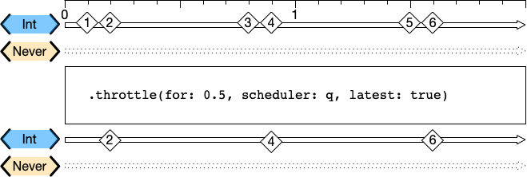
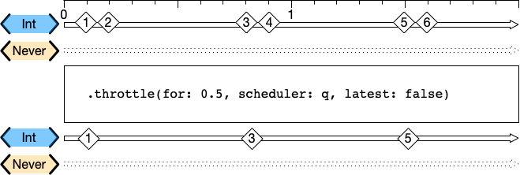
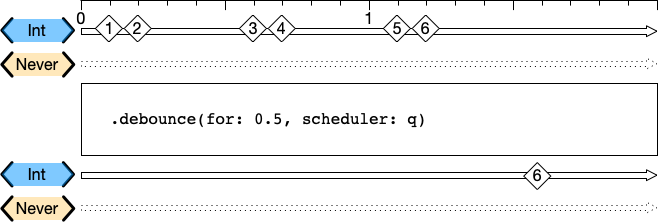
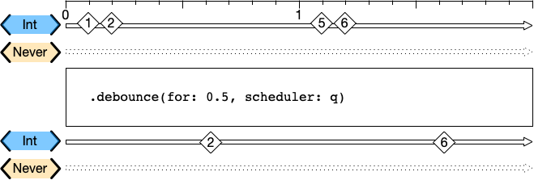

# Functional Reactive Programming (FRP)

[TOC]

## 1、介绍FRP

FRP是Functional Reactive Programming的缩写，Wiki对FRP释义，如下

> Functional reactive programming (FRP) is a programming paradigm for reactive programming (asynchronous dataflow programming) using the building blocks of functional programming (e.g. map, reduce, filter).

简单来说，FRP是一种基于函数的响应式的编程范式。函数是这种编程方式的形式，比如map、reduce、filter函数等。

​       响应式（Reactive）的含义是指，函数的输入是不确定的值，而输出结果，会随着时间的推移，会产生不同的结果。

​       举个例子，用户输入搜索词，服务端给出搜索词相关的数据，这个过程就是响应式的。对于这个“函数”，输入是用户的任意搜索词，而输出是用户在输入过程的检索结果。和时间的联系在于，用户可以输入后，停下来，然后继续输入。

参考SO的回答[^2]，如下

> The basic idea behind reactive programming is that there are certain datatypes that represent a value "over time".

### （1）FRP使用的常见场景

* 用户输入搜索词，确定最终的搜索词
* 鼠标移动，计算最终停下来的坐标
* 用户点击鼠标，计算最终处理的点击事件

## 2、常用FRP函数

### （1）Throttle和Debounce函数

Throttle和Debounce函数，都是用于频率控制的函数，防止某个函数被频繁的调用。Throttle和Debounce函数，都有一个时间参数，它们的区别在于如何使用这个时间参数。

#### a. Throttle函数

​        Throttle函数，在特定长度的时间片内，仅处理一次函数调用，其他调用都忽略。在时间片内，如果有多次函数调用，具体处理哪一次，有2种策略可以选择。

* 在时间片内，处理最近的一次函数调用，如下图

2、4、6都是500ms时间区域内的最近一次（或者最后一次）的调用，因此1、3、5被忽略。

* 在时间片内，处理第一次函数调用，如下图

1、3、5都是500ms时间区域内的第一次的调用，因此2、4、6被忽略。

注意

> 1. 这个时间片的大小，会影响处理函数调用的次数。在调用频率一样的情况下，时间片越小，处理函数调用的次数越多，反之则相反。
> 2. 图片来源[^4]

#### b. Debounce函数

​       Debounce函数，在触发后并不立马执行函数，而是在特定时间内，做推迟操作。如果在特定时间内，该函数再被多次调用，则以最后一次调用的时间，重新推迟到特定时间之后，一直到在特定时间过后，触发该函数操作。

假设Debounce函数的特定时间，设置500ms，marble示意图，如下

* Debounce函数，被密集调用的情况，如下

* Debounce函数，被稀疏调用的情况，如下

注意

> 1. 和Throttle函数的时间片一样，Debounce函数的延迟时间的大小，会影响处理函数调用的次数。在调用频率一样的情况下，延迟时间越小，处理函数调用的次数越多，反之则相反。
> 2. 图片来源[^4]

#### c. Throttle函数实现

Throttle函数，用多种方式

* 这篇文章[^5]使用GCD的dispatch_after函数
* SO[^6]使用NSObject的cancelPreviousPerformRequestsWithTarget和performSelector方法

> WCThrottler是采用GCD的方式

#### d. Debouncer函数的实现

TODO

> WCDebouncer

## References

[^1]:https://en.wikipedia.org/wiki/Functional_reactive_programming
[^2]:https://stackoverflow.com/a/1028642
[^3]:https://www.telerik.com/blogs/debouncing-and-throttling-in-javascript#:~:text=The%20main%20difference%20between%20throttling,only%20after%20some%20cooling%20period.&text=Both%20throttling%20and%20debouncing%20can,help%20of%20the%20setTimeout%20function.
[^4]:https://rhonabwy.com/2019/12/15/combine-throttle-and-debounce/
[^5]:https://www.craftappco.com/blog/2018/5/30/simple-throttling-in-swift
[^6]:https://stackoverflow.com/a/29760716

