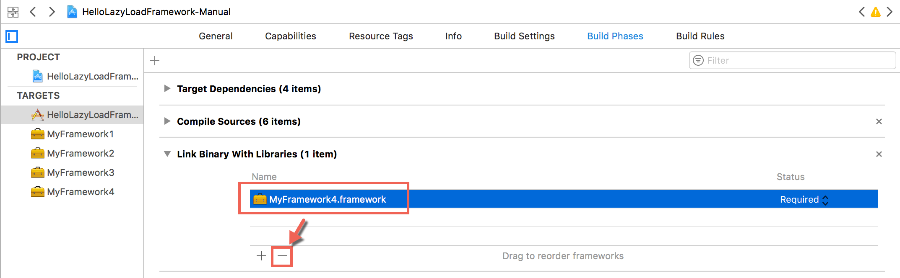

# HelloLazyLoadFramework-Manual
--

说明：   
framework可以是静态库，也可以是动态库，这里讨论的都是动态库的framework

## 1. 如何懒加载framework

<b>懒加载framework</b>，指的是app启动的时候，不自动加载需要framework，而是app使用NSBundle或dlopen加载framework到内存，然后使用framework提供的类。

使用懒加载framework的工程，创建步骤，如下

1\. 创建Single View App工程。    
2\. 在Targets中点击+，添加Cocoa Touch Framework，例如MyFramework1、MyFramework2等。    
3\. 在App Target的Build Phasese -> Link Binary With Libraries，移除刚创建的framework



这里实际上，是不让app启动自动加载framework。

4\. 组织framework的头文件，在Build Phase -> Headers中设置.h的可见级别，需要在framework中公开的需要设置成public。


5\. 确认App Target中的几个地方，看Xcode添加framework时是否配置正确

* General -> Embedded Binaries，应该包含刚才添加的framework
* General -> Linked Frameworks and Libraries，应该没有刚才添加的framework
* Build Phases -> Target Dependencies，应该包含刚才添加的framework
* Build Phases -> Copy Files，应该包含刚才添加的framework

6\. App Target中懒加载framework

* NSBundle或dlopen加载framework 

说明
>
1. 步骤以使用Xcode 9.2为例，
2. 创建lazyload的步骤，参考https://github.com/patriknyblad/ios-runtime-loading-dynamic-framework)


## 2. 如何使用懒加载framework的类

方式有几种

* 运行时方式，获取类、实例化对象、调用类或者实例方法，都通过运行时方式。这样不用引入framework的任何头文件。
* 使用framework的头文件。获取类用NSClassFromString，调用类或实例方法
* 使用framework的protocol文件。获取类用NSClassFromString，实例化delegate对象，调用protocol声明的方法。

说明
>
1. Class对象可以调用任意方法，但是必须提供对应的头文件，否则编译会报错
2. 直接使用framework的类，然后调用类方法，会导致framework被静态链接，app启动时就会加载framework，达不到懒加载framework的目前

## 3. 关于-undefined dynamic_lookup

Other Linker Flag设置`-undefined dynamic_lookup`，可以让ld链接时，不去检查符号是否实现。例如

SomeTool.m

```
#import "SomeTool.h"
#import "OrphanClassWithoutImpl.h"

@implementation SomeTool

- (instancetype)init {
    self = [super init];
    if (self) {
        [OrphanClassWithoutImpl doSomething];
    }
    return self;
}

@end
```

OrphanClassWithoutImpl.h

```
@interface OrphanClassWithoutImpl : NSObject
+ (void)doSomething;
@end
```

OrphanClassWithoutImpl只有头文件，没有.m文件，doSomething方法的实现可能在另外一个framework中（通过分类方法）。

为了能让SomeTool链接通过，将Other Linker Flag设置`-undefined dynamic_lookup`，可以发现ld通过了。但是和开启BitCode是冲突的，而`-undefined dynamic_lookup`会报warning，标记为deprecated。

### Tips

1\. Same symbols in different frameworks, loaded in runtime, will cause `Which one is undefined` error. Afterward loaded same symbols will not work.

```
dyld: loaded: /Users/wesley_chen/Library/Developer/Xcode/DerivedData/HelloLazyLoadFramework-Manual-ddocsdrrinmirffuqwxdfasdudty/Build/Products/Debug-iphonesimulator/MyFramework2.framework/MyFramework2
objc[24903]: Class MFManager is implemented in both /Users/wesley_chen/Library/Developer/Xcode/DerivedData/HelloLazyLoadFramework-Manual-ddocsdrrinmirffuqwxdfasdudty/Build/Products/Debug-iphonesimulator/MyFramework1.framework/MyFramework1 (0x11713d160) and /Users/wesley_chen/Library/Developer/Xcode/DerivedData/HelloLazyLoadFramework-Manual-ddocsdrrinmirffuqwxdfasdudty/Build/Products/Debug-iphonesimulator/MyFramework2.framework/MyFramework2 (0x117142160). One of the two will be used. Which one is undefined.
```

2\. After `dlclose` or NSBundle `unload`, symbols still alive

3\. Only import framework's header files, will not link the framework. But different symbols (e.g. methods) will or not link framework on compile time

* Class name, will not link, e.g. `MFManager *manager = [NSClassFromString(@"MFManager") new]`
* Class methods, will link, e.g. `MFManager *manager = [MFManager new]`
* Instance methods, will not link, e.g. `[manager helloWithName:@"Lucy"];`

4\. Class type can call any method, e.g. `[NSClassFromString(@"XXXClass") anyMethod]`, but still need to import header files

5\. `otool -L xxx.app/xxx`, check app executable needed frameworks

6\. `xxx.app/Frameworks`, private frameworks folder

7\. Dynamic Linker (dyld) [environment variables](https://developer.apple.com/library/content/technotes/tn2239/_index.html#//apple_ref/doc/uid/DTS40010638-CH1-SUBSECTION21), e.g. `DYLD_PRINT_LIBRARIES `

