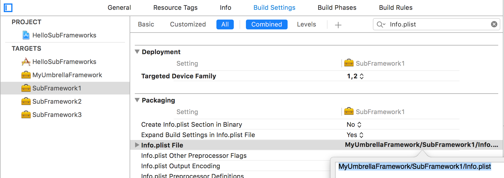
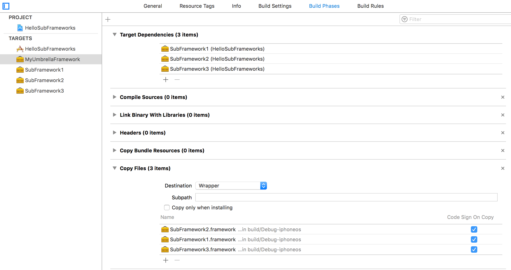

## HelloSubFrameworks

### 1. Umbrella Framework

有时候需要一个umbrella framework，用于放在subframework。Xcode没有这种产物的模板，但是可以调整一些编译配置，达到生成一个空的umbrella framework。

首先，使用CocoaTouch Framework模板，生成一个Target，类型是framework。然后按照下面步骤

* <del>去掉Info.plist，Info.plist File设置为空</del>（Xcode 9.3上，代码签名报错，必须要Info.plist）
* 去掉modulemap文件，Defines Module设置为NO（DEFINES_MODULE = NO）
* 去掉二进制文件，Versioning System设置为None（默认是Apple Generic）（VERSIONING_SYSTEM = ""）
* 去掉头文件，Build Phases -> Headers，全部文件删掉

完成上面的步骤，产物就是一个空的umbrella framework

### 2. SubFramework

（1）构建umbrella framework的文件结构

在创建umbrella framework后，添加framework target，它的文件夹默认和umbrella framework是平级的，可以直接在Xcode 9工程中，拖拽framework对应的文件夹到umbrella framework对应的文件夹下，Xcode 9会自动调整物理文件夹。如下


（2）调整Info.plist的路径



（3）umbrella framework依赖subframework



### 3. 使用SubFramework

app使用umbrella framework，两个步骤：依赖target、拷贝产物，如下


umbrella framework可以包含static framework或者dynamic framework。

（1）subframework是dynamic framework

subframework是dynamic framework，安装app失败，要求umbrella framework必须有Info.plist文件。满足这个要求后，安装app还是失败，发现签名失败，如下

```
Mar 26 21:26:20 chenliangde-iPhone streaming_zip_conduit[286] <Notice>: dispatch_source_read_socket_block_invoke:312: Failed to install application at file:///var/mobile/Media/PublicStaging/HelloSubFrameworks.app/ : Error Domain=MIInstallerErrorDomain Code=13 "Failed to verify code signature of /private/var/installd/Library/Caches/com.apple.mobile.installd.staging/temp.6tSyP1/extracted/HelloSubFrameworks.app/Frameworks/MyUmbrellaFramework.framework : 0xe8008001 (An unknown error has occurred.)" UserInfo={NSLocalizedDescription=Failed to verify code signature of /private/var/installd/Library/Caches/com.apple.mobile.installd.staging/temp.6tSyP1/extracted/HelloSubFrameworks.app/Frameworks/MyUmbrellaFramework.framework : 0xe8008001 (An unknown error has occurred.), LegacyErrorString=ApplicationVerificationFailed, SourceFileLine=147, LibMISErrorNumber=-402620415, FunctionName=+[MICodeSigningVerifier _validateSignatureAndCopyInfoForURL:withOptions:error:]}
```

推测是MyUmbrellaFramework.framework没有可执行文件，签名校验不对。所以，subframework是dynamic framework，这条路行不通。

（2）subframework是static framework

将dynamic framework的MachO-Type换成static library，产物就是static framework。这个方法是可行，编译时期，subframework的符号都导入到app target中，不会有安装app失败的问题。

