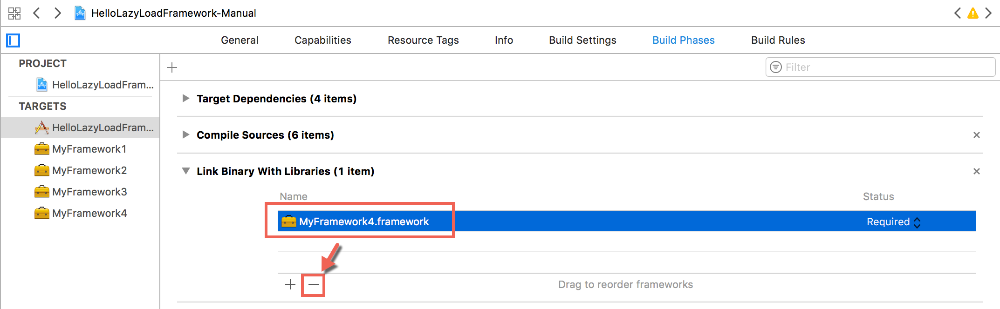
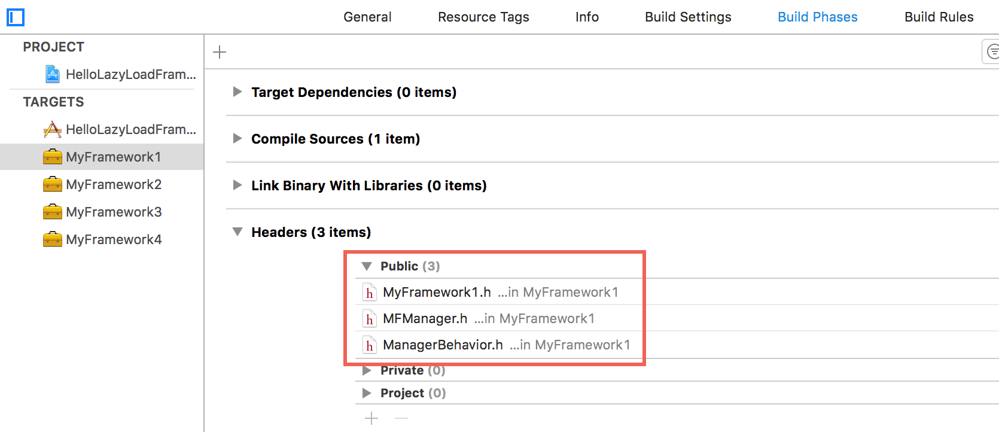
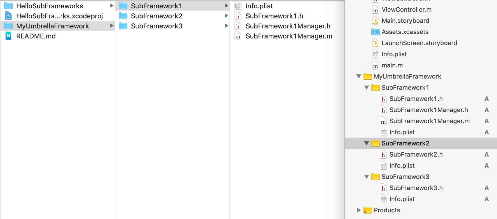
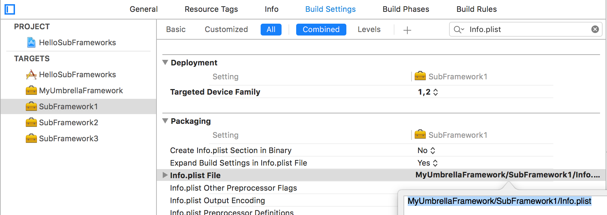
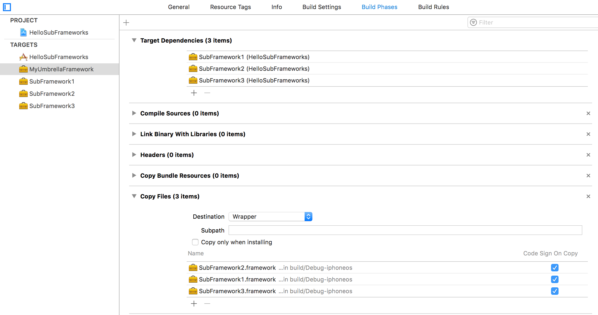

# HelloFrameworks

[TOC]

## 1、创建一个静态库

新建工程 -> 搜索“static library”


> 示例工程，见HelloStaticLibrary


## 2、创建一个Framework

framework可以是静态库，也可以是动态库

* 新建工程 -> 搜索“framework”，默认创建的target是动态库
* 新建工程 -> 搜索“framework”，Build Settings搜索Mach-O Type，设置成Static Library


## 3、创建一个Universal静态库


> 示例工程，见HelloUniversalStaticLibrary


## 4、创建一个Universal Dynamic Framework


> 示例工程，见HelloUniversalFramework


## 5、静态库转动态库


静态库转动态库的方法

下面说明的示例是

源码 -> 静态库 -> 动态库

动态库target的Other Linker Flags需要设置-all_load或者-ObjC，这样将静态库的符号复制到动态库中；否则动态库仅包含它自身的源码符号。


> 示例工程，HelloConvertStaticLibraryToDynamicFramework


## 6、懒加载动态库（Dynamic Framework）


### （1）如何懒加载framework

​        <b>懒加载framework</b>，指的是app启动的时候，不自动加载需要framework，而是app使用NSBundle或dlopen加载framework到内存，然后使用framework提供的类。


#### 手动创建动态库，换成懒加载方式

​        使用懒加载framework的工程，创建步骤，如下

1\. 创建Single View App工程。    
2\. 在Targets中点击+，添加Cocoa Touch Framework，例如MyFramework1、MyFramework2等。    
3\. 在App Target的Build Phasese -> Link Binary With Libraries，移除刚创建的framework



这里实际上，是不让app启动自动加载framework。

4\. 组织framework的头文件，在Build Phase -> Headers中设置.h的可见级别，需要在framework中公开的需要设置成public。



5\. 确认App Target中的几个地方，看Xcode添加framework时是否配置正确

* General -> Embedded Binaries，应该包含刚才添加的framework
* General -> Linked Frameworks and Libraries，应该没有刚才添加的framework
* Build Phases -> Target Dependencies，应该包含刚才添加的framework
* Build Phases -> Copy Files，应该包含刚才添加的framework

6\. App Target中懒加载framework

* NSBundle或dlopen加载framework 
* App Target中代码不能直接使用类对象来调用类方法，需要使用NSClassFromString获取类对象

说明

> 1. 步骤以使用Xcode 9.2为例
> 2. 创建lazyload的步骤，参考https://github.com/patriknyblad/ios-runtime-loading-dynamic-framework)


> 示例工程，见HelloLazyLoadFramework-Manual


#### CocoaPod集成的动态库换成懒加载方式

1. Prepare a podspec to provide binary framework
2. Create Podfile to import the framework
3. Add `DYLD_PRINT_LIBRARIES` environment variable to check launching load
4. Modify xcconfig (Debug/Release)

* Remove framework in `FRAMEWORK_SEARCH_PATHS`, e.g. 

```
FRAMEWORK_SEARCH_PATHS = $(inherited) "${PODS_ROOT}/../../MyFramework/Frameworks"
=>
FRAMEWORK_SEARCH_PATHS = $(inherited)
```

* Remove framework in `OTHER_LDFLAGS `, e.g. 

```
OTHER_LDFLAGS = $(inherited) -ObjC -framework "MyFramework"
=>
OTHER_LDFLAGS = $(inherited) -ObjC
```


> 示例工程，见HelloLazyLoadFramework-CocoaPods


### （2）如何使用懒加载framework的类

方式有几种

* 运行时方式，获取类、实例化对象、调用类或者实例方法，都通过运行时方式。这样不用引入framework的任何头文件。
* 使用framework的头文件。获取类用NSClassFromString，调用类或实例方法
* 使用framework的protocol文件。获取类用NSClassFromString，实例化delegate对象，调用protocol声明的方法。

说明

>1. Class对象可以调用任意方法，但是必须提供对应的头文件，否则编译会报错
>2. 直接使用framework的类，然后调用类方法，会导致framework被静态链接，app启动时就会加载framework，达不到懒加载framework的目前


## 7、Modular Framework

Modular Framework可以是动态库，也可以是静态库。


> 见HelloModularFramework的[README.md](HelloModularFramework/README.md)


## 8、Umbrella Framework

### （1）创建Umbrella Framework

​        有时候需要一个umbrella framework，用于放在subframework。Xcode没有这种产物的模板，但是可以调整一些编译配置，达到生成一个空的umbrella framework。

首先，使用CocoaTouch Framework模板，生成一个Target，类型是framework。然后按照下面步骤

* <del>去掉Info.plist，Info.plist File设置为空</del>（Xcode 9.3上，代码签名报错，必须要Info.plist）
* 去掉modulemap文件，Defines Module设置为NO（DEFINES_MODULE = NO）
* 去掉二进制文件，Versioning System设置为None（默认是Apple Generic）（VERSIONING_SYSTEM = ""）
* 去掉头文件，Build Phases -> Headers，全部文件删掉

完成上面的步骤，产物就是一个空的umbrella framework


### （2）创建SubFramework

#### 构建umbrella framework的文件结构

​         在创建umbrella framework后，添加framework target，它的文件夹默认和umbrella framework是平级的，可以直接在Xcode 9工程中，拖拽framework对应的文件夹到umbrella framework对应的文件夹下，Xcode 9会自动调整物理文件夹。如下




#### 调整Info.plist的路径




#### umbrella framework依赖subframework




### （3）使用SubFramework

app使用umbrella framework，两个步骤：依赖target、拷贝产物，如下


umbrella framework可以包含static framework或者dynamic framework。


#### subframework是dynamic framework

​        subframework是dynamic framework，安装app失败，要求umbrella framework必须有Info.plist文件。满足这个要求后，安装app还是失败，发现签名失败，如下

```
Mar 26 21:26:20 chenliangde-iPhone streaming_zip_conduit[286] <Notice>: dispatch_source_read_socket_block_invoke:312: Failed to install application at file:///var/mobile/Media/PublicStaging/HelloSubFrameworks.app/ : Error Domain=MIInstallerErrorDomain Code=13 "Failed to verify code signature of /private/var/installd/Library/Caches/com.apple.mobile.installd.staging/temp.6tSyP1/extracted/HelloSubFrameworks.app/Frameworks/MyUmbrellaFramework.framework : 0xe8008001 (An unknown error has occurred.)" UserInfo={NSLocalizedDescription=Failed to verify code signature of /private/var/installd/Library/Caches/com.apple.mobile.installd.staging/temp.6tSyP1/extracted/HelloSubFrameworks.app/Frameworks/MyUmbrellaFramework.framework : 0xe8008001 (An unknown error has occurred.), LegacyErrorString=ApplicationVerificationFailed, SourceFileLine=147, LibMISErrorNumber=-402620415, FunctionName=+[MICodeSigningVerifier _validateSignatureAndCopyInfoForURL:withOptions:error:]}
```

推测是MyUmbrellaFramework.framework没有可执行文件，签名校验不对。所以，subframework是dynamic framework，这条路行不通。


#### subframework是static framework

​      将dynamic framework的MachO-Type换成static library，产物就是static framework。这个方法是可行，编译时期，subframework的符号都导入到app target中，不会有安装app失败的问题。


## 9、关于-undefined dynamic_lookup

Other Linker Flag设置`-undefined dynamic_lookup`，可以让ld链接时，不去检查符号是否实现。例如

SomeTool.m

```objective-c
#import "SomeTool.h"
#import "OrphanClassWithoutImpl.h"

@implementation SomeTool

- (instancetype)init {
    self = [super init];
    if (self) {
        [OrphanClassWithoutImpl doSomething];
    }
    return self;
}

@end
```

OrphanClassWithoutImpl.h

```objective-c
@interface OrphanClassWithoutImpl : NSObject
+ (void)doSomething;
@end
```

OrphanClassWithoutImpl只有头文件，没有.m文件，doSomething方法的实现可能在另外一个framework中（通过分类方法）。

为了能让SomeTool链接通过，将Other Linker Flag设置`-undefined dynamic_lookup`，可以发现ld通过了。但是和开启bitcode是冲突的，而`-undefined dynamic_lookup`会报warning，标记为deprecated。

举另一个例子，如下

动态库链接静态库，静态库中有些undefined符号，如下

```shell
$ nm -um xxx                                 

xxx(yyy.o):
                 (undefined) external _OBJC_CLASS_$_NSObject
                 (undefined) external _OBJC_CLASS_$_NSTimer
                 (undefined) external _OBJC_METACLASS_$_NSObject
                 (undefined) external __NSConcreteStackBlock
                 (undefined) external ___CFConstantStringClassReference
                 (undefined) external __dispatch_main_q
                 (undefined) external __objc_empty_cache
                 (undefined) external _dispatch_async
                 (undefined) external _globalModular4MessengerKit
                 (undefined) external _objc_autoreleaseReturnValue
                 (undefined) external _objc_copyWeak
                 (undefined) external _objc_destroyWeak
                 (undefined) external _objc_getProperty
                 (undefined) external _objc_initWeak
                 (undefined) external _objc_loadWeakRetained
```

ld进行符号链接（和系统库、自定义库），如果根据undefined符号找不到对应的实现，则报错

```shell
Undefined symbols for architecture x86_64:
  "_OBJC_CLASS_$_zzz", referenced from:
      l_OBJC_$_CATEGORY_www in xxx(yyy.o)
```

如果将动态库的other linker flags添加`-undefined dynamic_lookup`，则编译可以通过。

### Tips

1\. Same symbols in different frameworks, loaded in runtime, will cause `Which one is undefined` error. Afterward loaded same symbols will not work.

```shell
dyld: loaded: /Users/wesley_chen/Library/Developer/Xcode/DerivedData/HelloLazyLoadFramework-Manual-ddocsdrrinmirffuqwxdfasdudty/Build/Products/Debug-iphonesimulator/MyFramework2.framework/MyFramework2
objc[24903]: Class MFManager is implemented in both /Users/wesley_chen/Library/Developer/Xcode/DerivedData/HelloLazyLoadFramework-Manual-ddocsdrrinmirffuqwxdfasdudty/Build/Products/Debug-iphonesimulator/MyFramework1.framework/MyFramework1 (0x11713d160) and /Users/wesley_chen/Library/Developer/Xcode/DerivedData/HelloLazyLoadFramework-Manual-ddocsdrrinmirffuqwxdfasdudty/Build/Products/Debug-iphonesimulator/MyFramework2.framework/MyFramework2 (0x117142160). One of the two will be used. Which one is undefined.
```

2\. After `dlclose` or NSBundle `unload`, symbols still alive

3\. Only import framework's header files, will not link the framework. But different symbols (e.g. methods) will or not link framework on compile time

* Class name, will not link, e.g. `MFManager *manager = [NSClassFromString(@"MFManager") new]`
* Class methods, will link, e.g. `MFManager *manager = [MFManager new]`
* Instance methods, will not link, e.g. `[manager helloWithName:@"Lucy"];`

4\. Class type can call any method, e.g. `[NSClassFromString(@"XXXClass") anyMethod]`, but still need to import header files

5\. `otool -L xxx.app/xxx`, check app executable needed frameworks

6\. `xxx.app/Frameworks`, private frameworks folder

7\. Dynamic Linker (dyld) [environment variables](https://developer.apple.com/library/content/technotes/tn2239/_index.html#//apple_ref/doc/uid/DTS40010638-CH1-SUBSECTION21), e.g. `DYLD_PRINT_LIBRARIES `


