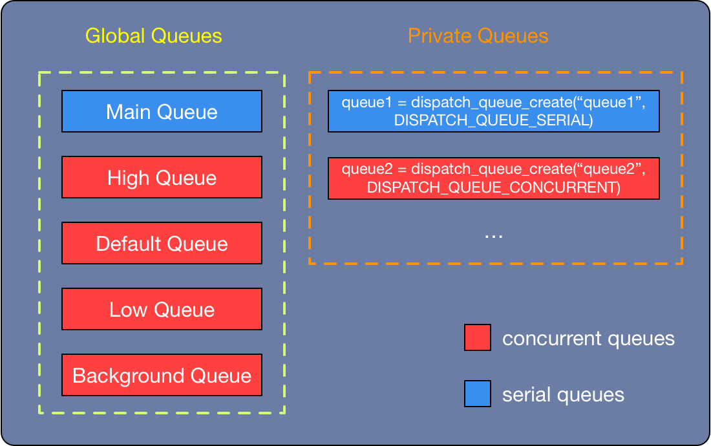
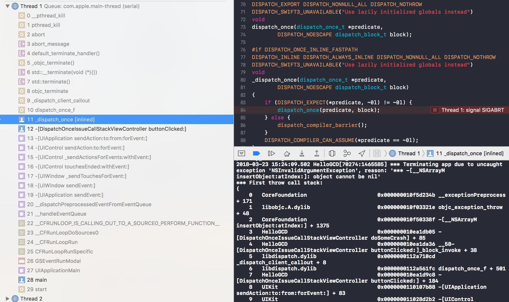

# HelloGCD
--

TOC

## Dispatch Queue




### 1. Queue的分类

* 按照队列的执行顺序，分为串行队列（serial queue）和并行队列（concurrent queue）
  - 串行队列，每次从队列中顺序取出一个任务执行
  - 并行队列，每次从队列中顺序取出多个任务同时执行

* 按照队列的生命周期，分为全局队列（global queue）和私有队列（private queue）
  - 全局队列，生命周期在app执行过程中，系统为每个app，初始化5个队列，1个串行队列（main queue）和4个并行队列（high、default、low、background queue，优先级依次递减）
  - 私有队列，开发者自己创建的队列（串行或者并行），生命周期自己维护
 
优先级对应QoS的关系
>
* High priority (user-initiated-qos)
* Default priority (default-qos)
* Low priority (utility-qos)
* Background (background-qos)

### 2. 创建私有队列

创建串行队列

```
dispatch_queue_create("com.example.MyQueue", NULL)
dispatch_queue_create("com.example.MyQueue", DISPATCH_QUEUE_SERIAL)
```
> 
DISPATCH\_QUEUE\_SERIAL宏被定义为NULL

创建并行队列

```
dispatch_queue_create("com.example.MyQueue2", DISPATCH_QUEUE_CONCURRENT)
```

### 3. 获取全局队列

```
// main queue
dispatch_get_main_queue()
// high queue
dispatch_get_global_queue(DISPATCH_QUEUE_PRIORITY_HIGH, 0)
// default queue
dispatch_get_global_queue(DISPATCH_QUEUE_PRIORITY_DEFAULT, 0)
// low queue
dispatch_get_global_queue(DISPATCH_QUEUE_PRIORITY_LOW, 0)
// background queue
dispatch_get_global_queue(DISPATCH_QUEUE_PRIORITY_BACKGROUND, 0)
```

### 4. 添加上下文数据到队列

（1）使用dispatch\_set\_context和dispatch\_get\_context

（2）使用

```
// 设置Context Data
dispatch_queue_set_specific

// 获取当前queue的Context Data
dispatch_get_specific

// 获取指定的queue的Context Data
dispatch_queue_get_specific
```

### 5. 获取当前队列

（1）使用dispatch\_get\_current\_queue()获取对象比较

`dispatch_get_current_queue()`在iOS 6+上被标记deprecated，已经不能使用，而且在iOS 6+可能存在crash情况

```
dispatch_queue_t queue = dispatch_queue_create("com.wc.example", DISPATCH_QUEUE_SERIAL);
dispatch_async(queue, ^{
    // Note: crash on iOS 6+, but safe on iOS 5 and lower
    NSLog(@"Will crash here: %@", dispatch_get_current_queue());
});
```

（2）使用[NSOperationQueue currentQueue].underlyingQueue获取对象比较[^1]

underlyingQueue方法在iOS 8+上，而且仅在main queue上调用能返回当前queue对象，就是main queue，在其他queue中调用返回nil。

测试代码如下

```
// assume on main queue
NSLog(@"1. %@", [NSOperationQueue currentQueue].underlyingQueue);
    
dispatch_async(dispatch_get_global_queue(DISPATCH_QUEUE_PRIORITY_DEFAULT, 0), ^{
    NSLog(@"2. %@", [NSOperationQueue currentQueue].underlyingQueue);
});
    
dispatch_async(dispatch_get_main_queue(), ^{
    NSLog(@"3. %@", [NSOperationQueue currentQueue].underlyingQueue);
});
    
dispatch_queue_t queue = dispatch_queue_create("com.wc.myQueue", DISPATCH_QUEUE_SERIAL);
dispatch_async(queue, ^{
    NSLog(@"4. %@", [NSOperationQueue currentQueue].underlyingQueue);
});
```

（3）获取queue的label进行比较[^2]

`dispatch_queue_get_label`带一个参数queue，取出该queue的label。如果传入常量DISPATCH\_CURRENT\_QUEUE\_LABEL，则取出当前queue的label。

```
dispatch_queue_t queue1 = dispatch_queue_create("com.wc.myQueue", DISPATCH_QUEUE_SERIAL);
dispatch_async(queue1, ^{
    // com.wc.myQueue
    NSLog(@"3. %s", dispatch_queue_get_label(DISPATCH_CURRENT_QUEUE_LABEL));
    
    if (strcmp(dispatch_queue_get_label(DISPATCH_CURRENT_QUEUE_LABEL), "com.wc.myQueue") == 0) {
        NSLog(@"is current queue");
    }
    else {
        NSLog(@"is not current queue");
    }
});
```

和上面的两种方法不一样，不是直接取出queue对象，而是取出queue的label。通过比较label，来判断block中是否在特定的queue中执行。缺点是，queue的label并不是唯一标识，允许存在重复的情况。

（4）获取queue的context data进行比较

queue可以设置context data，在block中获取context data，达到判断是否是当前queue的目的。

```
// 设置Context Data
dispatch_queue_set_specific

// 获取当前queue的Context Data
dispatch_get_specific

// 获取指定的queue的Context Data
dispatch_queue_get_specific
```

dispatch\_queue\_set\_specific可以设置多个key-value数据。context data内存管理需调用者处理。

>
设置context data的另一种方式，dispatch\_set\_context和dispatch\_get\_context，支持对所有dispatch_object设置，dispatch_queue是dispatch_object的一种。缺点：1. 不能取当前queue的context data，必须指定queue参数。2. 不支持key-value形式，只能设置一个context data。


5\. Add task to a queue (AddTaskToQueueViewController)

* 同步/异步：`dispatch_sync` or `dispatch_async`
* 回调是block/function：`dispatch_async` or `dispatch_async_f`
* Dead Lock示例

6\. Barrier block

* 使用`dispatch_barrier_async`提交barrier block到concurrent queue（created by dispatch_queue_create）。
* barrier block执行前会等之前的任务执行完，barrier block执行过程中会阻塞后面的任务，当barrier block执行结束后才执行后面的任务
* `dispatch_barrier_async`提交barrier block到serial queue或者global concurrent queue，则退化到`dispatch_async` (from `dispatch_barrier_async` apple doc)

7\. Add completion block to a queue

```
    dispatch_async(dispatch_get_global_queue(DISPATCH_QUEUE_PRIORITY_DEFAULT, 0), ^{
        float avg = average(data, len);
        NSLog(@"Done average1");
        dispatch_async(queue, ^{
            block(avg);
        });
    });
```

8\. Concurrent loop using `dispatch_apply`

* `dispatch_apply`是同步调用，需要注意死锁情况
* `dispatch_apply`执行的任务是并行loop，需要注意资源隔离和方法重入

```
    dispatch_queue_t concurrentQueue = dispatch_get_global_queue(DISPATCH_QUEUE_PRIORITY_DEFAULT, 0);
    
    dispatch_async(concurrentQueue, ^{
        NSLog(@"start concurrent iterating");
        size_t count = 10;
        dispatch_apply(count, concurrentQueue, ^(size_t i) {
            NSLog(@"This is %zu iteration", i);
        });
        NSLog(@"end concurrent iterating");
    });
```

9\. Suspend and resume queue

10\. Dispatch semaphore

* use for finite resource pool
* use for completion block

11\. Dispatch group

* `dispatch_group_async` with `dispatch_group_wait`
* `dispatch_group_async` with `dispatch_group_notify`
* use `dispatch_group_enter` and `dispatch_group_leave` instead of `dispatch_group_async `

12\. Create inactive queue

* use `DISPATCH_QUEUE_SERIAL_INACTIVE` or `DISPATCH_QUEUE_CONCURRENT_INACTIVE`

## Dispatch Source

see HelloGCD project


## GCD Issues

#### 1. dispatch_once中出现crash，Xcode中调用栈没有显示正常的调用栈

dispatch\_once方法中，如果出现crash，Xcode中调用栈没有显示正常的调用栈。应该是dispatch\_once宏使用汇编代码，丢掉了帧信息或者捕获到异常重新throw。




References
--
[^1]: https://stackoverflow.com/a/29708852
[^2]: https://stackoverflow.com/a/38271884