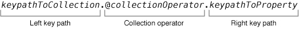

# KeyValueCoding

[TOC]

1、accessInstanceVariablesDirectly

TODO:

 https://stackoverflow.com/questions/6122398/objective-c-why-private-ivars-are-not-hidden-from-the-outside-access-when-using

https://developer.apple.com/library/archive/documentation/Cocoa/Conceptual/KeyValueCoding/SearchImplementation.html#//apple_ref/doc/uid/20000955


## 1、集合操作符（Collection Operators）[^1]

​       集合操作符是以`@`开头，后面跟着特定关键词的字符串，用于在KVC（KeyValueCoding）的`valueForKeyPath:`方法中。

​       完整的keyPath结构，分为三个部分：Left key path、Collection operator、Right key path，如下




集合操作符（Collection Operator）根据行为，分为下面三种操作符

* Aggregation Operator（聚合操作符），将一系列对象做聚合操作，得到单个对象。例如`@count`
* Array Operator（数组操作符），返回NSArray对象。一般是原对象集合的子集。
* Nesting Operator（嵌套操作符），适用于集合嵌套集合的情况。


### Aggregation Operators


| 操作符的使用格式                                 | 含义     | 返回值类型           |
| ------------------------------------------------ | -------- | -------------------- |
| [collectionObject valueForKeyPath:@avg.property] | 取平均数 | NSNumber             |
| [collectionObject valueForKeyPath:@count]        | 取个数   | NSNumber             |
| [collectionObject valueForKeyPath:@max.property] | 取最大数 | id，根据property确定 |
| [collectionObject valueForKeyPath:@min.property] | 取最小数 | id，根据property确定 |
| [collectionObject valueForKeyPath:@sum.property] | 取总数   | NSNumber             |

如果是对集合中元素本身操作，而不是元素上的属性，则将property换成self，例如@sum.self。

举个例子，如下

```objective-c
NSArray *pattern = @[@5, @4, @3, @2];
output = [pattern valueForKeyPath:@"@sum.self"];
XCTAssertTrue([output isKindOfClass:[NSNumber class]]);
XCTAssertEqualObjects(output, @(14));
```


### Array Operators


| 操作符的使用格式                                         | 含义                             | 返回值类型             |
| -------------------------------------------------------- | -------------------------------- | ---------------------- |
| [array valueForKeyPath:@distinctUnionOfObjects.property] | 将一维数组的property求不重复并集 | NSArray\<PropertyType> |
| [array valueForKeyPath:@unionOfObjects.property]         | 将一维数组的property的并集       | NSArray\<PropertyType> |


### Nesting Operators


| 操作符的使用格式                                             | 含义                                              | 返回值类型             |
| :----------------------------------------------------------- | :------------------------------------------------ | ---------------------- |
| [arrayOfArrays valueForKeyPath:@distinctUnionOfArrays.property] | 将二维数组中所有元素的property求不重复并集        | NSArray\<PropertyType> |
| [arrayOfArrays valueForKeyPath:@unionOfArrays.property]      | 将二维数组中所有元素的property求并集              | NSArray\<PropertyType> |
| [setOfSets valueForKeyPath:@distinctUnionOfSets.property]    | 将二维集合(NSSet)中所有元素的property求不重复并集 | NSSet\<PropertyType>   |


示例：将嵌套的二维数组转成一维数组，如下

```objective-c
NSArray *flattedArray = [twoDimensionalArray valueForKeyPath:@"@unionOfArrays.self"];
```


## 2、KVC常见问题


## References

[^1]: https://developer.apple.com/library/archive/documentation/Cocoa/Conceptual/KeyValueCoding/CollectionOperators.html#//apple_ref/doc/uid/20002176-SW9 Apple KVC 文档