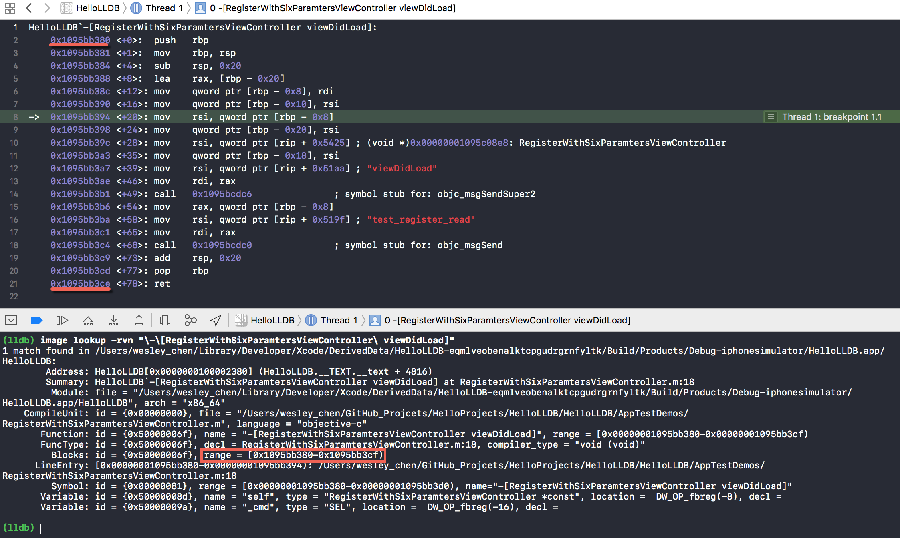
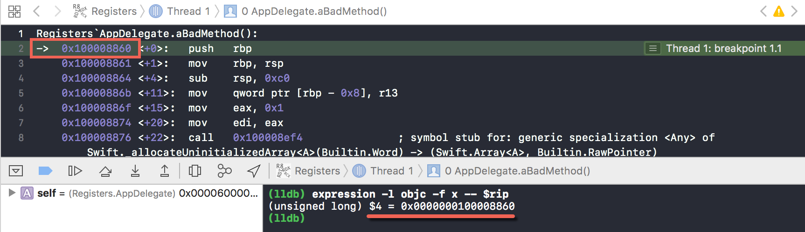
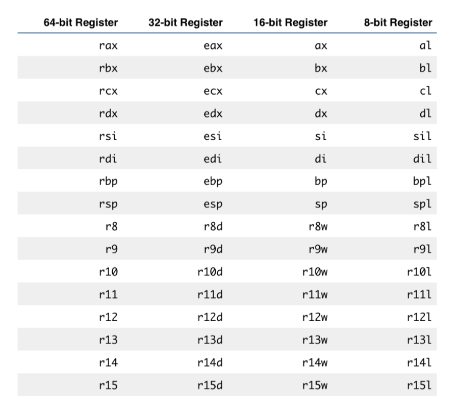
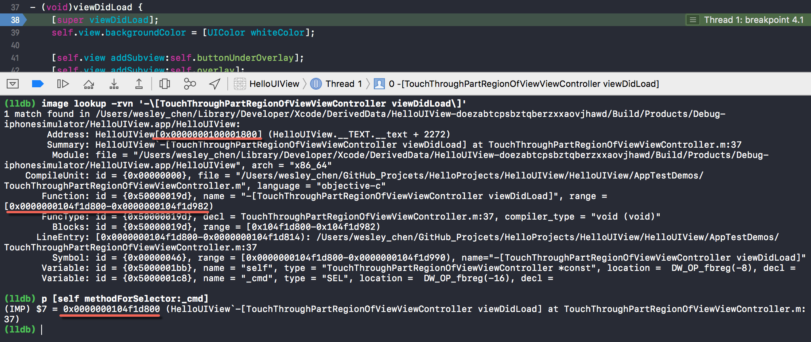
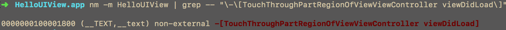

# HelloLLDB

[TOC]


## 1、lldb手册


### 1. print

格式：print \<expression\>    
简写：p     
说明：print是**expression --**的别名，后面不能加选项    
例子：    

```shell
(lldb) p @[@"foo", @"bar"]
(__NSArrayI *) $4 = 0x00000001028010f0 @"2 elements"
```


### 2. po（print object）

格式：po \<expression\>    
简写：po    
说明：po是**expression -O --**的别名，用于调用对象的debugDescription方法    
例子：

```shell
(lldb) e -O -- $4
<__NSArrayI 0x1028010f0>(
foo,
bar
)
```


### 3. print/\<fmt\>

格式：    

* p/x，以十六进制打印
* p/t，以二进制打印，t代表two
* p/d，以十进制打印
* 其他的有p/c，p/s等

例子：

```shell
(lldb) p 16
(int) $5 = 16
(lldb) p/x 16
(int) $6 = 0x00000010
(lldb) p/t 16
(int) $7 = 0b00000000000000000000000000010000
(lldb) p/t (char)16
(char) $8 = 0b00010000
```


### 4. expression

格式：expression <expression>    
简写：e    
说明：expression是比较复杂的命令，后面可以加选项。     

* expression -l\<objc/swift\>，lldb调试会根据上下文选择objc环境，还是swift环境，-l指定上下文的语言环境

* expression -- \<expression\>，--指定后面不是选项，而是需要执行的表达式

* expression -i 0 -- \<expression\>，lldb中执行expression默认不会触发断点。-i0（或者-i 0）强制执行expression触发断点。

```shell
(lldb) expr -i 0 -- [self areaNbr]
```

参考 
>
https://stackoverflow.com/questions/35861198/xcode-not-stopping-on-breakpoint-in-method-called-from-lldb

* expression -O -- \<expression\>，等同于po命令

例子：

* 执行表达式

```shell
(lldb) e int $a = 2
(lldb) e $a
(int) $a = 2
(lldb) e $a * 19
(int) $0 = 38
(lldb) e NSArray *$array = @[ @"Saturday", @"Sunday", @"Monday" ]
(lldb) e $array
(__NSArrayI *) $array = 0x0000000100700ee0 @"3 elements"
(lldb) p $array
(__NSArrayI *) $array = 0x0000000100700ee0 @"3 elements"
(lldb) po $array
<__NSArrayI 0x100700ee0>(
Saturday,
Sunday,
Monday
)
```

* expression对方法的返回值严格检查，需要加上返回值类型

```shell
(lldb) e [[$array objectAtIndex:0] uppercaseString]
error: no known method '-uppercaseString'; cast the message send to the method's return type
(lldb) e (NSString *)[[$array objectAtIndex:0] uppercaseString]
(NSTaggedPointerString *) $1 = 0x005325e6621cbe85 @"SATURDAY"
```

* 执行简单的代码片段

```shell
(lldb) e char *$str = (char *)malloc(8)
(lldb) e $str
(char *) $str = 0x0000000100100020 <no value available>
(lldb) e (void)strcpy($str, "munkeys")
(lldb) e $str
(char *) $str = 0x0000000100100020 "munkeys"
(lldb) e $str[1] = 'o'
(char) $0 = 'o'
(lldb) e $str
(char *) $str = 0x0000000100100020 "monkeys"
(lldb) x/4c $str
error: reading memory as characters of size 4 is not supported
(lldb) x/c $str
0x100100020: monk
(lldb) x/1w `$str + 3`
0x100100023: keys
(lldb) e (void)free($str)
(lldb) e $str
(char *) $str = 0x0000000100100020 "monkeys"
```

* 设置UIView的frame

```shell
e [v setFrame:(CGRect){0, 0, 100, 100}] 
```

参考
>
https://stackoverflow.com/questions/27533709/how-to-set-the-frame-of-a-uiview-at-runtime-using-lldb-expr-debugging-console

* 打印Objective-C方法的字符串

```shell
(lldb) po (char *)$x1
"_parseEventsArrayFromEvent:"

(lldb) po (SEL)$x1
"_parseEventsArrayFromEvent:"
```

* expression -lobjc -O -- (unichar *)$rax，打印unichar类型的字符串

```shell
(lldb) expression -lobjc -O -- (char *)$rax
"D"

(lldb) memory read $rax
error: invalid start address expression.
error: address expression "$rax" evaluation failed
(lldb) memory read 106377752533792
0x60c00026db20: 44 00 65 00 72 00 65 00 6b 00 20 00 53 00 65 00  D.e.r.e.k. .S.e.
0x60c00026db30: 6c 00 61 00 6e 00 64 00 65 00 72 00 00 00 00 00  l.a.n.d.e.r.....
(lldb) expression -lobjc -O -- (unichar *)$rax
u"Derek Selander"
(lldb) po strlen("Derek Selander") * 2
28
(lldb) e -lobjc -O -- [[NSString alloc] initWithBytes:$rax length:28 encoding:0x94000100]
Derek Selander
```
> 0x94000100是NSUTF16LittleEndianStringEncoding的值


### 5. continue

格式：continue    
简写：c     
continue不带参数，是**process continue**的别名。debug时，代表当前进程恢复执行


### 6. thread

#### （1）thread step-over (next)

格式：thread step-over    
简写：n，next    
说明：当前线程单步执行
n不带参数。debug时，代表单步执行


#### （2）thread step-in（step）

格式：thread step-in    
简写：s，step    
说明：当前线程单步进入函数。finish命令是和step相反的操作，用于跳出函数

* step -a0，忽略lldb设置，总是单步进入


#### （3）thread return

格式：thread return \<optional retVal\>    
说明：当前线程中止后面的执行，提前返回到函数入口。thread return带一个可选的返回值，如果执行，当前函数立即返回，剩下的代码不会执行。  
注意：和finish不一样，finish是执行完当前函数才返回。由于提前返回，可能有ARC相关内存问题


#### （4）thread list

格式：thread list     
说明：列出当前所有线程

```shell
(lldb) thread list
Process 15767 stopped
* thread #1: tid = 0x5bf9ba, 0x000000010ff0cf10 Commons`__34+[UnixSignalHandler sharedHandler]_block_invoke((null)=0x0000000113cc8470) at UnixSignalHandler.m:68, queue = 'com.apple.main-thread', stop reason = breakpoint 1.1
  thread #2: tid = 0x5bfa09, 0x0000000115fa5562 libsystem_kernel.dylib`__workq_kernreturn + 10
  thread #3: tid = 0x5bfa0a, 0x0000000115fa5562 libsystem_kernel.dylib`__workq_kernreturn + 10
  thread #4: tid = 0x5bfa0b, 0x0000000115fdac40 libsystem_pthread.dylib`start_wqthread
  thread #5: tid = 0x5bfa0c, 0x0000000115fa5562 libsystem_kernel.dylib`__workq_kernreturn + 10
  thread #6: tid = 0x5bfa13, 0x0000000115f9b7c2 libsystem_kernel.dylib`mach_msg_trap + 10, name = 'com.apple.uikit.eventfetch-thread'
  thread #8: tid = 0x5bfa15, 0x0000000115fa5562 libsystem_kernel.dylib`__workq_kernreturn + 10
```


#### （5）thread step-out（finish）

格式：thread step-out    
简写：finish    
说明：debug时，代表执行完当前函数或者方法，然后跳到调用处，这时可以查看RAX寄存器    
参考资料：https://www.objc.io/issues/19-debugging/lldb-debugging/


#### （6）thread info

格式：thread info [-js]    

说明：显示当前thread信息

```shell
(lldb) thread info
thread #1: tid = 0x1ba0d4, 0x000000010dc05280 libclang_rt.asan_iossim_dynamic.dylib`__asan::AsanDie(), queue = 'com.apple.main-thread', stop reason = Use of deallocated memory
```

* -j，JSON格式显示当前thread信息
* -s，JSON格式显示当前thread的扩展信息


### 7. type

格式：type \<subcommand\>    
说明：type命令用于定义LLDB环境中的类型以及输出格式    


#### （1）type summary

格式：type summary \<subcommand\>  
说明：用于显示某种类型的描述信息。常用子命令有add、clear等    

* type summary add，向某种类型添加描述信息summary

```shell
(lldb) p superView
(SuperView *) $0 = 0x00007fb4fac15130
(lldb) type summary add SuperView --summary-string "This is a SuperView"
(lldb) p superView
(SuperView *) $1 = 0x00007fb4fac15130 This is a SuperView
```

* type summary clear，清除所有summary信息

```shell
(lldb) p superView
(SuperView *) $1 = 0x00007fb4fac15130 This is a SuperView
(lldb) type summary clear
(lldb) p superView
(SuperView *) $2 = 0x00007fb4fac15130
```


### 8. TODO


### 9. frame


#### （1）frame info

格式：frame info    
说明：显示当前执行点的信息，例如对应源文件的行号等

```shell
(lldb) frame info
frame #0: 0x0000000100000ecf flow_control`main(argc=1, argv=0x00007fff5fbff7e0) + 63 at main.m:25
```


#### （2）frame select

格式：frame select <frame No.>    
说明：查看特定的frame。frame info只显示第0个frame。这里的序号，对应thread backtrace输出的frame序号。

```shell
(lldb) frame select 1
frame #1: 0x0000000115b1533d libdispatch.dylib`_dispatch_client_callout + 8
libdispatch.dylib`_dispatch_client_callout:
    0x115b1533d <+8>:  addq   $0x8, %rsp
    0x115b15341 <+12>: popq   %rbx
    0x115b15342 <+13>: popq   %rbp
    0x115b15343 <+14>: retq 
```


#### （3）frame variable

格式：frame variable    
说明：查看当前frame的所有变量   

```shell
(lldb) frame variable
(__block_literal_1 *)  = 0x0000000113cc8470
```

* frame variable -F self，查看特定变量的值


### 10. command


#### （1）command alias

格式：command alias \<alias name\> \<command\>/\<expr\>    
说明：command alias的作用是，定义命令或者表达式的别名，用于简化输入的命令

定义别名Yay_Autolayout

```shell
command alias -- Yay_Autolayout expression -l objc -O --
[[[[[UIApplication sharedApplication] keyWindow] rootViewController]
view] recursiveDescription]
```
>
`--`的作用是不让后面-l -O等当成command alias命令的选项

定义别名Yay\_Autolayout，同时提供help信息。-H对应help Yay\_Autolayout的输出；-h对应直接help的输出

```shell
command alias -H "Yay_Autolayout will get the root view and recursively
dump all the subviews and their frames" -h "Recursively dump views" --
Yay_Autolayout expression -l objc -O -- [[[[[UIApplication
sharedApplication] keyWindow] rootViewController] view]
recursiveDescription]
```

定义别名cpo，并接收一个参数。注意：使用command alias只能支持一个参数，而且在末尾拼接。如果动态参数在命令中间，需要使用command regex命令。

```shell
command alias cpo expression -l objc -O --
```

定义别名cpx，接收一个参数

```shell
command alias -H "Print value in ObjC context in hexadecimal" -h "Print
in hex" -- cpx expression -f x -l objc --
```


#### （2）command regex

格式：command regex \<alias name\> 's/\<regexp\>/\<subst\>/'    
说明：command regex命令，根据regex抽取参数，同时替换到subst中。这样构成接收动态参数的命令subst。

定义别名rlook，它接收一个按照(.+)匹配的参数%1，构成命令image lookup -rn \<%1\>

```shell
command regex rlook 's/(.+)/image lookup -rn %1/'

// rlook FOO => image lookup -rn FOO
```

定义别名tv，它接收一个参数，执行一段代码

```shell
command regex -- tv 's/(.+)/expression -l objc -O -- @import
QuartzCore; [%1 setHidden:!(BOOL)[%1 isHidden]]; (void)[CATransaction
flush];/'
```

定义别名getcls，它接收以0-9或者@或者[开头的字符串，构成命令cpo [%1 class]，cpo是另一个命令或者别名

```shell
command regex getcls 's/(([0-9]|\$|\@|\[).*)/cpo [%1 class]/'
```

定义别名getcls，定义两个regex，执行两个命令cpo [%1 class]和expression -l swift -O -- type(of: %1)

```shell
command regex getcls 's/(([0-9]|\$|\@|\[).*)/cpo [%1 class]/' 's/
(.+)/expression -l swift -O -- type(of: %1)/'
```


#### （3）command script

格式：command script \<subcommand\>    
说明：command script命令，后面跟着几种子命令。例如import、list等

* command script import，导入自定义的python脚本，指定脚本的路径。

```shell
(lldb) command script import /usr/local/opt/chisel/libexec/fblldb.py
(lldb) command script import "/Users/wesley_chen/lldb/Scripts/Live Debug/subl.py"
```

如果预置的脚本在/Applications/Xcode.app/Contents/SharedFrameworks/LLDB.framework/Versions/A/Resources/Python/lldb下面，可直接使用下面方式

```shell
(lldb) command script import lldb.macosx.heap
```

* command script add，添加python函数作为一个lldb命令

```shell
(lldb) command script add -f helloworld.your_first_command yay
```
>
-f，指定python函数名，同时指定lldb命令名称


### 11. process

格式：process \<subcommand\>    
说明：用于和当前进程交互


#### （1）process load

格式：process load \<path/to/image\>    
说明：加载动态库到当前进程中

```shell
(lldb) process load /Library/Developer/CoreSimulator/Profiles/Runtimes/iOS\ 10.0.simruntime/Contents/Resources/RuntimeRoot/System/Library/Frameworks/Speech.framework/Speech
Loading "/Library/Developer/CoreSimulator/Profiles/Runtimes/iOS 10.0.simruntime/Contents/Resources/RuntimeRoot/System/Library/Frameworks/Speech.framework/Speech"...ok
Image 0 loaded.
```

还可以省略完整的路径，采用xxx.framework/xxx格式，如下

```shell
(lldb) process load MessageUI.framework/MessageUI
Loading "MessageUI.framework/MessageUI"...ok
Image 1 loaded.
```


#### （2）process launch

格式：process launch [options]    
说明：当target命令设置可执行文件后，process launch启动当前可执行文件

```shell
(lldb) process launch -e /dev/ttys027 --
```

>
-e，将stderr定向到/dev/ttys027文件


### 12. script

格式：script \<python script\>    
说明：script用于执行python代码

```shell
(lldb) script import sys
(lldb) script print (sys.version)
```


### 13. breakpoint


#### （1）breakpoint set

格式：breakpoint set [options] \<arguments\>

常用选项：

* -o \<boolean\> (--one-shot \<boolean\>)，设置一次性断点，当触发断点，断点自动删除掉
* -S \<selector\> (--selector \<selector\>)，根据Objective-C的selector（例如"-[ViewController viewDidLoad]"）设置断点

```shell
(lldb) breakpoint set -S -[RegisterWithSixParamtersViewController\ viewDidLoad]
(lldb) breakpoint set -S "-[RegisterWithSixParamtersViewController viewDidLoad]"
```
Tips:
>
直接复制代码中方法的selector，`⌘ + ⇧ + ⎇ + ^ + c`

* -K \<boolean\> (--skip-prologue \<boolean\>)，触发断点时是否自动跳过prologue。默认是跳过的，可以设置false，这样触发断点时总是停在汇编第一条指令处。

```shell
(lldb) br set -K false -S '-[RegisterWithSixParamtersViewController methodWithArg3:arg4:arg5:arg6:]'
```

* -r \<regular expression\>，简写rb \<regular expression\>，正则匹配符号，设置断点

匹配特定的符号

```shell
(lldb) rb SwiftTestClass.name.setter
(lldb) rb name\.setter
(lldb) rb '\-\[UIViewController\ '
```

匹配所有的符号

```shell
(lldb) rb .
```

* -s (--shlib) \<module\>，匹配在特定module中所有的符号

```shell
(lldb) rb . -s UIKit
```

匹配在特定module中所有的符号，而且断点是一次性的

```shell
(lldb) rb . -s UIKit -o
```

* breakpoint set -f \<filename\.m> -l \<line number\>，指定文件和行号，设置断点

```shell
(lldb) breakpoint set -f YWEmoticonGroupIndexController.m -l 232
Breakpoint 18: where = YWExtensionForEmotionFMWK`-[YWEmoticonGroupIndexController setupNavBar] + 780 at YWEmoticonGroupIndexController.m:232, address = 0x00000001227ec9fc
```

>
如果符号信息没有加载到内存中（例如手动加载动态库），则设置断点会报错如下    
Breakpoint 16: no locations (pending).    
WARNING:  Unable to resolve breakpoint to any actual locations.

* 指定C函数的符号，设置断点

```shell
(lldb) b isEven
Breakpoint 3: where = DebuggerDance`isEven + 16 at main.m:4, address = 0x000000010a3f6d00
(lldb) br s -F isEven
Breakpoint 4: where = DebuggerDance`isEven + 16 at main.m:4, address = 0x000000010a3f6d00
```

* breakpoint set -F \<OC method\>, 指定OC方法的符号，设置断点

```shell
(lldb) br set -F "-[YWEmoticonGroupIndexController setupNavBar]"
Breakpoint 14: where = YWExtensionForEmotionFMWK`-[YWEmoticonGroupIndexController setupNavBar] at YWEmoticonGroupIndexController.m:215, address = 0x000000011dc005dc
```

```shell
(lldb) breakpoint set -F "-[NSArray objectAtIndex:]"
Breakpoint 5: where = CoreFoundation`-[NSArray objectAtIndex:], address = 0x000000010ac7a950
(lldb) b -[NSArray objectAtIndex:]
Breakpoint 6: where = CoreFoundation`-[NSArray objectAtIndex:], address = 0x000000010ac7a950
(lldb) breakpoint set -F "+[NSSet setWithObject:]"
Breakpoint 7: where = CoreFoundation`+[NSSet setWithObject:], address = 0x000000010abd3820
(lldb) b +[NSSet setWithObject:]
Breakpoint 8: where = CoreFoundation`+[NSSet setWithObject:], address = 0x000000010abd3820
```

* 指定函数的内存地址，设置断点

```shell
(lldb) b 0x00000001034643f0
Breakpoint 1: where = HookingSwift`HookingSwift.CopyrightImageGenerator.(originalImage in _71AD57F3ABD678B113CF3AD05D01FF41).getter : Swift.Optional<__ObjC.UIImage> at CopyrightImageGenerator.swift:36, address = 0x00000001034643f0
```
说明
>
0x00000001034643f0是Swift方法originalImage的内存地址，可以使用image lookup -rn HookingSwift.*originalImage得到文件偏移量，然后使用image dump symtab -m HookingSwift，搜索该偏移量找到originalImage方法的内存地址

注意：上面的命令方式，仅在当前debug session中生效，并没有同步到Xcode的breakpoint中


#### （2）breakpoint list

格式：breakpoint list    
简写：br li    
说明：显示当前所有文件的断点（包括多个target）    
例子：

```shell
(lldb) br li
Current breakpoints:
1: file = '/Users/arig/Desktop/DebuggerDance/DebuggerDance/main.m', line = 16, locations = 1, resolved = 1, hit count = 1

  1.1: where = DebuggerDance`main + 27 at main.m:16, address = 0x000000010a3f6cab, resolved, hit count = 1
```


#### （3）breakpoint enable/disable

格式：breakpoint enable/disable \<breakpointID\>    
说明：启用和禁用某个断点
例子：

```shell
(lldb) br dis 1
1 breakpoints disabled.
(lldb) br li
Current breakpoints:
1: file = '/Users/arig/Desktop/DebuggerDance/DebuggerDance/main.m', line = 16, locations = 1 Options: disabled

  1.1: where = DebuggerDance`main + 27 at main.m:16, address = 0x000000010a3f6cab, unresolved, hit count = 1
```


#### （4）breakpoint delete

格式：breakpoint delete \<breakpoint ID\>    
简写：br li   

* 删除特定断点

```shell
(lldb) br del 1
1 breakpoints deleted; 0 breakpoint locations disabled.
(lldb) br li
No breakpoints currently set.
```

* 删除断点的location

```shell
(lldb) br delete 1.8
0 breakpoints deleted; 1 breakpoint locations disabled.
```

* 删除全部断点

```shell
(lldb) br delete
About to delete all breakpoints, do you want to do that?: [Y/n] Y
All breakpoints removed. (3 breakpoints)
```


#### （5）breakpoint command add/delete/list

格式：breakpoint command \<subcommand\>   
说明：subcommand有add、delete和list三个子命令

* 设置断点，触发后继续执行 （实际上，添加空的脚本）

```shell
(lldb) breakpoint command add 1
Enter your debugger command(s).  Type 'DONE' to end.
> continue
> DONE
(lldb) br li 1
1: name = 'isEven', locations = 1, resolved = 1, hit count = 0
    Breakpoint commands:
      continue

  1.1: where = DebuggerDance`isEven + 16 at main.m:4, address = 0x00000001083b5d00, resolved, hit count = 0
```

* 设置断点的脚本，以及触发条件(-c)

```
(lldb) breakpoint set -F isEven
Breakpoint 1: where = DebuggerDance`isEven + 16 at main.m:4, address = 0x00000001083b5d00
(lldb) breakpoint modify -c 'i == 99' 1
(lldb) breakpoint command add 1
Enter your debugger command(s).  Type 'DONE' to end.
> p i
> DONE
(lldb) br li 1
1: name = 'isEven', locations = 1, resolved = 1, hit count = 0
    Breakpoint commands:
      p i

Condition: i == 99

  1.1: where = DebuggerDance`isEven + 16 at main.m:4, address = 0x00000001083b5d00, resolved, hit count = 0 
```


#### （6）breakpoint modify

格式：breakpoint modify [options]    
常用选项：

* -c \<expr\> (--condition \<expr\>)，设置断点触发条件

```
(lldb) breakpoint modify 1 -c "(BOOL)[$rdi isKindOfClass:[NSTextView
class]]"
```


### 14. memory

格式：memory \<subcommand\> [options]       
说明：常用子命令有read等


#### （1）memory read

格式：memory read [options] \<memory address\>      
简写: x/\<fmt\> \<memory address\>          
常用选项：

* -c\<num\>，根据输出的格式（或者每个单位），指定输出多少个单位。例如-fi指定按照指令格式，单位是内存地址，所以-c10，是输出10个连续地址。

```
(lldb) memory read -fi -c10 0x00000001000089f0
->  0x1000089f0: 55                    pushq  %rbp
    0x1000089f1: 48 89 e5              movq   %rsp, %rbp
    0x1000089f4: 48 81 ec c0 00 00 00  subq   $0xc0, %rsp
    0x1000089fb: 4c 89 6d f8           movq   %r13, -0x8(%rbp)
    0x1000089ff: b8 01 00 00 00        movl   $0x1, %eax
    0x100008a04: 89 c7                 movl   %eax, %edi
    0x100008a06: e8 53 06 00 00        callq  0x10000905e               ; symbol stub for: generic specialization <preserving fragile attribute, Any> of Swift._allocateUninitializedArray<A>(Builtin.Word) -> (Swift.Array<A>, Builtin.RawPointer)
    0x100008a0b: 48 89 c7              movq   %rax, %rdi
    0x100008a0e: 48 89 45 a8           movq   %rax, -0x58(%rbp)
    0x100008a12: 48 89 55 a0           movq   %rdx, -0x60(%rbp)
```

又例如-fx按照内存值输出，默认是4个字节为一个单位，输出20个单位。

```
(lldb) memory read -c20 -fx 0x00000001000089f0
0x1000089f0: 0xe5894855 0xc0ec8148 0x4c000000 0xb8f86d89
0x100008a00: 0x00000001 0x53e8c789 0x48000006 0x8948c789
0x100008a10: 0x8948a845 0x9de8a055 0x48000006 0x48a87d8b
0x100008a20: 0xe8984589 0x0000068a 0xe1058b48 0x48000025
0x100008a30: 0x48a0558b 0xb9184289 0x00000003 0x15e8cf89
```

* -fi，按照指令格式(instruction)输出。objc上下文中，可以使用简写形式p/i。

```
(lldb) expr -l objc -f x -- $rip
(unsigned long) $1 = 0x00000001000089f0
(lldb) memory read -fi -c1 0x00000001000089f0
->  0x1000089f0: 55  pushq  %rbp
```

上面读取内存地址0x00000001000089f0，它对应的值是0x55，对应的指令是pushq  %rbp

除了对内存地址中的值，按照指令格式输出，也适用于对应任意值，例如

```
(lldb) expression -l objc -fi -- 0x55
(int) $2 = 55  pushq  %rbp
(lldb) expression -l objc -fi -- 0x4889e5
(int) $3 = e5 89  inl    $0x89, %eax
(lldb) expression -l objc -fi -- 0xe58948
(int) $4 = 48 89 e5  movq   %rsp, %rbp
```

需要注意内存值的排列方式是little-endian，还是big-endian。

>
little-endian方式，即低位存低地址。例如存储0xabcd到内存，先存0xcd（地址x），然后存0xab（地址x+1）。big-endian方式则相反。

* -fx，按照十六进制格式输出。如果不指定-s，默认是4个字节（64位上）

```
memory read -c1 -fx 0x00000001000089f0
0x1000089f0: 0xe5894855
```

* -s\<n\>，指定每个单位的大小（n byte）。注意：-s和-fi一起使用，-s无效

```
(lldb) memory read -s1 -c20 -fx 0x00000001000089f0
0x1000089f0: 0x55 0x48 0x89 0xe5 0x48 0x81 0xec 0xc0
0x1000089f8: 0x00 0x00 0x00 0x4c 0x89 0x6d 0xf8 0xb8
0x100008a00: 0x01 0x00 0x00 0x00
(lldb) memory read -s2 -c10 -fx 0x00000001000089f0
0x1000089f0: 0x4855 0xe589 0x8148 0xc0ec 0x0000 0x4c00 0x6d89 0xb8f8
0x100008a00: 0x0001 0x0000
(lldb) memory read -c20 -fx 0x00000001000089f0
0x1000089f0: 0xe5894855 0xc0ec8148 0x4c000000 0xb8f86d89
0x100008a00: 0x00000001 0x53e8c789 0x48000006 0x8948c789
0x100008a10: 0x8948a845 0x9de8a055 0x48000006 0x48a87d8b
0x100008a20: 0xe8984589 0x0000068a 0xe1058b48 0x48000025
0x100008a30: 0x48a0558b 0xb9184289 0x00000003 0x15e8cf89
```

* x/\<fmt\>，支持-f和-G选项，例如

```
(lldb) x/gx $rsp
0x7ffeefbfe3a8: 0x0000000100003550
(lldb) memory read -fx -G g $rsp
0x7ffeefbfe3a8: 0x0000000100003550
(lldb) memory read -fx -G w $rsp
0x7ffeefbfe3a8: 0x00003550
```

-G选项的参数，可以参考http://visualgdb.com/gdbreference/commands/x

>


### 15. register

格式：register \<subcommand\> [options]    
说明：子命令有read和write两个


#### （1）register read

格式：register read [options] \<register name\>    
常用选项： 

* 没有选项，输出通用寄存器值

```
(lldb) register read
```

* 读取特定寄存器的值

```
(lldb) register read rax
```

* -f d，以十进制格式输出当前寄存器值

```
(lldb) register read -f d
```

* -a，输出所有寄存器值

```
(lldb) register read -a
```

包括General Purpose Registers、Floating Point Registers和Exception State Registers。


#### （2）register write

格式：register write \<register name\> \<value\>

```
(lldb) register write rip 0x100008a70
```

修改rip寄存器，必须在进入函数的第一行指令时，用于跳转到其他函数。0x100008a70是另一个函数的加载地址，函数加载地址，可以使用image -rvn \<function name\>搜索出来。


### 16. lldb attach进程

格式：lldb -n \<process name\>

```
$ lldb -n Finder
(lldb) process attach --name "Finder"
error: attach failed: cannot attach to process due to System Integrity Protection
```

一般不能debug经过Apple签名的程序，需要禁用System Integrity Protection。    
步骤如下：

* 重启macOS，屏幕变黑时，按住⌘+R直到出现Logo
* Utilities -> Terminal，输入`csrutil disable; reboot`


### 17. target

lldb中有target概念，指的是调试的目标，可以存在多个调试目标。直接输入lldb，进入lldb调试，没有任何target。

```
(lldb) target list
No targets.
```

target有几个子命令

* target create，指定到一个可执行文件，创建target。有别名file命令。

```
(lldb) target create -d /Applications/Xcode.app/Contents/MacOS/Xcode
Current executable set to '/Applications/Xcode.app/Contents/MacOS/Xcode' (x86_64).
```

或者

```
(lldb) file /Applications/Xcode.app/Contents/MacOS/Xcode
Current executable set to '/Applications/Xcode.app/Contents/MacOS/Xcode' (x86_64).
```

* target list，列出所有的target

```
(lldb) target list
Current targets:
  target #0: <none> ( platform=host )
  target #1: <none> ( platform=host )
* target #2: /Applications/Xcode.app/Contents/MacOS/Xcode ( arch=x86_64-apple-macosx, platform=host )
```

* target delete，删除某个target

```
(lldb) target delete 0
1 targets deleted.
```

* target select，设置当前target

```
(lldb) target select 1
Current targets:
  target #0: <none> ( platform=host )
* target #1: /Applications/Xcode.app/Contents/MacOS/Xcode ( arch=x86_64-apple-macosx, platform=host )
```


### 18. help

格式：help \<command\> \<subcommand\>     
说明：查看命令的帮助信息，subcommand是可选的

```
(lldb) help breakpoint list
     List some or all breakpoints at configurable levels of detail.

Syntax: 

Command Options Usage:
  breakpoint list [-Dbi] [<breakpt-id>]
  breakpoint list [-Dfi] [<breakpt-id>]
  breakpoint list [-Div] [<breakpt-id>]

       -D ( --dummy-breakpoints )
            List Dummy breakpoints - i.e. breakpoints set before a file is provided, which prime new targets.

       -b ( --brief )
            Give a brief description of the breakpoint (no location info).

       -f ( --full )
            Give a full description of the breakpoint and its locations.

       -i ( --internal )
            Show debugger internal breakpoints

       -v ( --verbose )
            Explain everything we know about the breakpoint (for debugging debugger bugs).
     
     This command takes options and free-form arguments.  If your arguments resemble option specifiers (i.e., they start with a - or --), you
     must use ' -- ' between the end of the command options and the beginning of the arguments.
```

>
结合command alias命令的-H和-h参数，可以自定义该命令的help信息。具体见command alias的用法。


### 19. source


### 20. TODO


### 21. image

格式：image \<subcommand\>    
说明：image是target module的简写    
常用子命令：list、lookup、dump等


#### （1）image list

列出所有module

```
(lldb) image list
[  0] 65E8199C-E9B4-3A6D-8800-84FFFFDE0C19 0x0000000104b8d000 /Users/wesley_chen/Library/Developer/Xcode/DerivedData/Signals-ezwjdgxtmgvixuaawmjotragooie/Build/Products/Debug-iphonesimulator/Signals.app/Signals 
[  1] 6695F30B-4E88-3C0B-9867-7D738C44A3E6 0x0000000108cab000 /usr/lib/dyld 
[  2] 0846E6B8-AF93-38F4-86B8-EE1548F71A43 0x0000000104bbc000 /Applications/Xcode.app/Contents/Developer/Platforms/iPhoneOS.platform/Developer/Library/CoreSimulator/Profiles/Runtimes/iOS.simruntime/Contents/Resources/RuntimeRoot/usr/lib/dyld_sim 
```

查看特定的module

```
(lldb) image list Foundation
[  0] AFD58A66-011A-3575-8D12-AC868A4D0157 0x0000000104eb1000 /Applications/Xcode.app/Contents/Developer/Platforms/iPhoneOS.platform/Developer/Library/CoreSimulator/Profiles/Runtimes/iOS.simruntime/Contents/Resources/RuntimeRoot/System/Library/Frameworks/Foundation.framework/Foundation 
```

>
输出格式，如`<UUID> <load address> <binary file path>`    
UUID，image的唯一标识符，用于查找对应的符号信息    
load address，在进程的内存空间中的加载地址    
binary file path，二进制文件的文件路径

* -d，打印某个image所在的文件夹路径

```
(lldb) image list -d UIKit
[  0] /Library/Developer/CoreSimulator/Profiles/Runtimes/iOS 10.0.simruntime/Contents/Resources/RuntimeRoot/System/Library/Frameworks/UIKit.framework
```


#### （2）image dump

格式：image dump \<subcommand\>   

* image dump symtab，查看特定module的符号表信息，而且符号以demangled形式显示

```
(lldb) image dump symtab HookingSwift
Symtab, file = /Users/wesley_chen/Library/Developer/Xcode/DerivedData/Watermark-bljnfutbpwxeipdlfbnqaxepnglx/Build/Products/Debug-iphonesimulator/Watermark.app/Frameworks/HookingSwift.framework/HookingSwift, num_symbols = 97:
               Debug symbol
               |Synthetic symbol
               ||Externally Visible
               |||
Index   UserID DSX Type            File Address/Value Load Address       Size               Flags      Name
------- ------ --- --------------- ------------------ ------------------ ------------------ ---------- ----------------------------------
...
[    6]     17 D X Code            0x00000000000013f0 0x0000000104ea93f0 0x00000000000000e0 0x000f0000 HookingSwift.CopyrightImageGenerator.(originalImage in _71AD57F3ABD678B113CF3AD05D01FF41).getter : Swift.Optional<__ObjC.UIImage>
```

关于字段的说明
>
* File Address/Value，符号在image（或者module）的偏移量
* Load Address，符号在内存的地址。如果符号是函数，使用b \<address\>可以直接在该函数处下断点
* Size，符号占用大小
* Name，符号的名称。这里是Swift代码，符号名被mangled

* image dump symtab \<module\> -s address，查看特定module的符号表信息，并且按照address排序

```
(lldb) image dump symtab UIKit -s address
```

* image dump symtab -m \<module\>，查看特定module的符号表信息，而且符号以mangled形式显示

```
(lldb) image dump symtab -m HookingSwift
Symtab, file = /Users/wesley_chen/Library/Developer/Xcode/DerivedData/Watermark-bljnfutbpwxeipdlfbnqaxepnglx/Build/Products/Debug-iphonesimulator/Watermark.app/Frameworks/HookingSwift.framework/HookingSwift, num_symbols = 97:
               Debug symbol
               |Synthetic symbol
               ||Externally Visible
               |||
Index   UserID DSX Type            File Address/Value Load Address       Size               Flags      Name
------- ------ --- --------------- ------------------ ------------------ ------------------ ---------- ----------------------------------
...
[    6]     17 D X Code            0x00000000000013f0 0x0000000104ea93f0 0x00000000000000e0 0x000f0000 _T012HookingSwift23CopyrightImageGeneratorC08originalD033_71AD57F3ABD678B113CF3AD05D01FF41LLSo7UIImageCSgvg
```

* image dump symfile，查看特定module的debug信息

```
(lldb) image dump symfile Registers
```


#### （3） image lookup

格式：image lookup [options] \<regex\>

* -n，搜索特定的符号名或者函数名

```
(lldb) image lookup -n "-[UIViewController viewDidLoad]"
1 match found in /Applications/Xcode.app/Contents/Developer/Platforms/iPhoneOS.platform/Developer/Library/CoreSimulator/Profiles/Runtimes/iOS.simruntime/Contents/Resources/RuntimeRoot/System/Library/Frameworks/UIKit.framework/UIKit:
        Address: UIKit[0x00000000001d1df6] (UIKit.__TEXT.__text + 1900502)
        Summary: UIKit`-[UIViewController viewDidLoad]
```

* -rn，正则匹配搜索特定的符号名

```
(lldb) image lookup -rn UIViewController
(lldb) image lookup -rn '\[UIViewController\ '
(lldb) image lookup -rn '\[UIViewController\(\w+)\ '
```

* -rn \<function name\>\_block\_invoke\_\<order number\> \<module name\>，正则匹配搜索的block符号

	* \_block\_invoke，是block的符号    
	* function name，是block所在的函数    
	* order number，如果函数中有多个block，则number是序号，但是第一个block序号不是0或1，而直接是<function name>\_block\_invoke，第二个block则是<function name>\_block\_invoke\_2。注意是从2开始的。    
	* module name，指定特定module    

```
(lldb) image lookup -rn _block_invoke
(lldb) image lookup -rn _block_invoke Commons
6 matches found in /Users/wesley_chen/Library/Developer/Xcode/DerivedData/Signals-ezwjdgxtmgvixuaawmjotragooie/Build/Products/Debug-iphonesimulator/Signals.app/Frameworks/Commons.framework/Commons:
        Address: Commons[0x0000000000002340] (Commons.__TEXT.__text + 1216)
        Summary: Commons`__32-[UnixSignalHandler initPrivate]_block_invoke at UnixSignalHandler.m:78        Address: Commons[0x00000000000025b0] (Commons.__TEXT.__text + 1840)
        Summary: Commons`__32-[UnixSignalHandler initPrivate]_block_invoke.27 at UnixSignalHandler.m:105        Address: Commons[0x0000000000001f00] (Commons.__TEXT.__text + 128)
        Summary: Commons`__34+[UnixSignalHandler sharedHandler]_block_invoke at UnixSignalHandler.m:67        Address: Commons[0x0000000000002770] (Commons.__TEXT.__text + 2288)
        Summary: Commons`__38-[UnixSignalHandler appendSignal:sig:]_block_invoke at UnixSignalHandler.m:119        Address: Commons[0x00000000000027b0] (Commons.__TEXT.__text + 2352)
        Summary: Commons`__38-[UnixSignalHandler appendSignal:sig:]_block_invoke_2 at UnixSignalHandler.m:123        Address: Commons[0x0000000000002b30] (Commons.__TEXT.__text + 3248)
        Summary: Commons`__38-[UnixSignalHandler appendSignal:sig:]_block_invoke_3 at UnixSignalHandler.m:135
```

* -v，输出详细信息。注意：v和r、n组合，只能是-vrn或者-rvn

```
(lldb) image lookup -rvn "\-\[RegisterWithSixParamtersViewController\ viewDidLoad]"
1 match found in /Users/wesley_chen/Library/Developer/Xcode/DerivedData/HelloLLDB-eqmlveobenalktcpgudrgrnfyltk/Build/Products/Debug-iphonesimulator/HelloLLDB.app/HelloLLDB:
        Address: HelloLLDB[0x0000000100002380] (HelloLLDB.__TEXT.__text + 4816)
        Summary: HelloLLDB`-[RegisterWithSixParamtersViewController viewDidLoad] at RegisterWithSixParamtersViewController.m:18
         Module: file = "/Users/wesley_chen/Library/Developer/Xcode/DerivedData/HelloLLDB-eqmlveobenalktcpgudrgrnfyltk/Build/Products/Debug-iphonesimulator/HelloLLDB.app/HelloLLDB", arch = "x86_64"
    CompileUnit: id = {0x00000000}, file = "/Users/wesley_chen/GitHub_Projcets/HelloProjects/HelloLLDB/HelloLLDB/AppTestDemos/RegisterWithSixParamtersViewController.m", language = "objective-c"
       Function: id = {0x50000006f}, name = "-[RegisterWithSixParamtersViewController viewDidLoad]", range = [0x00000001095bb380-0x00000001095bb3cf)
       FuncType: id = {0x50000006f}, decl = RegisterWithSixParamtersViewController.m:18, compiler_type = "void (void)"
         Blocks: id = {0x50000006f}, range = [0x1095bb380-0x1095bb3cf)
      LineEntry: [0x00000001095bb380-0x00000001095bb394): /Users/wesley_chen/GitHub_Projcets/HelloProjects/HelloLLDB/HelloLLDB/AppTestDemos/RegisterWithSixParamtersViewController.m:18
         Symbol: id = {0x00000081}, range = [0x00000001095bb380-0x00000001095bb3d0), name="-[RegisterWithSixParamtersViewController viewDidLoad]"
       Variable: id = {0x50000008d}, name = "self", type = "RegisterWithSixParamtersViewController *const", location =  DW_OP_fbreg(-8), decl = 
       Variable: id = {0x50000009a}, name = "_cmd", type = "SEL", location =  DW_OP_fbreg(-16), decl = 
```

Blocks一行，range表示函数的加载地址范围，[0x1095bb380-0x1095bb3cf)，左闭右开



* -s，搜索特定的符号名

```
(lldb) image lookup -s getenv
1 symbols match 'getenv' in /Users/wesley_chen/Library/Developer/Xcode/DerivedData/Watermark-bljnfutbpwxeipdlfbnqaxepnglx/Build/Products/Debug-iphonesimulator/Watermark.app/Frameworks/HookingC.framework/HookingC:
        Address: HookingC[0x0000000000000f60] (HookingC.__TEXT.__text + 0)
        Summary: HookingC`getenv at getenvhook.c:18
1 symbols match 'getenv' in /Users/wesley_chen/Applications/Xcode.app/Contents/Developer/Platforms/iPhoneOS.platform/Developer/Library/CoreSimulator/Profiles/Runtimes/iOS.simruntime/Contents/Resources/RuntimeRoot/usr/lib/system/libsystem_c.dylib:
        Address: libsystem_c.dylib[0x000000000005ce06] (libsystem_c.dylib.__TEXT.__text + 376838)
        Summary: libsystem_c.dylib`getenv
```


### 22. run

```
(lldb) run
```

说明：不编译app，直接重新启动app


## 2、lldbinit配置

### （1）加载.lldbinit文件

LLDB使用.lldbinit-[context]文件，来初始化一些LLDB配置。LLDB按照下面顺序，查找.lldbinit-[context]文件

1\. 根据上下文环境，查找~/.lldbinit-[context]文件。例如Xcode中的lldb，优先使用`~/.lldbinit-Xcode`文件；Terminal中的lldb，优先使用`~/.lldbinit-lldb`文件

2\. 如果没有.lldbinit-[context]文件，则使用`~/.lldbinit`文件

3\. 如果没有~/.lldbinit文件，则使用根目录下的`.lldbinit`文件

推荐使用方式1和2

当lldb在运行时，修改.lldbinit文件不会立即生效，需要重新加载这个文件，如下

```
(lldb) command source ~/.lldbinit
Executing commands in '/Users/wesley_chen/.lldbinit'.
(lldb) ...
```


### （2）.lldbinit文件的配置项

* 配置LLDB显示汇编代码，用Intel形式

```
settings set target.x86-disassembly-flavor intel
```

LLDB默认使用AT&T形式，显示汇编代码。

Intel格式和AT&T格式的区别

1. Intel格式交换了指令的source和destination，即opcode dest, src
2. Intel格式移除了$和%符号


* 设置不跳过函数的prologue

```
settings set target.skip-prologue false
```


### （3）配置lldb常用快捷命令

在.lldbinit文件中，还可以配置一些常用命令的别名，缩短键入命令的长度。

* ls，作用和shell中的ls命令差不多

```
command regex ls 's/(.+)/po @import Foundation; [[[NSFileManager defaultManager] contentsOfDirectoryAtPath:@"%1" error:nil] sortedArrayUsingSelector:@selector(localizedCompare:)]/'
```

示例

```
(lldb) ls /Library/Developer/CoreSimulator/Profiles/Runtimes/iOS\ 10.0.simruntime/Contents/Resources/RuntimeRoot/System/Library/Frameworks
<__NSArrayM 0x6180000438d0>(
GameKit.framework,
...
SceneKit.framework
)
```

>
在iOS 10.3.2设备上，ls命令可以访问/和/System/Library/目录

* dump_classMethods0，dump某个image中所有类或者分类方法，而且不带参数

```
command regex dump_classMethods0 "s/(.+)/image lookup -rn '\+\[\w+(\(\w+\))?\ \w+\]$' %1 /"
```

示例

```
(lldb) dump_classMethods0 Social
71 matches found in /Library/Developer/CoreSimulator/Profiles/Runtimes/iOS 10.0.simruntime/Contents/Resources/RuntimeRoot/System/Library/Frameworks/Social.framework/Social:
        Address: Social[0x0000000000002280] (Social.__TEXT.__text + 0)
        Summary: Social`+[SLInternalComposeServiceHostContext _extensionAuxiliaryVendorProtocol]        Address: Social[0x00000000000022ec] (Social.__TEXT.__text + 108)
        Summary: Social`+[SLInternalComposeServiceHostContext _extensionAuxiliaryHostProtocol]        Address: Social[0x0000000000002471] (Social.__TEXT.__text + 497)
        ...
```

* ivars，输出NSObject子类的实例中所有ivar变量。实际上，利用了NSObject的私有API（_ivarDescription方法）

```
command regex ivars 's/(.+)/expression -lobjc -o -- [%1 _ivarDescription]/'
```

示例

```
(lldb) ivars [SLFacebookPost new]
<SLFacebookPost: 0x6000000daa20>:
in SLFacebookPost:
	_imageData (NSMutableArray*): <__NSArrayM: 0x6180000425e0>
	_imageAssetURLs (NSMutableArray*): <__NSArrayM: 0x618000041d10>
	_videoData (NSMutableArray*): <__NSArrayM: 0x618000041b90>
	_videoAssetURLs (NSMutableArray*): <__NSArrayM: 0x618000043390>
	_maskedApplicationID (NSString*): nil
	_text (NSString*): nil
	_videoExportPreset (NSString*): nil
	_link (NSURL*): nil
	_place (SLFacebookPlace*): nil
	_album (SLFacebookAlbum*): nil
	_privacySetting (SLFacebookPostPrivacySetting*): nil
	_taggedUserIDs (NSArray*): nil
in NSObject:
	isa (Class): SLFacebookPost (isa, 0x10ceb4cf0)

(lldb)
```

* methods，打印某个类的所有方法，但不包括它的父类方法。实际上，利用了NSObject的私有API（_shortMethodDescription方法）

```
command regex methods 's/(.+)/expression -lobjc -o -- [%1 _shortMethodDescription]/'
```

示例

```
(lldb) methods SLFacebookPost
<SLFacebookPost: 0x10ceb4cf0>:
in SLFacebookPost:
	Class Methods:
		+ (BOOL) supportsSecureCoding; (0x10ce0ebba)
	Properties:
		@property (retain) NSString* text;  (@synthesize text = _text;)
		...
		@property (retain) NSArray* taggedUserIDs;  (@synthesize taggedUserIDs = _taggedUserIDs;)
	Instance Methods:
		- (id) privacySetting; (0x10ce0f1bf)
		...
		- (id) album; (0x10ce0f198)
(NSObject ...)

```

* methods\_r，打印某个类的所有方法，但包括它的所有父类方法。实际上，利用了NSObject的私有API（_methodDescription方法）

```
command regex methods_r 's/(.+)/expression -lobjc -o -- [%1 _methodDescription]/'
```

示例

```
(lldb) methods_r SLFacebookPost
<SLFacebookPost: 0x10ceb4cf0>:
in SLFacebookPost:
	Class Methods:
		+ (BOOL) supportsSecureCoding; (0x10ce0ebba)
	Properties:
		@property (retain) NSString* text;  (@synthesize text = _text;)
		...
		@property (retain) NSArray* taggedUserIDs;  (@synthesize taggedUserIDs = _taggedUserIDs;)
	Instance Methods:
		- (id) privacySetting; (0x10ce0f1bf)
		...
		- (id) album; (0x10ce0f198)
in NSObject:
	Class Methods:
		+ (id) CKSQLiteClassName; (0x1240bedf6)
		...
		+ (id) description; (0x10d7a0dab)
	Properties:
		@property (retain, nonatomic) NSArray* accessibilityCustomRotors;
		...
		@property (readonly, copy) NSString* debugDescription;
	Instance Methods:
		- (id) mf_objectWithHighest:(^block)arg1; (0x123971bb6)
		...
		- (id) description; (0x10d7a0dae)
```


## 3、lldb快捷键

* `^ + c`，暂停当前进程
* `^ + d`，结束输入
* (lldb) ⏎，直接执行上次输入的命令


## 4、lldb类型格式（Type Formatting）

lldb的很多命令，可以按照一定类型和格式输出，例如expression、memory read等。这些命令的选项通常有-G和-f。

* -G，采用GDB格式。如果-f和-G同时存在，一般优先采用GDB格式
* -f，采用LLDB格式。

| GBD格式(-G)           | LLDB格式(-f)           |
| --------------------- | ---------------------- |
| x: hexadecimal        | B: boolean             |
| d: decimal            | b: binary              |
| u: unsigned decimal   | y: bytes               |
| o: octal              | Y: bytes with ASCII    |
| t: binary             | c: character           |
| a: address            | C: printable character |
| c: character constant | F: complex float       |
| f: float              | s: c-string            |
| s: string             | i: decimal             |
|                       | E: enumeration         |
|                       | x: hex                 |
|                       | f: float               |
|                       | o: octal               |
|                       | O: OSType              |
|                       | U: unicode16           |
|                       | u: unsigned decimal    |
|                       | p: pointer             |


| GBD格式(-G)的size修饰符 | 大小 |
|-----------------------|-----|
| b | byte |
| h | halfword (16-bit value) |
| w | word (32-bit value) |
| g | giant word (64-bit value) |

GBD格式，参考[https://sourceware.org/gdb/ onlinedocs/gdb/Output-Formats.html](https://sourceware.org/gdb/ onlinedocs/gdb/Output-Formats.html)

LLDB格式，参考[http://lldb.llvm.org/
varformats.html](http://lldb.llvm.org/
varformats.html)

GBD格式的size修饰符，参考[http://visualgdb.com/gdbreference/commands/x](http://visualgdb.com/gdbreference/commands/x)


## 5、Call Convention

#### x86_64

* RDI、RSI、RDX、RCX、R8、R9，存放方法（函数）的前6个参数。剩余的参数（从第7个参数开始）从右到左的顺序用栈来存放[^1]。
* RAX，存放方法（函数）的返回值
* RIP，存放当前指令的地址，如下



#### ARM64

* x0-x7，存放方法（函数）的前8个参数，具体个数视调试而定
* x0，存放方法（函数）的返回值

#### 寄存器命名

根据寄存器大小，寄存器命名有一定约定，如下



归纳如下[^1]

* `r*x` (64 bits)，`e*x` (32 bits)，`*x` (16 bits)，`*h` (8 bits)，`*l` (8 bits)
* r8-r15，`rN` (64 bits)，`rNd` (32 bits)，`rNb` (8 bits)（`rNb`和上表有出入，待定）
* `rip`和`rflags`只能是64 bits
* `rsi`、`rdi`、`rsp`、`rbp`的8 bits版本有特殊命名，分别是`sil`、`dil`、`spl`、`bpl`


lldb打印寄存器的值时，可以使用这些约定命名，输出特定大小的值。

例如，pause当前程序，修改$rdx的值，然后用不同命名打印值。

```
(lldb) register write rdx 0x0123456789ABCDEF
(lldb) p/x $rdx
(unsigned long) $0 = 0x0123456789abcdef
(lldb) p/x $edx
(unsigned int) $1 = 0x89abcdef
(lldb) p/x $dx
(unsigned short) $2 = 0xcdef
(lldb) p/x $dl
(unsigned char) $3 = 0xef
(lldb) p/x $dh
(unsigned char) $4 = 0xcd
```

R8到R15的寄存器，由于仅出现在64bit架构，它们对应的命名是加后缀。

例如，pause当前程序，修改$r9的值，然后用不同命名打印值。

```
(lldb) register write $r9 0x0123456789ABCDEF
(lldb) p/x $r9
(unsigned long) $5 = 0x0123456789abcdef
(lldb) p/x $r9d
(unsigned int) $6 = 0x89abcdef
(lldb) p/x $r9w
(unsigned short) $7 = 0xcdef
(lldb) p/x $r9l
(unsigned char) $8 = 0xef
```

#### 加载地址（load address）和偏移地址（implementation offset）

* load address

函数是内存\_\_TEXT,\_\_text一段连续地址，首地址就是加载地址。例如下面image lookup -rvn命令输出的Function的range起始地址就是加载地址



load address也对应方法的IMP地址，但不是偏移地址

* implementation offset

函数代码在文件中的偏移量，就是偏移地址。例如nm输出符号的地址



#### 栈相关的opcode

* push x

push过程是，将栈指针（sp）自减，64位系统下，自减8个bytes，然后将值x，放在腾出的8个byte的位置。例如push 0x5，换成伪代码，如下

```
RSP = RSP - 0x8
*RSP = 0x5
```

* pop x

pop过程，和push完全相反，将栈指针（sp）当前指向的值，放入到x中，然后自增，64位系统下，自增8个bytes。例如pop rdx，换成伪代码，如下

```
RDX = *RSP
RSP = RSP + 0x8
```

>
一般来说，编译器会负责把push和pop配对。但是手动写汇编代码，一定要注意push和pop是匹配的。

* call \<function address\>

call过程，将被调用函数的返回后的地址压栈，然后跳入要执行的函数的地址处。举个例子，如下

```
0x7fffb34de913 <+227>: call   0x7fffb34df410
0x7fffb34de918 <+232>: mov    edx, eax
```

0x7fffb34df410是函数地址，而0x7fffb34de918是这个函数执行完成后返回来的地址。假设RIP正指向0x7fffb34de913，此时还没有执行call操作。RIP自增，指向到0x7fffb34de918，call操作被执行，call操作被分为下面几个过程

```
RIP = 0x7fffb34de918 ; call操作被执行
RSP = RSP - 0x8 ; 栈指针自减，腾出空间，准备存入函数返回后的地址
*RSP = RIP ; 存入函数返回后的地址到栈上
RIP = 0x7fffb34df410 ; 覆盖RIP，完成跳入函数地址
```

当上面的RIP被覆盖后，即开始执行函数那片地址。

* ret

ret过程，和call对应。将栈顶的值（函数返回后的地址）pop出来，存入到RIP。这样函数执行完，可以回到原来的地方，继续执行。ret对应的伪代码，如下

```
pop RIP
```


## 6、ptrace

ptrace函数位于<sys/ptrace.h>

```
ptrace(PT_DENY_ATTACH, 0, nil, 0)
```

```
Program ended with exit code: 45
```

```
lldb -n helloptrace
(lldb) process attach --name "helloptrace"
error: attach failed: lost connection
```


## 7、Hooking Functions

#### Hooking c functions

Hook c函数的技术，主要用到dlopen和dlsym两个函数。

* dlopen，用于获取image的句柄handle。第一个参数是image路径（可以用image list查看路径），第二个参数是加载模式，一般使用RTLD_NOW立即加载。

```
#include <dlfcn.h>

void* dlopen(const char* path, int mode);
```

* dlsym，用于获取函数符号。第一个参数是image句柄（可以用dlopen获取），第二个参数是函数符号名。

```
#include <dlfcn.h>

void* dlsym(void* handle, const char* symbol);
```

以hook getenv函数为例

```
#import <dlfcn.h>
#import <assert.h>
#import <stdio.h>
#import <dispatch/dispatch.h>
#import <string.h>

char * getenv(const char *name)
{
  static void *handle;
  static char * (*real_getenv)(const char *);
  
  static dispatch_once_t onceToken;
  dispatch_once(&onceToken, ^{
    handle = dlopen("/usr/lib/system/libsystem_c.dylib", RTLD_NOW);
    assert(handle);
    real_getenv = dlsym(handle, "getenv");
  });
  
  if (strcmp(name, "HOME") == 0) {
    return "/";
  }
  
  return real_getenv(name);
}
```

说明
>
1. 如果dlopen和dlsym执行失败，会返回NULL
2. hook的getenv函数是否被调用，和dyld如何解决外部函数符号有关。如果UIKit中有函数调用getenv，但是getenv地址解释成/usr/lib/system/libsystem_c.dylib中的getenv地址，则自定义hook的getenv不调用了

#### Hooking swift functions

Hook swift函数，要比hook c函数难一些，有两点需要解决

* Swift采用面向对象思想，一般用类或者结构体封装方法，就必须考虑self这一类的参数，需要考虑如何获取self
* Swift代码编译后，方法名被mangled，需要获取mangle后的符号名

Hook swift函数主要技术，包括dlopen/dlsym、获取mangled符号名以及typealias强制转函数指针。

以hook CopyrightImageGenerator类的getter方法originalImage为例

基本步骤，如下

1\. 确认要hook的方法，找到mangled符号名

* 搜索方法名，找到文件偏移量

```
(lldb) image lookup -rn HookingSwift.*originalImage
1 match found in /Users/wesley_chen/Library/Developer/Xcode/DerivedData/Watermark-bljnfutbpwxeipdlfbnqaxepnglx/Build/Products/Debug-iphonesimulator/Watermark.app/Frameworks/HookingSwift.framework/HookingSwift:
        Address: HookingSwift[0x00000000000013f0] (HookingSwift.__TEXT.__text + 432)
        Summary: HookingSwift`HookingSwift.CopyrightImageGenerator.(originalImage in _71AD57F3ABD678B113CF3AD05D01FF41).getter : Swift.Optional<__ObjC.UIImage> at CopyrightImageGenerator.swift:36
```

* 通过偏移量找到managled符号名

```
(lldb) image dump symtab -m HookingSwift
Symtab, file = /Users/wesley_chen/Library/Developer/Xcode/DerivedData/Watermark-bljnfutbpwxeipdlfbnqaxepnglx/Build/Products/Debug-iphonesimulator/Watermark.app/Frameworks/HookingSwift.framework/HookingSwift, num_symbols = 97:
               Debug symbol
               |Synthetic symbol
               ||Externally Visible
               |||
Index   UserID DSX Type            File Address/Value Load Address       Size               Flags      Name
------- ------ --- --------------- ------------------ ------------------ ------------------ ---------- ----------------------------------
...
[    6]     17 D X Code            0x00000000000013f0 0x00000001034643f0 0x00000000000000e0 0x000f0000 _T012HookingSwift23CopyrightImageGeneratorC08originalD033_71AD57F3ABD678B113CF3AD05D01FF41LLSo7UIImageCSgvg
```

2\. 通过dlopen/dlsym函数获取原始的函数指针

```
override func viewDidLoad() {
  super.viewDidLoad()

  let imageGenerator = CopyrightImageGenerator()
  imageView.image = imageGenerator.watermarkedImage
  
  if let handle = dlopen("./Frameworks/HookingSwift.framework/HookingSwift", RTLD_NOW) {
    let sym = dlsym(handle, "_T012HookingSwift23CopyrightImageGeneratorC08originalD033_71AD57F3ABD678B113CF3AD05D01FF41LLSo7UIImageCSgvg")
    print("\(sym)")
    typealias privateMethodAlias = @convention(c) (Any) -> UIImage?
    let originalImageFunction = unsafeBitCast(sym, to: privateMethodAlias.self)
    let originalImage = originalImageFunction(imageGenerator)
    self.imageView.image = originalImage
  }
}
```


## 8、Python调试脚本

Xcode的lldb提供一个python模块，也名为lldb。它位于/Applications/Xcode.app/Contents/SharedFrameworks/LLDB.framework/Versions/A/Resources/Python/lldb


### 1. 导入python脚本或者模块
通过command script import命令，可以导入python脚本或者模块到lldb环境中。只有导入到lldb才可以执行python函数。

```
(lldb) command script import lldb.macosx.heap
```

或者

```
(lldb) command script import ~/lldb/helloworld.py
```


### 2. 执行python代码

通过script命令，可以执行python代码。
>
注意，script命令和command script命令不一样，script命令作用仅执行python代码，而command script命令用于管理脚本，有add、delete、list等子命令。

```
(lldb) script import sys
(lldb) script print (sys.version)
2.7.10 (default, Oct  6 2017, 22:29:07) 
[GCC 4.2.1 Compatible Apple LLVM 9.0.0 (clang-900.0.31)]
```


### 3. 调试相关的python方法

这里不详细介绍python的语法，而是列举一些和调试相关的python方法，方便解决python调试脚本中的问题。

#### （1）help方法    

格式：help (class/class.method)   
说明：在python交互式环境中，可以查看类以及方法的帮助信息

```
>>> help (str)
>>> help str
  File "<stdin>", line 1
    help str
           ^
SyntaxError: invalid syntax
>>> help (str.split)
```

结合script命令，可以方便查看一些帮助信息。

```
(lldb) script help(lldb.SBDebugger.HandleCommand)
Help on method HandleCommand in module lldb:

HandleCommand(self, *args) unbound lldb.SBDebugger method
    HandleCommand(self, str command)
```

#### （2）\_\_class\_\_方法

格式：object.\_\_class\_\_    
说明：获取对象的类型

```
>>> h = "hello world"
>>> h.split(" ").__class__
<type 'list'>
>>> h.__class__
<type 'str'>
```

#### （3）dir方法 

格式：dir ([object/class/module])   
说明：在python交互式环境中，可以查看对象、类以及模块的属性。参数可以为为空，则输出当前scope的属性。

```
(lldb) script dir (helloworld)
Traceback (most recent call last):
  File "<input>", line 1, in <module>
NameError: name 'helloworld' is not defined
(lldb) command script import ~/lldb/helloworld.py
(lldb) script dir (helloworld)
['__builtins__', '__doc__', '__file__', '__lldb_init_module', '__name__', '__package__', 'your_first_command']
```

>
使用dir可以检查module是否导入在当前环境中。


### 4. 建立python方法的别名

直接使用script命令执行python方法，比较麻烦，可能需要import模块以及多次执行script命令。command script add命令（具体见command script命令）可以为python方法建立别名，这样在lldb环境中直接使用别名调用python方法。

```
(lldb) command script add -f helloworld.your_first_command yay
```
如果helloworld模块没有导入在lldb环境中，command script add不会报错，执行yay命令才会报错。

```
(lldb) yay
error: unable to execute script function
```


### 5. python脚本断点调试


### 6. 自定义lldb的python脚本

#### （1）\_\_lldb\_init\_module方法

lldb模块提供一个\_\_lldb\_init\_module方法，自定义的python脚本在导入lldb环境时，会自动执行该方法。因此，可以在\_\_lldb\_init\_module方法中做一些初始化工作。

helloworld.py，在\_\_lldb\_init\_module方法中添加python方法的别名yay。

```
def __lldb_init_module(debugger, internal_dict):
  debugger.HandleCommand('command script add -f helloworld.your_first_command yay')
```

debugger是SBDebugger实例，它的HandleCommand方法，相当于在lldb环境中执行命令。

#### （2）~/.lldbinit文件

可以直接配置~/.lldbinit文件，这样lldb启动自动加载需要的python脚本。具体见<b>lldbinit配置</b>。

```
command script import ~/lldb/helloworld.py
```


## 9、符号解释

nm命令可以输出.o文件的二进制符号。除了代码，还有一些特定的符号，如下

| 符号名 | 说明 |
|-------|------|
| ___CFConstantStringClassReference | 说明.o文件存在字面字符串 |
| l\_.str.\<x\> | x是序号，这个符号表示宽字符串，例如@"中文"就是宽字符串。非宽字符串，不会有这个符号。 |
| GCC\_except\_table<x> | x是序号，这个符号表示存在异常捕获，例如@try@catch，也可能带上\_objc\_begin\_catch和\_objc\_end\_catch符号 |


## 10、运行时trap


## 11、lldb常见问题

### 1. 不能使用stringWithFormat

```shell
(lldb) po [NSString stringWithFormat:@"%@", @"123"]
error: too many arguments to method call, expected 1, have 2
```

解决方法：使用initWithFormat方法[^2]

```shell
(lldb) po [[NSString alloc] initWithFormat:@"%@", @"123"]
123
```


## References

[^1]: https://www.mikeash.com/pyblog/friday-qa-2011-12-16-disassembling-the-assembly-part-1.html

[^2]:https://stackoverflow.com/questions/19448101/stringwithformat-not-working-in-lldb


