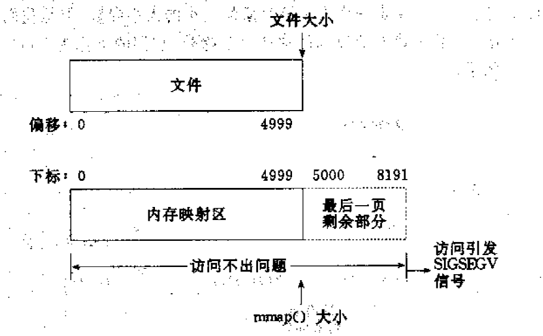
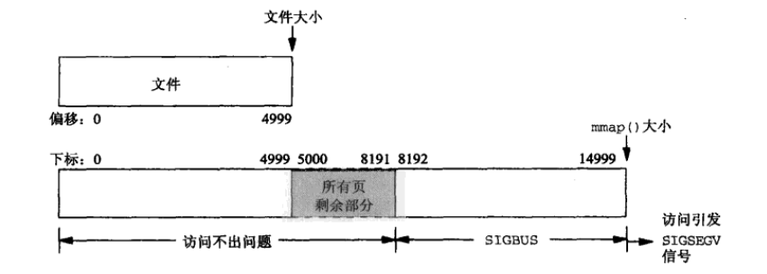

# NSData

[TOC]


## 1、File Mapping

​       File Mapping指的是将磁盘上文件直接映射到进程的虚拟内存中。如果映射成功，则进程可以读写这段虚拟内存，系统会将这段虚拟内存同步到磁盘文件上。

Apple对FileMapping描述[^1]，如下

> File mapping is the process of mapping the disk sectors of a file into the virtual memory space of a process. Once mapped, your app accesses the file as if it were entirely resident in memory. As you read data from the mapped file pointer, the kernel pages in the appropriate data and returns it to your app.


实现File Mapping主要是通过mmap函数，和常见的读写文件可以对比下[^5]

* 读写文件: `open` + `read/write` + `fsync`方式
* File Mapping: `open` + `mmap` + `memcpy` + `msync`方式

使用mmap函数的优势是，减少一次数据拷贝过程，即**常规文件操作需要从磁盘到页缓存，再到用户主存的两次数据拷贝，而mmap映射文件，只需要从磁盘到用户主存的一次数据拷贝过程**[^2]。

这篇文章[^3]从机器指令的角度，比较了mmap和系统调用，分析了mmap的性能好的具体原因。


### (1) File Mapping使用场景

不是所有文件和应用场景，适合把文件映射到虚拟内存中。

适合使用File Mapping

* 有较大的文件，需要随机访问多次以上
* 有较小的文件，需要一次性读到内存，并频繁访问。因此cache比较适合使用File Mapping
* 需要把文件的部分内容读到内存中

注意

> iOS上由于设备内存有限，支持的虚拟内存大小也是有限的。SO有人提问[^6]，遇到映射400MB文件失败的情况。因此，几百MB的文件不适合使用File Mapping。


不适合使用File Mapping

* 读文件从开始到结束，仅执行一次
* 文件有几百MB以上。映射大文件到内存，导致页缓存不够，页换出
* 文件大于剩余可用的连续虚拟内存地址。64位应用比较少出现此情况，但是32位应用可能会出现
* 文件位于可移动的磁盘上
* 文件位于网络磁盘上

说明

> NSData的`initWithContentsOfFile:options:error:`方法，options参数推荐使用DataReadingMappedIfSafe，能保证安全映射一个文件


### (2) 介绍mmap函数

mmap函数的声明位于`sys/mman.h`中，如下

```c
void * mmap(void *, size_t, int, int, int, off_t) __DARWIN_ALIAS(mmap);
```

可以在terminal中使用man命令查看mmap更详细的签名，如下

```c
void * mmap(void *addr, size_t len, int prot, int flags, int fd, off_t offset);
```

mmap的参数有一些限制，必须小心设置参数，才能保证mmap创建虚拟内存成功。

mmap的参数的含义，如下

* addr，指定映射后虚拟内存起始地址，一般指定为NULL，让系统随机分配返回一个起始地址

* len，指定虚拟内存的长度。如果不满足页大小的整数倍，系统会自动将未用完的虚拟地址，扩展到页大小的整数倍，并填充为0。

* prot，指定虚拟内存的保护模式。一共有4种模式，如下。一般指定`PROT_READ`、`PROT_WRITE`或`PROT_READ | PROT_WRITE`。

  * PROT_NONE，虚拟内存地址不能被访问
  * PROT_READ，虚拟内存地址可以读
  * PROT_WRITE，虚拟内存地址可以写
  * PROT_EXEC，虚拟内存地址可以执行

  注意

  > prot指定值后，并不代表系统一定遵守这个约定。例如指定`PROT_EXEC`，在iOS系统上实际不能创建可执行的虚拟内存地址。

* flags，指定映射虚拟内存的选项。如下表

  | 选项          | 作用                                                         |
  | ------------- | ------------------------------------------------------------ |
  | MAP_ANONYMOUS | 和MAP_ANON同义                                               |
  | MAP_ANON      | 映射一块匿名的虚拟内存，并且不和指定文件关联。该选项会忽略offset参数。 |
  | MAP_FILE      | 从文件映射到虚拟内存。默认是该选项，不需要指定该选项         |
  | MAP_FIXED     | 不允许系统自动分配虚拟内存。强制使用addr参数的起始地址，而且要求该地址必须是页大小的整数倍。如果分配成功，则虚拟内存从addr到addr+len。如果分配失败，则mmap返回MAP_FAILED。注意：使用MAP_FIXED，会强制清除addr到addr+len之间已经在使用的内存地址。一般是不推荐使用该选项。 |
  | MAP_PRIVATE   | 指定虚拟内存是私有的。如果修改，则执行copy-on-write          |
  | MAP_SHARED    | 指定虚拟内存是共享的，多个进程可以同时访问                   |
  | MAP_NOCACHE   | 指定虚拟内存，在系统内存不足，优先考虑回收该虚拟内存         |
  | MAP_JIT       | MacOS上，使用该选项，以及配合`PROT_WRITE | PROT_EXEC`，可以创建可执行的虚拟内存 |
  | MAP_32BIT     | 强制系统分配虚拟内存在32位地址空间内。如果虚拟内存地址不够，则分配失败。 |

* offset，指的是文件开始映射的偏移量。为了性能的考虑，offset必须是页大小的整数倍[^4]

  说明

  > 页大小，可以使用**getpagesize**函数来获取。一般是4096B，即4KB。


除了mmap函数，还有配合使用下面的几个函数等

```c
int munmap(void *addr, size_t len);
int msync(void *addr, size_t len, int flags);
int mprotect(void *addr, size_t len, int prot);
```

* munmap函数，用于移除映射的虚拟内存。addr是映射的虚拟内存起始地址。

* msync函数，用于将映射的虚拟内存立即同步到磁盘文件上。flags参数可以指定下面值

  * MS_ASYNC，msync函数立即返回，异步写磁盘
  * MS_SYNC，同步写磁盘
  * MS_INVALIDATE，使缓存失效

  > 调用munmap函数，也可以将虚拟内存同步到磁盘文件上，但是这个同步是系统控制的，因此无法知道系统确切同步的时刻。如果要控制同步的时机，则使用msync函数。

* mprotect函数，用于修改映射的虚拟内存的保护模式


### (3) 映射文件到虚拟内存的几种情况

根据mmap函数对入参的要求，可以知道映射的虚拟内存地址，有下面几个要求

* 虚拟内存的起始地址，必须是页大小的整数倍
* 虚拟内存的长度，必须是页大小的整数倍

注意

> ```c
> void * mmap(void *addr, size_t len, int prot, int flags, int fd, off_t offset);
> ```
>
> 1. mmap的addr入参可以传NULL，因此虚拟内存的起始地址，交给系统来做地址对齐
>
> 2. mmap的len入参，可以不是页大小的整数倍，系统也会自动将虚拟内存的长度扩展到页大小的整数倍，剩余未使用的填充0


但是文件大小，并不一定是页大小的整数倍。因此，映射有下面几种情况[^2]

* 虚拟内存的长度，按照文件大小向上取整到页大小的整数倍
* 虚拟内存的长度远超过文件实际需要的虚拟内存
* 文件大小为0
* 虚拟内存指定长度为0


#### a. 虚拟内存的长度，按照文件大小向上取整到页大小的整数倍

这种情况是系统创建映射的虚拟内存地址的默认行为。

举个例子：**一个文件的大小是5000字节，mmap函数从一个文件的起始位置开始，映射5000字节到虚拟内存中。**如下图



系统将虚拟内存长度自动扩展到8192，即多出5000到8191的无用地址。

* 读/写前5000个字节（0~4999），会返回操作文件内容
* 读字节5000~8191时，结果全为0。写5000~8191时，进程不会报错，但是所写的内容不会写入原文件中
* 读/写8192以外的磁盘部分，会返回一个SIGSECV错误


#### b. 虚拟内存的长度远超过文件实际需要的虚拟内存

这种情况是指定len参数，远超过文件实际需要的虚拟内存的大小，可以认为len参数设置的有问题。但是程序这么无理指定长度，系统照样分配内存，但是这次系统不会取整到页大小的整数倍。

举个例子：**一个文件的大小是5000字节，mmap函数从一个文件的起始位置开始，映射15000字节到虚拟内存中，即映射大小超过了原始文件的大小。**

如下图



访问虚拟内存地址时，系统按照页大小整数倍的最小原则支持访问，即从起始地址，到按照文件大小向上取整到页大小的整数倍。

这时

* 进程可以正常读/写被映射的前5000字节(0~4999)，写操作的改动会在一定时间后反映在原文件中

* 对于5000~8191字节，进程可以进行读写过程，不会报错。但是内容在写入前均为0，另外，写入后不会反映在文件中

* 对于8192~14999字节，进程不能对其进行读写，会报SIGBUS错误

* 对于15000以外的字节，进程不能对其读写，会引发SIGSEGV错误


#### c. 文件大小为0

如果映射的文件大小为0，相当于没有合法的物理页，任何访问都是错误的


#### d. 虚拟内存指定长度为0

如果len参数为0，则mmap函数返回MAP_FAILED。


总结上面的测试，归纳几点

* 文件映射到虚拟内存，是按照页大小的整数倍，按照最小的页数，提供有效的访问。如果超过范围，则访问出错
* 文件映射到虚拟内存，对文件的同步，都是在文件映射的地址范围内。超过这个范围，即使写或读，是有效地址，也同步到文件上
* 文件映射到虚拟内存，要保证文件大小不能为0，不然没有对应的物理页存在，对虚拟内存访问都会出错


### (4) 测试mmap的读写性能

测试环境：

* big_json.json，26MB
* iPhone 6S

* Xcode 12.5


mmap读的性能比较好，完全可以取代NSData提供的方法。

```shell
2021-06-14 14:55:22.573542+0800 HelloNSData[6506:678530] average: 0.009834 s, count: 100
2021-06-14 14:55:22.576925+0800 HelloNSData[6506:678530] average: 0.000033 s, count: 100
```

> 示例代码，见test_measure_dataUsingMmapWithFilePath方法


mmap写的性能不好，比NSData的writeToFile:options:error:方法要差。

```shell
2021-06-14 14:49:44.772131+0800 HelloNSData[6477:675159] average: 0.573229 s, count: 100
2021-06-14 14:51:02.736807+0800 HelloNSData[6477:675159] average: 0.779648 s, count: 100
```

> 示例代码，见test_measure_createFileUsingMmapWithPath_data_overwrite_error方法


说明

> 如果写的文件不大，而且是异步写，也可以使用mmap方式，因为munmap函数执行写文件是系统的行为，如果在执行该函数后，程序出现crash，系统依然能保证执行写文件。


## References

[^1]:https://developer.apple.com/library/archive/documentation/FileManagement/Conceptual/FileSystemAdvancedPT/MappingFilesIntoMemory/MappingFilesIntoMemory.html#//apple_ref/doc/uid/TP40010765-CH2-SW1
[^2]:https://www.cnblogs.com/huxiao-tee/p/4660352.html
[^3]:https://sasha-f.medium.com/why-mmap-is-faster-than-system-calls-24718e75ab37

[^4]:https://stackoverflow.com/questions/20093473/why-file-starting-offset-in-mmap-must-be-multiple-of-the-page-size

[^5]:http://blog.jcix.top/2018-10-26/mmap_tests/#28221mmap8221_SIGBUS
[^6]:https://stackoverflow.com/questions/13425558/why-does-mmap-fail-on-ios


