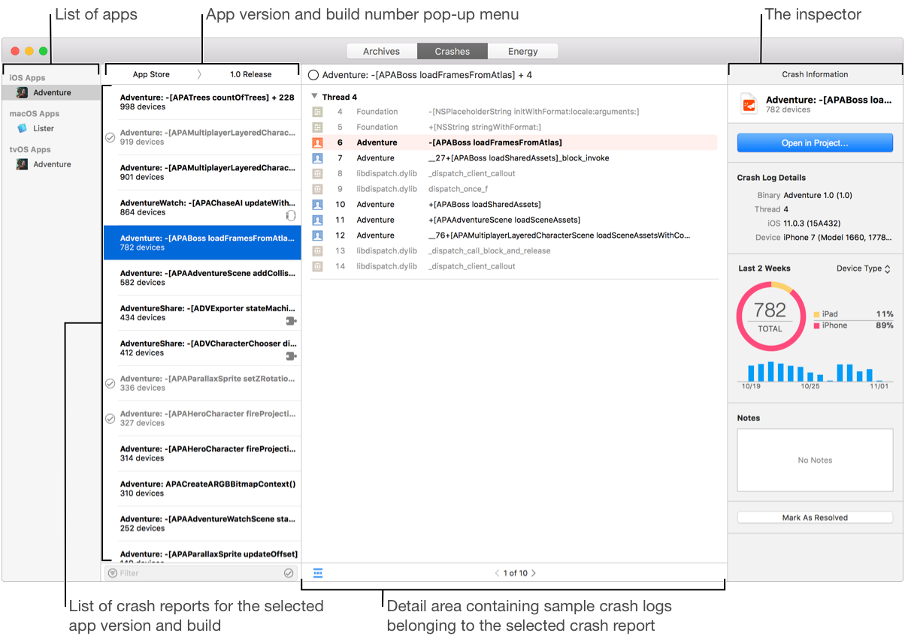
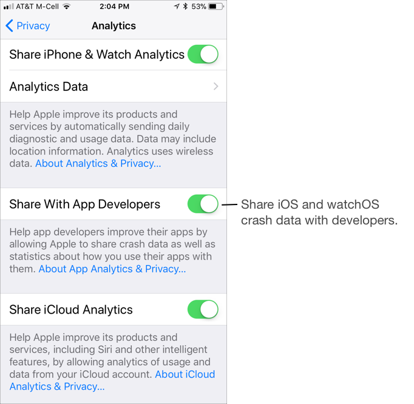
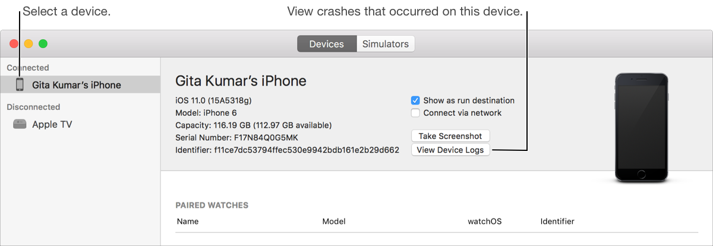
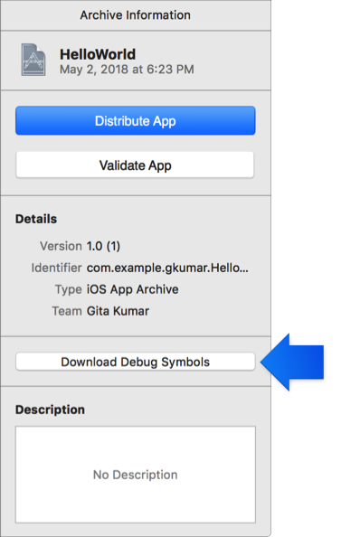
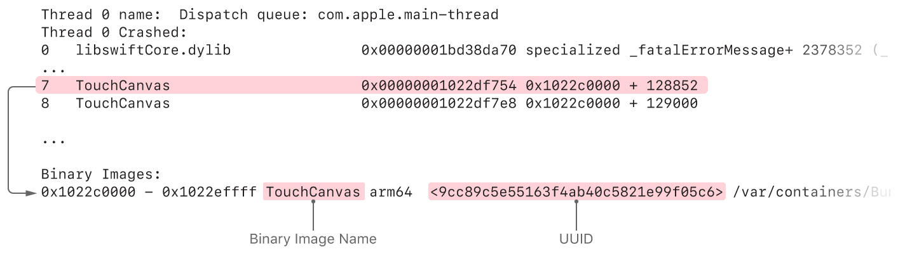
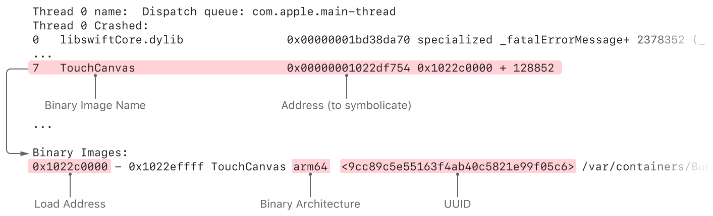
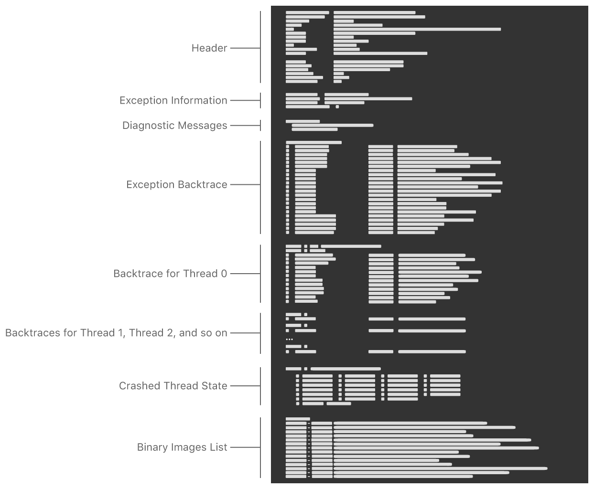
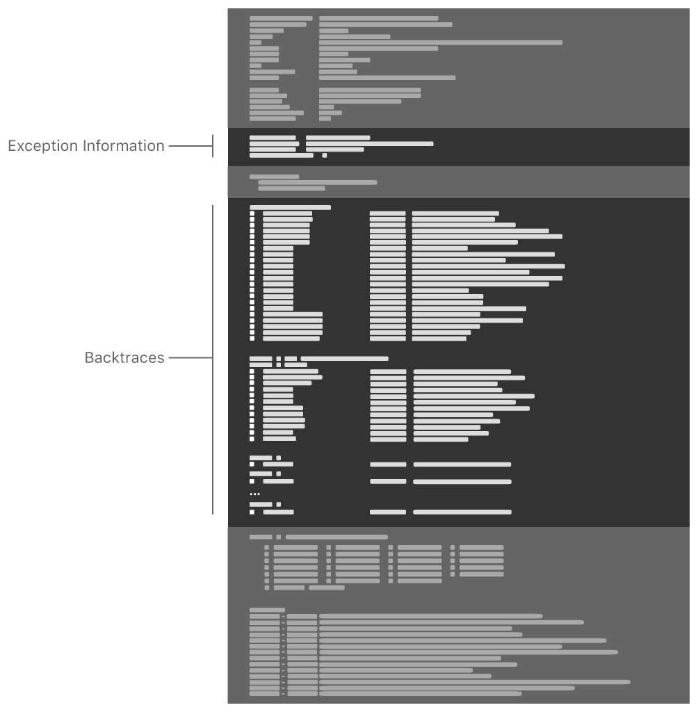

# HelloNSException

[TOC]

## 1、Exception vs Signal

​        Exception是在Objective-C中，主要API是NSException类；而Signal是操作系统级别，一般用于IPC（inter-process communication），主要是C API。可见Signal比Exception更加底层一些。mikeash的[文章](https://www.mikeash.com/pyblog/friday-qa-2013-01-11-mach-exception-handlers.html)，提到Signal和Exception的区别。


## 2、Crash的过程

简单来说，Crash是没有捕获的异常或者信号。CocoaWithLove的[这篇文章](https://www.cocoawithlove.com/2010/05/handling-unhandled-exceptions-and.html)提到Crash的来源。

- Crash是应用程序不能处理的信号（signal）或者异常（exception），不能处理的signal或来exception自三种地方：内核（kernel）、其他进程和应用程序自身。
- 常见导致crash的信号和异常
  - EXC\_BAD\_ACCESS，是Mach exception。如果没有在Mach内处理，将转成SIGBUS或者SIGSEGV信号
  - SIGABRT，是应用程序自身发出的，当NSException或者obj\_exception\_throw没有被捕获


## 3、Crash捕获

### （1） NSUncaughtExceptionHandler捕获异常

Objective-C提供两个C函数，如下

```c
// handler类型
typedef void (NSException * _Nonnull) NSUncaughtExceptionHandler;

// 获取当前handler
NSUncaughtExceptionHandler * NSGetUncaughtExceptionHandler(void);

// 设置uncaught exception handler
void NSSetUncaughtExceptionHandler(NSUncaughtExceptionHandler *);
```

​        iOS app默认没有提供handler，开发者可以自己设置NSUncaughtExceptionHandler。常见的nil参数、数组越界可以通过这个handler捕获。

Apple文档对这个handler的解释是，在程序结束之前，做日志操作。


### （2）signal捕获特定信号

signal是一个C函数，定义在`#include <sys/signal.h>`，如下

```c
void (*signal(int, void (*)(int)))(int);
```

signal函数用于配置当前进程，可以接收哪些信号，或者忽略哪些信号。

- 第一个参数，是信号值。例如SIGABRT（abort）、SIGILL（illegal instruction）、SIGSEGV（segmentation violation）、SIGFPE（floating point exception）、SIGBUS（bus error）、SIGPIPE（write on a pipe with no one to read it）等。这些值通过宏提供，也在`<sys/signal.h>`中。
- 第二个参数，是信号handler，类型是函数指针。如果handler指定不是函数指针，而是特定的宏（也是函数指针类型，定义在`<sys/signal.h>`中），如下
  - SIG\_DFL（default）代表默认handler，其实NULL。如果要注销掉handler，可以设置signal(SIGABRT, SIG_DFL)
  - SIG\_IGN（ignore）代表忽略特定的信号。
  - SIG\_HOLD和SIG\_ERR

信号的handler的类型是void (handler)(int)，带一个int参数对应的是信号值。

signal函数的返回值是上一个handler，也是就被替换的handler


### （3）其他方式

- main函数添加try-catch

```objective-c
int main(int argc, char * argv[]) {
    @autoreleasepool {
        @try {
            return UIApplicationMain(argc, argv, nil, NSStringFromClass([AppDelegate class]));
        }
        @catch (NSException *exception) {
            NSLog(@"exception: %@", exception);
        }
    }
}
```

​        不推荐使用这种方式，所有exception被catch住，跳出了主线程的runloop，应用已经不能存活。在catch块除了记录日志，不能做任何UI相关事情，而且不会触发NSUncaughtExceptionHandler句柄。


## 4、如何分析Crash Reports[^1]

### （1）Report的Header部分

```
Incident Identifier: 6C1DF203-BF5B-4A10-98AB-FF1D44A5D518
CrashReporter Key:   7de926b94a450d65d5fbac872f8e146e39954611
Hardware Model:      iPhone8,1
Process:             HelloNSException [37262]
Path:                /private/var/containers/Bundle/Application/B6AC6F47-951D-4AD2-A728-3B84EB610D59/HelloNSException.app/HelloNSException
Identifier:          com.wc.HelloNSException
Version:             1 (1.0)
Code Type:           ARM-64 (Native)
Role:                Foreground
Parent Process:      launchd [1]
Coalition:           com.wc.HelloNSException [3791]


Date/Time:           2018-10-17 15:33:16.1141 +0800
Launch Time:         2018-10-17 15:33:14.0543 +0800
OS Version:          iPhone OS 11.4 (15F79)
Baseband Version:    4.60.00
Report Version:      104
```


* **Incident Identifier**：Client-assigned unique identifier for the report.

  唯一标识一次Crash Report，相当于标识一次crash事件

* **CrashReporter Key**：This is a client-assigned, anonymized, per-device identifier, similar to the UDID. This helps in determining how widespread an issue is.

  在相同设备上，相同的crash下，该值是一样的。可以使用该值，确定某个crash在多少台设备发生过。

* **Hardware Model**：This is the hardware on which a crash occurred, as available from the “hw.machine” sysctl. This can be useful for reproducing some bugs that are specific to a given phone model, but those cases are rare.

  设备型号，可以使用hw.machine

* **Code Type**：This is the target processor type. On an iOS device, this will always be ‘ARM’, even if the code is ARMv7 or ARMv7s.

* **OS Version**：The OS version on which the crash occurred, including the build number. This can be used to identify regressions that are specific to a given OS release. Note that while different models of iOS devices are assigned unique build numbers (eg, 9B206), crashes are only very rarely specific to a given OS build.

* **Report Version**：This opaque value is used by Apple to version the actual format of the report. As the report format is changed, Apple *may* update this version number.


### （2）分析堆栈的frame

frame是crash时调用栈的帧，有一定显示的格式。举个例子，如下

符号化之前

```
// Before symbolication
8 OurApp 0x000029d4 0x1000 + 6612
```

* column 1，the index of the stack frame in the stack trace
* column 2，the name of the binary the function belongs to
* column 3，the address of the function that was called in the process’ address space
* column 4，a base address for the library’s binary image and an offset


符号化之后

```
// After symbolication
8 OurApp 0x000029d4 -[OurAppDelegate applicationDidFinishLaunching:] (OurAppDelegate.m:128)
```

前3列都是一样的，只有最后一列有变化，变成文件名、行号和函数名。


### （3）Report的Exception部分

```
Exception Type:  EXC_CRASH (SIGABRT)
Exception Codes: 0x0000000000000000, 0x0000000000000000
Exception Note:  EXC_CORPSE_NOTIFY
Triggered by Thread:  0
```

Exception部分提供几个信息

* exception type，异常的类型
* exception codes，
* the index of the thread where the crash occurred，crash在哪个线程上

这里的Exception不是指Objective-C的exception，而是*Mach Exceptions*。另外，异常也可以指UNIX信号，例如SIGABRT。


##### 1. Signals

* SIGILL Attempted to execute an illegal (malformed, unknown, or privileged) instruction. This may occur if your code jumps to an invalid but executable memory address.

* SIGTRAP Mostly used for debugger watchpoints and other debugger features.

* SIGABRT Tells the process to abort. It can only be initiated by the process itself using the `abort()` C stdlib function. Unless you’re using `abort()` yourself, this is probably most commonly encountered if an `assert()` or `NSAssert()` fails.

* SIGFPE A floating point or arithmetic exception occurred, such as an attempted division by zero.

* SIGBUS A bus error occurred, e.g. when trying to load an unaligned pointer.

* SIGSEGV Sent when the kernel determines that the process is trying to access invalid memory, e.g. when an invalid pointer is dereferenced.


##### 2. Exceptions

* EXC_BAD_ACCESS Memory could not be accessed. The memory address where an access attempt was made is provided by the kernel. 
* EXC_BAD_INSTRUCTION Instruction failed. Illegal or undefined instruction or operand.
* EXC_ARITHMETIC For arithmetic errors.

除了Exception之外，还有一个关联的exception code用于进一步描述信息。举些例子，如下

`EXC_BAD_ACCESS` could point to a `KERN_PROTECTION_FAILURE`, which would indicate that the address being accessed is valid, but does not permit the required form of access (see[`osfmk/mach/kern_return.h`](http://fxr.watson.org/fxr/source/osfmk/mach/kern_return.h?v=xnu-2050.18.24)). 

`EXC_ARITHMETIC` exceptions will also include the precise nature of the problem as part of the exception code.


### （4）Report的Binary Images部分

```
Binary Images:
0x104910000 - 0x104917fff HelloNSException arm64  <060561111a403aa2a35970db520f2178> /var/containers/Bundle/Application/B6AC6F47-951D-4AD2-A728-3B84EB610D59/HelloNSException.app/HelloNSException
0x104c40000 - 0x104c7bfff dyld arm64  <b15e536a710732dabfafece44c5685e4> /usr/lib/dyld
0x182a37000 - 0x182a38fff libSystem.B.dylib arm64  <f3beb9029e533a899d794429fec383f9> /usr/lib/libSystem.B.dylib
...
```

Crash Report最下面有一个Binary Images部分，这里列出了app目前加载的所有binary image，以及它们在进程中的地址空间。每一条entry也有对应的UUID，它是由linker在编译时确定的，同时存储在Mach-O文件以及对应.dSYM文件中，位置在LC_UUID command中。根据UUID，可以正确匹配Mach-O到对应的.dSYM文件进行符号化。


举个例子，每一条entry格式，如下

```
0x35f62000 - 0x36079fff CoreFoundation armv7 /System/Library/Frameworks/CoreFoundation.framework/CoreFoundation
```

* column 1，binary image在进程中的地址范围，起始地址0x35f62000，结束地址0x36079fff
* column 2，binary image的名称
* column 3，binary image的架构，一般和设备架构是一致的
* column 4，binary image的本地路径 

当分析堆栈的frame时，会有一个内存中的函数地址，例如

```
9 CoreFoundation 0x35fee2ad ___CFRunLoopRun + 1269
```

如果想反汇编CFRunLoopRun函数，则需要计算它在CoreFoundation中偏移量，如下

```
0x35fee2ad - 0x35f62000 == 0x8c2ad
```

在本地反汇编CoreFoundation后，查看地址0x8c2ad的汇编指令就对应上CFRunLoopRun函数


### （5）Report的Register State部分

```
Thread 0 crashed with ARM Thread State (64-bit):
    x0: 0x0000000000000000   x1: 0x0000000000000000   x2: 0x0000000000000000   x3: 0x00000001c00f0137
    x4: 0x0000000182ab2abd   x5: 0x000000016b4ef3d0   x6: 0x000000000000006e   x7: 0xffffffffffffffec
    x8: 0x0000000008000000   x9: 0x0000000004000000  x10: 0x000000018352a110  x11: 0x0000000000000003
   x12: 0xffffffffffffffff  x13: 0x0000000000000001  x14: 0x0000000000000000  x15: 0x0000000000000010
   x16: 0x0000000000000148  x17: 0x0000000000000300  x18: 0x0000000000000000  x19: 0x0000000000000006
   x20: 0x00000001b5c78b40  x21: 0x000000016b4ef3d0  x22: 0x0000000000000303  x23: 0x00000001b5c78c20
   x24: 0x0000000000000001  x25: 0x00000001c0002090  x26: 0x0000000000000000  x27: 0x0000000000000001
   x28: 0x000000016b4efb20   fp: 0x000000016b4ef330   lr: 0x000000018352a288
    sp: 0x000000016b4ef300   pc: 0x00000001833892ec cpsr: 0x00000000
```

Register State部分描述crash时寄存器的状态，在某些情况下，这些寄存器信息是非常有用的。

举个例子，下面一行代码发生crash

```
new_data->ptr2 = [myObject executeSomeMethod:old_data->ptr2];
```

假设Crash产生SIGSEGV信号，推断是解引用NULL导致，但是这里有两个解引用，从调用栈上无法判断出来。这时可以通过Register State来分析。

```
str r0, [r1, #4]
```

假设crash发生在上面这行指令，r0和r1在使用。等价的C语言形式如下

```
*(r1 + 4) = r0;
```

这是个赋值语句，而且new_data是指向data_t结构体的指针，

```
typedef struct { void *ptr1, void *ptr2 } data_t;
```

所以，+4是可以看做是new_data->ptr2，这样可以推测new_data->ptr2被赋值时产生的crash，那么解引用应该发生在new_data。实际上，这时r1地址是0x00000000，加上4后也是一个无效的地址，对这个地址进行取值就会出现crash问题。


## 5、常见Crash类型防护


常见crash类型，有下面几种

* nil参数 

* mutable容器快速枚举时，被修改（可以被try-catch） 

* NaN参数 

CALayer的position(x,y)不允许有NaN值，否则会出现crash。（具体见HelloIssueUI_CALayerPositionNaNCrash） 


### （1）参数为nil导致crash的API


#### NSString

| 方法签名                                                     | 说明                       |
| ------------------------------------------------------------ | -------------------------- |
| `-[NSString hasPrefix:]`                                     |                            |
| `-[NSString appendString:]`                                  |                            |
| `-[NSMutableString replaceOccurrencesOfString:withString:options:range:]` | `withString:`参数不能为nil |


#### NSAttributedString

| 方法签名                                           | 说明                           |
| -------------------------------------------------- | ------------------------------ |
| `-[NSAttributedString initWithString:attributes:]` | `initWithString:`参数不能为nil |


#### NSURL

| 方法签名                    | 说明 |
| --------------------------- | ---- |
| `+[NSURL fileURLWithPath:]` |      |


#### NSRegularExpression

| 方法签名                                                     | 说明                                    |
| ------------------------------------------------------------ | --------------------------------------- |
| `-[NSRegularExpression enumerateMatchesInString:options:range:usingBlock:]` | `enumerateMatchesInString`参数不能为nil |


#### NSData

| 方法签名                                          | 说明                                  |
| ------------------------------------------------- | ------------------------------------- |
| `+[NSData dataWithContentsOfFile:options:error:]` | `dataWithContentsOfFile`参数不能为nil |


#### GCD

| 方法签名                           | 说明                |
| ---------------------------------- | ------------------- |
| `dispatch_async(<not nil>, {...})` | 第一个参数不能为nil |


#### UIGestureRecognizer

| 方法签名                                                 | 说明          |
| -------------------------------------------------------- | ------------- |
| `-[UIGestureRecognizer requireGestureRecognizerToFail:]` | 参数不能为nil |


## 6、Crash捕获后程序保活问题（TODO）


## 7、Crash日志符号化


## 8、Watchdog Terminations[^2]


## 9、介绍Crash Report

Apple提供三种方式用于诊断App的问题[^5]

* Crash报告（Crash Report），用于描述App如何被terminated，以及当时的每个线程堆栈信息。
* Jetsam事件报告（Jetsam Event Report），用于描述App由于内存问题被系统terminate时的系统内存信息。
* 设备控制日志（Device Console Log），当iOS设备连接Mac电脑，用Console可以查看

下面主要介绍Crash Report，最后介绍Jetsam Event Report和Device Console Log


### （1）Crash Report

通过Crash Report来分析Crash问题，需要下面几个步骤来完成

* 编译带dSYM文件的app，发布到AppStore也需要dSYM文件
* 收集Crash Report日志文件
* 符号化Crash Report日志文件
* 分析Crash Report日志文件
* 代码上修复Crash问题
* 如果有可能，添加XCTest的Test Case


#### a. 如何收集Crash Report[^6]

Crash Report来自下面三个途径

* App Store
* TestFlight
* 直接来自设备上


##### Crashes Organizer

​         App Store、TestFlight的Crash Report可以用使用Crashes Organizer（Xcode > Window > Organizer > Crashes)来查看，如下图所示（Xcode版本不同，可能界面会不一样）



Crash Report会自动下载到~/Library/Developer/Xcode/Products/<app_bundle_identifier>目录下面。

注意

> 1. 来自App Store、TestFlight的Crash Report，必须在用户的设备上将“Share With Developers”的开关开启，这样设备上Crash Report才会传到Apple网址上，Crashes Report才可以下载到[^7]。
>
> “Share With Developers”的开关，如下图所示
>
> 
>
> 2. 不是所有的Crash Report都会出现在Crashes Organizer中，这时需要直接从iOS设备上获取


##### View Device Logs

把iOS连接到Mac电脑上，选择Xcode > Devices and Simulators window，点击View Device Logs，可以查看该设备的Crash Report[^8]。如下图所示




##### 在iOS设备上分享Crash Report

​      Settings > Privacy > Analytics & Improvements，可以看到该设备上所有Crash的列表。根据文件名`<AppBinaryName>_<DateTime>`找到Crash Report，或者`JetsamEvent_<DateTime>`找到Jetsam Event Report。点击打开日志，然后点击右上角，分享到Mac电脑上或其他地方。


##### 在Debug时创建Crash Report

​      如果在调试app时出现Crash，尽管LLDB拦截住Crash时的堆栈，但是还是可以生成Crash Report日志，在Xcode中选择Debug > Detach，这样可以在iOS设备上生成Crash Report。


#### b. 符号化Crash Report

Crash Report由系统收集app在Crash时的诊断信息，其中比较重要的信息有thread backtrace，但是它是十六进制的地址，需要通过工具将它转成可读的函数名和源码行号，这个过程叫符号化（symbolication）。

说明

> 使用Crashes Organizer可以自动完成符号化，因为Crash Report收集自AppStore和TestFlight，而且dSYM文件已经上传。


Crash Report经过符号化后，不一定能得到完全符号化的日志，因此分为下面三种类型的Crash Report[^10]

* 完全符号化的Crash Report
* 部分符号化的Crash Report
* 没有符号化的Crash Report


举个例子，如下

完全符号化的Crash Report

```properties
Thread 0 name:  Dispatch queue: com.apple.main-thread
Thread 0 Crashed:
0   libswiftCore.dylib                0x00000001bd38da70 specialized _fatalErrorMessage+ 2378352 (_:_:file:line:flags:) + 384
1   libswiftCore.dylib                0x00000001bd38da70 specialized _fatalErrorMessage+ 2378352 (_:_:file:line:flags:) + 384
2   libswiftCore.dylib                0x00000001bd15958c _ArrayBuffer._checkInoutAndNativeTypeCheckedBounds+ 66956 (_:wasNativeTypeChecked:) + 200
3   libswiftCore.dylib                0x00000001bd15c814 Array.subscript.getter + 88
4   TouchCanvas                       0x00000001022cbfa8 Line.updateRectForExistingPoint(_:) (in TouchCanvas) + 656
5   TouchCanvas                       0x00000001022c90b0 Line.updateWithTouch(_:) (in TouchCanvas) + 464
6   TouchCanvas                       0x00000001022e7374 CanvasView.updateEstimatedPropertiesForTouches(_:) (in TouchCanvas) + 708
7   TouchCanvas                       0x00000001022df754 ViewController.touchesEstimatedPropertiesUpdated(_:) (in TouchCanvas) + 304
8   TouchCanvas                       0x00000001022df7e8 @objc ViewController.touchesEstimatedPropertiesUpdated(_:) (in TouchCanvas) + 120
9   UIKitCore                         0x00000001b3da6230 forwardMethod1 + 136
10  UIKitCore                         0x00000001b3da6230 forwardMethod1 + 136
11  UIKitCore                         0x00000001b3e01e24 -[_UIEstimatedTouchRecord dispatchUpdateWithPressure:stillEstimated:] + 340
```

完全符号化的Crash Report中，线程的堆栈每一帧都显示了可读的函数名和行号


部分符号化的Crash Report

```properties
Thread 0 name:  Dispatch queue: com.apple.main-thread
Thread 0 Crashed:
0   libswiftCore.dylib                0x00000001bd38da70 specialized _fatalErrorMessage+ 2378352 (_:_:file:line:flags:) + 384
1   libswiftCore.dylib                0x00000001bd38da70 specialized _fatalErrorMessage+ 2378352 (_:_:file:line:flags:) + 384
2   libswiftCore.dylib                0x00000001bd15958c _ArrayBuffer._checkInoutAndNativeTypeCheckedBounds+ 66956 (_:wasNativeTypeChecked:) + 200
3   libswiftCore.dylib                0x00000001bd15c814 Array.subscript.getter + 88
4   TouchCanvas                       0x00000001022cbfa8 0x1022c0000 + 49064
5   TouchCanvas                       0x00000001022c90b0 0x1022c0000 + 37040
6   TouchCanvas                       0x00000001022e7374 0x1022c0000 + 160628
7   TouchCanvas                       0x00000001022df754 0x1022c0000 + 128852
8   TouchCanvas                       0x00000001022df7e8 0x1022c0000 + 129000
9   UIKitCore                         0x00000001b3da6230 forwardMethod1 + 136
10  UIKitCore                         0x00000001b3da6230 forwardMethod1 + 136
11  UIKitCore                         0x00000001b3e01e24 -[_UIEstimatedTouchRecord dispatchUpdateWithPressure:stillEstimated:] + 340
```

部分符号化的Crash Report中，线程的堆栈中部分帧都显示了可读的函数名和行号，有些则没有，比如TouchCanvas，原因在于符号化过程没有找到TouchCanvas对应dSYM符号信息。

说明

> 一般来说，app的调用帧没有符号化，需要app的dSYM文件。而系统的调用帧没有符号化，需要检查`~/Library/Developer/Xcode/iOS DeviceSupport`下面有没有对应iOS系统的文件夹。


没有符号化的Crash Report

```properties
Thread 0 name:  Dispatch queue: com.apple.main-thread
Thread 0 Crashed:
0   libswiftCore.dylib                0x00000001bd38da70 0x1bd149000 + 2378352
1   libswiftCore.dylib                0x00000001bd38da70 0x1bd149000 + 2378352
2   libswiftCore.dylib                0x00000001bd15958c 0x1bd149000 + 66956
3   libswiftCore.dylib                0x00000001bd15c814 0x1bd149000 + 79892
4   TouchCanvas                       0x00000001022cbfa8 0x1022c0000 + 49064
5   TouchCanvas                       0x00000001022c90b0 0x1022c0000 + 37040
6   TouchCanvas                       0x00000001022e7374 0x1022c0000 + 160628
7   TouchCanvas                       0x00000001022df754 0x1022c0000 + 128852
8   TouchCanvas                       0x00000001022df7e8 0x1022c0000 + 129000
9   UIKitCore                         0x00000001b3da6230 0x1b3348000 + 10871344
10  UIKitCore                         0x00000001b3da6230 0x1b3348000 + 10871344
11  UIKitCore                         0x00000001b3e01e24 0x1b3348000 + 11247140
```

没有符号化的Crash Report，如果一直符号化不了，需要检查dSYM文件是否正确。


Crash日志符号化，有几种方式

* Xcode的View Device Logs，将Crash日志拖到左侧的日志列表中，Xcode自动符号化
* 手动调用atos命令
* 手动调用symbolicatecrash脚本


##### 使用Xcode符号化

​      Xcode中，选择Devices and Simulators > View Device Logs > All Logs，将Crash Report文件的后缀名改成`.crash`，然后将文件拖到All Logs中，选择刚才拖的文件，右键选择“Re-Symbolicate Log”进行符号化。

注意

> 1. 如果app的调用帧没有符号化成功，需要检查app的dSYM文件是否在MacOS系统上，一般将app的dSYM文件和.crash文件放在同级目录下面。
>
> 2. 如果app是AppStore或TestFlight上的，需要下载dSYM文件。通过Archive Organizer，选择对应app archive文件，然后在右侧点击“Download Debug Symbols”来获取dSYM文件[^11]。
>
>    
>
>    说明：一般来说上传app也需要上传dSYM文件，但是如果不上传也可以，那么dSYM文件由开发者自己管理。
>
> 3. 如果app开启了bitcode，则最终app产物是由AppStore编译生成的，那么则需要使用Archive Organizer来下载dSYM文件


###### 用mdfind查找dSYM文件

使用Xcode符号化会自动找MacOS上dSYM文件，主要是通过Spotlight工具（mdfind）。如果使用Xcode符号化失败，可以通过mdfind命令手动确认MacOS上是否有dSYM文件。

首先，查看Crash Report文件，找到Binary Image Name和对应的UUID，如下图所示



可以使用下面命令，去查询Binary Image Name和对应的UUID，也可以直接肉眼看一下

```shell
$ grep --after-context=1000 "Binary Images:" <Path to Crash Report> | grep TouchCanvas
0x1022c0000 - 0x1022effff TouchCanvas arm64  <9cc89c5e55163f4ab40c5821e99f05c6>
```


然后，使用mdfind命令，如下

```shell
$ mdfind "com_apple_xcode_dsym_uuids == DD698BD4-71CE-3439-8BDF-BA96C0320562"
```

或者

```shell
$ mdfind "com_apple_xcode_dsym_uuids == *"
```


注意

> 需要将全部小写uuid换成全部大写，而且满足8-4-4-4-12 (`XXXXXXXX-XXXX-XXXX-XXXX-XXXXXXXXXXXX`)格式。这个有点不方便，需要写脚本来代替手工了。

如果mdfind能找到对应dSYM文件，则会输出文件路径，否则无任何输出

mdfind也可以查找系统image的dSYM，一般在`~/Library/Developer/Xcode/iOS DeviceSupport`中。如果没有，需要Xcode连接iOS设备，Xcode将自动Copy符号文件到iOS DeviceSupport目录。还有其他方法[^4]可以获取系统符号文件。


###### 恢复隐藏符号文件

如果app编译开启bitcode，则app的dSYM中符号会被混淆，例如`_hidden#109_`。这时下载到dSYM文件也无法直接使用，需要调用dsymutil命令恢复到正常的dSYM。

命令如下

```shell
$ dsymutil -symbol-map <PathToXcodeArchive>/MyGreatApp.xcarchive/BCSymbolMaps <PathToDownloadedDSYMs>/<UUID>.dSYM
```

xcarchive文件，是上传AppStore的归档文件，需要妥善保留


##### 使用atos命令符号化

​      一般用atos命令来符号化调用帧，即调用栈的一个frame。当然也可以写脚本调用atos命令符号化所有的调用帧（实际上Xcode符号化的symbolicatecrash脚本也用到atos命令）。

在使用atos命令之前，需要完成下面的准备工作

* 在Crash Report中，找到需要符号化的帧，确定镜像名字（image name）和符号地址（symbol address）
* 在Crash Report的Binary Image中，找到image name对应加载地址（load address）、UUID和image架构
* 获取dSYM文件，确认dSYM文件的UUID和image name对应的UUID是一样的
* 最后调用atos命令进行符号化，如下

```shell
$ atos -arch <BinaryArchitecture> -o <PathToDSYMFile>/Contents/Resources/DWARF/<BinaryName>  -l <LoadAddress> <AddressesToSymbolicate>
```

说明

> 可以有多个AddressesToSymbolicate，如果每个AddressesToSymbolicate都是对应同一个LoadAddress，则每个AddressesToSymbolicate都能符号化，否则某些AddressesToSymbolicate不能符号化。这时需要修改-o参数，多次调用atos命令。


用个示意图，说明atos命令如何传参数，如下



对应的atos命令，如下

```shell
$ atos -arch arm64 -o TouchCanvas.app.dSYM/Contents/Resources/DWARF/TouchCanvas -l 0x1022c0000 0x00000001022df754
ViewController.touchesEstimatedPropertiesUpdated(_:) (in TouchCanvas) + 304
```


atos的常见选项，如下

* -o，指定符号文件
* -l，某个镜像(image)的加载地址，该地址可以在Crash日志的Binary Images部分找到
* address，每个函数符号都是一个地址，可以传入多个地址

举个例子，如下

```shell
$ atos -o HelloNSException.app.dSYM/Contents/Resources/DWARF/HelloNSException -l 0x1029a0000 0x19e9b098c 0x19e6d90a4 0x19ea063f8 0x19ea05a8c 0x19e887fc0 0x1029ab524 0x1029ae868 0x1a2b84cf0 0x1a2b8480c 0x1a2b84f0c 0x1a29c7b98 0x1a29b77c0 0x1a29e7594 0x19e92dc48 0x19e928b34 0x19e929100 0x19e9288bc 0x1a8794328 0x1a29be6d4 0x1029a5f68 0x19e7b3460 
0x19e9b098c
0x19e6d90a4
0x19ea063f8
0x19ea05a8c
0x19e887fc0
+[WCCrashCaseTool makeCrashWithNilParameter] (in HelloNSException) (WCCrashCaseTool.m:16)
-[BaseTableViewController tableView:didSelectRowAtIndexPath:] (in HelloNSException) (BaseTableViewController.m:52)
0x1a2b84cf0
0x1a2b8480c
0x1a2b84f0c
0x1a29c7b98
0x1a29b77c0
0x1a29e7594
0x19e92dc48
0x19e928b34
0x19e929100
0x19e9288bc
0x1a8794328
0x1a29be6d4
main (in HelloNSException) (main.m:14)
0x19e7b3460
```

说明

> 由于-l指定的加载地址是HelloNSException镜像的加载地址，所以atos只能解析出HelloNSException镜像中的函数地址对应的符号。


##### 使用symbolicatecrash脚本符号化

symbolicatecrash脚本，是Xcode符号化的脚本。我们自己也可以手动调用来符号化。


###### 确定symbolicatecrash脚本路径

使用下面的命令找到symbolicatecrash脚本的位置

```shell
$ find /Applications/Xcode.app -name symbolicatecrash -type f
```

一般会找到多个路径，但实际对应的是同一个文件。

说明

> symbolicatecrash脚本是Perl语言编写的，使用到atos命令


可以直接使用下面的路径，如下

```shell
/Applications/Xcode.app/Contents/SharedFrameworks/DVTFoundation.framework/Resources/symbolicatecrash
```


###### 导出DEVELOPER_DIR环境变量

然后配置DEVELOPER_DIR环境变量，使用symbolicatecrash脚本符号化crash文件[^3]，如下

```shell
$ export DEVELOPER_DIR="/Applications/Xcode.app/Contents/Developer"
$ /Applications/Xcode.app/Contents/SharedFrameworks/DVTFoundation.framework/Resources/symbolicatecrash 1.crash > 1.log
```


###### 调用symbolicatecrash脚本

如果要符号化app的符号，使用`-d`选项指定dSYM路径，如下

```shell
$ /Applications/Xcode.app/Contents/SharedFrameworks/DVTFoundation.framework/Resources/symbolicatecrash log.crash -d YourApp.app.dSYM > result.log
```


#### c. 介绍Crash Report格式[^13]

Crash Report格式，可以看下面的示意图



##### Header

Header部分描述Crash发生的环境。例如

```properties
Incident Identifier: 6156848E-344E-4D9E-84E0-87AFD0D0AE7B
CrashReporter Key:   76f2fb60060d6a7f814973377cbdc866fffd521f
Hardware Model:      iPhone8,1
Process:             TouchCanvas [1052]
Path:                /private/var/containers/Bundle/Application/51346174-37EF-4F60-B72D-8DE5F01035F5/TouchCanvas.app/TouchCanvas
Identifier:          com.example.apple-samplecode.TouchCanvas
Version:             1 (3.0)
Code Type:           ARM-64 (Native)
Role:                Foreground
Parent Process:      launchd [1]
Coalition:           com.example.apple-samplecode.TouchCanvas [1806]

Date/Time:           2020-03-27 18:06:51.4969 -0700
Launch Time:         2020-03-27 18:06:31.7593 -0700
OS Version:          iPhone OS 13.3.1 (17D50)
```

header部分，有下面的字段

* `Incident Identifier`: 唯一标识Crash Report。没有两个Crash Report，该字段是一样的

* `CrashReporter Key`: 用于标识设备，如果两个Crash Report来自同一个设备，那么该字段的值是一样的。但是如果设备被重置后，该值会重新生成

* `Beta Identifier`: 作用和`CrashReporter Key`是一样的，只出现在TestFlight app上，并且替换`CrashReporter Key`

* `Hardware Model`: 显示特定机型

* `Process`: 可执行文件的名字，这个值和Info.plist中CFBundleExecutable是保持一致的。中括号的值是该进程的ID

* `Path`: 可执行文件在磁盘上的文件路径。macOS上使用占位符，用于保护隐私

* `Identifier`: 出现Crash的进程对应的CFBundleIdentifier。如果没有CFBundleIdentifier，则显示进程名字或者占位符

* `Version`: 显示进程的版本号。这个值是CFBundleVersion和CFBundleShortVersionString组成的字符串，即CFBundleVersion (CFBundleShortVersionString)

* `AppStoreTools`: 用于编译bitcode和裁剪特定设备的变体app的Xcode版本。如果app开启bitcode，对应的Crash Report Header中应该有该字段

  > The version of Xcode used to compile your app’s bitcode and to thin your app to device specific variants.

* `AppVariant`: 显示对应特定设备裁剪后的变体app。这个字段的值包含多个值，用冒号分隔，例如，1:iPhone10,6:12.2

  * 1：内部系统的值，分析Crash，该值没有用处
  * iPhone10,6：裁剪后app变体名字，代表一些设备的变体，并不只代表iPhone10,6，可能和Hardware Model的值是不一样的
  * 12.2：操作系统的版本号，代表可以运行在iOS 12.2以及更高版本上

* `Code Type`: 显示CPU的架构。值有ARM-64、ARM、X86-64或者X86

* `Role`: 发生Crash时，进程被分配的[task_role](https://opensource.apple.com/source/xnu/xnu-3248.60.10/osfmk/mach/task_policy.h)。一般情况下，该字段没有用途

* `Parent Process`: 发生Crash进程的父进程，以及父进程ID

* `Coalition`: 官方文档描述，如下

  > The name of the process coalition containing the app. Process coalitions track resource usage among groups of related processes, such as an operating system process supporting a specific API’s functionality in an app. Most processes, including app extensions, form their own coalition.

* `Date/Time`: Crash发生的时间
* `Launch Time`: App的启动时间
* `OS Version`: 操作系统的版本号


##### Exception Information

每个Crash Report都包含Exception Information，这部分信息用于解释进程如何被终止，但是不一定解释清楚app如何被终止。

下面的字段，需要特别关注

```properties
Exception Type:  EXC_BREAKPOINT (SIGTRAP)
Exception Codes: 0x0000000000000001, 0x0000000102afb3d0
```

> Exception Information不描述特定语言下API或语言特性抛出的异常

* `Exception Type`: Mach异常的名字，以及对应的BSD终止信号的名字。可以参考“分析常见Crash类型”这一节。
* `Exception Codes`: 进程的有关异常信息，被编码到一个或多个64位十六进制的数字中。一般情况，该字段不会出现，因为操作系统以可读形式，显示在其他字段（`Exception Subtype`、`Exception Message`）上
* `Exception Subtype`: 对`Exception Codes`可读的描述
* `Exception Message`: 从`Exception Codes`获取的额外描述
* `Exception Note`: 不描述特定的异常类型。
  * 如果该字段包含EXC_CORPSE_NOTIFY，则Crash不会产生自hardware trap，可能进程被系统终止掉，或者进程调用abort函数
  * 如果该字段包含SIMULATED（这不是Crash），进程没有出现Crash，但是系统可能请求终止该进程
  * 如果该字段包含NON-FATAL CONDITION（这不是Crash），进程没有出现Crash，该Crash Report不是fatal

* `Termination Reason`:当操作系统终止进程时的退出描述信息。关键操作系统组件、关键错误等。例如invalid code signature, a missing dependent library, or accessing privacy sensitive information without a purpose string等
* `Triggered by Thread` 或者 `Crashed Thread`: 显示那个线程触发了Crash


##### Diagnostic Messages

Diagnostic Messages这部分信息，根据不同的crash原因，使用不同的格式，而且不会在每个Crash Report中都有。

* Application Specific Information字段

Framework错误信息会出现在Application Specific Information字段中，例如

```properties
Application Specific Information:
BUG IN CLIENT OF LIBDISPATCH: dispatch_sync called on queue already owned by current thread
```

上面说明Dispatch Framework中记录了一个不正确使用dispatch queue的日志

说明

> Application Specific Information不能记录隐私相关信息
>
> `Application Specific Information` is sometimes elided from a crash report to avoid logging privacy-sensitive information in the message.

* Termination Description字段

因为违反watchdog导致终止，会包含Termination Description字段，以及下面信息

```properties
Termination Description: SPRINGBOARD, 
    scene-create watchdog transgression: application<com.example.MyCoolApp>:667
    exhausted real (wall clock) time allowance of 19.97 seconds 
```

可以查看[Addressing Watchdog Terminations](https://developer.apple.com/documentation/xcode/addressing-watchdog-terminations)了解更多细节

* VM Region Info字段

因为内存访问导致的，会包含VM Region Info字段，举个例子，如下

```properties
VM Region Info: 0 is not in any region.  Bytes before following region: 4307009536
      REGION TYPE                      START - END             [ VSIZE] PRT/MAX SHRMOD  REGION DETAIL
      UNUSED SPACE AT START
--->  
      __TEXT                 0000000100b7c000-0000000100b84000 [   32K] r-x/r-x SM=COW  ...pp/MyGreatApp
```

可以查看[Investigating Memory Access Crashes](https://developer.apple.com/documentation/xcode/investigating-memory-access-crashes)了解更多细节


##### Backtraces

​        出现crash的进程，捕获每个线程正在运行的代码，并记录下，成为Backtrace。Backtrace类似在调试器使用暂停时，看到的那样。如果是因为语言异常导致的Crash，会出现Last Exception Backtrace，它位于第一个线程前面。如果Crash Report出现Last Exception Backtrace，则可以参考[Addressing Language Exception Crashes](https://developer.apple.com/documentation/xcode/addressing-language-exception-crashes)。

​        每个backtrace的第一行，列出线程号和线程名字。由于隐私问题，Crash Origanizer收集到的Crash Report中没有线程名字。下面这个例子，显示Thread 0出现crash，它是app的主线程

```properties
Thread 0 name:  Dispatch queue: com.apple.main-thread
Thread 0 Crashed:
0   TouchCanvas                       0x0000000102afb3d0 CanvasView.updateEstimatedPropertiesForTouches(_:) + 62416 (CanvasView.swift:231)
1   TouchCanvas                       0x0000000102afb3d0 CanvasView.updateEstimatedPropertiesForTouches(_:) + 62416 (CanvasView.swift:231)
2   TouchCanvas                       0x0000000102af7d10 ViewController.touchesMoved(_:with:) + 48400 (<compiler-generated>:0)
3   TouchCanvas                       0x0000000102af80b8 @objc ViewController.touchesMoved(_:with:) + 49336 (<compiler-generated>:0)
4   UIKitCore                         0x00000001ba9d8da4 forwardTouchMethod + 328
5   UIKitCore                         0x00000001ba9d8e40 -[UIResponder touchesMoved:withEvent:] + 60
6   UIKitCore                         0x00000001ba9d8da4 forwardTouchMethod + 328
7   UIKitCore                         0x00000001ba9d8e40 -[UIResponder touchesMoved:withEvent:] + 60
8   UIKitCore                         0x00000001ba9e6ea4 -[UIWindow _sendTouchesForEvent:] + 1896
9   UIKitCore                         0x00000001ba9e8390 -[UIWindow sendEvent:] + 3352
10  UIKitCore                         0x00000001ba9c4a9c -[UIApplication sendEvent:] + 344
11  UIKitCore                         0x00000001baa3cc20 __dispatchPreprocessedEventFromEventQueue + 5880
12  UIKitCore                         0x00000001baa3f17c __handleEventQueueInternal + 4924
13  UIKitCore                         0x00000001baa37ff0 __handleHIDEventFetcherDrain + 108
14  CoreFoundation                    0x00000001b68a4a00 __CFRUNLOOP_IS_CALLING_OUT_TO_A_SOURCE0_PERFORM_FUNCTION__ + 24
15  CoreFoundation                    0x00000001b68a4958 __CFRunLoopDoSource0 + 80
16  CoreFoundation                    0x00000001b68a40f0 __CFRunLoopDoSources0 + 180
17  CoreFoundation                    0x00000001b689f23c __CFRunLoopRun + 1080
18  CoreFoundation                    0x00000001b689eadc CFRunLoopRunSpecific + 464
19  GraphicsServices                  0x00000001c083f328 GSEventRunModal + 104
20  UIKitCore                         0x00000001ba9ac63c UIApplicationMain + 1936
21  TouchCanvas                       0x0000000102af16dc main + 22236 (AppDelegate.swift:12)
22  libdyld.dylib                     0x00000001b6728360 start + 4

Thread 1:
0   libsystem_pthread.dylib           0x00000001b6645758 start_wqthread + 0

Thread 2:
0   libsystem_pthread.dylib           0x00000001b6645758 start_wqthread + 0
...
```

在线程号后，backtrace的每一行代表一个stack frame，如下

```properties
0   TouchCanvas                       0x0000000102afb3d0 CanvasView.updateEstimatedPropertiesForTouches(_:) + 62416 (CanvasView.swift:231)
```

stack frame的每一列包含的信息，如下

* 0：stack frame的序号。frame 0是正在执行的函数，而frame 1是调用frame 0中的函数，以此类推
* TouchCanvas：包含正在执行函数的二进制文件
* 0x0000000102afb3d0：正在执行的机器指令地址。对于frame 0，该地址是线程正在执行的机器指令地址，对于其他frame，该地址是返回到该frame后执行的第一条机器指令的地址
* CanvasView.updateEstimatedPropertiesForTouches(_:)：在完全符号化的Crash Report中，显示正在执行的函数名。由于隐私的问题，函数名的显示有可能限制在前100个字符。
* 62416：在+之后的数字代表从函数入口到当前指令的字节偏移量
* CanvasView.swift:231：包含该代码的文件名和行号，这个需要dSYM文件来符号化
  * 某些情况下，文件名和行号不会关联对应的源代码。
    * 如果文件名是`<compiler-generated>`，则那个frame对应的代码是由编译器生成的，并不是用户的代码生成的。如果这种情况出现在top frame，在前面几个frame寻找线索
    * 如果行号是0，则说明backtrace没有映射到特定的源代码。可能的原因是，编译器优化了代码，例如内联函数。


##### Thread State

Thread State这一部分信息列出CPU寄存器以及在发生crash的线程对应的值。理解Thread State是一个高级的话题，需要理解操作系统的ABI（application binary interface）。可以参考[OS X ABI Function Call Guide](https://developer.apple.com/library/archive/documentation/DeveloperTools/Conceptual/LowLevelABI/000-Introduction/introduction.html#//apple_ref/doc/uid/TP40002437-SW1)和[iOS ABI Function Call Guide](https://developer.apple.com/library/archive/documentation/Xcode/Conceptual/iPhoneOSABIReference/Introduction/Introduction.html#//apple_ref/doc/uid/TP40009023).

```properties
Thread 0 crashed with ARM Thread State (64-bit):
    x0: 0x0000000000000001   x1: 0x0000000000000000   x2: 0x0000000000000000   x3: 0x000000000000000f
    x4: 0x00000000000001c2   x5: 0x000000010327f6c0   x6: 0x000000010327f724   x7: 0x0000000000000120
    x8: 0x0000000000000001   x9: 0x0000000000000001  x10: 0x0000000000000001  x11: 0x0000000000000000
   x12: 0x00000001038612b0  x13: 0x000005a102b075a7  x14: 0x0000000000000100  x15: 0x0000010000000000
   x16: 0x00000001c3e6c630  x17: 0x00000001bae4bbf8  x18: 0x0000000000000000  x19: 0x0000000282c14280
   x20: 0x00000001fe64a3e0  x21: 0x4000000281f1df10  x22: 0x0000000000000001  x23: 0x0000000000000000
   x24: 0x0000000000000000  x25: 0x0000000282c14280  x26: 0x0000000103203140  x27: 0x00000001bacf4b7c
   x28: 0x00000001fe5ded08   fp: 0x000000016d311310   lr: 0x0000000102afb3d0
    sp: 0x000000016d311200   pc: 0x0000000102afb3d0 cpsr: 0x60000000
   esr: 0xf2000001  Address size fault
```

寄存器为内存访问的问题，提供额外信息。可以参考[Understand the Crashed Thread’s Registers](https://developer.apple.com/documentation/xcode/analyzing-a-crash-report#Understand-the-Crashed-Threads-Registers)


##### Binary Images

Binary Images这一部分，列出在crash时装载的所有代码镜像，例如app可执行文件、系统framework等。Binary Images的每一行，代表一个二进制镜像，如下

```properties
Binary Images:
0x102aec000 - 0x102b03fff TouchCanvas arm64  <fe7745ae12db30fa886c8baa1980437a> /var/containers/Bundle/Application/51346174-37EF-4F60-B72D-8DE5F01035F5/TouchCanvas.app/TouchCanvas
...
```

* 0x102aec000 - 0x102b03fff：代表二进制镜像的地址范围，第一个地址是镜像的加载地址，可以参考 [Symbolicate the Crash Report with the Command Line](https://developer.apple.com/documentation/xcode/adding-identifiable-symbol-names-to-a-crash-report#Symbolicate-the-Crash-Report-with-the-Command-Line)来如何使用这个值

* TouchCanvas：二进制镜像的名字

* arm64：二进制镜像装载到哪个CPU架构上

* fe7745ae12db30fa886c8baa1980437a：一个编译产生的UUID，用于唯一标识二进制镜像。当符号化Crash Report时，使用这个值，可以找到对应的dSYM文件。

* /var/containers/.../TouchCanvas.app/TouchCanvas：二进制文件在磁盘上的路径。macOS使用占位符来保护隐私。如下

  ```properties
  Binary Images:
         0x1025e5000 -        0x1025e6ffb +com.example.apple-samplecode.TouchCanvas (1.0 - 1) <5ED9BD63-2A55-3DDD-B3FF-EFCF61382F6F> /Users/USER/*/TouchCanvas.app/Contents/MacOS/TouchCanvas
  ```

  * 0x105f97000 - 0x105f98ffb：二进制镜像的地址范围
  * +com.example.apple-samplecode.TouchCanvas：二进制的CFBundleIdentifier值，+表示二进制不属于macOS一部分
  * 1.0 - 1：代表二进制的CFBundleShortVersionString和CFBundleVersion
  * 5ED9BD63-2A55-3DDD-B3FF-EFCF61382F6F：二进制镜像的UUID
  * /Users/USER/*/TouchCanvas.app/Contents/MacOS/TouchCanvas：二进制文件在磁盘上的路径


#### d. 分析常见Crash类型

官方这篇文章[^12]提供常见的几种Crash类型

* Swift Runtime Error
* Language Exception
* Watchdog Exception
* Zombie objects
* Memory Access Issue
* Framework Missing


上面几种类型，主要通过Exception Information和Backtrace来判断出来，如下图所示




##### Swift Runtime Error

​      Swift相比Objective-C，在内存安全上多了一层保护，因此某些判断nil的地方，Swift在Runtime时提前触发Crash。

官方描述[^14]，如下

> If you use the `!` operator to force unwrap an optional value that’s `nil`, or if you force a type downcast that fails with the `as!` operator, the Swift runtime catches these errors and intentionally crashes the app.

Swift Runtime Error在ARM处理器上的Crash特征，如下

```properties
Exception Type:  EXC_BREAKPOINT (SIGTRAP)
...
Termination Signal: Trace/BPT trap: 5
Termination Reason: Namespace SIGNAL, Code 0x5
```

而在Interl处理器上Crash特征，如下

```properties
Exception Type:        EXC_BAD_INSTRUCTION (SIGILL)
...
Exception Note:        EXC_CORPSE_NOTIFY

Termination Signal:    Illegal instruction: 4
Termination Reason:    Namespace SIGNAL, Code 0x4
```

Swift的堆栈信息，也一般比较容易排查，

举个例子，如下

```properties
Thread 0 Crashed:
0   MyCoolApp                         0x0000000100a71a88 @objc ViewController.viewDidLoad() (in MyCoolApp) (ViewController.swift:18)
1   MyCoolApp                         0x0000000100a71a40 @objc ViewController.viewDidLoad() (in MyCoolApp) (ViewController.swift:18)
2   UIKitCore                         0x00000001c569e920 -[UIViewController _sendViewDidLoadWithAppearanceProxyObjectTaggingEnabled] + 100
3   UIKitCore                         0x00000001c56a3430 -[UIViewController loadViewIfRequired] + 936
4   UIKitCore                         0x00000001c56a3838 -[UIViewController view] + 28
```

在Thread 0，即主线程出现Crash，具体位置在ViewController.swift文件的第18行，viewDidLoad方法中


官方也提供了几个修复nil问题的示例代码，如下

示例1

```swift
let image = UIImage(named: "aMissingIcon")!
print("Image size: \(image.size)") // ISSUE: maybe crash
```

正确写法，如下

```swift
if let image = UIImage(named: "aMissingIcon") {
    print("Image size: \(image.size)")
}
```


示例2

```swift
for item in library {
    let song = item as! Song
    print("Song: \(song.name), by \(song.artist)")
}
```

正确写法，如下

```swift
for item in library {
    if let song = item as? Song {
         print("Song: \(song.name), by \(song.artist)")
    }
}
```


##### Language Exception

Apple系统framework在遇到特定编程错误时，会抛出语言异常（Language Exception），比如NSArray的数组越界。

判断Crash类型是否属于Language Exception，Crash Report有2个特征，如下

* Exception Information，满足下面的格式

  ```properties
  Exception Type:  EXC_CRASH (SIGABRT)
  Exception Codes: 0x0000000000000000, 0x0000000000000000
  Exception Note:  EXC_CORPSE_NOTIFY
  ```

* 存在Last Exception Backtrace，如下

  ```properties
  Last Exception Backtrace:
  0   CoreFoundation                    0x19aae2a48 __exceptionPreprocess + 220
  1   libobjc.A.dylib                   0x19a809fa4 objc_exception_throw + 55
  ```


举个排查Language Exception的例子[^15]

```properties
Last Exception Backtrace:
0   CoreFoundation                    0x1bf596a48 __exceptionPreprocess + 220
1   libobjc.A.dylib                   0x1bf2bdfa4 objc_exception_throw + 55
2   CoreFoundation                    0x1bf49b0ec -[NSException raise] + 11
3   Foundation                        0x1bf879170 -[NSObject+ 205168 (NSKeyValueCoding) setValue:forKey:] + 311
4   UIKitCore                         0x1c2ffa0b4 -[UIViewController setValue:forKey:] + 99
5   UIKitCore                         0x1c32c1234 -[UIRuntimeOutletConnection connect] + 123
6   CoreFoundation                    0x1bf470f3c -[NSArray makeObjectsPerformSelector:] + 251
7   UIKitCore                         0x1c32be3a4 -[UINib instantiateWithOwner:options:] + 1967
8   UIKitCore                         0x1c3000f18 -[UIViewController _loadViewFromNibNamed:bundle:] + 363
9   UIKitCore                         0x1c30019a4 -[UIViewController loadView] + 175
10  UIKitCore                         0x1c3001c5c -[UIViewController loadViewIfRequired] + 171
11  UIKitCore                         0x1c3002360 -[UIViewController view] + 27
12  UIKitCore                         0x1c3017a98 -[UIViewController _setPresentationController:] + 107
13  UIKitCore                         0x1c30108a4 -[UIViewController _presentViewController:modalSourceViewController:presentationController:animationController:interactionController:completion:] + 1343
14  UIKitCore                         0x1c30122b8 -[UIViewController _presentViewController:withAnimationController:completion:] + 4255
15  UIKitCore                         0x1c3014794 __63-[UIViewController _presentViewController:animated:completion:]_block_invoke + 103
16  UIKitCore                         0x1c3014c90 -[UIViewController _performCoordinatedPresentOrDismiss:animated:] + 507
17  UIKitCore                         0x1c30146e4 -[UIViewController _presentViewController:animated:completion:] + 195
18  UIKitCore                         0x1c301494c -[UIViewController presentViewController:animated:completion:] + 159
19  MyCoolApp                         0x104e8b1ac MasterViewController.viewDidLoad() (in MyCoolApp) (MasterViewController.swift:35)
```

这里不列出Exception Information，因为都是一样的。根据Last Exception Backtrace的第0到2帧，是系统抛出的异常。第3到18帧是系统的调用过程，而第19帧是app的代码，可以定位到源码来分析Crash问题。


值得说明的是，Language Exception在调试时LLDB会输出更多的Crash信息，如下

```shell
Application Specific Information:
*** Terminating app due to uncaught exception 'NSUnknownKeyException', 
    reason: '[<MyCoolApp.MyViewController 0x105510d50> setValue:forUndefinedKey:]: 
    this class is not key value coding-compliant for the key refreshButton.'
```

Apple解释说iOS设备的Crash Report中不会有有Application Specific Information这个信息，是因为防止用户的信息通过异常泄漏出去。而Mac app的Crash Report会有Application Specific Information这个信息。

官方描述，如下

> iOS, iPadOS, watchOS, and tvOS crash reports don’t contain the exception message to prevent disclosing private information about the user through an exception message. Mac apps include the exception message in the `Application Specific Information` field of a crash report.


一般遇到Language Exception，可以通过复现（Reproduce）和设置异常断点，来定位到Crash时的堆栈。然后，查看系统API的文档，判断满足什么条件，该API可能会抛出异常。另外，也可以绕过该API的调用，换成其他方式来实现逻辑。


上面提出的Language Exception是系统framework抛出的，但是用户代码也可以抛出异常。但是有2点需要注意

* 编译用户代码（Objective-C）时，不要指定`-no_compact_unwind`，以免用户代码抛出OC异常，没有调用栈信息
* 编译用户代码（C）时，可以指定`-funwind-tables`，以免用户代码抛出C的异常，没有调用栈信息


// TODO

Crash Report格式：https://developer.apple.com/documentation/xcode/diagnosing_issues_using_crash_reports_and_device_logs/examining_the_fields_in_a_crash_report


分析Crash Report：https://developer.apple.com/documentation/xcode/diagnosing_issues_using_crash_reports_and_device_logs/analyzing_a_crash_report


### （2）Jetsam Event Report


### （3）Device Console Log

当iOS设备连接Mac电脑，可以使用Console.app来查看app的NSLog输出以及iOS系统的输出。

打开Console.app，侧边栏Devices选择对应iOS设备，将App名复制粘贴到右上角的过滤框中，选择Process，就可以看到app的NSLog输出。

注意

> 1. 经测试，Console.app只打印NSLog的输出，并不打印printf的输出
> 2. 如果日志输出太多，可以使用pause按钮，暂时日志的打印
> 3. 谨慎使用NSLog，因为App的Release版本或者AppStore版本，连接Console.app，也会打印输出。所以不能使用NSLog打印敏感信息，或者在Release版本中，将NSLog输出失效，可以参考这篇SO[^9]的做法


## Reference

[^1]: https://www.plausible.coop/blog/?p=176 "Exploring iOS Crash Reports"

[^2]:https://developer.apple.com/documentation/xcode/diagnosing_issues_using_crash_reports_and_device_logs/identifying_the_cause_of_common_crashes/addressing_watchdog_terminations

[^3]:https://www.infoq.cn/article/jltuf3pgfjv6ovjzu1sq
[^4]:https://zuikyo.github.io/2016/12/18/iOS%20Crash%E6%97%A5%E5%BF%97%E5%88%86%E6%9E%90%E5%BF%85%E5%A4%87%EF%BC%9A%E7%AC%A6%E5%8F%B7%E5%8C%96%E7%B3%BB%E7%BB%9F%E5%BA%93%E6%96%B9%E6%B3%95/

[^5]:https://developer.apple.com/documentation/xcode/diagnosing_issues_using_crash_reports_and_device_logs
[^6]:https://developer.apple.com/documentation/xcode/diagnosing_issues_using_crash_reports_and_device_logs/acquiring_crash_reports_and_diagnostic_logs
[^7]:https://help.apple.com/xcode/mac/current/#/deve2819c518
[^8]:https://help.apple.com/xcode/mac/current/#/dev85c64ec79?sub=devc8ddd72c5

[^9]:https://stackoverflow.com/questions/2025471/do-i-need-to-disable-nslog-before-release-application
[^10]:https://developer.apple.com/documentation/xcode/diagnosing_issues_using_crash_reports_and_device_logs/adding_identifiable_symbol_names_to_a_crash_report
[^11]:https://help.apple.com/xcode/mac/current/#/devef5928039
[^12]:https://developer.apple.com/documentation/xcode/diagnosing_issues_using_crash_reports_and_device_logs/identifying_the_cause_of_common_crashes
[^13]:https://developer.apple.com/documentation/xcode/diagnosing_issues_using_crash_reports_and_device_logs/examining_the_fields_in_a_crash_report
[^14]:https://developer.apple.com/documentation/xcode/diagnosing_issues_using_crash_reports_and_device_logs/identifying_the_cause_of_common_crashes/addressing_crashes_from_swift_runtime_errors

[^15]:https://developer.apple.com/documentation/xcode/diagnosing_issues_using_crash_reports_and_device_logs/identifying_the_cause_of_common_crashes/addressing_language_exception_crashes


