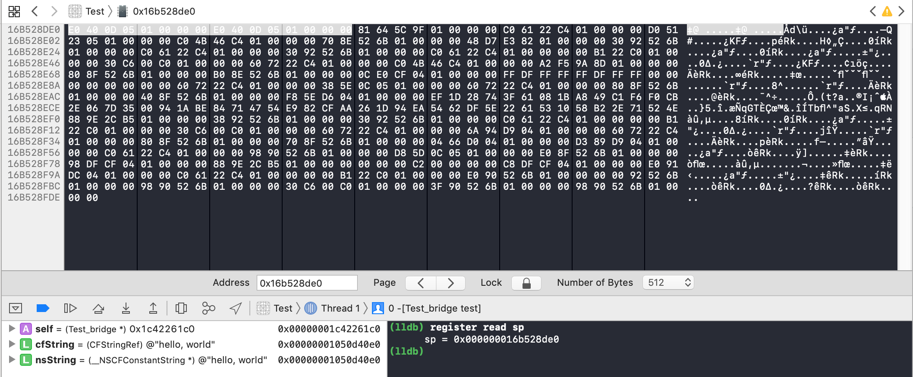
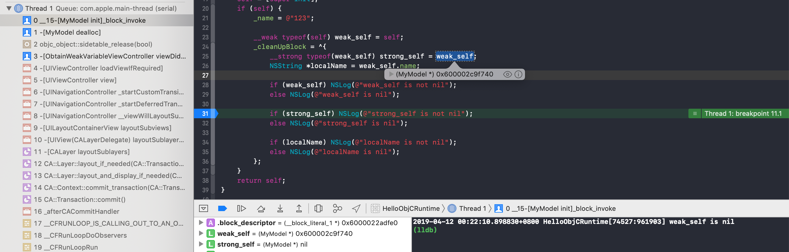

# HelloNSObject

[TOC]

## 1、关于NSObject

### （1）+load方法

`+load`方法是NSObject的类方法，调用顺序依次为

* 父类中load方法

* 子类中load方法

* 父类的分类中load方法

* 子类的分类中load方法

* C constructor函数（使用`__attribute__((constructor))`标记的C函数）

* 全局C++对象的构造函数

  > Math m = Math();
  >
  > Math *m2 = new Math();

* main函数调用

示例代码见**OrderOfCallLoadMethodInNSObject**


### （2）+initialize方法

`+initialize`方法是NSObject的类方法，当类第一次发送任意类消息时，会触发该方法，有且仅有一次触发。同时，如果存在继承关系，总是先触发父类的initialize方法，然后自身类的initialize方法。

* 子类可以重新实现initialize方法，并通过super调用父类的initialize方法，但是不显示调用initialize方法，父类的initialize方法依然会被调用

* 防止父类的initialize方法被调用多次，可以采用下面的方法

  > ```objective-c
  > + (void)initialize {
  >       if (self == [ClassName self]) {
  >         // ... do the initialization ...
  >       }
  > }
  > ```

* 和`+load`方法不同，分类中实现的initialize方法会覆盖主类

示例代码见**OrderOfCallInitializeMethodInNSObject**和**InitializeMethodInCategory**


### （3）@hash

NSObject的hash属性，实际是对象的指针地址[^7]。

```objective-c
NSObject *object = [[NSObject alloc] init];
NSString *address = [NSString stringWithFormat:@"%p", object];
NSString *hash = [NSString stringWithFormat:@"0x%lx", (unsigned long)[object hash]];
XCTAssertEqualObjects(address, hash);
```


## 2、Object Subscripting[^1]

​        Xcode 4.4开始支持对象下标访问方式，即除了NSMutableDictionary和NSMutableArray之外，任意自定义类都可以使用`[]`来访问。

​        自定义类通过实现特定的方法，能支持索引下标和键下标。

### （1）索引下标的实现方法

```objective-c
@interface IndexedSubscriptingObject<__covariant ObjectType> : NSObject
- (nullable ObjectType)objectAtIndexedSubscript:(NSUInteger)index;
- (void)setObject:(nullable ObjectType)object atIndexedSubscript:(NSUInteger)index;
@end
```


### （2）键下标的实现方法

```objective-c
@interface KeyedSubscriptingObject<__covariant KeyType, __covariant ObjectType> : NSObject
- (nullable ObjectType)objectForKeyedSubscript:(KeyType)key;
- (void)setObject:(nullable ObjectType)object forKeyedSubscript:(KeyType)key;
@end
```


>  示例代码，参考WCOrderedDictionary


## 3、运行时Runtime


### （1）Swizzle方法

​       Objective-C的运行时（Runtime），提供替换某个方法的实现的功能，也称为Swizzle方法。这里仅讨论Swizzle Objective-C方法。

​       Objective-C方法，定义为Method类型，代码中的实例方法和类方法，在运行时都对应这个Method，每个Method对应一个selector和IMP，可以通过selector执行Method，而实际上是执行IMP。IMP是一个C函数指针。

​       代码中的Objective-C方法，编译器已经编译好IMP，可以等价看成Objective-C方法就是IMP。Swizzle方法，实际上是替换现有方法的IMP。

​       替换IMP，目前有三种方法

* 用block作为swizzled IMP去替换。主要用到`imp_implementationWithBlock`函数，将block转成IMP，然后替换现有方法的IMP
* 用Objective-C分类方法作为swizzled IMP去替换。一般实现某个类的分类方法，然后将这个分类方法的IMP替换原来方法的IMP
* 用C函数作为swizzled IMP去替换。这个过程和用Objective-C分类方法去替换差不多，只不过是直接用C函数作为IMP去替换原来方法的IMP

> 上面三种方式，分别见SwizzleMethodByBlockViewController、SwizzleMethodByCategoryMethodViewController、SwizzleMethodByCFunctionViewController


#### a. Block Swizzle


#### b. Objective-C分类方法 Swizzle

NSHipster的这篇文章[^11]介绍了使用Objective-C分类方法来Swizzle，原理如下图所示


#### c. C函数 Swizzle


### （2）分析selector

在objc.h头文件中，SEL被定义为结构体指针。注释上说SEL是opaque类型，即对外不透明的。

```objective-c
/// An opaque type that represents a method selector.
typedef struct objc_selector *SEL;
```

查看objc-sel.mm的[sel_getName函数源码](https://github.com/opensource-apple/objc4/blob/master/runtime/objc-sel.mm#L118)，可以看出SEL指向的实际是C字符串。

```objective-c
const char *sel_getName(SEL sel) 
{
    if (!sel) return "<null selector>";
    return (const char *)(const void*)sel;
}
```

如果强制将SEL类型转成char *，则Xcode会给出一个warning，如下

```objective-c
string = (char *)selector; // Cast of type 'SEL' to 'char *' is deprecated; use sel_getName instead
XCTAssertTrue(strcmp("compare:", string) == 0);
```


解决方法1：参考warning提示，使用sel_getName函数获取C字符串，注意返回值类型是const char *

解决方法2：参考源码的方式，两次类型转换，可以消除warning（Xcode 10.2），如下

```objective-c
string = (const char *)(const void*)selector; // Note: no warning here
XCTAssertTrue(strcmp("compare:", string) == 0);
```

示例代码，见Test_selector.m


### （3）分析IMP

​      IMP在objc.h中定义为一个函数指针，值得注意的是，它有两种函数签名。一般OBJC_OLD_DISPATCH_PROTOTYPES宏不会生效，它的签名是`void (*IMP)(void /* id, SEL, ... */ )`

```objective-c
/// A pointer to the function of a method implementation. 
#if !OBJC_OLD_DISPATCH_PROTOTYPES
typedef void (*IMP)(void /* id, SEL, ... */ ); 
#else
typedef id _Nullable (*IMP)(id _Nonnull, SEL _Nonnull, ...); 
#endif
```

​        注释上说IMP对应方法的实现，实际上签名为`void (*)(void)`的函数指针可以转成任意签名的函数指针，然后调用这个函数指针，可以调用任意OC方法。

举个例子，如下

```objective-c
- (NSInteger)anOCMethod:(NSInteger)arg {
    printf("anOCMethod called\n");
    return arg + 1;
}

- (void)test_check_IMP {
    IMP imp;
    
    // Case 1
    imp = class_getMethodImplementation([Test_IMP class], @selector(anOCMethod:));
    imp();
    
    // Case 2
    typeof(self) object = [[[self class] alloc] init];
    NSInteger (*func)(id, SEL, NSInteger) = (NSInteger (*)(id, SEL, NSInteger))imp;
    NSInteger result = func(object, @selector(anOCMethod:), 5);
    XCTAssertTrue(result == 6);
}
```

示例代码，见Test_IMP.m


### （4）分析weak变量

不能在dealloc中使用weak变量

```objective-c
@implementation Test_weak

- (void)dealloc {
    __weak typeof(self) weak_self = self; // ERROR: crash here
    NSLog(@"%@", weak_self);
}

#pragma mark -

- (void)test_weak_cause_crash_in_dealloc {
    {
        Tests_weak *object = [[Tests_weak alloc] init];
        NSLog(@"%@", object);
    }
    // Note: release the object after the end of code block
}

@end
```

控制台出现下面提示，如下

```
objc[26150]: Cannot form weak reference to instance (0x600000ebc4c0) of class Tests_weak. It is possible that this object was over-released, or is in the process of deallocation.
```

提示信息"Cannot form weak reference to instance..."在**weak_register_no_lock**方法中，可以查看weak_register_no_lock的[源码](<https://github.com/opensource-apple/objc4/blob/master/runtime/objc-weak.mm#L377>)。

具体分析，见下面"dealloc中创建weak self变量导致Crash"和"获取weak变量返回nil"。


### （5）分析self的类型

self是Objective-C方法中很特殊的变量，在ARC环境下，self实际上有两种类型：

* 在非init family方法中，self是`__unsafe_unretained`类型
* 在init family方法中，self是`__strong`类型

Clang文档给出关于self的解释[^4]，如下

> The `self` parameter variable of an non-init Objective-C method is considered [externally-retained](http://clang.llvm.org/docs/AutomaticReferenceCounting.html#arc-misc-externally-retained) by the implementation. It is undefined behavior, or at least dangerous, to cause an object to be deallocated during a message send to that object. In an init method, `self` follows the :ref:`init family rules<arc.family.semantics.init>`.
>
> Rationale
>
> The cost of retaining `self` in all methods was found to be prohibitive, as it tends to be live across calls, preventing the optimizer from proving that the retain and release are unnecessary — for good reason, as it’s quite possible in theory to cause an object to be deallocated during its execution without this retain and release. Since it’s extremely uncommon to actually do so, even unintentionally, and since there’s no natural way for the programmer to remove this retain/release pair otherwise (as there is for other parameters by, say, making the variable `objc_externally_retained` or qualifying it with `__unsafe_unretained`), we chose to make this optimizing assumption and shift some amount of risk to the user.

​        理解下文档上的意思，有下面几点

* 在非init family方法中，self被认为是`objc_externally_retained`变量或者`__unsafe_unretained`变量，而且为了性能考虑，在非init family方法中，都不会retain和release self变量。所以self指向的对象，如果释放了，在非init family方法中，访问self变量会产生EXC_BAD_ACCESS错误

  * Xcode（Xcode 10.2）的llvm并不支持objc_externally_retained变量修饰符，[这里]([http://clang.llvm.org/docs/AutomaticReferenceCounting.html#arc-misc-externally-retained](http://clang.llvm.org/docs/AutomaticReferenceCounting.html#arc-misc-externally-retained))给出测试的代码

    > ```objective-c
    > #if __has_attribute(objc_externally_retained)
    > // Use externally retained...
    > #endif
    > ```

* 在init family方法中，self按照init family rules规则。文档这里[^6]介绍了init family rules，如下

  > Methods in the `init` family implicitly [consume](http://clang.llvm.org/docs/AutomaticReferenceCounting.html#arc-objects-operands-consumed) their `self` parameter and [return a retained object](http://clang.llvm.org/docs/AutomaticReferenceCounting.html#arc-object-operands-retained-return-values). Neither of these properties can be altered through attributes.

意思是init family方法中，返回都是retained对象，即引用计数会加1。

​     为了验证self变量在不同方法中有不同的类型，使用CoreFoundation中的`CFGetRetainCount`函数检查retainCount

> 在ARC下，Xcode编译器禁止使用NSObject的retainCount方法


```objective-c
- (void)test_initMethods {
    Test_retainCount *object = [[self class] alloc];
    NSLog(@"%p retain count: %d", object, (int)CFGetRetainCount((__bridge CFTypeRef)(object)));
    XCTAssertTrue(CFGetRetainCount((__bridge CFTypeRef)(object)) == 1);
    
    [object setupWithSomething];
    NSLog(@"%p retain count: %d", object, (int)CFGetRetainCount((__bridge CFTypeRef)(object)));
    XCTAssertTrue(CFGetRetainCount((__bridge CFTypeRef)(object)) == 1);
    
    object = [object initWithCaseName:@"test_initMethods"] ;
    NSLog(@"%p retain count: %d", object, (int)CFGetRetainCount((__bridge CFTypeRef)(object)));
    XCTAssertTrue(CFGetRetainCount((__bridge CFTypeRef)(object)) == 1);
    ...
}
```

​       在initWithCaseName方法中self的引用计数加1，而setupWithSomething方法中self的引用计数不变。具体代码，见Test_retainCount.m。


### （6）分析toll-free bridge转换

​        对于基础对象类型，Objective-C的对象和CoreFoundation的对象是可以相互转换的。简单来说，CFTypeRef和id之间可以转换，CFStringRef和NSString之间可以转换，等等。

以CFStringRef和NSString之间转换的为例，分析下它们的内存对象。

```objective-c
- (void)test {    
    CFStringRef cfString = CFSTR("hello, world");
    __unsafe_unretained NSString *nsString = (__bridge id)cfString;
} // Note: make a breakpoint here
```

使用__unsafe_unretained为了去掉多余的retain和release调用，在arm64下使用汇编模式调试（Debug -> Debug Workflow -> Always Show Disassembly），如下

```assembly
Test`-[Test_bridge test]:
    0x1050cdeac <+0>:  sub    sp, sp, #0x20             ; =0x20 
    0x1050cdeb0 <+4>:  adrp   x8, 7
    0x1050cdeb4 <+8>:  add    x8, x8, #0xe0             ; =0xe0 
    0x1050cdeb8 <+12>: str    x0, [sp, #0x18]
    0x1050cdebc <+16>: str    x1, [sp, #0x10]
    0x1050cdec0 <+20>: str    x8, [sp, #0x8]
    0x1050cdec4 <+24>: ldr    x8, [sp, #0x8]
    0x1050cdec8 <+28>: str    x8, [sp]
->  0x1050cdecc <+32>: add    sp, sp, #0x20             ; =0x20 
    0x1050cded0 <+36>: ret    
```

在test函数调用结束时，查看sp寄存器的地址0x000000016b528de0，使用View Memory查看该地址，如下



可以看出NSString*变量和CFStringRef变量的值是一样的，都指向同一个对象。


## 4、Runtime常用技巧

### （1）内存地址转成对象[^2]

```objective-c
NSString *address = textField.text;

__unsafe_unretained NSObject *object;
sscanf([address cStringUsingEncoding:NSUTF8StringEncoding], "%p", &object);

NSString *debugDescriton = [object debugDescription];

NSLog(@"%@", debugDescriton);
```

这里使用`sscanf`函数将字符串内地地址，设置到NSObject对象的地址，改写了该对象的栈上地址。


注意

> 1. 这里的object指针需要标记为`__unsafe_unretained`，防止当超过object的作用域时，ARC将object引用计数减1，导致后面发生内存错误
> 2. 即使标记`__unsafe_unretained`，当object指针的值不是一个合法对象内地地址时，调用`[object debugDescription]`会出现`EXC_BAD_ACCESS (code=1, address=0xXXX)`


### （2）分类添加属性


```objective-c
// .h
@interface NSString (Addition)

@property (nonatomic, retain) NSString *defaultHashKey;
- (void)printHashKey;

@end

// .m
#import <objc/runtime.h>

@implementation NSString (Addition)

static char const * const ObjectTagKey = "ObjectTag";

- (NSString *)defaultHashKey {
    return objc_getAssociatedObject(self, ObjectTagKey);
}

- (void)setDefaultHashKey:(NSString *)hashKey {
    objc_setAssociatedObject(self, ObjectTagKey, hashKey, OBJC_ASSOCIATION_RETAIN_NONATOMIC);
}

- (void)printHashKey {
    NSLog(@"the hash key is: %@", self.defaultHashKey);
}

@end
```


```objective-c
#import "NSString+Addition.h"

int main(int argc, const char * argv[]) {
    @autoreleasepool {
        
        NSString *string = [NSString string] ;
        string.defaultHashKey = @"Ciao";
        [string printHashKey] ;
    }
    return 0;
}
```


### （3）判断一个类是否重写了父类方法[^6]

​        通过比较子类和父类的selector对应的IMP地址是否是一样的，如果IMP地址不一样，则子类重写该selector对应的方法。

```objective-c
+ (BOOL)checkIfSubclass:(Class)subclass overridesSelector:(SEL)selector {
    Class superClass = class_getSuperclass(subclass);
    
    BOOL isMethodOverridden = NO;
    
    while (superClass != Nil) {
        isMethodOverridden = [superClass instancesRespondToSelector:selector] && ([subclass instanceMethodForSelector:selector] != [superClass instanceMethodForSelector:selector]);
        
        if (isMethodOverridden) {
            break;
        }
        
        superClass = [superClass superclass];
    }
    
    return isMethodOverridden;
}
```

示例代码见WCObjectTool.m


### （4）运行时创建类

runtime.h中提供运行时创建类的API，主要分为三个步骤

* 创建class以及它的metaClass，`objc_allocateClassPair()`
* 添加方法和实例变量等
* 注册class到运行时环境，`objc_registerClassPair()`

示例代码，见WCObjCRuntimeTool


## 5、常见Runtime问题

主要列举Objective-C Runtime中遇到的特殊情况以及Crash问题。


### （1）dealloc中创建weak self变量导致Crash[^3]

在dealloc方法或者该方法执行过程中，创建self的weak变量会导致crash，如下

```objective-c
- (void)dealloc {
    __weak typeof(self) weak_self = self; // CRASH
    NSLog(@"%@", weak_self);
}
```

示例代码，见**CreateWeakSelfInDeallocViewController**


dealloc中创建weak self变量，导致Crash，同时控制台出现下面提示。

```shell
objc[49305]: Cannot form weak reference to instance (0x600000e0c340) of class MyModel. It is possible that this object was over-released, or is in the process of deallocation.
(lldb) bt
* thread #1, queue = 'com.apple.main-thread', stop reason = signal SIGABRT
    frame #0: 0x0000000108129016 libsystem_kernel.dylib`__abort_with_payload + 10
    frame #1: 0x00000001081245db libsystem_kernel.dylib`abort_with_payload_wrapper_internal + 82
    frame #2: 0x0000000108124589 libsystem_kernel.dylib`abort_with_reason + 22
    frame #3: 0x0000000105ab2589 libobjc.A.dylib`_objc_fatalv(unsigned long long, unsigned long long, char const*, __va_list_tag*) + 108
    frame #4: 0x0000000105ab24b2 libobjc.A.dylib`_objc_fatal(char const*, ...) + 127
    frame #5: 0x0000000105ac45cb libobjc.A.dylib`weak_register_no_lock + 288
    frame #6: 0x0000000105ac4f8a libobjc.A.dylib`objc_initWeak + 297
  * frame #7: 0x00000001051d9121 HelloObjCRuntimeCrash`-[MyModel dealloc](self=0x0000600000e0c340, _cmd="dealloc") at CreateWeakSelfInDeallocViewController.m:16:25
  ...
```

提示信息"Cannot form weak reference to instance..."在**weak_register_no_lock**方法中，可以查看weak_register_no_lock的[源码](<https://github.com/opensource-apple/objc4/blob/master/runtime/objc-weak.mm#L377>)。


### （2）获取weak变量返回nil[^4]

​      在ARC中获取weak变量是通过特定的C函数完成的，一般是**objc_loadWeakRetained**或者**objc_loadWeak**函数。可以设置符号断点objc_loadWeakRetained，查看获取weak变量的调用栈。例如

```shell
(lldb) bt
* thread #1, queue = 'com.apple.main-thread', stop reason = breakpoint 7.1
    frame #0: 0x0000000100f66203 libobjc.A.dylib`objc_loadWeakRetained
  * frame #1: 0x00000001006471b3 HelloObjCRuntime`__15-[MyModel init]_block_invoke(.block_descriptor=0x00006000022a8bd0) at ObtainWeakVariableViewController.m:25:40
    frame #2: 0x0000000100647355 HelloObjCRuntime`-[MyModel dealloc](self=0x0000600002c9ad20, _cmd="dealloc") at ObtainWeakVariableViewController.m:42:5
    frame #3: 0x0000000100f6672c libobjc.A.dylib`objc_object::sidetable_release(bool) + 202
    frame #4: 0x00000001006475a4 HelloObjCRuntime`-[ObtainWeakVariableViewController viewDidLoad](self=0x00007f8011912c40, _cmd="viewDidLoad") at ObtainWeakVariableViewController.m:55:1
   ...
```


[官方文档](<http://clang.llvm.org/docs/AutomaticReferenceCounting.html#arc-runtime-objc-loadweakretained>)指出，在对象**完成释放**或者**已经开始释放**时，通过objc_loadWeakRetained方法返回的是nil。

> **id objc_loadWeakRetained(id \*object)**
>
> If object is registered as a __weak object, and the last value stored into object has not > yet been deallocated or begun deallocation, retains that value and returns it. Otherwise > returns null.


值得注意的是，Xcode的UI调试器显示是weak变量，并没有通过objc_loadWeakRetained方法获取。所以，Xcode显示的变量值和NSLog输出不一致，如下




测试代码，如下

```objective-c
- (instancetype)init {
    self = [super init];
    if (self) {
        _name = @"123";
        
        __weak typeof(self) weak_self = self;
        _cleanUpBlock = ^{
            __strong typeof(weak_self) strong_self = weak_self;
            NSString *localName = weak_self.name;
            
            if (weak_self) NSLog(@"weak_self is not nil");
            else NSLog(@"weak_self is nil");
            
            if (strong_self) NSLog(@"strong_self is not nil");
            else NSLog(@"strong_self is nil");
            
            if (localName) NSLog(@"localName is not nil");
            else NSLog(@"localName is nil");
        };
    }
    return self;
}

- (void)dealloc {
    _cleanUpBlock();
}
```

示例代码见**ObtainWeakVariableViewController**


### （3）performSelector不支持基本类型参数

​        performSelector带参数的方法，不支持基本类型参数，即基本类型用NSValue封装，也不支持调用有基本类型参数的方法。举个例子，如下

```objective-c
- (void)test_performSelector_NSValue {
    [self performSelector:@selector(setSize:) withObject:[NSValue valueWithCGSize:CGSizeMake(100, 200)]];
}

- (void)setSize:(CGSize)size {
    NSLog(@"%@", NSStringFromCGSize(size));
    XCTAssertNotEqualObjects(NSStringFromCGSize(size), @"{100, 200}");
}
```

这里setSize:方法将接收到错误的CGSize值


### （4）performSelector内存泄漏问题

​       performSelector方法中selector参数，如果使用NSSelectorFromString，而不是@selector，会产生一个Warning，“PerformSelector may cause a leak because its selector is unknown”。

> 使用@selector就不会有这个警告

​       SO有人[^8]分析了产生这个Warning的原因。performSelector方法在ARC之前就已经存在，当应用ARC时，由于NSSelectorFromString使用字符串，而不是@selector，编译器无法判断返回值的类型，因此如果返回值是对象有可能存在内存泄漏的问题。

注意

> Warning中说的可能的内存泄漏是指返回值，而不是performSelector方法的参数。

先说说如何消除这个Warning的方法，首先不是用下面预编译指令来抑制Warning

```objective-c
#pragma GCC diagnostic push
#pragma GCC diagnostic ignored "-Warc-performSelector-leaks"
        <#suppressed method#>
#pragma GCC diagnostic pop
```

这样只是消除了Warning，但实际上可能存在内存泄漏。

有两种方式来替换performSelector方法的使用

* NSInvocation
* 调用函数指针

这里以函数指针为例，给出示例代码，如下

```objective-c
SEL selector = NSSelectorFromString(@"someMethod");
IMP imp = [_controller methodForSelector:selector];
void (*func)(id, SEL) = (void *)imp;
func(_controller, selector);
```


再说说什么情况下，performSelector方法会产生内存泄漏。

在ARC下，编译器会考虑方法的返回值有4种情况

* 返回值是非对象类型，例如void、int等
* 调用者retain返回的对象，然后在不使用该对象时release它（标准的假设）
* 如果是init/copy等family方法，调用者不retain返回的对象，在不使用该对象时release它
* 不做任何retain和release操作，并且调用者假设返回的对象，是在最内层的autorelease pool中，当autorelease pool清理对象时，该对象自动会被release


原文如下

> There are really only 4 things that ARC would consider for the return value:
>
> 1. Ignore non-object types (`void`, `int`, etc)
> 2. Retain object value, then release when it is no longer used (standard assumption)
> 3. Release new object values when no longer used (methods in the `init`/ `copy` family or attributed with `ns_returns_retained`)
> 4. Do nothing & assume returned object value will be valid in local scope (until inner most release pool is drained, attributed with `ns_returns_autoreleased`)


当调用performSelector方法，编译器会按照第4种情况来处理，原文没有提到这个，但是翻译后简书[^9]提到这一点。如果performSelector方法调用者，不做任何retain和release操作，那么被调用的方法属于2和3的情况，则会存在内存泄漏。

先验证init方法和non-init方法的retain情况，即上面3和4点。

```objective-c
- (void)test_call_initMethod_without_performSelector {
    __weak NSObject *returnedObject;
    {
        returnedObject = [self initWithReturnObject];
    }
    
    if (returnedObject) {
        NSLog(@"%@ is leaked", returnedObject);
    }
    else {
        NSLog(@"The object is released"); // This will print
    }
}

- (void)test_call_nonInitMethod_without_performSelector {
    __weak NSObject *returnedObject;
    {
        returnedObject = [self callWithReturnObject];
    }
    
    if (returnedObject) {
        NSLog(@"%@ is leaked", returnedObject); // This will print
    }
    else {
        NSLog(@"The object is released");
    }
}

- (id)initWithReturnObject {
    NSObject *object = [[NSObject alloc] init];
    NSLog(@"%@", object);
    
    return object;
}

- (id)callWithReturnObject {
    NSObject *object = [[NSObject alloc] init];
    NSLog(@"%@", object);
    
    return object;
}
```

​         可以看出对于init方法，调用者不会retain而且在不使用对象会release对象。但是为什么返回的对象能被正确释放，在于init/copy等方法，被编译器隐式标记为`__attribute__((ns_returns_retained))`，init/copy等方法自身会retain一次返回的对象。

clang文档描述[^10]，如下

> Methods in the `alloc`, `copy`, `init`, `mutableCopy`, and `new` [families](http://clang.llvm.org/docs/AutomaticReferenceCounting.html#arc-method-families) are implicitly marked `__attribute__((ns_returns_retained))`. This may be suppressed by explicitly marking the method `__attribute__((ns_returns_not_retained))`.


而对于non-init方法，调用者会retain返回的对象，而且在不使用对象会release对象。但是上面代码却表示返回的对象没有释放，可能在于non-init方法自身将返回的对象retain或者标记为autorelease。为了验证这一点，将test_call_nonInitMethod_without_performSelector方法换成下面的代码，如下

```objective-c
- (void)test_call_nonInitMethod_without_performSelector {
    __weak NSObject *returnedObject;
    @autoreleasepool {
        returnedObject = [self callWithReturnObject];
    }
    
    if (returnedObject) {
        NSLog(@"%@ is leaked", returnedObject);
    }
    else {
        NSLog(@"The object is released"); // This will print
    }
}

- (id)callWithReturnObject {
    NSObject *object = [[NSObject alloc] init];
    NSLog(@"%@", object);
    
    return object;
}
```

这次发现返回的对象（returnedObject）被释放掉了。


回到验证performSelector方法的内存泄漏，可以看出performSelector方法调用non-init方法，效果和直接调用non-init方法是一样的，即对象不会立马释放，但是加了@autoreleasepool，都会释放，符合预期。代码如下

```objective-c
- (void)test_performSelector_leak2 {
    __weak NSObject *returnedObject;
    {
        returnedObject = [self performSelector:NSSelectorFromString(@"callWithReturnObject")];
    }
    
    if (returnedObject) {
        NSLog(@"%@ is leaked", returnedObject); // This will print
    }
    else {
        NSLog(@"The object is released");
    }
}

- (void)test_performSelector_leak2_autoreleasepool {
    __weak NSObject *returnedObject;
    @autoreleasepool {
        returnedObject = [self performSelector:NSSelectorFromString(@"callWithReturnObject")];
    }
    
    if (returnedObject) {
        NSLog(@"%@ is leaked", returnedObject);
    }
    else {
        NSLog(@"The object is released"); // This will print
    }
}

- (id)callWithReturnObject {
    NSObject *object = [[NSObject alloc] init];
    NSLog(@"%@", object);
    
    return object;
}
```

但是换成init方法，不管performSelector方法是否添加@autoreleasepool，返回的对象都不会释放，代码如下

```objective-c
- (void)test_performSelector_leak1 {
    __weak NSObject *returnedObject;
    {
        returnedObject = [self performSelector:NSSelectorFromString(@"initWithReturnObject")];
    }
    
    if (returnedObject) {
        NSLog(@"%@ is leaked", returnedObject); // This will print
    }
    else {
        NSLog(@"The object is released");
    }
}

- (void)test_performSelector_leak1_autoreleasepool {
    __weak NSObject *returnedObject;
    @autoreleasepool {
        returnedObject = [self performSelector:NSSelectorFromString(@"initWithReturnObject")];
    }
    
    if (returnedObject) {
        NSLog(@"%@ is leaked", returnedObject); // This will print
    }
    else {
        NSLog(@"The object is released");
    }
}

- (id)initWithReturnObject {
    NSObject *object = [[NSObject alloc] init];
    NSLog(@"%@", object);
    
    return object;
}
```


​       总结一下，performSelector方法在调用init等family方法时存在内存泄漏的问题，需要避免使用performSelector的方式。


## References

[^1]:<https://nshipster.com/object-subscripting/>

[^2]:http://stackoverflow.com/questions/5756605/ios-get-pointer-from-nsstring-containing-address
[^3]:<https://www.jianshu.com/p/841f60876180>
[^4]:<https://stackoverflow.com/questions/16122347/weak-property-is-set-to-nil-in-dealloc-but-propertys-ivar-is-not-nil>

[^5]:[http://clang.llvm.org/docs/AutomaticReferenceCounting.html#self](http://clang.llvm.org/docs/AutomaticReferenceCounting.html#self)

[^6]: [http://clang.llvm.org/docs/AutomaticReferenceCounting.html#semantics-of-init](http://clang.llvm.org/docs/AutomaticReferenceCounting.html#semantics-of-init)

[^7]:https://stackoverflow.com/questions/1241575/what-is-the-nsobject-isequal-and-hash-default-function

[^8]:https://stackoverflow.com/questions/7017281/performselector-may-cause-a-leak-because-its-selector-is-unknown
[^9]:https://www.jianshu.com/p/6517ab655be7
[^10]:http://clang.llvm.org/docs/AutomaticReferenceCounting.html#retained-return-values

[^11]:https://nshipster.com/method-swizzling/


