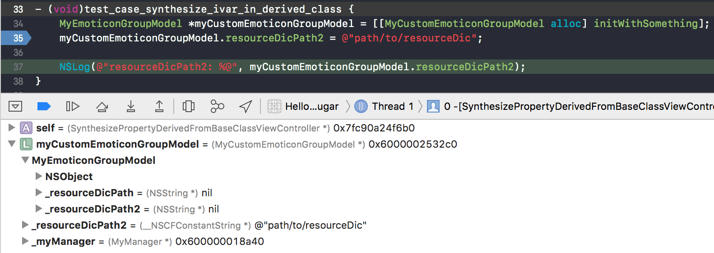
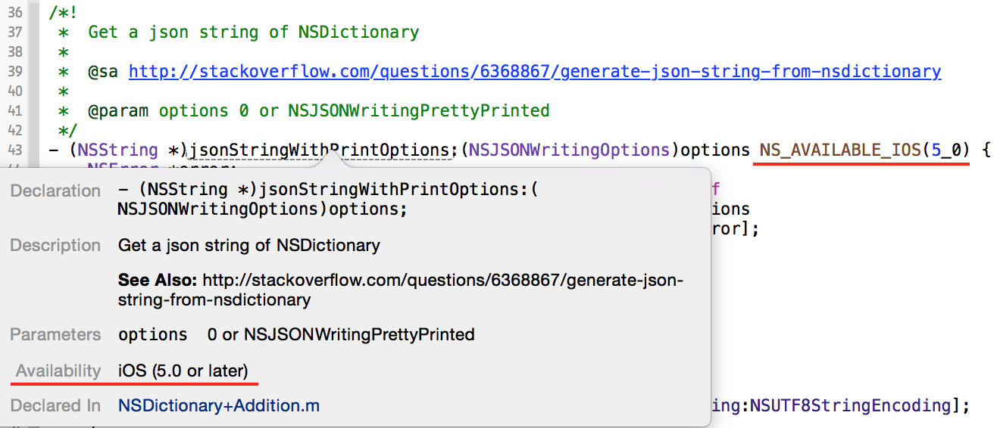
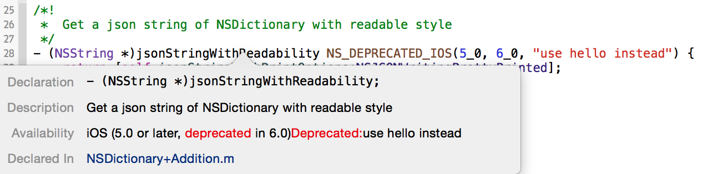
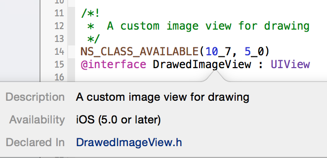
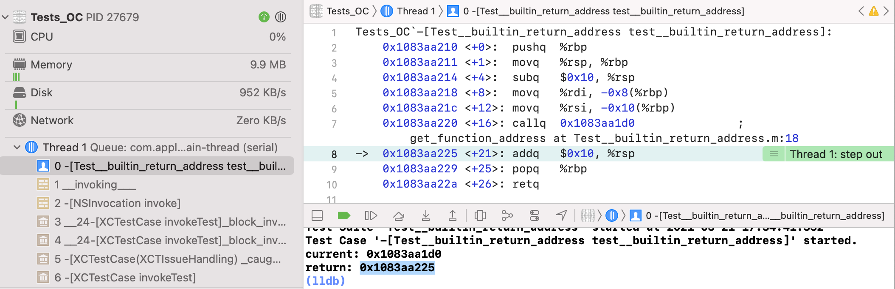

# HelloNSObject

[TOC]


## 1、ObjC Syntax

### （1）char字面常量，存放多个字符

​      char字面常量，存放多个字符。例如'abc'、'abcd'、'abcde'等。根据赋值的数据类型长度和编译器选择little endian或big endian，决定是从前还是从后选择N个字符，赋值到对应类型的变量中[^16]。

举个例子，如下

```c
unsigned value;
char* ptr = (char*)&value;

value = 'ABCD';
printf("'ABCD' = %02x%02x%02x%02x = %08x\n", ptr[0], ptr[1], ptr[2], ptr[3], value);
    
value = 'ABC';
printf("'ABC'  = %02x%02x%02x%02x = %08x\n", ptr[0], ptr[1], ptr[2], ptr[3], value);
```

> unsigned类型，即unsigned int类型，可以存放4个char类型


在MacOS用Xcode编译上面的代码，输出结果，如下

'ABCD' = 44434241 = 41424344    
'ABC'  = 43424100 = 00414243


得出如下规则：

由于是little endian，低地址的字节放在word（4个字节）的低位，总是从后到前取最后4个字节的数据，如果不满足4个字节，填充0x00。


### （2）C++ 11支持Raw String

C++ 11支持Raw String，在.mm文件中可以使用R"\<LANG\>(raw string)\<LANG\>"语法，用于直接写非转义的C字符串。如下

```objective-c
static NSString *jsonString = @R"JSON(
{
    "glossary": {
        "title": "example glossary",
        "GlossDiv": {
            "title": "S",
            "GlossList": {
                "GlossEntry": {
                    "ID": "SGML",
                    "SortAs": "SGML",
                    "GlossTerm": "Standard Generalized Markup Language",
                    "Acronym": "SGML",
                    "Abbrev": "ISO 8879:1986",
                    "GlossDef": {
                        "para": "A meta-markup language, used to create markup languages such as DocBook.",
                        "GlossSeeAlso": ["GML", "XML"]
                    },
                    "GlossSee": "markup"
                }
            }
        }
    }
}
)JSON";
```

上面的@符号将C字符串转成NSString类型。


### （3）表示NaN

math.h头文件提供NaN（Not A Number），有时候需要这种特殊值来占位或者其他用途。


#### a. NaN值的表示

使用NAN宏或者nan(NULL)返回一个NaN值


#### b. 判断是否NaN

NaN相关函数

```c
extern float nanf(const char *);
extern double nan(const char *);
extern long double nanl(const char *);
```

或者直接使用isnan(x)宏


#### c. 打印NaN值

NaN值的字符串输出总是nan。系统函数一般都处理过，然后输出成nan。

```objective-c
double maybeNumber = nan(NULL);
    
NSLog(@"%f", maybeNumber); // nan

CGRect rect = CGRectMake(maybeNumber, maybeNumber, maybeNumber, maybeNumber);
NSLog(@"%@", NSStringFromCGRect(rect)); // {{nan, nan}, {nan, nan}}
```

>参考资料：https://stackoverflow.com/questions/9402348/how-to-return-a-nil-cgfloat


### （4）延迟释放对象

ibireme的[这篇文章](https://blog.ibireme.com/2015/11/12/smooth_user_interfaces_for_ios/)提到一种简便的延迟释放对象的方法。主要思路是，在延迟释放对象的持有者要释放时，将延迟释放的对象，用本地变量临时强引用一下，同时将本地变量放到block中引用，并将延迟释放对象设置为nil。

举个例子，如下。

```objective-c
- (void)dealloc {
    MyObject *tempObject = _myObject;
    _myObject = nil;
    NSLog(@"start to dealloc");
    dispatch_after(dispatch_time(DISPATCH_TIME_NOW, (int64_t)(3 * NSEC_PER_SEC)), dispatch_get_main_queue(), ^{
        // Note: use it to avoid warning
        [tempObject class];
    });
}
```

> 示例代码，见DelayReleaseObjectViewController

文章也提到，如果对象可以在后台线程释放，可以放在非主线程去释放这个对象，这样可以减少主线程的开销。


### （5）使用@property

​      一般来说，定义@property会自动synthesize setter和getter方法，同时定义一个名为`_property`的实例变量。

> 1. 手动实现setter或者getter方法，其中之一，这个`_property`实例变量也是自动合成的。
> 2. 如果同时实现setter和getter方法，需要手动synthesize @property
> 3. 可以使用`__has_feature(objc_default_synthesize_properties)`来检查编译器是否此特性[^18]


#### a. 手动synthesize @property         

​        手动同时实现setter和getter方法，编译器不再自动合成`_property`实例变量，当用到`_property`实例变量会在编译时报错。

举个例子，如下

```objective-c
@interface SynthesizePropertyViewController ()
@property (nonatomic, copy) NSString *propertyWithBothCustomSetterAndGetter;
@end

#pragma mark - Both Setter and Getter

- (void)setPropertyWithBothCustomSetterAndGetter:(NSString *)propertyWithBothCustomSetterAndGetter {
    // Compile Error: Use of undeclared identifier '_propertyWithBothCustomSetterAndGetter'; did you mean 'propertyWithBothCustomSetterAndGetter'?
    _propertyWithBothCustomSetterAndGetter = propertyWithBothCustomSetterAndGetter;
}

- (NSString *)propertyWithBothCustomSetterAndGetter {
    // Compile Error: Use of undeclared identifier '_propertyWithBothCustomSetterAndGetter'
    return _propertyWithBothCustomSetterAndGetter;
}
```

解决方法：这种情况需要手动合成`_property`实例变量，如下

```objective-c
@synthesize propertyWithBothCustomSetterAndGetter = _propertyWithBothCustomSetterAndGetter;
```


#### b. 子类和父类不共用一个实例变量，需要手动synthesize @property

​        一般来说，父类定义@property后，自动合成的实例变量，继承父类的子类不能直接使用`_ivar`方式访问，但是可以通过`super`关键字来访问。但需要注意的是，子类重写了setter或getter方法，需要调用对应的super方法。

​      举个错误的例子，如下

```objective-c
- (void)setResourceDicPath:(NSString *)resourceDicPath {
    // WARNING: missing call [super setXXX:]
    self.myManager.directoryPath = resourceDicPath;
}
```

这里父类的_resourceDicPath没有被赋值。有两种方法可以解决这个问题。

方法一：调用super方法

方法二：在子类中手动合成实例变量，让子类和父类不共用一个实例变量。调试检查如下



可以看出子类和父类有各自的_resourceDicPath2实例变量。


#### c. Ivar在子类中访问[^12]

* property合成的Ivar变量是private类型，不能在子类使用_ivar访问。

  > 示例代码见Tests_AccessIvarOfProperty.m

* 在父类的头文件.h中，显式声明Ivar变量，则子类可以使用_ivar访问。同时定义对应的属性，则子类可以使用self来访问Ivar变量

  > 示例代码，见Tests_AccessPublicIvar.m

  * 这种做法在.h头文件暴露了Ivar变量，可能子类也只是内部使用Ivar变量，所以可以使用扩展的方式。

* 在父类的扩展头文件baseClass_internal.h中，显式声明Ivar变量同时标记为protected，子类的.m文件引入父类的头文件和扩展头文件xx_internal.h，可以访问Ivar变量。对外面暴露父类和子类的.h文件，不暴露父类的xx_internal.h

  > 示例代码，见Tests_AccessPublicIvar.m


### （6）使用@synthesize

@synthesize的作用是指示编译自动生成对应的实例变量，以及setter和getter方法[^17]。

类的定义中声明@property，就可以不用使用@synthesize，但是如果类实现协议中的@property，就需要使用@synthesize


### （7）使用Category

​         Category方法的使用，一般是创建Category Class，定义新的方法（即分类方法），这样Primary Class也拥有这个方法。

​        但是Category方法也存在覆盖Primary Class方法的情况，因此有两种情况：（1）分类方法不覆盖主类方法；（2）分类方法覆盖主类方法。

| Primary Class | Category Class | 说明                                         |
| ------------- | -------------- | -------------------------------------------- |
| ✘             | ✔︎              | 使用分类方法                                 |
| ✔︎             | ✔︎              | 总是使用分类方法，编译会有覆盖主类方法的警告 |


如果子类中也定义分类方法，将有下面组合

| Inheritance   | Primary Class | Category Class | 说明 |
| ------------- | ------------- | -------------- | ---- |
| BaseClass     | ✔︎             | ✔︎              |      |
| DerivedClass1 | ✘             | ✔︎              |      |
| DerivedClass2 | ✔︎             | ✘              |      |
| DerivedClass3 | ✔︎             | ✔︎              |      |
| DerivedClass4 | ✘             | ✘              |      |


### （8）使用`__attribute__`

#### a. 介绍`__attribute__`

`__attribute__`指令可以修饰C/C++和Objective-C的代码，用于代码优化、消除警告、提高代码可读性等。

参考Twitter上的这篇文章[^22]的描述，如下

> The __attribute__ directive is used to decorate a code declaration in C, C++ and Objective-C programming languages. This gives the declared code additional attributes that would help the compiler incorporate optimizations or elicit useful warnings to the consumer of that code.

简单来说，`__attribute__`指令为编译器提供上下文。


`__attribute__`是编译器提供的指令，其结构是两对括号构成[^20]，如`__attribute__((xxx))`。xxx是属性名，如果有多个属性名，则用逗号分隔，如`__attribute__((xxx, yyy))`。举个例子，如下

```c
// Send printf-like message to stderr and exit
extern void die(const char *format, ...)
  __attribute__((noreturn, format(printf, 1, 2)));
```

上面有两个属性名，分别是noreturn和format

从GCC开始就支持`__attribute__`，而LLVM继续支持`__attribute__`，并且增加很多属性名。


#### b. 常用属性的使用

常用属性列表，如下

| 属性                          | 系统别名   | 作用                                                         |
| ----------------------------- | ---------- | ------------------------------------------------------------ |
| `annotate("xxx")`             |            | https://blog.quarkslab.com/implementing-a-custom-directive-handler-in-clang.html |
| `cleanup`                     |            |                                                              |
| `const`                       |            | 标记某个函数的返回值，仅依赖于函数的参数，因此运行时采用缓存直接返回之前计算过的值 |
| `constructor`和`destructor`   |            | 在main之前，调用用`constructor`修饰的函数<br/>在main之后，调用用`destructor`修饰的函数 |
| `deprecated`                  |            |                                                              |
| `enable_if`                   |            | 用于静态检查函数的参数，是否满足特定判断if条件               |
| `objc_boxable`                | CG_BOXABLE | 用于标记struct或union，可以使用@()语法糖封箱成NSValue对象    |
| `objc_requires_super`         |            | 该方法里面需要调用super方法                                  |
| `objc_runtime_name`           |            | 用于重命名OC类或OC协议                                       |
| `objc_subclassing_restricted` |            | 禁止某个类被继承                                             |
| `overloadable`                |            | 用于重载C函数，编译器根据参数类型匹配对应的函数调用          |
| `weak`                        |            |                                                              |


// TODO

https://prafullkumar77.medium.com/clang-attributes-4f20cdd1e04


##### 1. `cleanup`


##### 2. `objc_boxable`

`objc_boxable`用于标记struct或union，可以使用@()语法糖封箱成NSValue对象。

举个例子，如下

```objective-c
// Note: make some_struct into objc_boxable
struct __attribute__((objc_boxable)) some_struct {
    int i;
};

// Note: some_union into objc_boxable
union __attribute__((objc_boxable)) some_union {
    int i;
    float f;
};

// Note: make existing type into objc_boxable
typedef struct __attribute__((objc_boxable)) CGRect WCRect;

- (void)test_WCRect {
    NSValue *value;
    CGRect rect;
    
    CGRect rect2 = CGRectMake(0, 0, 100, 100);
    value = @(rect2);
    NSLog(@"%@", value);
    rect = [value CGRectValue];
    NSLog(@"{%f, %f, %f, %f}", rect.origin.x, rect.origin.y, rect.size.width, rect.size.height);
    
    WCRect rect3 = CGRectMake(0, 0, 200, 200);
    value = @(rect3);
    NSLog(@"%@", value);
    rect = [value CGRectValue];
    NSLog(@"{%f, %f, %f, %f}", rect.origin.x, rect.origin.y, rect.size.width, rect.size.height);
}
```

> 示例代码，见Tests_objc_boxable.m


##### 3. `objc_requires_super`

`objc_requires_super`用标记该方法，在重写时，必现使用super调用父类方法，否则会产生警告[^21]

举个例子，如下

```objective-c
@interface Tests_objc_requires_super_BaseClass : NSObject
- (void)aMethodNeedCallSuperWhenOverride __attribute__((objc_requires_super));
@end
@implementation Tests_objc_requires_super_BaseClass
- (void)aMethodNeedCallSuperWhenOverride {
}
@end

@interface Tests_objc_requires_super_DerivedClass : Tests_objc_requires_super_BaseClass
@end
@implementation Tests_objc_requires_super_DerivedClass
- (void)aMethodNeedCallSuperWhenOverride {
    // Note: a warning here if not call [super aMethodNeedCallSuperWhenOverride]
}
@end
```

> 示例代码，见Tests_objc_requires_super.m


##### 4. `objc_subclassing_restricted`

`objc_subclassing_restricted`用标记该类不能被继承使用，否则编译时产生错误[^21]

举个例子，如下

```objective-c
__attribute__((objc_subclassing_restricted))
@interface ClassNotSuppoertInheritance : NSObject
@end
@implementation ClassNotSuppoertInheritance
@end

@interface DerivedFromClassNotSuppoertInheritance : ClassNotSuppoertInheritance
@end
@implementation DerivedFromClassNotSuppoertInheritance
@end
```

> 示例代码，见Tests_objc_subclassing_restricted.m


##### 5. `const`

`const`用于标记函数的返回值，完全依赖它的参数，而且内部不依赖其他变量。这样编译器可以在调用的地方，增加缓存，用于提高性能。

NSHipster的这篇文章[^20]对const描述，如下

> The `const` attribute specifies that a function does not examine any values except their arguments, and have no effects except the return value. 


举个例子，如下

```c
int square(int n) __attribute__((const));
```

求平方的函数，它的返回值仅依赖输入的参数，因此非常适合使用`const`修饰。

但是需要注意的是

* 如果函数的参数是指针，并且内部会检查指针指向的数据，则一定不能使用`const`修饰
* 如果函数是非`const`修饰，则调用它的函数同样不能使用`const`修饰
* 如果函数的返回值是void，则使用`const`修饰是没有意义的

> Note that a function that has pointer arguments and examines the data pointed to must not be declared const. Likewise, a function that calls a non-`const` function usually must not be `const`. It does not make sense for a `const` function to return `void`.


如果错误地使用`const`，则会产生非常难调试排查的bug，而且一般在Debug编译下不会复现，则在使用某些高度优化的编译选项的app才出现。

参考Twitter上的这篇文章[^22]的描述，如下

> The worst of this is that the optimization that would cause this crash will only happen in builds that are highly optimized. Since debug builds often have optimizations turned down, you can run your app in a debugger forever and never reproduce it, making this bug, like most __attribute__ based bugs, very hard to figure out and fix.


##### 6. `constructor`和`destructor`

构造器`constructor`和析构器`destructor`，使用这两个属性修饰的函数会在分别在可执行文件（包括动态库）load和 unload时被调用，可以理解为在 `main()` 函数调用前和 return 后执行[^21]。


##### `constructor`和`+load`的顺序[^21]

`constructor`在`+load`的之后，如下

> constructor 和 `+load` 都是在 main 函数执行前调用，但 `+load` 比 constructor 更加早一丢丢，因为 dyld（动态链接器，程序的最初起点）在加载 image（可以理解成 Mach-O 文件）时会先通知 `objc runtime` 去加载其中所有的类，每加载一个类时，它的 `+load` 随之调用，全部加载完成后，dyld 才会调用这个 image 中所有的 constructor 方法。

可以看出`constructor`比`+load`更适合进行swizzle。


##### 7. `enable_if`

`enable_if`用于静态检查函数的参数是否满足特定条件，一般比较适合检查整型枚举值的参数。

> 因为使用到函数的参数，`enable_if`只能放在函数名后面修饰


举个例子，如下

```objective-c
typedef NS_ENUM(NSInteger, MyEnumType) {
    MyEnumTypeA,
    MyEnumTypeB,
};

static NSString *NSStringFromMyEnumType(MyEnumType type) __attribute__((enable_if(type > MyEnumTypeA - 1 && type < MyEnumTypeB + 1, "枚举值不在范围中"))) {
    switch (type) {
        case MyEnumTypeA:
            return @"A";
        case MyEnumTypeB:
            return @"B";
        default:
            break;
    }
    return nil;
}

- (void)test_enable_if {
    NSString *string;
    __unused NSInteger type = 200;
    
    string = NSStringFromMyEnumType(MyEnumTypeA);
    string = NSStringFromMyEnumType(MyEnumTypeB);
    
    // Errors: error: no matching function for call to 'NSStringFromMyEnumType'
    /*
    string = NSStringFromMyEnumType(-1);
    string = NSStringFromMyEnumType(100);
    string = NSStringFromMyEnumType(type);
     */
}
```

但是编译报错不是`enable_if`的第二个字符串参数，导致编译报错提示有点不友好。


##### 8. `overloadable`

`overloadable`用于重载C函数，编译器根据参数类型匹配对应的函数调用。

举个例子，如下

```objective-c
__attribute__((overloadable))
static void logAnything(id obj) {
    NSLog(@"id: %@", obj);
}

__attribute__((overloadable))
static void logAnything(int number) {
    NSLog(@"int: %@", @(number));
}

__attribute__((overloadable))
static void logAnything(CGRect rect) {
    NSLog(@"CGRect: %@", NSStringFromCGRect(rect));
}

- (void)test_overloadable {
    logAnything(@[@"1", @"2"]);
    logAnything(233);
    logAnything(CGRectMake(1, 2, 3, 4));
}
```

// TODO: https://github.com/mattt/WebPImageSerialization/blob/master/WebPImageSerialization/WebPImageSerialization.m


##### 9. `objc_runtime_name`

`objc_runtime_name`可以修饰OC的类或协议进行重命名，一般用于代码混淆、代码注解等。

举个例子，如下

```objective-c
__attribute__((objc_runtime_name("7eceb275788590faefc1097c0f903ce5")))
@protocol MySecretProtcol <NSObject>
- (void)test_objc_runtime_name;
@end

__attribute__((objc_runtime_name("544cd1f719a0cb56dce50fd51b39852d")))
@interface MySecretClass : NSObject
@end

- (void)test_objc_runtime_name {
    NSLog(@"class: %@", NSStringFromClass([MySecretClass class])); // class: 544cd1f719a0cb56dce50fd51b39852d
    NSLog(@"protocol: %@", NSStringFromProtocol(@protocol(MySecretProtcol))); // protocol: 7eceb275788590faefc1097c0f903ce5
}
```

值得注意的是，重命名可以打破编译时命名规则，可以使用数字开头。


// TODO: 代码注解示例


\_\_attribute\_\_ ((\_\_cleanup\_\_(\<callback\>)))的用法


示例代码，见**GCCAttributeCleanupViewController**


#### c. 让Xcode生成Availability提示

Xcode中按住Option键，同时点击某个方法、类、属性，会弹出相关的文档，其中有一项是Availability（如下图），作用是告知该方法、类或属性，在什么版本引入，在什么版本不推荐使用，方便开发者知晓API版本和系统版本的兼容性。




下面介绍一些相关的宏，如下表

| 宏                                                           | 修饰内容 | 含义                         |
| ------------------------------------------------------------ | -------- | ---------------------------- |
| NS_AVAILABLE(_mac, _ios)                                     | 方法     | 在mac和ios平台上可用起始版本 |
| NS_AVAILABLE_MAC(_mac)                                       | 方法     | 在mac平台上可用起始版本      |
| NS_AVAILABLE_IOS(_ios)                                       | 方法     | 在ios平台上可用起始版本      |
| NS_DEPRECATED(_macIntro, _macDep, _iosIntro, _iosDep, ...)   | 方法     |                              |
| NS_DEPRECATED_MAC(_macIntro, _macDep, ...)                   | 方法     |                              |
| NS_DEPRECATED_IOS(_iosIntro, _iosDep, ...)                   | 方法     |                              |
| NS_CLASS_AVAILABLE(_mac, _ios)                               | 类       |                              |
| NS_CLASS_AVAILABLE_IOS(_ios)                                 | 类       |                              |
| NS_CLASS_AVAILABLE_MAC(_mac)                                 | 类       |                              |
| NS_CLASS_DEPRECATED(_mac, _macDep, _ios, _iosDep, ...)       | 类       |                              |
| NS_CLASS_DEPRECATED_MAC(_macIntro, _macDep, ...)             | 类       |                              |
| NS_CLASS_DEPRECATED_IOS(_iosIntro, _iosDep, ...)             | 类       |                              |
| NS_ENUM_AVAILABLE(_mac, _ios)                                | 枚举     |                              |
| NS_ENUM_AVAILABLE_MAC(_mac)                                  | 枚举     |                              |
| NS_ENUM_AVAILABLE_IOS(_ios)                                  | 枚举     |                              |
| NS_ENUM_DEPRECATED(_macIntro, _macDep, _iosIntro, _iosDep, ...) | 枚举     |                              |
| NS_ENUM_DEPRECATED_MAC(_macIntro, _macDep, ...)              | 枚举     |                              |
| NS_ENUM_DEPRECATED_IOS(_iosIntro, _iosDep, ...)              | 枚举     |                              |


在Foundation.framework中NSObjCRuntime.h定义了一些宏，用于显示Availability，主要有AVAILABLE和DEPRECATED两类，分别标志什么版本开始引入的和什么版本开始弃用的


##### 1. 修饰方法


- AVAILABLE类

```objective-c
#define NS_AVAILABLE(_mac, _ios) CF_AVAILABLE(_mac, _ios)
#define NS_AVAILABLE_MAC(_mac) CF_AVAILABLE_MAC(_mac)
#define NS_AVAILABLE_IOS(_ios) CF_AVAILABLE_IOS(_ios)
```

`_MAC`和`_IOS`后缀分别对应Mac OS X和iOS平台，没有后缀则是针对两者平台的。


注意

> 版本号，必须是x_y格式的，例如NS_AVAILABLE_IOS(5_0)则显示iOS (5.0 or later)


- DEPRECATED类

```objective-c
#define NS_DEPRECATED(_macIntro, _macDep, _iosIntro, _iosDep, ...) CF_DEPRECATED(_macIntro, _macDep, _iosIntro, _iosDep, __VA_ARGS__)
#define NS_DEPRECATED_MAC(_macIntro, _macDep, ...) CF_DEPRECATED_MAC(_macIntro, _macDep, __VA_ARGS__)
#define NS_DEPRECATED_IOS(_iosIntro, _iosDep, ...) CF_DEPRECATED_IOS(_iosIntro, _iosDep, __VA_ARGS__)
```

同样，`_MAC`和`_IOS`后缀分别对应Mac OS X和iOS平台，没有后缀则是针对两者平台的


   与AVAILABLE类，相比DEPRECATED类至少提供引入版本号和弃用版本号，还可以在第三个宏参数提供替换的API，如下图所示



注意

> 弃用版本号必须大于引入版本号，第三个宏参数是可选的


##### 2. 修饰类


除了上面通用的AVAILABLE宏和DEPRECATED宏，还有针对类和枚举的AVAILABLE宏和DEPRECATED宏

- NS_CLASS_AVAILABLE_xxx类

```objective-c
#if (__MAC_OS_X_VERSION_MIN_REQUIRED >= __MAC_10_6 || __IPHONE_OS_VERSION_MIN_REQUIRED >= __IPHONE_3_1) && \
    ((__has_feature(objc_weak_class) || \
     (defined(__llvm__) && defined(__APPLE_CC__) && (__APPLE_CC__ >= 5658)) || \
     (defined(__APPLE_CC__) && (__APPLE_CC__ >= 5666))))
#define NS_CLASS_AVAILABLE(_mac, _ios) __attribute__((visibility("default"))) NS_AVAILABLE(_mac, _ios)
...
#else
#define NS_CLASS_AVAILABLE(_mac, _ios)
...
#endif

#define NS_CLASS_AVAILABLE_IOS(_ios) NS_CLASS_AVAILABLE(NA, _ios)
#define NS_CLASS_AVAILABLE_MAC(_mac) NS_CLASS_AVAILABLE(_mac, NA)
```


* NS_CLASS_DEPRECATED_xxx类

```objective-c
#if (__MAC_OS_X_VERSION_MIN_REQUIRED >= __MAC_10_6 || __IPHONE_OS_VERSION_MIN_REQUIRED >= __IPHONE_3_1) && \
    ((__has_feature(objc_weak_class) || \
     (defined(__llvm__) && defined(__APPLE_CC__) && (__APPLE_CC__ >= 5658)) || \
     (defined(__APPLE_CC__) && (__APPLE_CC__ >= 5666))))
...
#define NS_CLASS_DEPRECATED(_mac, _macDep, _ios, _iosDep, ...) __attribute__((visibility("default"))) NS_DEPRECATED(_mac, _macDep, _ios, _iosDep, __VA_ARGS__)
#else
...
#define NS_CLASS_DEPRECATED(_mac, _macDep, _ios, _iosDep, ...)
#endif

#define NS_CLASS_DEPRECATED_MAC(_macIntro, _macDep, ...) NS_CLASS_DEPRECATED(_macIntro, _macDep, NA, NA, __VA_ARGS__)
#define NS_CLASS_DEPRECATED_IOS(_iosIntro, _iosDep, ...) NS_CLASS_DEPRECATED(NA, NA, _iosIntro, _iosDep, __VA_ARGS__)
```


举个例子如下图



注意：AVAILABLE和DEPRECATED宏，是区分平台的，这里只显示了iOS编译环境下的提示“iOS (5.0 or later)”，另外宏是需要编译的，因此Option+Clicking在头文件中或对应的.m文件有可能Availability不会出现，这时需要在其他文件引入.h文件编译后，在第三方文件（.h或.m文件）中使用该类才会出现Availability提示。


##### 3. 修饰枚举


- NS_ENUM_AVAILABLE_xxx类和NS_ENUM_DEPRECATED_xxx类

```objective-c
#define NS_ENUM_AVAILABLE(_mac, _ios) CF_ENUM_AVAILABLE(_mac, _ios)
#define NS_ENUM_AVAILABLE_MAC(_mac) CF_ENUM_AVAILABLE_MAC(_mac)
#define NS_ENUM_AVAILABLE_IOS(_ios) CF_ENUM_AVAILABLE_IOS(_ios)

#define NS_ENUM_DEPRECATED(_macIntro, _macDep, _iosIntro, _iosDep, ...) CF_ENUM_DEPRECATED(_macIntro, _macDep, _iosIntro, _iosDep, __VA_ARGS__)
#define NS_ENUM_DEPRECATED_MAC(_macIntro, _macDep, ...) CF_ENUM_DEPRECATED_MAC(_macIntro, _macDep, __VA_ARGS__)
#define NS_ENUM_DEPRECATED_IOS(_iosIntro, _iosDep, ...) CF_ENUM_DEPRECATED_IOS(_iosIntro, _iosDep, __VA_ARGS__)
```


### （9）使用`__builtin_xxx`系列函数

​       GCC编译器提供一些内置函数，例如`__builtin_trap`等。这里统称为`__builtin_xxx`系列函数。Clang也支持`__builtin_xxx`系列函数，但是作为可选的。因此需要使用宏`__has_builtin`测试是否编译器支持[^23]，如下

```c
#ifndef __has_builtin         // Optional of course.
  #define __has_builtin(x) 0  // Compatibility with non-clang compilers.
#endif

...
#if __has_builtin(__builtin_trap)
  __builtin_trap();
#else
  abort();
#endif
```


由于，这里只介绍常用的函数，如下

| 函数                       | 作用                                                   | 说明 |
| -------------------------- | ------------------------------------------------------ | ---- |
| `__builtin_return_address` | 获取当前函数的返回地址，即返回后要执行的下个指令的地址 |      |


#### a. `__builtin_return_address`

`__builtin_return_address`函数签名[^24]，如下

```c
void * __builtin_return_address (unsigned int level);
```

注意：level参数只能传0，因为可能会出现crash。GCC文档描述，如下

> Calling this function with a nonzero argument can have unpredictable effects, including crashing the calling program. 

该函数返回值是被调用函数返回到调用处执行的下一个指令的内存地址，如下面截图



current值是get_function_adress函数的内存地址，而return值是下个指令的内存地址。

示例代码，如下

```objective-c
void get_function_address(void)
{
    void *current_function_ptr = get_function_address;
    printf("current: %p\n", current_function_ptr);
    printf("return: %p\n", __builtin_return_address(0));
}

- (void)test__builtin_return_address {
    get_function_address();
}
```


### （10）Objective-C常见关键词

#### a. template

template在Objective-C++是关键词，不能作为参数使用，否则编译器（Xcode 10）会报错。

举个例子，如下

```objective-c
- (void)callDelegateOfHookHandleWithTemplate:(TemplateModel *)template data:(DataModel *)data nameSpace:(NSString *)nameSpace { // error: expected identifier; 'template' is a keyword in Objective-C++
}
```


### （11）Objective-C常用方法命名方式


| 格式                             | 作用                       | 说明 |
| -------------------------------- | -------------------------- | ---- |
| `view`Tapped                     | view单击的方法             |      |
| `view`DoubleTapped               | view双击的方法             |      |
| `UISwitchVarName`Toggled         | UISwitch点击切换的方法     |      |
| callDelelgateOf`protocol_method` | 调用delegate方法的包装方法 |      |


### （12）随机化处理[^13]


经常使用的函数`arc4random`，一般用它来取模得到某个范围的随机值。

```c
uint32_t arc4random(void)
```


更简单的方式，使用`arc4random_uniform`函数

```c
uint32_t
	 arc4random_uniform(uint32_t __upper_bound) __OSX_AVAILABLE_STARTING(__MAC_10_7, __IPHONE_4_3);
```

它随机返回[0, N-1]的随机值


除了获取随机的整型值，也可以通过`drand48`函数获得随机的浮点型数，但是用`srand48`函数必须初始化一次。

```c
srand48(time(0));
double random = drand48();
NSLog(@"%f", random);
```


> 示例代码，见Tests_Random.m


### （13）extern "C"[^14]


### （14）数据类型最大最小值[^15]

limits.h提供整型数据类型最大最小值的宏定义

float.h提供float型数据类型最大最小值的宏定义


### （15）__has_feature检查

__has_feature(xxx)可以传入下面的参数，来检查编译是否支持某个特性。

| 参数                               | 作用                                                 |
| ---------------------------------- | ---------------------------------------------------- |
| objc_default_synthesize_properties | 检查声明@property是否自动生成setter和getter方法[^18] |
| objc_array_literals                | 检查是否支持数组字面常量[^19]                        |
| objc_dictionary_literals           | 检查是否支持词典字面常量[^19]                        |
| objc_subscripting                  | 检查是否支持下标引用[^19]                            |


### （16）ivar变量

Objective-C实例的内部变量，称为ivar变量（或者实例变量）。一般来说，访问ivar变量，需要通过对应setter和getter方法来访问。


#### a. ivar变量访问级别

ivar变量可以设置访问级别，有4种[^25]，如下

* @private，仅在定义该变量的类中访问。属性的私有变量，就是@private级别
* @protected，在定义该变量的类中以及所有子类中访问。如果定义ivar变量，默认就是@protected级别

* @package，在可执行的包（例如framework）的代码中任意访问，但是在另一个可执行包的编译链接中不能访问
* @public，任意访问


举个例子，如下

@private

```objective-c
@interface AccessPrivateIvar1 : NSObject {
@private
    NSString *_privateIvar;
}
@end
@implementation AccessPrivateIvar1
@end

@interface AccessPrivateIvar2 : AccessPrivateIvar1
@end
@implementation AccessPrivateIvar2
- (instancetype)init {
    self = [super init];
    if (self) {
        _privateIvar = @"abc"; // Compile Error: Instance variable '_privateIvar' is private
    }
    return self;
}
@end

- (void)test_access_private_ivar {
    AccessPrivateIvar2 *object = [AccessPrivateIvar2 new];
    NSLog(@"%@", object->_privateIvar);  // Compile Error: Instance variable '_privateIvar' is private
}
```


@protected

```objective-c
@interface AccessProtectedIvar1 : NSObject {
@protected
    NSString *_protectedIvar;
}
@end
@implementation AccessProtectedIvar1
@end

@interface AccessProtectedIvar2 : AccessProtectedIvar1
@end
@implementation AccessProtectedIvar2
- (instancetype)init {
    self = [super init];
    if (self) {
        _protectedIvar = @"abc";
    }
    return self;
}
@end
  
- (void)test_access_protected_ivar {
    __unused AccessProtectedIvar2 *object = [AccessProtectedIvar2 new];
    NSLog(@"%@", object->_protectedIvar);  // Compile Error: Instance variable '_protectedIvar' is protected
}
```


@public

```objective-c
@interface AccessPublicIvar1 : NSObject {
@public
    NSString *_publicIvar;
}
@end
@implementation AccessPublicIvar1
@end

@interface AccessPublicIvar2 : AccessPublicIvar1
@end
@implementation AccessPublicIvar2
- (instancetype)init {
    self = [super init];
    if (self) {
        _publicIvar = @"abc";
    }
    return self;
}
@end
  
- (void)test_access_public_ivar {
    __unused AccessPublicIvar2 *object = [AccessPublicIvar2 new];
    NSLog(@"%@", object->_publicIvar);
    
    object->_publicIvar = @"123";
    XCTAssertEqualObjects(object->_publicIvar, @"123");
}
```


@package

```objective-c
@interface AccessPackageIvar1 : NSObject {
@package
    NSString *_packageIvar;
}
@end
@implementation AccessPackageIvar1
@end

@interface AccessPackageIvar2 : AccessPackageIvar1
@end
@implementation AccessPackageIvar2
- (instancetype)init {
    self = [super init];
    if (self) {
        _packageIvar = @"abc";
    }
    return self;
}
@end

#pragma mark -

@interface AccessPackageIvarFromDynamicFramework : DynamicFrameworkClass
@end
@implementation AccessPackageIvarFromDynamicFramework
- (instancetype)init {
    self = [super init];
    if (self) {
        /**
         Undefined symbols for architecture x86_64:
         "_OBJC_IVAR_$_DynamicFrameworkClass._packageIvar", referenced from:
             -[AccessPackageIvarFromStaticLibrary init] in Tests_AccessPackageIvar.o
         */
        //_packageIvar = @"123";
        _publicIvar = @"123";
    }
    return self;
}
@end
  
- (void)test_access_package_ivar {
    __unused AccessPackageIvar2 *object = [AccessPackageIvar2 new];
    NSLog(@"%@", object->_packageIvar);
    
    object->_packageIvar = @"123";
    XCTAssertEqualObjects(object->_packageIvar, @"123");
}

- (void)test_access_public_ivar_from_dynamic_framework {
    __unused AccessPackageIvarFromDynamicFramework *object = [AccessPackageIvarFromDynamicFramework new];
    NSLog(@"%@", object->_publicIvar);
    
    object->_publicIvar = @"123";
    XCTAssertEqualObjects(object->_publicIvar, @"123");
}
```


> 以上代码，见
>
> Tests_AccessPrivateIvar.m
>
> Tests_AccessProtectedIvar.m
>
> Tests_AccessPublicIvar.m
>
> Tests_AccessPackageIvar.m


通过上面的例子，可以4种访问级别，可以归纳如下表

| 级别       | 定义类中访问 | 子类中访问 | 实例外访问 | 可执行bundle代码访问另一个可执行bundle代码（子类中访问、实例外访问） |
| ---------- | ------------ | ---------- | ---------- | ------------------------------------------------------------ |
| @private   | ✅            | ❌          | ❌          | ❌                                                            |
| @protected | ✅            | ✅          | ❌          | ❌                                                            |
| @package   | ✅            | ✅          | ✅          | ❌                                                            |
| @public    | ✅            | ✅          | ✅          | ✅                                                            |


#### b. 访问私有ivar变量

根据上面一节，可以看到@private修饰的ivar变量访问限制是最小的，因此如果要通过实例对象来访问私有ivar变量，需要一些hook操作。

目前有下面几种方式可以实现[^26]

* 直接使用指针地址
* 通过runtime api（`class_getInstanceVariable`和`object_getIvar`）
* 通过KVC
* 声明ivar变量为@public


以访问下面两个私有变量为例

```objective-c
@implementation HiddenPrivateIvarClass {
@private
    NSString *_name;
    NSString *_job;
}

- (instancetype)init {
    self = [super init];
    if (self) {
        _name = @"w";
        _job = @"hacker";
    }
    return self;
}

@end
```


##### 1. 直接使用指针地址

由于Objective-C对象的内存都是分配在堆上，因此根据实例对象的地址，加上特定的偏移量，就能计算出实例变量在内存的地址。

示例代码，如下

```objective-c
- (void)test_hook_by_pointer_arithmetic {
    HiddenPrivateIvarClass *foo = [[HiddenPrivateIvarClass alloc] init];
    
    __unsafe_unretained NSString *name = (__bridge id)*(void **)((__bridge void *)foo + 8);
    NSLog(@"name: %@", name);
    XCTAssertEqualObjects(name, @"w");
    
    __unsafe_unretained NSString *job = (__bridge id)*(void **)((__bridge void *)foo + 16);
    NSLog(@"job: %@", job);
    XCTAssertEqualObjects(job, @"hacker");
}
```

说明

> 1. 每个Objective-C对象默认有个isa变量，在64bit系统中，isa占8个字节，因此计算第一个实例变量的偏移量是8
> 2. 在ARC下，需要使用`__unsafe_unretained`修饰获取到ivar变量对象，不需要持有该对象
> 3. 上面这种方法，获取到实例变量不一定是Objective-C对象，也可能是基本类型，容易产生内存问题，因此不适合用于生产中


##### 2. 通过runtime api

Objective-C的runtime提供获取实例变量的API，主要通过`class_getInstanceVariable`和`object_getIvar`这两个函数。


在runtime中，实例变量类型定义为Ivar，如下

```objective-c
/// An opaque type that represents an instance variable.
typedef struct objc_ivar *Ivar;
```


通过`class_getInstanceVariable`函数，如下

```objective-c
OBJC_EXPORT Ivar _Nullable
class_getInstanceVariable(Class _Nullable cls, const char * _Nonnull name)
    OBJC_AVAILABLE(10.0, 2.0, 9.0, 1.0, 2.0);
```

可以根据实例变量名获取到Ivar。

注意

> class_getInstanceVariable是class_系列函数，可以不用传实例对象


通过`object_getIvar`函数，如下

```objective-c
OBJC_EXPORT id _Nullable
object_getIvar(id _Nullable obj, Ivar _Nonnull ivar) 
    OBJC_AVAILABLE(10.5, 2.0, 9.0, 1.0, 2.0);
```

可以拿到实例变量。

注意

> 如果实例变量是基本类型，则不能使用`object_getIvar`函数，否则返回的地址并不是实例对象的。


这篇SO[^27]给一个方式来获取基本类型的实例变量，基本思路还是直接使用指针地址，加偏移量来计算，然后强制转成基本类型的变量。


针对实例变量为对象类型和基本类型的情况。举个例子，如下

```objective-c
- (void)test_hook_by_runtime_api {
    HiddenPrivateIvarClass *foo = [[HiddenPrivateIvarClass alloc] init];
    
    // Case 1: object ivar
    Ivar nameIVar = class_getInstanceVariable([foo class], "_name");
    NSString *name = object_getIvar(foo, nameIVar);
    NSLog(@"name: %@", name);
    XCTAssertEqualObjects(name, @"w");
    
    // Case 2: primitive ivar
    CGSize outSize;
    Ivar sizeIVar = class_getInstanceVariable([foo class], "_size");
    ptrdiff_t offset = ivar_getOffset(sizeIVar);
    unsigned char *stuffBytes = (unsigned char *)(__bridge void *)foo;
    outSize = *((CGSize *)(stuffBytes + offset));
    XCTAssertTrue(outSize.width == 1);
    XCTAssertTrue(outSize.height == 2);
}
```


说明

> WCObjectTool提供的工具方法，采用上面的方法，来获取ivar变量


##### 3. 通过KVC

每个NSObje对象都是符合KVC机制的，因此可以通过KVC的API直接访问私有实例变量。

举个例子，如下

```objective-c
- (void)test_hook_by_KVC {
    HiddenPrivateIvarClass *foo = [[HiddenPrivateIvarClass alloc] init];
    NSValue *value;
    
    // Case 1: object ivar
    NSString *name = [foo valueForKey:@"_name"];
    XCTAssertEqualObjects(name, @"w");
    
    NSString *job = [foo valueForKey:@"_job"];
    XCTAssertEqualObjects(job, @"hacker");
    
    // Case 2: CGSize - primitive ivar
    value = [foo valueForKey:@"_size"];
    CGSize outSize = [value CGSizeValue];
    XCTAssertTrue(outSize.width == 1);
    XCTAssertTrue(outSize.height == 2);
    
    // Case 3: double - primitive ivar
    value = [foo valueForKey:@"_double"];
    double outDouble = primitiveValueFromNSValue(value, double);
    XCTAssertTrue(outDouble == 3.14);
}
```

注意

> 如果KVC的类实现了accessInstanceVariablesDirectly方法并返回NO，则不能使用KVC访问实例变量。如果还是要采用KVC方式，则需要通过分类方法hook让accessInstanceVariablesDirectly方法并返回YES。
>
> 如下
>
> ```objective-c
> @implementation Foo (Exposed)
> + (BOOL)accessInstanceVariablesDirectly {
>     return YES;
> }
> @end
> ```


##### 4. 声明ivar变量为@public

除了上面的通过运行时来获取私有实例变量，可以通过在类的扩展中重新声明私有实例变量为@public，这样在编译期间，编译器生成计算实例变量的低级代码。

举个例子，如下

```objective-c
#import "HiddenPrivateIvarClass.h"

@interface HiddenPrivateIvarClass () {
    // Note: Ivar without any modifier in extension is private by default
    // Redeclare private ivars as public
@public
    NSString *_name;
    NSString *_job;
    CGSize _size;
    double _double;
}
@end

- (void)test_hook_by_redeclare_as_public_ivar {
    HiddenPrivateIvarClass *foo = [[HiddenPrivateIvarClass alloc] init];
    // Case 1: object ivar
    NSString *name = foo->_name;
    XCTAssertEqualObjects(name, @"w");
    
    NSString *job = foo->_job;
    XCTAssertEqualObjects(job, @"hacker");
    
    // Case 2: CGSize - primitive ivar
    CGSize outSize = foo->_size;
    XCTAssertTrue(outSize.width == 1);
    XCTAssertTrue(outSize.height == 2);
    
    // Case 3: double - primitive ivar
    double outDouble = foo->_double;
    XCTAssertTrue(outDouble == 3.14);
}
```

注意

> 在类扩展中，没有指定访问级别，默认是@private而不是@protected，这个和在类定义中声明不一样（默认是@protected）。


## 2、ObjC Runtime

TODO

https://bignerdranch.com/blog/inside-the-bracket-part-5-runtime-api/


### （1）Swizzle方法

​       Objective-C的运行时（Runtime），提供替换某个方法的实现的功能，也称为Swizzle方法。这里仅讨论Swizzle Objective-C方法。

​       Objective-C方法，定义为Method类型，代码中的实例方法和类方法，在运行时都对应这个Method，每个Method对应一个selector和IMP，可以通过selector执行Method，而实际上是执行IMP。IMP是一个C函数指针。

​       代码中的Objective-C方法，编译器已经编译好IMP，可以等价看成Objective-C方法就是IMP。Swizzle方法，实际上是替换现有方法的IMP。

​       替换IMP，目前有三种方法

* 用block作为swizzled IMP去替换。主要用到`imp_implementationWithBlock`函数，将block转成IMP，然后替换现有方法的IMP
* 用Objective-C分类方法作为swizzled IMP去替换。一般实现某个类的分类方法，然后将这个分类方法的IMP替换原来方法的IMP
* 用C函数作为swizzled IMP去替换。这个过程和用Objective-C分类方法去替换差不多，只不过是直接用C函数作为IMP去替换原来方法的IMP

> 上面三种方式，分别见SwizzleMethodByBlockViewController、SwizzleMethodByCategoryMethodViewController、SwizzleMethodByCFunctionViewController


#### a. Block Swizzle


#### b. Objective-C分类方法 Swizzle

NSHipster的这篇文章[^11]介绍了使用Objective-C分类方法来Swizzle，原理如下图所示


#### c. C函数 Swizzle


### （2）分析selector

在objc.h头文件中，SEL被定义为结构体指针。注释上说SEL是opaque类型，即对外不透明的。

```objective-c
/// An opaque type that represents a method selector.
typedef struct objc_selector *SEL;
```

查看objc-sel.mm的[sel_getName函数源码](https://github.com/opensource-apple/objc4/blob/master/runtime/objc-sel.mm#L118)，可以看出SEL指向的实际是C字符串。

```objective-c
const char *sel_getName(SEL sel) 
{
    if (!sel) return "<null selector>";
    return (const char *)(const void*)sel;
}
```

如果强制将SEL类型转成char *，则Xcode会给出一个warning，如下

```objective-c
string = (char *)selector; // Cast of type 'SEL' to 'char *' is deprecated; use sel_getName instead
XCTAssertTrue(strcmp("compare:", string) == 0);
```


解决方法1：参考warning提示，使用sel_getName函数获取C字符串，注意返回值类型是const char *

解决方法2：参考源码的方式，两次类型转换，可以消除warning（Xcode 10.2），如下

```objective-c
string = (const char *)(const void*)selector; // Note: no warning here
XCTAssertTrue(strcmp("compare:", string) == 0);
```

示例代码，见Test_selector.m


### （3）分析IMP

​      IMP在objc.h中定义为一个函数指针，值得注意的是，它有两种函数签名。一般OBJC_OLD_DISPATCH_PROTOTYPES宏不会生效，它的签名是`void (*IMP)(void /* id, SEL, ... */ )`

```objective-c
/// A pointer to the function of a method implementation. 
#if !OBJC_OLD_DISPATCH_PROTOTYPES
typedef void (*IMP)(void /* id, SEL, ... */ ); 
#else
typedef id _Nullable (*IMP)(id _Nonnull, SEL _Nonnull, ...); 
#endif
```

​        注释上说IMP对应方法的实现，实际上签名为`void (*)(void)`的函数指针可以转成任意签名的函数指针，然后调用这个函数指针，可以调用任意OC方法。

举个例子，如下

```objective-c
- (NSInteger)anOCMethod:(NSInteger)arg {
    printf("anOCMethod called\n");
    return arg + 1;
}

- (void)test_check_IMP {
    IMP imp;
    
    // Case 1
    imp = class_getMethodImplementation([Test_IMP class], @selector(anOCMethod:));
    imp();
    
    // Case 2
    typeof(self) object = [[[self class] alloc] init];
    NSInteger (*func)(id, SEL, NSInteger) = (NSInteger (*)(id, SEL, NSInteger))imp;
    NSInteger result = func(object, @selector(anOCMethod:), 5);
    XCTAssertTrue(result == 6);
}
```

示例代码，见Test_IMP.m


### （4）分析weak变量

不能在dealloc中使用weak变量

```objective-c
@implementation Test_weak

- (void)dealloc {
    __weak typeof(self) weak_self = self; // ERROR: crash here
    NSLog(@"%@", weak_self);
}

#pragma mark -

- (void)test_weak_cause_crash_in_dealloc {
    {
        Tests_weak *object = [[Tests_weak alloc] init];
        NSLog(@"%@", object);
    }
    // Note: release the object after the end of code block
}

@end
```

控制台出现下面提示，如下

```
objc[26150]: Cannot form weak reference to instance (0x600000ebc4c0) of class Tests_weak. It is possible that this object was over-released, or is in the process of deallocation.
```

提示信息"Cannot form weak reference to instance..."在**weak_register_no_lock**方法中，可以查看weak_register_no_lock的[源码](<https://github.com/opensource-apple/objc4/blob/master/runtime/objc-weak.mm#L377>)。

具体分析，见下面"dealloc中创建weak self变量导致Crash"和"获取weak变量返回nil"。


### （5）分析self的类型

self是Objective-C方法中很特殊的变量，在ARC环境下，self实际上有两种类型：

* 在非init family方法中，self是`__unsafe_unretained`类型
* 在init family方法中，self是`__strong`类型

Clang文档给出关于self的解释[^4]，如下

> The `self` parameter variable of an non-init Objective-C method is considered [externally-retained](http://clang.llvm.org/docs/AutomaticReferenceCounting.html#arc-misc-externally-retained) by the implementation. It is undefined behavior, or at least dangerous, to cause an object to be deallocated during a message send to that object. In an init method, `self` follows the :ref:`init family rules<arc.family.semantics.init>`.
>
> Rationale
>
> The cost of retaining `self` in all methods was found to be prohibitive, as it tends to be live across calls, preventing the optimizer from proving that the retain and release are unnecessary — for good reason, as it’s quite possible in theory to cause an object to be deallocated during its execution without this retain and release. Since it’s extremely uncommon to actually do so, even unintentionally, and since there’s no natural way for the programmer to remove this retain/release pair otherwise (as there is for other parameters by, say, making the variable `objc_externally_retained` or qualifying it with `__unsafe_unretained`), we chose to make this optimizing assumption and shift some amount of risk to the user.

​        理解下文档上的意思，有下面几点

* 在非init family方法中，self被认为是`objc_externally_retained`变量或者`__unsafe_unretained`变量，而且为了性能考虑，在非init family方法中，都不会retain和release self变量。所以self指向的对象，如果释放了，在非init family方法中，访问self变量会产生EXC_BAD_ACCESS错误

  * Xcode（Xcode 10.2）的llvm并不支持objc_externally_retained变量修饰符，[这里]([http://clang.llvm.org/docs/AutomaticReferenceCounting.html#arc-misc-externally-retained](http://clang.llvm.org/docs/AutomaticReferenceCounting.html#arc-misc-externally-retained))给出测试的代码

    > ```objective-c
    > #if __has_attribute(objc_externally_retained)
    > // Use externally retained...
    > #endif
    > ```

* 在init family方法中，self按照init family rules规则。文档这里[^6]介绍了init family rules，如下

  > Methods in the `init` family implicitly [consume](http://clang.llvm.org/docs/AutomaticReferenceCounting.html#arc-objects-operands-consumed) their `self` parameter and [return a retained object](http://clang.llvm.org/docs/AutomaticReferenceCounting.html#arc-object-operands-retained-return-values). Neither of these properties can be altered through attributes.

意思是init family方法中，返回都是retained对象，即引用计数会加1。

​     为了验证self变量在不同方法中有不同的类型，使用CoreFoundation中的`CFGetRetainCount`函数检查retainCount

> 在ARC下，Xcode编译器禁止使用NSObject的retainCount方法


```objective-c
- (void)test_initMethods {
    Test_retainCount *object = [[self class] alloc];
    NSLog(@"%p retain count: %d", object, (int)CFGetRetainCount((__bridge CFTypeRef)(object)));
    XCTAssertTrue(CFGetRetainCount((__bridge CFTypeRef)(object)) == 1);
    
    [object setupWithSomething];
    NSLog(@"%p retain count: %d", object, (int)CFGetRetainCount((__bridge CFTypeRef)(object)));
    XCTAssertTrue(CFGetRetainCount((__bridge CFTypeRef)(object)) == 1);
    
    object = [object initWithCaseName:@"test_initMethods"] ;
    NSLog(@"%p retain count: %d", object, (int)CFGetRetainCount((__bridge CFTypeRef)(object)));
    XCTAssertTrue(CFGetRetainCount((__bridge CFTypeRef)(object)) == 1);
    ...
}
```

​       在initWithCaseName方法中self的引用计数加1，而setupWithSomething方法中self的引用计数不变。具体代码，见Test_retainCount.m。


### （6）分析toll-free bridge转换

​        对于基础对象类型，Objective-C的对象和CoreFoundation的对象是可以相互转换的。简单来说，CFTypeRef和id之间可以转换，CFStringRef和NSString之间可以转换，等等。

以CFStringRef和NSString之间转换的为例，分析下它们的内存对象。

```objective-c
- (void)test {    
    CFStringRef cfString = CFSTR("hello, world");
    __unsafe_unretained NSString *nsString = (__bridge id)cfString;
} // Note: make a breakpoint here
```

使用__unsafe_unretained为了去掉多余的retain和release调用，在arm64下使用汇编模式调试（Debug -> Debug Workflow -> Always Show Disassembly），如下

```assembly
Test`-[Test_bridge test]:
    0x1050cdeac <+0>:  sub    sp, sp, #0x20             ; =0x20 
    0x1050cdeb0 <+4>:  adrp   x8, 7
    0x1050cdeb4 <+8>:  add    x8, x8, #0xe0             ; =0xe0 
    0x1050cdeb8 <+12>: str    x0, [sp, #0x18]
    0x1050cdebc <+16>: str    x1, [sp, #0x10]
    0x1050cdec0 <+20>: str    x8, [sp, #0x8]
    0x1050cdec4 <+24>: ldr    x8, [sp, #0x8]
    0x1050cdec8 <+28>: str    x8, [sp]
->  0x1050cdecc <+32>: add    sp, sp, #0x20             ; =0x20 
    0x1050cded0 <+36>: ret    
```

在test函数调用结束时，查看sp寄存器的地址0x000000016b528de0，使用View Memory查看该地址，如下


可以看出NSString*变量和CFStringRef变量的值是一样的，都指向同一个对象。


## 3、关于NSObject

### （1）+load方法

`+load`方法是NSObject的类方法，调用顺序依次为

* 父类中load方法

* 子类中load方法

* 父类的分类中load方法

* 子类的分类中load方法

* C constructor函数（使用`__attribute__((constructor))`标记的C函数）

* 全局C++对象的构造函数

  > Math m = Math();
  >
  > Math *m2 = new Math();

* main函数调用

示例代码见**OrderOfCallLoadMethodInNSObject**


### （2）+initialize方法

`+initialize`方法是NSObject的类方法，当类第一次发送任意类消息时，会触发该方法，有且仅有一次触发。同时，如果存在继承关系，总是先触发父类的initialize方法，然后自身类的initialize方法。

* 子类可以重新实现initialize方法，并通过super调用父类的initialize方法，但是不显示调用initialize方法，父类的initialize方法依然会被调用

* 防止父类的initialize方法被调用多次，可以采用下面的方法

  > ```objective-c
  > + (void)initialize {
  >       if (self == [ClassName self]) {
  >         // ... do the initialization ...
  >       }
  > }
  > ```

* 和`+load`方法不同，分类中实现的initialize方法会覆盖主类

示例代码见**OrderOfCallInitializeMethodInNSObject**和**InitializeMethodInCategory**


### （3）@hash

NSObject的hash属性，实际是对象的指针地址[^7]。

```objective-c
NSObject *object = [[NSObject alloc] init];
NSString *address = [NSString stringWithFormat:@"%p", object];
NSString *hash = [NSString stringWithFormat:@"0x%lx", (unsigned long)[object hash]];
XCTAssertEqualObjects(address, hash);
```


## 4、Object Subscripting[^1]

​        Xcode 4.4开始支持对象下标访问方式，即除了NSMutableDictionary和NSMutableArray之外，任意自定义类都可以使用`[]`来访问。

​        自定义类通过实现特定的方法，能支持索引下标和键下标。

### （1）索引下标的实现方法

```objective-c
@interface IndexedSubscriptingObject<__covariant ObjectType> : NSObject
- (nullable ObjectType)objectAtIndexedSubscript:(NSUInteger)index;
- (void)setObject:(nullable ObjectType)object atIndexedSubscript:(NSUInteger)index;
@end
```


### （2）键下标的实现方法

```objective-c
@interface KeyedSubscriptingObject<__covariant KeyType, __covariant ObjectType> : NSObject
- (nullable ObjectType)objectForKeyedSubscript:(KeyType)key;
- (void)setObject:(nullable ObjectType)object forKeyedSubscript:(KeyType)key;
@end
```


>  示例代码，参考WCOrderedDictionary


## 5、Runtime常用技巧

### （1）内存地址转成对象[^2]

```objective-c
NSString *address = textField.text;

__unsafe_unretained NSObject *object;
sscanf([address cStringUsingEncoding:NSUTF8StringEncoding], "%p", &object);

NSString *debugDescriton = [object debugDescription];

NSLog(@"%@", debugDescriton);
```

这里使用`sscanf`函数将字符串内地地址，设置到NSObject对象的地址，改写了该对象的栈上地址。


注意

> 1. 这里的object指针需要标记为`__unsafe_unretained`，防止当超过object的作用域时，ARC将object引用计数减1，导致后面发生内存错误
> 2. 即使标记`__unsafe_unretained`，当object指针的值不是一个合法对象内地地址时，调用`[object debugDescription]`会出现`EXC_BAD_ACCESS (code=1, address=0xXXX)`


### （2）分类添加属性


```objective-c
// .h
@interface NSString (Addition)

@property (nonatomic, retain) NSString *defaultHashKey;
- (void)printHashKey;

@end

// .m
#import <objc/runtime.h>

@implementation NSString (Addition)

static char const * const ObjectTagKey = "ObjectTag";

- (NSString *)defaultHashKey {
    return objc_getAssociatedObject(self, ObjectTagKey);
}

- (void)setDefaultHashKey:(NSString *)hashKey {
    objc_setAssociatedObject(self, ObjectTagKey, hashKey, OBJC_ASSOCIATION_RETAIN_NONATOMIC);
}

- (void)printHashKey {
    NSLog(@"the hash key is: %@", self.defaultHashKey);
}

@end
```


```objective-c
#import "NSString+Addition.h"

int main(int argc, const char * argv[]) {
    @autoreleasepool {
        
        NSString *string = [NSString string] ;
        string.defaultHashKey = @"Ciao";
        [string printHashKey] ;
    }
    return 0;
}
```


### （3）判断一个类是否重写了父类方法[^6]

​        通过比较子类和父类的selector对应的IMP地址是否是一样的，如果IMP地址不一样，则子类重写该selector对应的方法。

```objective-c
+ (BOOL)checkIfSubclass:(Class)subclass overridesSelector:(SEL)selector {
    Class superClass = class_getSuperclass(subclass);
    
    BOOL isMethodOverridden = NO;
    
    while (superClass != Nil) {
        isMethodOverridden = [superClass instancesRespondToSelector:selector] && ([subclass instanceMethodForSelector:selector] != [superClass instanceMethodForSelector:selector]);
        
        if (isMethodOverridden) {
            break;
        }
        
        superClass = [superClass superclass];
    }
    
    return isMethodOverridden;
}
```

示例代码见WCObjectTool.m


### （4）运行时创建类

runtime.h中提供运行时创建类的API，主要分为三个步骤

* 创建class以及它的metaClass，`objc_allocateClassPair()`
* 添加方法和实例变量等
* 注册class到运行时环境，`objc_registerClassPair()`

示例代码，见WCObjCRuntimeTool


### （5）检查非主线程刷新UI

autolayout检查

https://stackoverflow.com/a/39712843


## 6、常见Runtime问题

主要列举Objective-C Runtime中遇到的特殊情况以及Crash问题。


### （1）dealloc中创建weak self变量导致Crash[^3]

在dealloc方法或者该方法执行过程中，创建self的weak变量会导致crash，如下

```objective-c
- (void)dealloc {
    __weak typeof(self) weak_self = self; // CRASH
    NSLog(@"%@", weak_self);
}
```

示例代码，见**CreateWeakSelfInDeallocViewController**


dealloc中创建weak self变量，导致Crash，同时控制台出现下面提示。

```shell
objc[49305]: Cannot form weak reference to instance (0x600000e0c340) of class MyModel. It is possible that this object was over-released, or is in the process of deallocation.
(lldb) bt
* thread #1, queue = 'com.apple.main-thread', stop reason = signal SIGABRT
    frame #0: 0x0000000108129016 libsystem_kernel.dylib`__abort_with_payload + 10
    frame #1: 0x00000001081245db libsystem_kernel.dylib`abort_with_payload_wrapper_internal + 82
    frame #2: 0x0000000108124589 libsystem_kernel.dylib`abort_with_reason + 22
    frame #3: 0x0000000105ab2589 libobjc.A.dylib`_objc_fatalv(unsigned long long, unsigned long long, char const*, __va_list_tag*) + 108
    frame #4: 0x0000000105ab24b2 libobjc.A.dylib`_objc_fatal(char const*, ...) + 127
    frame #5: 0x0000000105ac45cb libobjc.A.dylib`weak_register_no_lock + 288
    frame #6: 0x0000000105ac4f8a libobjc.A.dylib`objc_initWeak + 297
  * frame #7: 0x00000001051d9121 HelloObjCRuntimeCrash`-[MyModel dealloc](self=0x0000600000e0c340, _cmd="dealloc") at CreateWeakSelfInDeallocViewController.m:16:25
  ...
```

提示信息"Cannot form weak reference to instance..."在**weak_register_no_lock**方法中，可以查看weak_register_no_lock的[源码](<https://github.com/opensource-apple/objc4/blob/master/runtime/objc-weak.mm#L377>)。


### （2）获取weak变量返回nil[^4]

​      在ARC中获取weak变量是通过特定的C函数完成的，一般是**objc_loadWeakRetained**或者**objc_loadWeak**函数。可以设置符号断点objc_loadWeakRetained，查看获取weak变量的调用栈。例如

```shell
(lldb) bt
* thread #1, queue = 'com.apple.main-thread', stop reason = breakpoint 7.1
    frame #0: 0x0000000100f66203 libobjc.A.dylib`objc_loadWeakRetained
  * frame #1: 0x00000001006471b3 HelloObjCRuntime`__15-[MyModel init]_block_invoke(.block_descriptor=0x00006000022a8bd0) at ObtainWeakVariableViewController.m:25:40
    frame #2: 0x0000000100647355 HelloObjCRuntime`-[MyModel dealloc](self=0x0000600002c9ad20, _cmd="dealloc") at ObtainWeakVariableViewController.m:42:5
    frame #3: 0x0000000100f6672c libobjc.A.dylib`objc_object::sidetable_release(bool) + 202
    frame #4: 0x00000001006475a4 HelloObjCRuntime`-[ObtainWeakVariableViewController viewDidLoad](self=0x00007f8011912c40, _cmd="viewDidLoad") at ObtainWeakVariableViewController.m:55:1
   ...
```


[官方文档](<http://clang.llvm.org/docs/AutomaticReferenceCounting.html#arc-runtime-objc-loadweakretained>)指出，在对象**完成释放**或者**已经开始释放**时，通过objc_loadWeakRetained方法返回的是nil。

> **id objc_loadWeakRetained(id \*object)**
>
> If object is registered as a __weak object, and the last value stored into object has not > yet been deallocated or begun deallocation, retains that value and returns it. Otherwise > returns null.


值得注意的是，Xcode的UI调试器显示是weak变量，并没有通过objc_loadWeakRetained方法获取。所以，Xcode显示的变量值和NSLog输出不一致，如下


测试代码，如下

```objective-c
- (instancetype)init {
    self = [super init];
    if (self) {
        _name = @"123";
        
        __weak typeof(self) weak_self = self;
        _cleanUpBlock = ^{
            __strong typeof(weak_self) strong_self = weak_self;
            NSString *localName = weak_self.name;
            
            if (weak_self) NSLog(@"weak_self is not nil");
            else NSLog(@"weak_self is nil");
            
            if (strong_self) NSLog(@"strong_self is not nil");
            else NSLog(@"strong_self is nil");
            
            if (localName) NSLog(@"localName is not nil");
            else NSLog(@"localName is nil");
        };
    }
    return self;
}

- (void)dealloc {
    _cleanUpBlock();
}
```

示例代码见**ObtainWeakVariableViewController**


### （3）performSelector不支持基本类型参数

​        performSelector带参数的方法，不支持基本类型参数，即基本类型用NSValue封装，也不支持调用有基本类型参数的方法。举个例子，如下

```objective-c
- (void)test_performSelector_NSValue {
    [self performSelector:@selector(setSize:) withObject:[NSValue valueWithCGSize:CGSizeMake(100, 200)]];
}

- (void)setSize:(CGSize)size {
    NSLog(@"%@", NSStringFromCGSize(size));
    XCTAssertNotEqualObjects(NSStringFromCGSize(size), @"{100, 200}");
}
```

这里setSize:方法将接收到错误的CGSize值


### （4）performSelector内存泄漏问题

​       performSelector方法中selector参数，如果使用NSSelectorFromString，而不是@selector，会产生一个Warning，“PerformSelector may cause a leak because its selector is unknown”。

> 使用@selector就不会有这个警告

​       SO有人[^8]分析了产生这个Warning的原因。performSelector方法在ARC之前就已经存在，当应用ARC时，由于NSSelectorFromString使用字符串，而不是@selector，编译器无法判断返回值的类型，因此如果返回值是对象有可能存在内存泄漏的问题。

注意

> Warning中说的可能的内存泄漏是指返回值，而不是performSelector方法的参数。

先说说如何消除这个Warning的方法，首先不是用下面预编译指令来抑制Warning

```objective-c
#pragma GCC diagnostic push
#pragma GCC diagnostic ignored "-Warc-performSelector-leaks"
        <#suppressed method#>
#pragma GCC diagnostic pop
```

这样只是消除了Warning，但实际上可能存在内存泄漏。

有两种方式来替换performSelector方法的使用

* NSInvocation
* 调用函数指针

这里以函数指针为例，给出示例代码，如下

```objective-c
SEL selector = NSSelectorFromString(@"someMethod");
IMP imp = [_controller methodForSelector:selector];
void (*func)(id, SEL) = (void *)imp;
func(_controller, selector);
```


再说说什么情况下，performSelector方法会产生内存泄漏。

在ARC下，编译器会考虑方法的返回值有4种情况

* 返回值是非对象类型，例如void、int等
* 调用者retain返回的对象，然后在不使用该对象时release它（标准的假设）
* 如果是init/copy等family方法，调用者不retain返回的对象，在不使用该对象时release它
* 不做任何retain和release操作，并且调用者假设返回的对象，是在最内层的autorelease pool中，当autorelease pool清理对象时，该对象自动会被release


原文如下

> There are really only 4 things that ARC would consider for the return value:
>
> 1. Ignore non-object types (`void`, `int`, etc)
> 2. Retain object value, then release when it is no longer used (standard assumption)
> 3. Release new object values when no longer used (methods in the `init`/ `copy` family or attributed with `ns_returns_retained`)
> 4. Do nothing & assume returned object value will be valid in local scope (until inner most release pool is drained, attributed with `ns_returns_autoreleased`)


当调用performSelector方法，编译器会按照第4种情况来处理，原文没有提到这个，但是翻译后简书[^9]提到这一点。如果performSelector方法调用者，不做任何retain和release操作，那么被调用的方法属于2和3的情况，则会存在内存泄漏。

先验证init方法和non-init方法的retain情况，即上面3和4点。

```objective-c
- (void)test_call_initMethod_without_performSelector {
    __weak NSObject *returnedObject;
    {
        returnedObject = [self initWithReturnObject];
    }
    
    if (returnedObject) {
        NSLog(@"%@ is leaked", returnedObject);
    }
    else {
        NSLog(@"The object is released"); // This will print
    }
}

- (void)test_call_nonInitMethod_without_performSelector {
    __weak NSObject *returnedObject;
    {
        returnedObject = [self callWithReturnObject];
    }
    
    if (returnedObject) {
        NSLog(@"%@ is leaked", returnedObject); // This will print
    }
    else {
        NSLog(@"The object is released");
    }
}

- (id)initWithReturnObject {
    NSObject *object = [[NSObject alloc] init];
    NSLog(@"%@", object);
    
    return object;
}

- (id)callWithReturnObject {
    NSObject *object = [[NSObject alloc] init];
    NSLog(@"%@", object);
    
    return object;
}
```

​         可以看出对于init方法，调用者不会retain而且在不使用对象会release对象。但是为什么返回的对象能被正确释放，在于init/copy等方法，被编译器隐式标记为`__attribute__((ns_returns_retained))`，init/copy等方法自身会retain一次返回的对象。

clang文档描述[^10]，如下

> Methods in the `alloc`, `copy`, `init`, `mutableCopy`, and `new` [families](http://clang.llvm.org/docs/AutomaticReferenceCounting.html#arc-method-families) are implicitly marked `__attribute__((ns_returns_retained))`. This may be suppressed by explicitly marking the method `__attribute__((ns_returns_not_retained))`.


而对于non-init方法，调用者会retain返回的对象，而且在不使用对象会release对象。但是上面代码却表示返回的对象没有释放，可能在于non-init方法自身将返回的对象retain或者标记为autorelease。为了验证这一点，将test_call_nonInitMethod_without_performSelector方法换成下面的代码，如下

```objective-c
- (void)test_call_nonInitMethod_without_performSelector {
    __weak NSObject *returnedObject;
    @autoreleasepool {
        returnedObject = [self callWithReturnObject];
    }
    
    if (returnedObject) {
        NSLog(@"%@ is leaked", returnedObject);
    }
    else {
        NSLog(@"The object is released"); // This will print
    }
}

- (id)callWithReturnObject {
    NSObject *object = [[NSObject alloc] init];
    NSLog(@"%@", object);
    
    return object;
}
```

这次发现返回的对象（returnedObject）被释放掉了。


回到验证performSelector方法的内存泄漏，可以看出performSelector方法调用non-init方法，效果和直接调用non-init方法是一样的，即对象不会立马释放，但是加了@autoreleasepool，都会释放，符合预期。代码如下

```objective-c
- (void)test_performSelector_leak2 {
    __weak NSObject *returnedObject;
    {
        returnedObject = [self performSelector:NSSelectorFromString(@"callWithReturnObject")];
    }
    
    if (returnedObject) {
        NSLog(@"%@ is leaked", returnedObject); // This will print
    }
    else {
        NSLog(@"The object is released");
    }
}

- (void)test_performSelector_leak2_autoreleasepool {
    __weak NSObject *returnedObject;
    @autoreleasepool {
        returnedObject = [self performSelector:NSSelectorFromString(@"callWithReturnObject")];
    }
    
    if (returnedObject) {
        NSLog(@"%@ is leaked", returnedObject);
    }
    else {
        NSLog(@"The object is released"); // This will print
    }
}

- (id)callWithReturnObject {
    NSObject *object = [[NSObject alloc] init];
    NSLog(@"%@", object);
    
    return object;
}
```

但是换成init方法，不管performSelector方法是否添加@autoreleasepool，返回的对象都不会释放，代码如下

```objective-c
- (void)test_performSelector_leak1 {
    __weak NSObject *returnedObject;
    {
        returnedObject = [self performSelector:NSSelectorFromString(@"initWithReturnObject")];
    }
    
    if (returnedObject) {
        NSLog(@"%@ is leaked", returnedObject); // This will print
    }
    else {
        NSLog(@"The object is released");
    }
}

- (void)test_performSelector_leak1_autoreleasepool {
    __weak NSObject *returnedObject;
    @autoreleasepool {
        returnedObject = [self performSelector:NSSelectorFromString(@"initWithReturnObject")];
    }
    
    if (returnedObject) {
        NSLog(@"%@ is leaked", returnedObject); // This will print
    }
    else {
        NSLog(@"The object is released");
    }
}

- (id)initWithReturnObject {
    NSObject *object = [[NSObject alloc] init];
    NSLog(@"%@", object);
    
    return object;
}
```


​       总结一下，performSelector方法在调用init等family方法时存在内存泄漏的问题，需要避免使用performSelector的方式。


## References

[^1]:<https://nshipster.com/object-subscripting/>

[^2]:http://stackoverflow.com/questions/5756605/ios-get-pointer-from-nsstring-containing-address
[^3]:<https://www.jianshu.com/p/841f60876180>
[^4]:<https://stackoverflow.com/questions/16122347/weak-property-is-set-to-nil-in-dealloc-but-propertys-ivar-is-not-nil>

[^5]:[http://clang.llvm.org/docs/AutomaticReferenceCounting.html#self](http://clang.llvm.org/docs/AutomaticReferenceCounting.html#self)

[^6]: [http://clang.llvm.org/docs/AutomaticReferenceCounting.html#semantics-of-init](http://clang.llvm.org/docs/AutomaticReferenceCounting.html#semantics-of-init)

[^7]:https://stackoverflow.com/questions/1241575/what-is-the-nsobject-isequal-and-hash-default-function

[^8]:https://stackoverflow.com/questions/7017281/performselector-may-cause-a-leak-because-its-selector-is-unknown
[^9]:https://www.jianshu.com/p/6517ab655be7
[^10]:http://clang.llvm.org/docs/AutomaticReferenceCounting.html#retained-return-values

[^11]:https://nshipster.com/method-swizzling/

[^12]: http://blog.benjamin-encz.de/post/objective-c-backing-ivars-subclasses/

[^13]: https://nshipster.com/random/

[^14]: https://stackoverflow.com/questions/1041866/what-is-the-effect-of-extern-c-in-c

[^15]: https://stackoverflow.com/questions/2053843/min-and-max-value-of-data-type-in-c

[^16]: https://stackoverflow.com/questions/6944730/multiple-characters-in-a-character-constant
[^17]: https://stackoverflow.com/questions/14658142/purpose-of-synthesize
[^18]: http://clang.llvm.org/docs/LanguageExtensions.html#objective-c-autosynthesis-of-properties
[^19]: http://clang.llvm.org/docs/LanguageExtensions.html#object-literals-and-subscripting
[^20]: https://nshipster.com/__attribute__/
[^21]: https://blog.sunnyxx.com/2016/05/14/clang-attributes/

[^22]: https://blog.twitter.com/engineering/en_us/a/2014/attribute-directives-in-objective-c.html

[^23]: https://clang.llvm.org/docs/LanguageExtensions.html#feature-checking-macros
[^24]: https://gcc.gnu.org/onlinedocs/gcc/Return-Address.html

[^25]: https://useyourloaf.com/blog/private-ivars/
[^26]: http://jerrymarino.com/2014/01/31/objective-c-private-instance-variable-access.html

[^27]: https://stackoverflow.com/a/24107536


