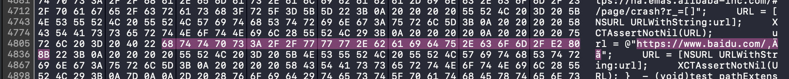

## 关于NSURL


NSURL的URLWithString:方法，对string参数做严格校验，不满足RFC 2396规则的，会返回nil。有时候，url会意外拼接不可见的字符，也会导致返回nil。


举个例子，一个包含不可见字符的url，如下

```text
https://www.baidu.com/​
```

​       上面在不同的编辑器中，不可见的字符表现不一样，有的不显示，有的会显示一个红色圆点（例如Typora）。即使在Xcode中打印这个字符串，也很难察觉不可见的字符。

​       在浏览器（Chrome、Safari）中打开上面链接，不可见字符也算作url一部分，导致链接打开不是预期的页面。


> 示例代码，见test_NSURL方法


Xcode可以使用十六进制查看，选择文件，右键菜单，Open As -> Hex。如下




