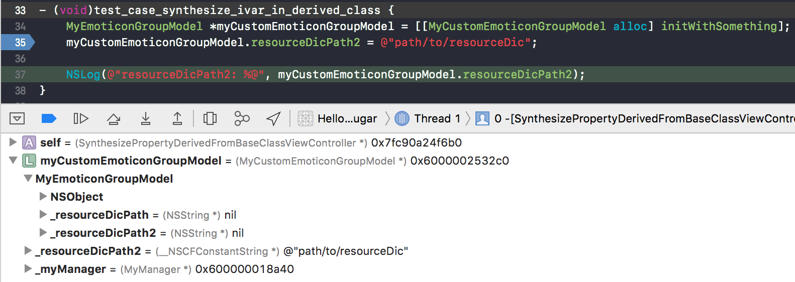

# HelloSyntaxSugar

[TOC]


## 1、char字面常量，存放多个字符

char字面常量，存放多个字符。例如'abc'、'abcd'、'abcde'等。

根据[SO](https://stackoverflow.com/questions/6944730/multiple-characters-in-a-character-constant)上面的说法，这种情况根据系统和编译器，情况会不一样。

在MacOS用Xcode编译，得出如下规则：

总是从后到前取最后4个字节的数据，如果不满足4个字节，填充0x00。

举个例子

```c
unsigned value;
char* ptr = (char*)&value;

value = 'ABCD';
printf("'ABCD' = %02x%02x%02x%02x = %08x\n", ptr[0], ptr[1], ptr[2], ptr[3], value);
    
value = 'ABC';
printf("'ABC'  = %02x%02x%02x%02x = %08x\n", ptr[0], ptr[1], ptr[2], ptr[3], value);
```

输出是

'ABCD' = 44434241 = 41424344    
'ABC'  = 43424100 = 00414243

由于是little endian，低地址的字节放在word（4个字节）的低位。


## 2、C++ 11支持Raw String

C++ 11支持Raw String，在.mm文件中可以使用R"\<LANG\>(raw string)\<LANG\>"语法，用于直接写非转义的C字符串。如下

```objective-c
static NSString *jsonString = @R"JSON(
{
    "glossary": {
        "title": "example glossary",
        "GlossDiv": {
            "title": "S",
            "GlossList": {
                "GlossEntry": {
                    "ID": "SGML",
                    "SortAs": "SGML",
                    "GlossTerm": "Standard Generalized Markup Language",
                    "Acronym": "SGML",
                    "Abbrev": "ISO 8879:1986",
                    "GlossDef": {
                        "para": "A meta-markup language, used to create markup languages such as DocBook.",
                        "GlossSeeAlso": ["GML", "XML"]
                    },
                    "GlossSee": "markup"
                }
            }
        }
    }
}
)JSON";
```

上面的@符号将C字符串转成NSString类型。


## 3、表示NaN

math.h头文件提供NaN（Not A Number），有时候需要这种特殊值来占位或者其他用途。

#### （1）NaN值的表示

使用NAN宏或者nan(NULL)返回一个NaN值

#### （2）判断是否NaN

NaN相关函数

```c
extern float nanf(const char *);
extern double nan(const char *);
extern long double nanl(const char *);
```

或者直接使用isnan(x)宏

#### （3）打印NaN值

NaN值的字符串输出总是nan。系统函数一般都处理过，然后输出成nan。

```objective-c
double maybeNumber = nan(NULL);
    
NSLog(@"%f", maybeNumber); // nan

CGRect rect = CGRectMake(maybeNumber, maybeNumber, maybeNumber, maybeNumber);
NSLog(@"%@", NSStringFromCGRect(rect)); // {{nan, nan}, {nan, nan}}
```
>
参考资料：https://stackoverflow.com/questions/9402348/how-to-return-a-nil-cgfloat


## 4、延迟释放对象

ibireme的[这篇文章](https://blog.ibireme.com/2015/11/12/smooth_user_interfaces_for_ios/)提到一种简便的延迟释放对象的方法，举个例子，如下。详见`DelayReleaseObjectViewController`

```objective-c
- (void)dealloc {
    MyObject *tempObject = _myObject;
    _myObject = nil;
    NSLog(@"start to dealloc");
    dispatch_after(dispatch_time(DISPATCH_TIME_NOW, (int64_t)(3 * NSEC_PER_SEC)), dispatch_get_main_queue(), ^{
        // Note: use it to avoid warning
        [tempObject class];
    });
}
```

文章也提到，如果对象可以在后台线程释放，可以放在非主线程去释放这个对象，这样可以减少主线程的开销。


## 5、手动synthesize @property

#### （1）同时实现setter和getter方法，需要手动synthesize @property

​         一般来说，定义@property会自动synthesize setter和getter方法，同时定义一个名为`_property`的实例变量。手动实现setter或getter方法，这个`_property`实例变量也是自动合成的。

​        但是手动同时实现setter和getter方法，编译器不再自动合成`_property`实例变量，当用到`_property`实例变量会在编译时报错。

举个例子，如下

```objective-c
@interface SynthesizePropertyViewController ()
@property (nonatomic, copy) NSString *propertyWithBothCustomSetterAndGetter;
@end

#pragma mark - Both Setter and Getter

- (void)setPropertyWithBothCustomSetterAndGetter:(NSString *)propertyWithBothCustomSetterAndGetter {
    // Compile Error: Use of undeclared identifier '_propertyWithBothCustomSetterAndGetter'; did you mean 'propertyWithBothCustomSetterAndGetter'?
    _propertyWithBothCustomSetterAndGetter = propertyWithBothCustomSetterAndGetter;
}

- (NSString *)propertyWithBothCustomSetterAndGetter {
    // Compile Error: Use of undeclared identifier '_propertyWithBothCustomSetterAndGetter'
    return _propertyWithBothCustomSetterAndGetter;
}
```

解决方法：这种情况需要手动合成`_property`实例变量，如下

```objective-c
@synthesize propertyWithBothCustomSetterAndGetter = _propertyWithBothCustomSetterAndGetter;
```


#### （2）子类和父类不共用一个实例变量，需要手动synthesize @property

​        一般来说，父类定义@property后，自动合成的实例变量，继承父类的子类不能直接使用`_ivar`方式访问，但是可以通过`super`关键字来访问。但需要注意的是，子类重写了setter或getter方法，需要调用对应的super方法。

​      举个错误的例子，如下

```objective-c
- (void)setResourceDicPath:(NSString *)resourceDicPath {
    // WARNING: missing call [super setXXX:]
    self.myManager.directoryPath = resourceDicPath;
}
```

这里父类的_resourceDicPath没有被赋值。有两种方法可以解决这个问题。

方法一：调用super方法

方法二：在子类中手动合成实例变量，让子类和父类不共用一个实例变量。调试检查如下



可以看出子类和父类有各自的_resourceDicPath2实例变量。


## 6、\_\_attribute\_\_ ((\_\_cleanup\_\_(\<callback\>)))的用法


示例代码见**GCCAttributeCleanupViewController**


## 7、Objective-C常见关键词

#### （1）@package


#### （2）template

template在Objective-C++是关键词，不能作为参数使用，否则编译器（Xcode 10）会报错。举个例子

```objective-c
- (void)callDelegateOfHookHandleWithTemplate:(TemplateModel *)template data:(DataModel *)data nameSpace:(NSString *)nameSpace { // error: expected identifier; 'template' is a keyword in Objective-C++
}
```


## 8、分析selector

在objc.h头文件中，SEL被定义为结构体指针。注释上说SEL是opaque类型，即对外不透明的。

```objective-c
/// An opaque type that represents a method selector.
typedef struct objc_selector *SEL;
```

查看objc-sel.mm的[sel_getName函数源码](https://github.com/opensource-apple/objc4/blob/master/runtime/objc-sel.mm#L118)，可以看出SEL指向的实际是C字符串。

```objective-c
const char *sel_getName(SEL sel) 
{
    if (!sel) return "<null selector>";
    return (const char *)(const void*)sel;
}
```

如果强制将SEL类型转成char *，则Xcode会给出一个warning，如下

```objective-c
string = (char *)selector; // Cast of type 'SEL' to 'char *' is deprecated; use sel_getName instead
XCTAssertTrue(strcmp("compare:", string) == 0);
```


解决方法1：参考warning提示，使用sel_getName函数获取C字符串，注意返回值类型是const char *

解决方法2：参考源码的方式，两次类型转换，可以消除warning（Xcode 10.2），如下

```objective-c
string = (const char *)(const void*)selector; // Note: no warning here
XCTAssertTrue(strcmp("compare:", string) == 0);
```


## References

[1]: https://stackoverflow.com/questions/34574933/a-good-and-idiomatic-way-to-use-gcc-and-clang-attribute-cleanup-and-point
[ 2 ]: http://echorand.me/site/notes/articles/c_cleanup/cleanup_attribute_c.html

