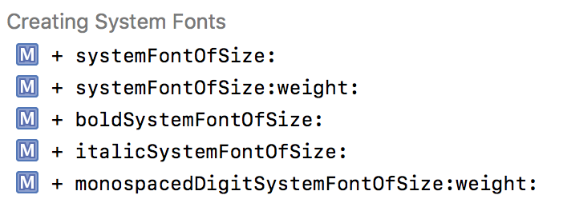
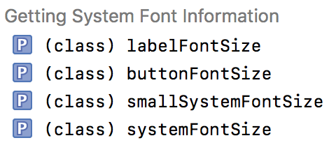

# iOS Font

[TOC]


## 1、字体名规则

​       每个字体所属一个font family，font family类似一个字体系列，然后在系列下面有具体的字体名（font name）。UIFont提供`+[UIFont familyNames]`方法用于查询系统支持的所有font family，然后通过`+[UIFont fontNamesForFamilyName:]`方法获取某个字体系列下面的字体名。

​      每个字体名有特定的规则，一般是`familyName-style`或者直接是`familyName`。

以Georgia为例，Georgia是font family，而它下面的有4种字体名，分别是

```
Georgia
Georgia-Bold
Georgia-BoldItalic
Georgia-Italic
```


示例代码，见GetAllFontNamesViewController。


需要注意下面几点：

* 不是每个字体系列下面，都有字体名，例如`Bangla Sangam MN`下面没有字体名（环境：iOS Simulator 11.4）
* 系统字体系列是San Francisco (SF)[^1]，但不在`+[UIFont familyNames]`方法中。通过下面几种方法可以获取系统字体。（Apple官方提供San Francisco下载地址，点[这里](https://developer.apple.com/fonts/ )）



* UIFont提供实例方法，`-[UIFont familyName]`和`-[UIFont fontName]`来查询每个字体对象所属的字体系列和字体名

* UIFont提供特定的方法，查询某些控件的字体大小，如下



* `+[UIFont fontWithName:size:]`的name参数传入nil，得到不是系统字体，而是Helvetica字体。

```shell
(lldb) po [UIFont fontWithName:nil size:18]
<UICTFont: 0x7fda85a26090> font-family: "Helvetica"; font-weight: normal; font-style: normal; font-size: 18.00pt
```


## 2、使用Icon Font

### （1）Icon Font介绍

​       Icon Font类似Apple Emoji，比如Unicode编码为@"\U0001F604"，打印文字为😄。而Icon Font类似这样的用法，每个Icon Font图标对应有一个Unicode编码，这个编码是在字体文件中（例如ttf文件）。当这个字体文件加载到系统中，就可以通过`[UIFont fontWithName:fontName size:fontSize]`来获取对应的字体。如果渲染的文本中使用到该字体中存在的Unicode编码，则该Unicode编码会被渲染成对应的图标。


> 1. 可以通过[这个表](https://unicode.org/emoji/charts/full-emoji-list.html)，查询到Apple支持的Emoji的Unicode编码
> 2. 可以用[这个网站](https://char-map.herokuapp.com/)来解析字体文件中的图标信息


### （2）加载自定义Font

加载自定义Font有两种方式：

* 在Info.plist注册字体文件。设置以main bunlde为相对路径的文件路径，可以有多个字体文件。
* 运行时注册字体文件

> 运行时注册字体文件，主要用CoreText的CTFontManagerRegisterGraphicsFont方法。示例代码，见WCIconFontTool


### （3）渲染Icon Font


#### a. UILabel使用Icon Font

将UILabel设置自定义Font以及文本包含特定Unicode，系统就渲染出icon图标

```objective-c
UILabel *label = [[UILabel alloc] initWithFrame:CGRectMake(0, CGRectGetMaxY(_labelUseFontResigteredInfoPlist.frame), screenSize.width, 60)];
label.font = [WCIconFontTool fontWithName:@"icofont" fontSize:20];
label.text = @"Display a \U0000EEA0, \uEEA0 on label \U0000C03A";
```


#### b. UIImageView使用Icon Font

基本原理就是UILabel使用icon font，然后把UILabel内容创建成UIImage对象，最后提供给UIImageView[^2]


#### c. UIButton使用Icon Font

和UILabel使用Icon Font类似


## 3、Bold Text

​        iOS 8+的系统设置支持粗体字体，即在Settings > General > Bold Text可以选择设置粗体字体。在iOS 14设置该开关不会重新系统，而在iOS 11.4上会重新系统。

iOS 8+提供下面的API可以查询该开关的状态[^3]，如下

```objective-c
BOOL UIAccessibilityIsBoldTextEnabled(void);
```

如果是设置粗体字体为YES，则下面某些系统API会自动返回粗体版本的字体，列举如下

```objective-c
+ (UIFont *)systemFontOfSize:(CGFloat)fontSize;
+ (UIFont *)systemFontOfSize:(CGFloat)fontSize weight:(UIFontWeight)weight API_AVAILABLE(ios(8.2));
```

> 如果是自定义字体名称的字体，则不受该开关控制。例如`[UIFont fontWithName:@"ArialMT" size:14]`。

iOS 8+也提供一个通知，用于通知该开关的变化，如下

```objective-c
const NSNotificationName UIAccessibilityBoldTextStatusDidChangeNotification;
```

> 该通知不带任何信息，所以收到通知后，需要再次用UIAccessibilityIsBoldTextEnabled函数查询开关状态


## 附录

### 1、各个iOS系统版本支持的字体

http://iosfonts.com/


### 2、免费获取IconFont图标

https://icofont.com/icons


## Reference

[^1]: https://developer.apple.com/design/human-interface-guidelines/ios/visual-design/typography/

[^2]:https://medium.com/@ankoma22/working-with-icon-fonts-in-ios-code-example-in-swift-3-561d47ae9d40

[^3]:https://stackoverflow.com/questions/23329238/possible-to-detect-bold-text-setting-in-settings-accessibility


