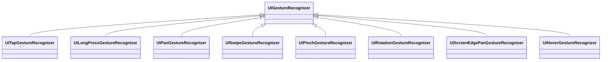
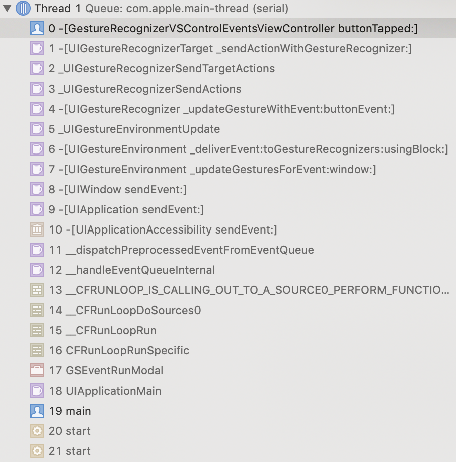
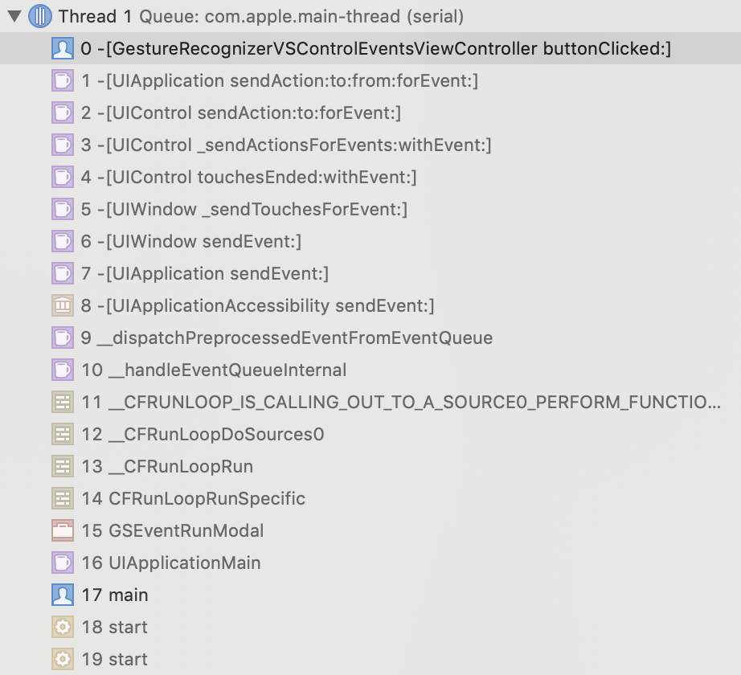

# UIGestureRecognizer

[TOC]

## 1、介绍UIGestureRecognizer




| UIGestureRecognizer子类          | 特有属性和方法                                               | 说明      |
| -------------------------------- | ------------------------------------------------------------ | --------- |
| UITapGestureRecognizer           | @numberOfTapsRequired (default: 1)<br/>@numberOfTouchesRequired (default: 1)<br/>@buttonMaskRequire (iOS 13.4) |           |
| UILongPressGestureRecognizer     | @minimumPressDuration (default: 0.5)<br/>@numberOfTouchesRequired (default: 1)<br/>@numberOfTapsRequired (default: 0)<br/>@allowableMovement (default: 10) |           |
| UIPanGestureRecognizer           | @maximumNumberOfTouches (default: NSUIntegerMax)<br/>@minimumNumberOfTouches (default: 1)<br/>@allowedScrollTypesMask (iOS 13.4)<br/>-translationInView:<br/>-setTranslation:inView:<br/>-velocityInView: |           |
| UISwipeGestureRecognizer         | @direction (default: UISwipeGestureRecognizerDirectionRight)<br/>@numberOfTouchesRequired (default: 1) |           |
| UIPinchGestureRecognizer         | @scale<br/>@velocity                                         |           |
| UIRotationGestureRecognizer      | @rotation<br/>@velocity                                      |           |
| UIScreenEdgePanGestureRecognizer | @edges (iOS 7)                                               |           |
| UIHoverGestureRecognizer         |                                                              | iOS 13.0+ |


### （1）UITapGestureRecognizer


### （2）UILongPressGestureRecognizer

#### a. allowableMovement属性

allowableMovement允许长按移动的最大距离（默认是10dp）。如果长按同时移动超过10dp，则长按手势识别失败。


### （3）UIPanGestureRecognizer

#### a. translationInView:方法

​       translationInView:方法获取View移动时的偏移量translation，当手势识别成功时，偏移量为(0, 0)；当手势移动时，偏移量translation总是相对于手势识别时的差值。

注意：translation不是两次UIGestureRecognizerStateChanged之间的差值。

>  They are not delta values from the last time that the translation was reported.


#### b. UIPanGestureRecognizer常用用法

##### 移动UIView

一般移动UIView，有两种方式:

* 第一种方式，不重置translation

```objective-c
- (void)viewPanned:(UIPanGestureRecognizer *)recognizer {
    UIView *targetView = recognizer.view;
    if (recognizer.state == UIGestureRecognizerStateBegan) {
        self.center = targetView.center;
    }
    else if (recognizer.state == UIGestureRecognizerStateEnded) {
        self.center = targetView.center;
    }
    else if (recognizer.state == UIGestureRecognizerStateChanged) {
        CGPoint translation = [recognizer translationInView:targetView];
        targetView.center = CGPointMake(self.center.x + translation.x, self.center.y + translation.y);
    }
}
```

* 第一种方式，重置translation

```objective-c
- (void)viewPanned:(UIPanGestureRecognizer *)recognizer {
    // @see https://stackoverflow.com/questions/25503537/swift-uigesturerecogniser-follow-finger
    UIView *targetView = recognizer.view;
    if (recognizer.state == UIGestureRecognizerStateBegan || recognizer.state == UIGestureRecognizerStateChanged) {
        CGPoint translation = [recognizer translationInView:self.view];
        targetView.center = CGPointMake(targetView.center.x + translation.x, targetView.center.y + translation.y);
        // Note: reset translation when every UIGestureRecognizerStateChanged detected, so translation is always calculated based on CGPointZero
        [recognizer setTranslation:CGPointZero inView:self.view];
    }
}
```


## 2、UIGestureRecognizer vs. UIControlEvents

UIGestureRecognizer和UIControlEvents都可以用于处理某个控件的事件响应，但是两者有一定区别。

简单分析如下

| 区分点                   | UIGestureRecognizer                                          | UIControlEvents                                              | 说明                                                         |
| ------------------------ | ------------------------------------------------------------ | ------------------------------------------------------------ | ------------------------------------------------------------ |
| 产生事件的对象不同       | UIView对象的事件                                             | UIControl对象的事件                                          | UIControl继承自UIView                                        |
| 事件回调的优先级         | 高                                                           | 低                                                           | 同一个控件的UIGestureRecognizer回调方法早于UIControlEvents事件回调方法 |
| 是否经过touchesEnded方法 | UIGestureRecognizer内部判断是否是该手势并直接触发对应的回调方法 | UIControl在touchesEnded方法中判断事件类型并触发对应的回调方法 |                                                              |


UIGestureRecognizer的回调方法，调用栈如下




UIControlEvents事件的回调方法，调用栈如下



示例代码见**GestureRecognizerVSControlEventsViewController**


## 3、UIGestureRecognizer常用属性分析

### （1）cancelsTouchesInView

`cancelsTouchesInView`属性默认值是YES。官方文档释义，如下

* 设置YES并手势被识别，pending中的touch事件不再发送给UIView，并且发送`touchesCancelled:withEvent:`消息给UIView。

* 设置NO或者手势不识别时，touch事件都会发送给UIView


> 这里touch事件指的是UIView的四个touch方法，touchesBegan/touchesMoved/touchesEnded/touchesCancalled


举个UIControl控件的例子

​       UIButton有UIControlEventTouchUpInside事件，如果再添加一个UITapGestureRecognizer，由于UITapGestureRecognizer优先级高于UIControlEventTouchUpInside，并且`cancelsTouchesInView`默认为YES，则UIControlEventTouchUpInside事件的回调方法不触发，只触发UITapGestureRecognizer的回调方法。

​       如果将`cancelsTouchesInView`设置为NO，则UIControlEventTouchUpInside事件的回调方法和UITapGestureRecognizer的回调方法都触发，但还是先触发后者的回调方法。

> 示例代码见**GestureRecognizerVSControlEventsViewController**


举个自定义UIView的例子

当`cancelsTouchesInView`为YES，手势识别成功后，自定义UIView的touchesCancelled:withEvent:会被调用

当`cancelsTouchesInView`为NO，手势识别成功后，自定义UIView的touchesEnd:withEvent:会被调用

> 示例代码见**UseCancelsTouchesInView1ViewController**


举个非UIControl控件的例子

​         UICollectionView不是继承自UIControl，但是collectionView:didSelectItemAtIndexPath:方法触发是通过touchesEnd:withEvent:（可以看调用栈）。当前UICollectionView自身或者父视图添加了UITapGestureRecognizer，如果`cancelsTouchesInView`设置为YES，则collectionView:didSelectItemAtIndexPath:方法不会被触发。如果`cancelsTouchesInView`设置为NO，则先触发手势回调方法，再触发collectionView:didSelectItemAtIndexPath:方法。

> 示例代码见**UseCancelsTouchesInView2ViewController**


注意

> 1. 如果需要UICollectionView能响应点击，而它的父视图，除UICollectionView之外的区域也能响应点击，而且两者是独立，不同时触发，就不要采用父视图添加手势的方法。尽管可以使用手势的delegate方法来判断要不是手势响应，但不是最佳实践方法。最佳实践是，和响应点击的front视图的平级后面添加一个backend视图，在这个视图添加手势或UIButton。
> 2. 尽管UICollectionView内部也有手势，但是没有UITapGestureRecognizer手势。


## 4、UIGestureRecognizerDelegate


```objective-c

- (BOOL)gestureRecognizerShouldBegin:(UIGestureRecognizer *)gestureRecognizer;

- (BOOL)gestureRecognizer:(UIGestureRecognizer *)gestureRecognizer shouldReceiveTouch:(UITouch *)touch;

- (BOOL)gestureRecognizer:(UIGestureRecognizer *)gestureRecognizer shouldRecognizeSimultaneouslyWithGestureRecognizer:(UIGestureRecognizer *)otherGestureRecognizer;
```


## 5、常见手势处理问题

### （1）parent view监听child view的tap gesture事件

#### 需求

parent view通过addSudview添加多个child view，需要在parent view统一监听child view的UITapGestureRecognizer点击事件，即child view手势触发方法时，都通知到parent view上。


#### 解决方案

​      parent view添加UITapGesture，一般情况下，点击child view，触发child view的回调；点击parent view，触发parent view的回调。这样，parent view感知不到child view的点击事件。

​      有三种方式，可以让parent view知道child view的点击事件。

##### a. 实现gestureRecognizerShouldBegin:方法

parent view的手势，注册delegate，实现gestureRecognizerShouldBegin:方法并返回NO，gestureRecognizerShouldBegin:方法中可以知道child view点击事件，但是不能区分哪个child view点击

注意

> parent view只是监听点击事件，不响应事件，gestureRecognizerShouldBegin:方法就一定要返回NO


> 示例代码，见ParentViewObserveChildViewTapEventViewController


##### b. parent view实现touchBegin/.../touchEnd方法

parent view实现touchBegin/.../touchEnd方法，自己判断touchUpInside事件


##### c. child view创建mirroring手势

child view创建额外的相同的点击手势，mirroring手势的gestureRecognizer:shouldRecognizeSimultaneouslyWithGestureRecognizer:方法返回YES（默认是NO），这样child view点击事件会触发两个tap手势。

```objective-c
- (BOOL)gestureRecognizer:(UIGestureRecognizer *)gestureRecognizer shouldRecognizeSimultaneouslyWithGestureRecognizer:(UIGestureRecognizer *)otherGestureRecognizer {
    return YES;
}
```

完成上面的设置后，存在一个问题：当parent view也添加mirroring手势，点击child view也会触发parent view的mirroring手势回调。只需要当前view的original gesture触发时，同步触发mirroring gesture。如下图。

|                 | child view original gesture | child view mirroring gesture | parent view original gesture | parent view mirroring gesture |
| --------------- | --------------------------- | ---------------------------- | ---------------------------- | ----------------------------- |
| child view点击  | 触发                        | 触发                         | 不触发                       | 不触发                        |
| parent view点击 | 不触发                      | 不触发                       | 触发                         | 触发                          |


mirroring手势的gestureRecognizer:shouldReceiveTouch:方法实现[^1]，如下

```objective-c
@interface WCMirroringTapGestureRecognizer () <UIGestureRecognizerDelegate>
@end
@implementation WCMirroringTapGestureRecognizer
- (BOOL)gestureRecognizer:(UIGestureRecognizer *)gestureRecognizer shouldReceiveTouch:(UITouch *)touch {
    // Note: accept only touchs on view which attached current tap gesture, not accept touchs on its subviews
    if (touch.view != self.view) {
        return NO;
    }
    
    return YES;
}
@end
```

用于控制仅点击touch view是手势注册的view时才接受手势响应。这样即使点击child view，在parent view的mirroring手势gestureRecognizer:shouldReceiveTouch:方法中，可以判断当前点击的view是不是mirroring手势注册的view。

> 示例代码，见MirrorTapGestureViewController


## 6、WCPannedView


## References

[^1]:https://stackoverflow.com/questions/15457205/exclude-subviews-from-uigesturerecognizer


