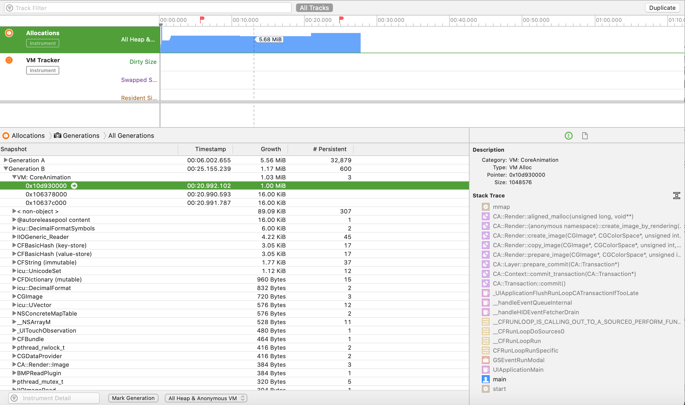
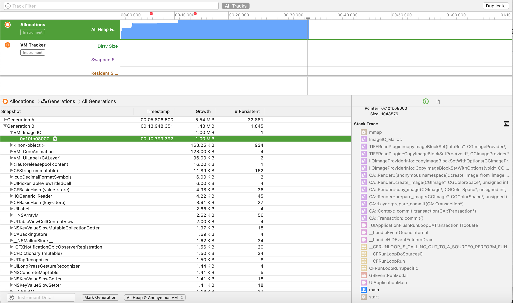
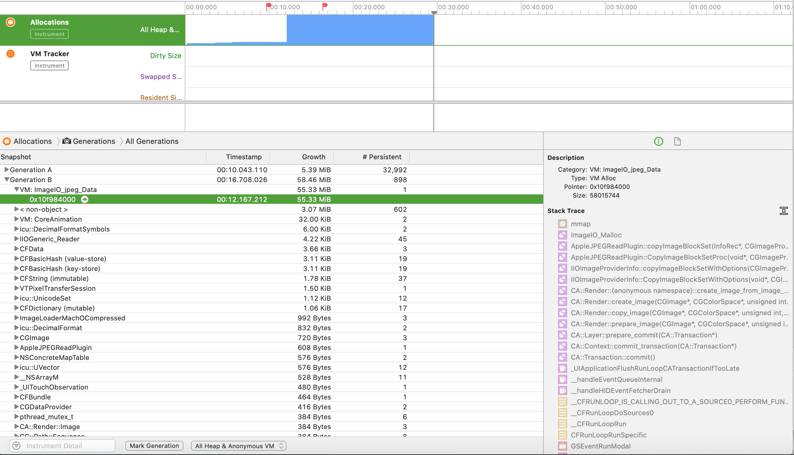
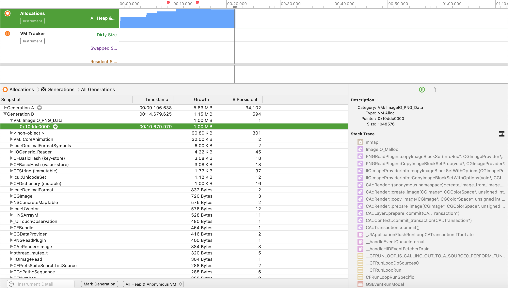
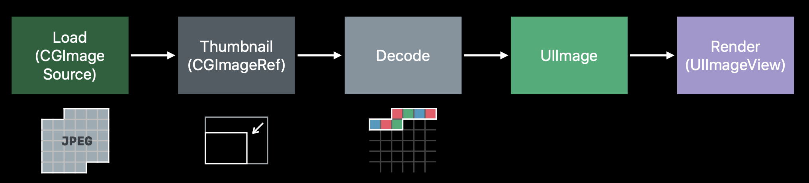

# iOS Drawing

[TOC]


## 1、几种绘图方式

iOS中有几种方式可以绘图，UIKit、CoreGraphics（Quartz 2D）、OpenGL ES，其中

* UIKit提供一套绘图函数[^1]，e.g. `UIGraphicsBeginImageContextWithOptions`。这些UI开头函数可以看成是对CoreGraphics函数的便利封装，可以和CG开头的函数混合使用。


## 2、UIKit绘图

### （1）创建绘图环境

创建一个绘图环境，可以用UIKit提供的`UIGraphicsBeginImageContextWithOptions`或`UIGraphicsBeginImageContext`函数。函数原型分别是

```objective-c
void UIGraphicsBeginImageContextWithOptions(CGSize size, BOOL opaque, CGFloat scale);
void UIGraphicsBeginImageContext(CGSize size);
```

上面的函数，实际上，在创建一个画布对象并将它放在栈上。

`UIGraphicsBeginImageContextWithOptions`和`UIGraphicsBeginImageContext`函数的区别，如下

* `UIGraphicsBeginImageContext`，创建的画布分辨率总是1，UIGraphicsGetImageFromCurrentImageContext取出的image的scale也总是1。而且当rect指定size小于1 point，生成的image总是{1,1}

* `UIGraphicsBeginImageContextWithOptions`，创建的画布分辨率可以指定分辨率，如果指定0.0f，则采用设备的分辨率，这样UIGraphicsGetImageFromCurrentImageContext取出image的scale和设备分辨率保持一致，而且image的size可以设置小于1 point，但不能低于1 px。


注意：用`UIGraphicsBeginImageContextWithOptions`或`UIGraphicsBeginImageContext`函数创建绘图环境后，需要用`UIGraphicsEndImageContext`函数做清理。（参考UIGraphicsBeginImageContextWithOptions的文档）


### （2）显示1px高度的UImage

​        使用CoreGraphics画图时，不同分辨率scale的画布，对应1px高度是不一样的。例如scale=1（@1x），则对应高度是1pt；scale=2（@2x）对应的高度是1.0/2pt；scale=3（@3x）对应的高度是1.0/3pt。当高度小于这个值，UIGraphicsGetImageFromCurrentImageContext方法，总是返回1.0/scale pt = （1px）高度的UIImage。

```objective-c
+ (UIImage *)imageWithColor:(UIColor *)color {
    // Note: change size {1, 0.5f} to test
    CGRect rect = CGRectMake(0, 0, 1, 0.5f);
    // Note: use UIGraphicsBeginImageContextWithOptions instead of UIGraphicsBeginImageContext
    // @see https://stackoverflow.com/questions/4965036/uigraphicsgetimagefromcurrentimagecontext-retina-resolution
    UIGraphicsBeginImageContextWithOptions(rect.size, NO, 0.0f);
    CGContextRef context = UIGraphicsGetCurrentContext();
    
    CGContextSetFillColorWithColor(context, [color CGColor]);
    CGContextFillRect(context, rect);
    
    UIImage *newImage = UIGraphicsGetImageFromCurrentImageContext();
    UIGraphicsEndImageContext();
    
    return newImage;
}
```


## 3、UIImage常见问题

### （1）+[UIImage imageWithContentsOfFile:]方法懒加载图片文件

​        `+[UIImage imageWithContentsOfFile:]`方法在调用时并不直接读文件，而是在渲染时才读取文件。如果在渲染之前删除UIImage对应的图片，则渲染失败显示一块黑色。

示例代码，如下

```objective-c
NSData *data;

NSString *newFilePath = [[self.class appDocumentsDirectory] stringByAppendingPathComponent:@"test.png"];
NSString *filePath = [[NSBundle mainBundle] pathForResource:@"fake" ofType:@"png"];
[[NSFileManager defaultManager] copyItemAtPath:filePath toPath:newFilePath error:nil];

if ([[NSFileManager defaultManager] fileExistsAtPath:newFilePath]) {
    UIImage *image = [UIImage imageWithContentsOfFile:newFilePath]; // ISSUE: the image file maybe delete afterward
    data = UIImagePNGRepresentation(image);
    XCTAssertNotNil(data);

    [[NSFileManager defaultManager] removeItemAtPath:newFilePath error:nil];

    XCTAssertNotNil(image);
    data = UIImagePNGRepresentation(image);
    XCTAssertNil(data);
}
```

解决方法：`+[NSData dataWithContentsOfFile:]`方法提前将图片读取到内存。代码见**Tests_UIImage.m**


### （2）计算UIImage所持有图片的内存大小

​        UIImage对象封装图片的信息，但是它自身的内存大小并不代表图片在内存的大小。另外，网上有人说使用`UIImageJPEGRepresentation`和`UIImagePNGRepresentation`方法来获取NSData对象来判断UIImage所持有图片的内存，显然这种方法不对，两个方法得出来NSData的length是不一样，因为采用不同图片编码压缩方式，得出来NSData大小就是不一样的。而且这个NSData并不是图片非压缩的大小。图片非压缩的大小，是指图片解码（反解JPEG、PNG等编码方式）展开成像素矩形（width * height），对于RGBA图片，每个像素用4 bytes来描述，因此RGBA图片的内存大小是`width * height * 4` bytes。

​       SO有人[^2]用Instruments的Allocations工具来确定图片的内存大小，自己实践确实可行。先给出几个实践后结论：

* 避免使用`imageNamed:`等系列方法，使用这个方法，系统有缓存，每次测试图片内存大小得每次杀掉app，比较麻烦。改用`[UIImage imageWithContentsOfFile:]`方法。

* 图片仅在UIImageView在屏幕上渲染，才会触发图片加载到内存（同“+[UIImage imageWithContentsOfFile:]方法懒加载图片文件”一节）。
* 图片类型不同，系统加载图片的代码调用栈也不同，Allocations工具的Generations统计的分类显示也不同。举几个例子，如下

| 图片类型      | Category统计          | 示例                                            |
| ------------- | --------------------- | ----------------------------------------------- |
| Grayscale图片 | VM: CoreAnimation     |      |
| TIFF图片      | VM: Image IO          |           |
| JPEG图片      | VM: ImageIO_jpeg_Data |  |
| PNG图片       | VM: ImageIO_PNG_Data  |            |


计算图片在内存大小，示例代码[^3]如下

```objective-c
+ (NSUInteger)memoryBytesWithImage:(UIImage *)image {
    if (![image isKindOfClass:[UIImage class]]) {
        return 0;
    }
    
    NSUInteger bytes = 0;
    CGColorSpaceRef colorSpace = CGImageGetColorSpace(image.CGImage);
    CGColorSpaceModel model = CGColorSpaceGetModel(colorSpace);

    if (model == kCGColorSpaceModelMonochrome) {
        bytes = CGImageGetHeight(image.CGImage) * CGImageGetBytesPerRow(image.CGImage);
    }
    else {
        NSUInteger height = (NSUInteger)ceil(image.size.height) * image.scale;
        NSUInteger width = (NSUInteger)ceil(image.size.width) * image.scale;
        
        NSUInteger bytesPerRow = 4 * width;
        if (bytesPerRow % 16)
            bytesPerRow = ((bytesPerRow / 16) + 1) * 16;
        bytes = height * bytesPerRow;
    }

    return bytes;
}
```


* 灰度图片，使用CGImageGetHeight和CGImageGetBytesPerRow方法来计算
* 其他图片，使用RGBA的计算方式。值得注意的是，image的尺寸是dp，需要转成px来获取图片在内存中实际的尺寸


> 示例代码，见CheckImageMemorySizeViewController


### （3）+[UIImage imageWithContentsOfFile:]方法的获取图片不对的问题

​        当同时存在xxx.png和xxx@2x.png时，使用imageWithContentsOfFile:方法，指定路径到xxx.png，该方法读取出的图片对象UIImage，居然是xxx@2x.png。

示例代码，如下

```objective-c
- (void)test_imageWithContentsOfFile_issue_load_wrong_image {
    NSString *filePath;
    UIImage *image;
    
    // Case 1
    NSString *filename = @"fake.png";
    filePath = [[NSBundle mainBundle] pathForResource:[filename stringByDeletingPathExtension] ofType:[filename pathExtension]];
    image = [UIImage imageWithContentsOfFile:filePath];
    
    NSLog(@"filePath1: %@", filePath);
    NSLog(@"image1: %@", image);
    
    // Case 2
    filePath = [[[NSBundle mainBundle] bundlePath] stringByAppendingPathComponent:@"fake.png"];
    UIImage *image2 = [UIImage imageWithContentsOfFile:filePath];
    
    NSLog(@"filePath2: %@", filePath);
    NSLog(@"image2: %@", image2);
}
```

推测imageWithContentsOfFile:方法内部优先使用当前设备scale对应的同名图片。可以删掉xxx@2x.png图片，仅保留xxx.png，发现imageWithContentsOfFile:方法可以获取到正确的图片。


> 示例代码，见test_imageWithContentsOfFile_issue_load_wrong_image


## 4、Image I/O

​       Image I/O是系统提供处理图片文件的库 (ImageIO.framework)，主要负责大多数图片的读写以及元属性(metadata)访问，还有管理颜色。

官方文档，对Image I/O描述，如下

> The Image I/O programming interface framework allows applications to read and write most image file formats. This framework offers high efficiency, color management, and access to image metadata.


Image I/O主要提供两个Opaque类型以及对应的API

* CGImageSource，用于读取图片文件的模型
* CGImageDestination，用于写图片文件的模型


### （1）CGImageSource

#### a. 创建CGImageSource

​       CGImageSource类型（CGImageSourceRef），可以理解为一个图片容器，里面封装了图片 (images)、缩略图 (thumbnails)、图片属性 (properties)等其他信息。

说明

> CGImageSource对象并不是图像的模型，CGImage对象才代表图片中的一帧图像，因此CGImageSource对象包含多帧图像（例如GIF、PDF等），以及对应的缩略图和属性。


创建CGImageSource可以来自URL、CFData和Data Provider，如下面三个API

```c
// 指定图片URL创建
CGImageSourceRef CGImageSourceCreateWithURL(CFURLRef url, CFDictionaryRef options);
// 根据Data创建
CGImageSourceRef CGImageSourceCreateWithData(CFDataRef data, CFDictionaryRef options);
// 根据Data Provider创建
CGImageSourceRef CGImageSourceCreateWithDataProvider(CGDataProviderRef provider, CFDictionaryRef options);
```

除了上面使用数据来源创建CGImageSource，还可以创建一个空白的CGImageSource，如下

```c
// 创建空白的图片容器，后续CGImageSourceUpdateDataProvider或CGImageSourceUpdateData添加图片数据
CGImageSourceRef CGImageSourceCreateIncremental(CFDictionaryRef options);
```

说明

> 创建CGImageSource对象并不意味着图片数据已经加装到内存中，例如使用URL方式创建CGImageSource


#### b. 创建CGImage

CGImage对象代表图片中的图像，CGImageSource有2个API可以创建CGImage对象，如下

```c
// 在指定帧创建图像
CGImageRef CGImageSourceCreateImageAtIndex(CGImageSourceRef isrc, size_t index, CFDictionaryRef options);
// 在指定帧创建缩略图
CGImageRef CGImageSourceCreateThumbnailAtIndex(CGImageSourceRef isrc, size_t index, CFDictionaryRef options);
```

CGImageSource可以包含多个图像（例如GIF、PDF等），可以通过下面函数，获取多个图像的总数

```c
size_t CGImageSourceGetCount(CGImageSourceRef isrc);
```


#### c. 获取属性(Properties)

CGImageSource有2个API可以CGImageSource或者每帧图像的属性，如下

```c
// 获取CGImageSource的属性
CFDictionaryRef CGImageSourceCopyProperties(CGImageSourceRef isrc, CFDictionaryRef options);
// 获取CGImageSource指定帧的属性
CFDictionaryRef CGImageSourceCopyPropertiesAtIndex(CGImageSourceRef isrc, size_t index, CFDictionaryRef options);
```

上面2个函数返回的词典，该词典的key可以参考[官方文档](https://developer.apple.com/documentation/imageio/cgimageproperties?language=objc)查询


#### d. CGImageSource选项[^4]

CGImageSource相关的API，都有options参数，该词典支持的key，如下

| key                                            | value类型 | 默认值                              | 作用                                                         | 适用函数                        |
| ---------------------------------------------- | --------- | ----------------------------------- | ------------------------------------------------------------ | ------------------------------- |
| kCGImageSourceTypeIdentifierHint               | CFString  | NULL                                | 使用uniform type identifier (UTI)，用于创建CGImageSource时提示图片类型 | CGImageSourceCreateImageAtIndex |
| kCGImageSourceShouldAllowFloat                 | CFBoolean | NO                                  | TODO                                                         | CGImageSourceCreateImageAtIndex |
| kCGImageSourceShouldCache                      | CFBoolean | 32bit系统下是NO，64bit系统系下是YES | 图片解码后是否缓存结果                                       |                                 |
| kCGImageSourceCreateThumbnailFromImageIfAbsent | CFBoolean | NO                                  | TODO                                                         |                                 |
| kCGImageSourceCreateThumbnailFromImageAlways   | CFBoolean | NO                                  | 是否总是创建缩略图，即使CGImageSource对象已经存在缩略图      |                                 |
| kCGImageSourceThumbnailMaxPixelSize            | CFNumber  | NULL                                | 缩略图的width或height的最大值，没有不指定，可能缩略图和原始图片一样大 |                                 |
| kCGImageSourceCreateThumbnailWithTransform     | CFBoolean | NO                                  | TODO                                                         |                                 |

注意

> 上面key并适用每个CGImageSource相关的API，还是需要参考每个API的文档。


#### e. 创建缩略图

当Image的显示区域比实际Image大小要小一些时，没有必要将原始图片Image设置UIImageView上，不然会存在两个问题

* 原始图片Image和UIImageView的width/height比例不一定是一致的，显示可能被压缩或拉伸
* 原始图片Image可能很大，占用很大的内存

针对第一个问题，一般想到的方法，是按照UIImageView的尺寸重新绘制UIImage对象，例如下面代码

```objective-c
+ (UIImage *)OriginImage:(UIImage *)image scaleToSize:(CGSize)size {
    UIGraphicsBeginImageContext(size);         
    [image drawInRect:CGRectMake(0, 0, size.width, size.height)];          
    UIImage *scaledImage = UIGraphicsGetImageFromCurrentImageContext();        
    UIGraphicsEndImageContext();
    return scaledImage; 
}
```

但是这个方法并不能减少原始图片占用内存的大小[^6]，可以采用ImageIO提供的downsampling技术[^5]来直接创建缩略图。

​      downsampling技术，是指读取图片文件后得到Data Buffer，然后根据缩略图大小，进行降级采样(downsample)，然后进行解码生成Image Buffer，提供给UIImage，最后UIImageView显示出来的缩略图是内存消耗比较小的，而且没有解码完整图片，少了完整图片解码后的Image Buffer的内存开销。整个过程，见下图




示意代码，如下

```swift
// Downsampling large images for display at smaller size 
func downsample(imageAt imageURL: URL, to pointSize: CGSize, scale: CGFloat) -> UIImage {  
  let imageSourceOptions = [kCGImageSourceShouldCache: false] as CFDictionary 
 
  let imageSource = CGImageSourceCreateWithURL(imageURL as CFURL, imageSourceOptions)! 
  
  let maxDimensionInPixels = max(pointSize.width, pointSize.height) * scale  
  let downsampleOptions = [kCGImageSourceCreateThumbnailFromImageAlways: true,
  kCGImageSourceShouldCacheImmediately: true, 
  kCGImageSourceCreateThumbnailWithTransform: true,
  kCGImageSourceThumbnailMaxPixelSize: maxDimensionInPixels] as CFDictionary   
  let downsampledImage = CGImageSourceCreateThumbnailAtIndex(imageSource, 0, downsampleOptions)!  
  return UIImage(cgImage: downsampledImage) 
}
```

> 示例代码，见CreateThumbnailImageViewController


### （2）CGImageDestination


## References

[^1]: https://developer.apple.com/documentation/uikit/drawing
[^2]:https://stackoverflow.com/a/29212494
[^3]:https://stackoverflow.com/a/1298043
[^4]:https://developer.apple.com/documentation/imageio/cgimagesource/image_source_option_dictionary_keys?language=objc
[^5]:https://developer.apple.com/videos/play/wwdc2018/219/
[^6]:https://medium.com/@prafullkumar77/image-usage-memory-comparison-and-best-practices-in-ios-wwdc2018-4a8919019ae9

