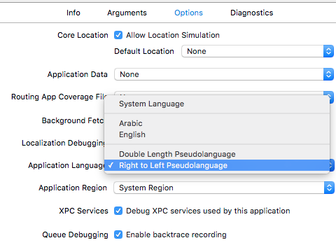

# iOS Label

[TOC]

## 1、对齐方式

iOS中UILabel的对齐方式，有下面几种

```objective-c
/* Values for NSTextAlignment */
typedef NS_ENUM(NSInteger, NSTextAlignment) {
    NSTextAlignmentLeft      = 0,    // Visually left aligned
#if TARGET_OS_IPHONE
    NSTextAlignmentCenter    = 1,    // Visually centered
    NSTextAlignmentRight     = 2,    // Visually right aligned
#else /* !TARGET_OS_IPHONE */
    NSTextAlignmentRight     = 1,    // Visually right aligned
    NSTextAlignmentCenter    = 2,    // Visually centered
#endif
    NSTextAlignmentJustified = 3,    // Fully-justified. The last line in a paragraph is natural-aligned.
    NSTextAlignmentNatural   = 4,    // Indicates the default alignment for script
} NS_ENUM_AVAILABLE_IOS(6_0);
```


* NSTextAlignmentLeft，段落左对齐
* NSTextAlignmentCenter，段落居中
* NSTextAlignmentRight，段落右对齐
* NSTextAlignmentJustified，段落两端对齐，但是最后一行按照自然对齐
  * 如果段落是一行，则采用自然对齐方式

* NSTextAlignmentNatural，段落自然对齐。
  * 段落根据系统语言来决定对齐方式，Left-to-Right语言（例如英文、中文），NSTextAlignmentNatural等价于NSTextAlignmentLeft；Right-to-Left语言（例如阿拉伯语），NSTextAlignmentNatural等价于NSTextAlignmentRight。
  * 在Scheme -> Options -> Application Language设置，选择 `Right-to-Left Pseudolanguage`可以将模拟器的语言换成Right-to-Left语言[^1]，观察NSTextAlignmentNatural的效果。




> 段落是以'\n'来分隔的。


示例代码，见`TextAlignmentViewController`。


2、按照高度自适应字体大小


## References

[^1]: https://useyourloaf.com/blog/natural-text-alignment-for-rtl-languages/