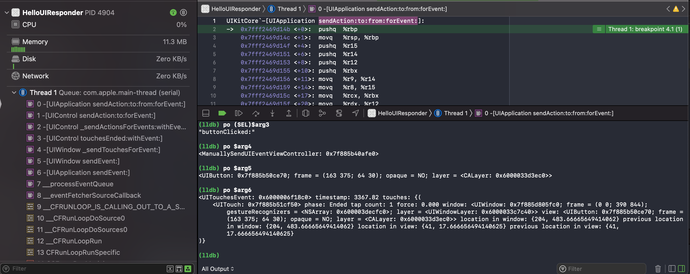

# 关于UIResponder

[TOC]

## 1、Responder Chain

​        响应者链（Responder Chain）是UIKit提供的让App处理各种系统事件（Touch、Motion等）的机制[^3]，其中UIResponder类是处理事件的响应者。由一个串在一起的UIResponder对象构造一条响应者链（Responder Chain），当某个响应者不处理事件，则把事件交个下个响应者处理。响应者链的第一个响应者，则称为第一响应者（First Responder）。


### （1）UIResponder类

​        一般情况下，没有直接使用UIResponder类，而经常使用它的子类，比如UIControl、UIView、UIViewController、UIWindow、UIApplication等。

UIResponder类提供下面一些常见的API提供子类重写，如下

```objective-c
// Touch事件的系列方法
- (void)touchesBegan/Moved/Ended/Cancelled:(NSSet<UITouch *> *)touches withEvent:(UIEvent *)event;
// Motion事件的系列方法
- (void)motionBegan/Ended/Cancelled:(UIEventSubtype)motion withEvent:(UIEvent *)event;
// Press事件的系列方法
- (void)pressesBegan/Changed/Ended/Cancelled:(NSSet<UIPress *> *)presses withEvent:(UIPressesEvent *)event;
// 第一响应者的系列方法
@property(nonatomic, readonly, nullable) UIResponder *nextResponder;
@property(nonatomic, readonly) BOOL isFirstResponder;
@property(nonatomic, readonly) BOOL canBecomeFirstResponder;
- (BOOL)becomeFirstResponder;
@property(nonatomic, readonly) BOOL canResignFirstResponder;
- (BOOL)resignFirstResponder;
```

上面3类系列方法（Touch、Motion、Press），都带有一个UIEvent参数。

这个UIEvent对象是UIKit构造出来，并分发到对应的UIResponder对象上的。一般来说，首先会发给First Responder，然后通过Responder Chain传递到下一个Responder，直至有Responder能处理，并不再传递（通过不调用super方法，这样将传递结束掉）。


这篇文章[^3]描述了Touch事件和非Touch事件的处理过程，如下

> When a system event like a screen touched is detected, UIKit internally creates `UIEvent` instances and dispatches it to the system event queue by calling `UIApplication.shared.sendEvent()`. When the event is retrieved from the queue, UIKit internally determines the first `UIResponder` capable of handling the event and sends it to the selected one. The selection process differs depending on the event type - while touch events go directly to the touched view itself, other event types will be dispatched to the so called **first responder**.

简单来说，UIEvent对象通过UIApplication的sendEvent方法发出，然后找第一响应者或者第一个Touched View，把这个事件发给对应处理者，即通过回调第一响应者（UIResponder对象） 的上面几个Touch、Motion、Press方法之一，把UIEvent对象传入该方法。

注意

> Touch事件传递的第一个响应者，是通过Hit-test确定出来的。而其他非Touch事件传递的第一个响应者，是通过UIResponder对象主动调用becomeFirstResponder，成为First Responder确定出来的。
>
> 所以Touch事件的第一个响应者，如果调用isFirstResponder来检查自己是否第一个响应者，实际返回的是NO。


### （2）基于Responder Chain的UIControl类

UIKit中UIControl类，基本都实现了Touch系列方法，用于Target-Action机制，即UIControl类在Touch系列方法中处理UIEvent事件，然后将action事件发给对应注册的target对象。

以UIButton的UIControlEventTouchUpInside为例，在点击UIButton后，会触发下面的符号断点，如下



通过左边调用栈，比较清楚看到，UIEvent由UIApplication发给“第一响应者”button对象，调用了button对象的touchedEnded方法，在touchedEnded方法中又将UIControlEventTouchUpInside事件通过`sendAction:to:from:forEvent:`方法发给通过Target-Action机制注册的target对象以及对应的action方法。

UIApplication的`sendAction:to:from:forEvent:`方法签名，如下

```objective-c
- (BOOL)sendAction:(SEL)action to:(id)target from:(id)sender forEvent:(UIEvent *)event;
```

通过打印上面方法的参数，可以看到具体的target对象和sender对象。

注意

> action方法，必现在target对象有实现的方法，不然会出现方法找不到的crash。而sender可以任意指定，但是一般message触发者，这里就是UIButton对象

了解UIApplication的`sendAction:to:from:forEvent:`方法的参数含义后，也可以手动调用该方法，如下

```objective-c
UIEvent *event = [UIEvent new];
[[UIApplication sharedApplication] sendAction:@selector(buttonClicked:) to:self from:self.buttonClick forEvent:event];
```

注意

> 一般不要手动调用该方法，但是如果要模拟UIControl的各种点击事件可以使用该方法，但是UIControl已经提供`sendAction:(SEL)action to:(id)target forEvent:(UIEvent *)event`方法，而且不用传sender对象。


值得说明的是，如果target参数是nil，则UIKit会按照响应者链的顺序来去找action方法。如果找不到方法，则该action被丢弃。

官方文档，描述如下

> The object to receive the action message. If target is nil, the app sends the message to the first responder, from whence it progresses up the responder chain until it is handled.


举个例子，如下

```objective-c
- (void)viewDidAppear:(BOOL)animated {
    [super viewDidAppear:animated];
    
    [[UIApplication sharedApplication] sendAction:@selector(myCustomMethod) to:nil from:self.view forEvent:nil];
}

- (void)myCustomMethod {
    NSLog(@"SwiftRocks!");
}

- (BOOL)canPerformAction:(SEL)action withSender:(id)sender {
    NSLog(@"canPerformAction: %@, sender: %@", NSStringFromSelector(action), sender);
    return YES;
}
```

canPerformAction会被调用，用于检查是否可以执行action方法。

注意

> 在viewDidLoad方法中，还没有建立完整的Responder Chain，即UIViewController的nextResponder可能为nil，这里执行上面的代码，不会传递到UIWindow等外层对象。


> 示例代码，见ManuallySendActionViewControllerh和ManuallySendActionAndPopUpwardEventViewController。


（3）基于Responder Chain Custom Uses

// TODO Responder Chain Custom Uses

https://swiftrocks.com/understanding-the-ios-responder-chain.html


## 2、UIResponderStandardEditActions协议

UIResponder实现UIResponderStandardEditActions协议，该协议描述系统的context menu中一些菜单行为，例如剪切、复制、粘贴等。

UIView的特定子类(UITextField、UITextView)，可以实现UIResponderStandardEditActions协议中的方法，用于控制特定菜单行为。举个例子，如下

```objective-c
- (void)paste:(id)sender {
//    [super paste:sender];
    NSLog(@"%@ PASTE!!", self);
}
```

示例代码见**GetContextMenuClickEventViewController**

说明

> 不调用super方法，可以禁止菜单点击后的行为


## 3、使用UIMenuController

​        UIMenuController用于显示上下文菜单，上下文菜单可以通过两种方式配置

* 实现UIResponderStandardEditActions协议的UIResponder类，显示系统默认的菜单
* 自定义UIMenuItem，并设置UIMenuController的`menuItems`属性，显示自定义菜单

UIMenuController是一个共享的单例，通过`+[UIMenuController sharedMenuController]`类方法获取。由于是一个单例，UIMenuController显示的菜单（UIMenuItem）总是和特定的UIResponder对象关联，实际上，UIMenuController按照事件响应链的顺序，去查找该显示哪个对象的上下文菜单。


### （1）设置UIMenuController显示

`-[UIMenuController setTargetRect:inView:]`方法，设置菜单的位置。

> 1. 一般来说，菜单的箭头总是指向targetRect的中间，但是targetRect没有设置width和height时，则指向这个点。
> 2. targetView和上面提到的显示上下文菜单的UIResponder对象，可以不是同一个对象

`-[UIMenuController setMenuVisible:animated:]`方法，用于显示菜单。

> 一般对于普通UIView，调用上面方法，并不显示上下文菜单。需要做下面三个步骤[^1]
>
> 1. 调用`-[UIMenuController setMenuVisile:animated:]`方法前，要必须先调用`-[UIResponder becomeFirstResponder]`。示例代码见**UseUIMenuControllerViewController**
> 2. UIView或者UIViewController，需要实现`-[UIResponder canBecomeFirstResponder]`并返回YES。UITextField/UITextView都默认返回YES。
> 3. UIView或者UIViewController，需要实现`-[UIResponder canPerformAction:withSender:]`，用于控制哪些菜单可以显示


### （2）设置UIMenuController的响应者

UIMenuController的响应者，是按照事件响应链的顺序，去查找该显示哪个响应者的上下文菜单。例如常见的UITextField，调用`-[UIResponder becomeFirstResponder]`方法，再次长按松开时，才会显示上下文菜单。如果要重新设置UITextField的上下文菜单，只需要完成下面两个步骤

> 1. 实现`-[UIResponder canPerformAction:withSender:]`方法，控制哪些菜单显示
> 2. 添加自定义的UIMenuItem，以及实现对应的selector方法

但是普通的UIView，除了上面两个步骤，还需要实现`-[UIResponder canBecomeFirstResponder]`并返回YES。

注意的是，普通的UIView调用`-[UIResponder becomeFirstResponder]`，不会唤起键盘，这就导致显示上下文菜单时，让UITextField失去焦点，对应的键盘也收起。SO上有人提出这个[问题](https://stackoverflow.com/questions/13601643/uimenucontroller-hides-the-keyboard)[^2]，解决思路是

存在两个响应链，而且UITextField和UILabel都需要调用`-[UIResponder becomeFirstResponder]`方法。

```
UITextField <- UIView <- ... <- UIWindow <- UIApplication
UILabel <- UIView <- ... <- UIWindow <- UIApplication
```

但是显示上下文菜单，是对应的是UILabel上设置的，而不是UITextField上设置的。因此，通过重写UITextField的`-[UIResponder nextResponder]`方法，将nextResponder设置为UILabel，形成下面这样一个响应链

```
UITextField <- UILabel <- UIView <- ... <- UIWindow <- UIApplication
```

这样键盘不会收起，但是如果UITextField自身提供了上下文菜单，则显示的上下文菜单对应的是UITextField。因此还需要重写UITextField的`-[UIResponder canBecomeFirstResponder]`方法，当存在上面的响应链，`- [UIResponder canBecomeFirstResponder]`方法返回NO，让事件传递给UILabel。

示例代码见**UIMenuControllerKeepKeyboardShowViewController**


3、UITableViewCell的上下文菜单

UITableViewCell的上下文菜单可以用两种方式实现

* 实现UITableViewDelegate下面三个方法，并且自定义UITableViewCell实现menu action方法（示例代码见**TableViewCellShowCustomContextMenuViewController**）

  >  \- (BOOL)tableView:(UITableView *)tableView shouldShowMenuForRowAtIndexPath:(NSIndexPath *)indexPath;
  >
  >  \- (BOOL)tableView:(UITableView *)tableView canPerformAction:(SEL)action forRowAtIndexPath:(NSIndexPath *)indexPath withSender:(id)sender;
  >
  >  \- (void)tableView:(UITableView *)tableView performAction:(SEL)action forRowAtIndexPath:(NSIndexPath *)indexPath withSender:(id)sender;

* UITableViewCell按照上面普通UIView的方式，然后UITableViewCell自己添加长按手势，并显示UIMenuController


## 4、使用WCMenuItem

WCMenuItem支持block方式，获取firstResponder的UIView中无侵入写处理action的代码。

示例代码，见


## References

[^1]: https://stackoverflow.com/a/3673790
[^2]: https://stackoverflow.com/questions/13601643/uimenucontroller-hides-the-keyboard

[^3]: https://swiftrocks.com/understanding-the-ios-responder-chain.html


