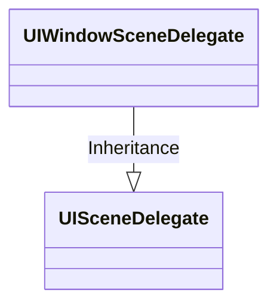

# UISceneDelegate

[TOC]




## 1、介绍UISceneDelegate


## 2、不使用Storyboard文件的工程模板[^1]


步骤，如下

* 删除Main.storyboard文件
* 修改Info.plist文件
  * Main storyboard file base name一栏，设置为空或者删除该栏
  * “Scene Configuration” > “Application Session Role” > “Item 0 (Default Configuration)”，删除Storyboard Name一栏

* 修改SceneDelegate文件，如下

  ```objective-c
  - (void)scene:(UIScene *)scene willConnectToSession:(UISceneSession *)session options:(UISceneConnectionOptions *)connectionOptions {
      self.window = [[UIWindow alloc] initWithWindowScene:(UIWindowScene *)scene];
      self.viewController = [[ViewController alloc] init];
      self.window.rootViewController = self.viewController;
      
      [self.window makeKeyAndVisible];
  }
  ```


## 3、常用Tips

### （1）检查设备是否支持分屏[^2]

iOS 13+上UIApplication有supportsMultipleScenes属性，可以判断当前App是否支持MultipleScenes，如下

```objective-c
[UIApplication sharedApplication].supportsMultipleScenes
```

实际上，当系统支持（iPad并且iOS 13+），同时App的Info.plist中 `UIApplicationSupportsMultipleScenes` 设置为YES，supportsMultipleScenes属性才为YES。


官方文档，描述如下

> UIKit sets this property to [`YES`](dash-apple-api://load?request_key=lc/documentation/objectivec/yes) when the system allows the app to display multiple scenes and the app's `Info.plist` file includes the [`UIApplicationSupportsMultipleScenes`](dash-apple-api://load?request_key=lc/documentation/bundleresources/information_property_list/uiapplicationscenemanifest/uiapplicationsupportsmultiplescenes) key with a value of [`YES`](dash-apple-api://load?request_key=lc/documentation/objectivec/yes). If either of those conditions is not true, the value of this property is [`NO`](dash-apple-api://load?request_key=lc/documentation/objectivec/no).


## References

[^1]:https://medium.com/@dpeachesdev/how-to-start-an-ios-app-with-scenedelegate-without-storyboards-f313d70a3710
[^2]:https://stackoverflow.com/questions/57900007/how-to-launch-multiple-instances-of-a-scene-on-iphone-with-ios-13


