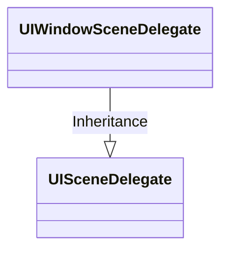

# UISceneDelegate

[TOC]




## 1、介绍UISceneDelegate


## 2、不使用Storyboard文件的工程模板


步骤，如下

* 删除Main.storyboard文件
* 修改Info.plist文件
  * Main storyboard file base name一栏，设置为空或者删除该栏
  * “Scene Configuration” > “Application Session Role” > “Item 0 (Default Configuration)”，删除Storyboard Name一栏

* 修改SceneDelegate文件，如下

  ```objective-c
  - (void)scene:(UIScene *)scene willConnectToSession:(UISceneSession *)session options:(UISceneConnectionOptions *)connectionOptions {
      self.window = [[UIWindow alloc] initWithWindowScene:(UIWindowScene *)scene];
      self.viewController = [[ViewController alloc] init];
      self.window.rootViewController = self.viewController;
      
      [self.window makeKeyAndVisible];
  }
  ```


## References


