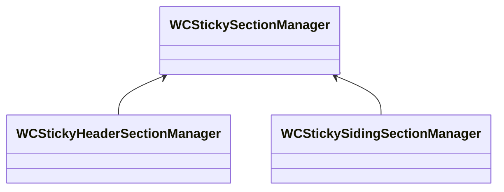

# 关于UIScrollView

[TOC]

## 1、检测用户拖拽事件

​      用户开始拖拽UIScrollView和结束拖拽UIScrollView的事件，可以通过下面2个UIScrollView的delegate方法得到，如下

```objective-c
- (void)scrollViewWillBeginDragging:(UIScrollView *)scrollView;
- (void)scrollViewDidEndDragging:(UIScrollView *)scrollView willDecelerate:(BOOL)decelerate;
```


## 2、检测滚动事件


UIScrollView滚动触发，目前有三种方式

* 方式1：用户拖拽触发
* 方式2：代码使用`setContentOffset:animated:`方法或者`scrollRectToVisible:animated:`方法
* 方式3：单击状态栏两次


| delegate方法                       | 触发方式 | 触发事件                                                     |
| ---------------------------------- | -------- | ------------------------------------------------------------ |
| scrollViewWillBeginDragging        | 1        | 用户开始拖拽                                                 |
| scrollViewDidEndDragging           | 1        | 用户结束拖拽                                                 |
| scrollViewWillBeginDecelerating    | 1        | 用户结束拖拽后，开始减速滚动                                 |
| scrollViewDidEndDecelerating       | 1        | 用户结束拖拽后，减速滚动结束                                 |
| scrollViewDidEndScrollingAnimation | 2        | `setContentOffset:animated:`方法或者`scrollRectToVisible:animated:`方法的animated参数为YES，才触发 |
| scrollViewDidScroll                | 1/2/3    | 滚动一直触发，调用间隔0.2s左右                               |


根据上表，可知方式1和方式2触发的滚动结束事件，会触发不同的方法，分别是

```objective-c
scrollViewDidEndDecelerating // 用户结束拖拽后，减速滚动结束
scrollViewDidEndScrollingAnimation // 执行滚动动画结束
```


而方式3目前没有公开API，得到滚动结束的事件，但是通过监听最后一次调用scrollViewDidScroll方法的方式，得知事件通知[^1]。示例代码，如下

```objective-c
- (void)scrollViewDidScroll:(UIScrollView *)scrollView {
    NSLog(@"scrollViewDidScroll: %f", scrollView.contentOffset.y);
    
    [NSObject cancelPreviousPerformRequestsWithTarget:self];
    // Note: ensure that the end of scroll is fired.
    [self performSelector:@selector(scrollViewDidEndScrolling:) withObject:_tableView afterDelay:0.3];
}

- (void)scrollViewDidEndScrolling:(UIScrollView *)scrollView {
    [NSObject cancelPreviousPerformRequestsWithTarget:self selector:@selector(scrollViewDidEndScrollingAnimation:) object:_tableView];
    
    NSLog(@"ScrollView end scrolling");
}
```

​      在scrollViewDidScroll方法中一直取消和建立scrollViewDidEndScrolling:方法的延迟调用，一直到最后一次调用scrollViewDidScroll:方法，不再取消scrollViewDidEndScrolling:方法的延迟调用，这样scrollViewDidEndScrolling:方法总是在最后一次调用scrollViewDidScroll:方法后触发。缺点：有一定时间延迟，上面代码是0.3秒，这个间隔太小有可能导致scrollViewDidEndScrolling:方法被触发多次，而是不一定是在最后一次调用scrollViewDidScroll:方法后触发，因此需要慎重设置。


## 3、禁止UIScrollView首次渲染自动调用scrollViewDidScroll方法[^2]

解决方法，如下

```objective-c
- (void)viewDidLayoutSubviews {
    // add table view delegate after the views have been laid out to prevent scrollViewDidScroll
    // from firing automaticly when the view is adjusted on load, which makes the tab bar disappear 
    self.tableView.delegate = self;
} 
```


## 4、UIScrollView滚动到特定位置

​        UIScrollView在水平和垂直方向进行滚动，由于contentInset的存在，因此可以判断滚动到内容的边缘，还是滚动到UIScrollView的边缘。在iOS 11+上UIScrollView支持SafeArea，增加adjustedContentInset属性，将是否滚动到内容的边缘变得更复杂一点。

​       按照分类来说，UIScrollView滚动到下面八种特定位置

|              | top  | left | bottom | right |
| ------------ | ---- | ---- | ------ | ----- |
| UIScrollView |      |      |        |       |
| Content      |      |      |        |       |

WCScrollViewTool实现UIScrollView滚动到上面八种特定位置。


## 5、WCStickySection

### （1）介绍WCStickySection组件

​      WCStickySection组件实现在UIScrollView上面添加子View（后简称sticky section），并让sticky section不跟随UIScrollView滚动或者滚动到指定位置后不滚动。

WCStickySection组件设计结构，如下

* WCStickySectionManager，负责实现sticky section不跟随UIScrollView滚动或者滚动到指定位置后不滚动
* WCStickySection，容器View，负责配置相关参数，以及添加content view

由于sticky section可以独立stick（例如重叠一起stick）或者关联stick（例如当一个section不滚动后，后面section滚动到上个section的底部也不滚动），因此设计WCStickySectionManager有两个子类，如下




### （2）WCStickySection

WCStickySection类，即是View，也是Model。

* 作为View，是容器作用，允许添加Content View
* 作为Model，有3个核心参数，如下
  * sticky，如果总是UIScrollView滚动，则设置NO，否则设置YES
  * fixedY，当sticky为YES时，滚动到这个值，不再继续滚动。
  * initialY，初始化section的y坐标


说明

> 不直接使用UITableView的tableHeaderView作为sticky section，是因为scrollViewDidScroll:方法之后，系统会设置tableHeaderView的origin总是{0, 0}，导致无法stick


### （2）Sticky Header Section

​      Sticky Header Section是WCStickyHeaderSectionManager实现的效果，用于UITableView的头部，添加sticky section。

​      WCStickyHeaderSectionManager添加WCStickySection的分类，支持priority和autoFixed属性。支持的feature，如下

* 按照priority，对section排序，优先级高总是排在头部的最上面
* 允许自动设置section的fixedY（autoFixed=YES时），排序后设置autoFixed=YES的section，stick时总是在上个section的后面，可以避免section stick时重叠在一起

* 自动设置UIScrollView的contentInset，为UITableView的头部腾出空间


### （3）Sticky Siding Section

​       Sticky Siding Section是WCStickySidingSectionManager实现的效果，用于多个section stick时，不互相重叠。支持的feature，如下

* 提供API，按照section的间距来初始化section的位置


说明

> WCStickyHeaderSectionManager的autoFixed属性，实际上，也实现了WCStickySidingSectionManager的多个section stick时不互相重叠的能力


## Reference

[^1]:https://stackoverflow.com/a/1857162
[^2]:https://stackoverflow.com/a/27784207


