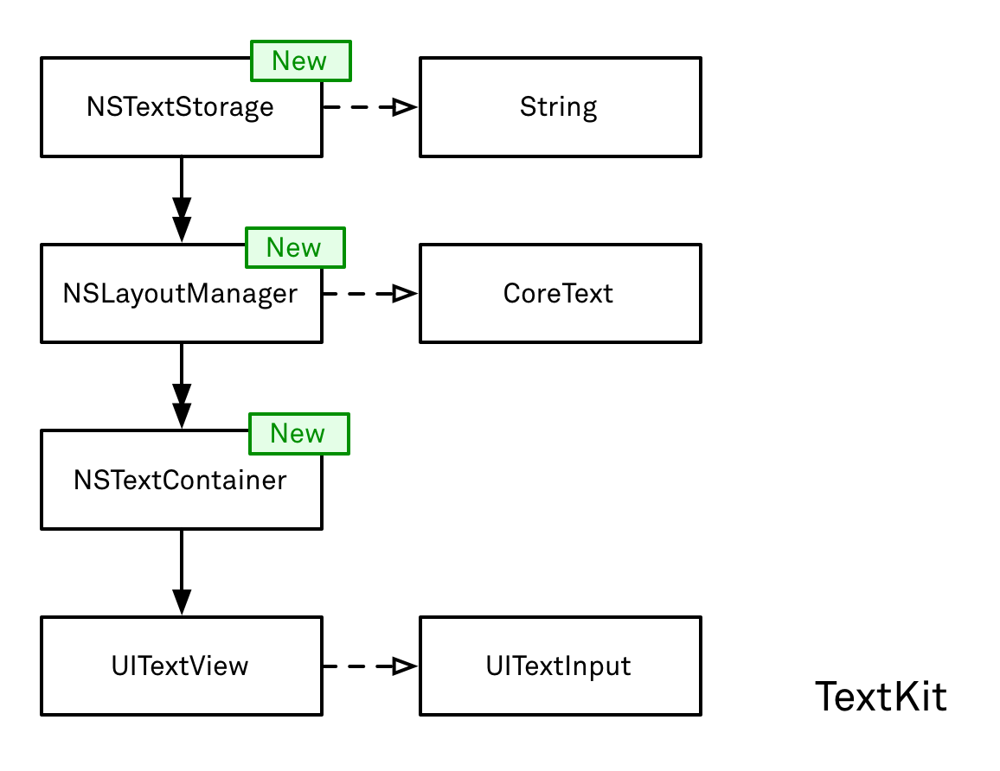

# UITextView

[TOC]

## 1、介绍UITextView

​       在iOS 7+开始，UITextView换成TextKit实现，TextKit主要提供NSTextStorage、NSLayoutManager、NSTextContainer等[^1]，用于控制文本的布局。

UITextView和NSTextStorage、NSLayoutManager、NSTextContainer的关系[^2]，如下



UITextView包含一个NSTextContainer对象，而NSTextContainer对象包含NSLayoutManager对象，NSLayoutManager对象包含NSTextStorage对象。

说明

> 1. UITextView除了提供textContainer属性，为了方便，也提供layoutManager属性和textStorage属性，但是持有关系还是上面图中所示。
> 2. NSTextStorage实际是继承自NSMutableAttributedString


上面图中，每个类负责不同的职责

* UITextView，负责参与视图层级，以及和键盘输入的交互（实现UITextInput）
* NSTextContainer，定义文本布局的区域
* NSLayoutManager，负责调用CoreText处理布局
* NSTextStorage，负责操作文本模型


### NSTextContainer

#### NSTextContainer定义

官方对NSTextContainer的定义是，一块文本布局的区域，如下

> A region where text is laid out.

NSTextContainer，一般支持矩形的区域，但是也可以通过exclusionPaths属性，或者继承实现子类的方式，自定义非矩形的区域，包括圆形区域、区域存在空洞等。官方描述，如下

> You can also subclass to create text containers with nonrectangular regions, such as circular regions, regions with holes in them, or regions that flow alongside graphics.


#### NSTextContainer和UITextView、NSLayoutManager的关系

NSTextContainer和UITextView、NSLayoutManager关系，如下

* NSTextContainer和UITextView是一对一，通过UITextView的initWithFrame:textContainer:方法建立关系
* NSTextContainer和NSLayoutManager是多对一，通过NSLayoutManager的addTextContainer:方法建立关系

因此，三者的关系，可以用下面图表示

```
UITextView 1 -->  NSTextContainer 1 ---|
                                       |--->  NSLayoutManager
UITextView 2 -->  NSTextContainer 2 ---|
```

值得说明的是，UITextView是弱引用NSTextContainer对象，而NSLayoutManager持有NSTextContainer对象。这篇文章[^2]，有提到到UITextView弱引用NSTextContainer对象，如下

> The only thing to remember when building a text system by hand is that your view controller must retain the text storage. The text view being at the end of the stack only weakly references the text storage and the layout manager. When the text storage is released, the layout manager is as well, leaving the text view with a disconnected container.


### NSLayoutManager

#### NSLayoutManager定义

​         官方对NSLayoutManager的定义是，用于调度布局和显示文本的对象，如下

> An object that coordinates the layout and display of text characters.

​        上面的定义，有点抽象，好在官方文档进一步描述NSLayoutManager的作用是，映射Unicode字符到glyph，设置glyphs到多个NSTextContainer对象上，并把它们显示在多个UITextView上。同时NSLayoutManager可以处理glyph非内在的属性，比如下划线、中划线等，可以通过实现NSLayoutManager子类来处理glyph非内在的属性。

> * `NSLayoutManager` maps Unicode character codes to glyphs, sets the glyphs in a series of [`NSTextContainer`](dash-apple-api://load?topic_id=1444539&language=occ) objects, and displays them in a series of [`NSTextView`](dash-apple-api://load?topic_id=1449142&language=occ) objects. 
> * You can create a subclass of `NSLayoutManager` to handle additional text attributes, whether inherent or not.


#### 非连续布局(Noncontiguous Layout)

​       非连续布局(Noncontiguous Layout)，指的是NSLayoutManager可以执行部分文本的glyph生成和布局，而不是从文本开头到结束，连续布局。非连续布局对于大文本，有很大的性能提升。

> Previously, both glyph generation and layout were always performed, in order, from the beginning to the end of the document. When noncontiguous layout is turned on, however, the layout manager gains the option of performing glyph generation or layout for one portion of the document without having done so for previous sections. This can provide significant performance improvements for large documents.

​        可以通过NSLayoutManager的allowsNonContiguousLayout属性开启非连续布局。当开启allowsNonContiguousLayout，一些调用布局的方法，例如ensureGlyphsForCharacterRange:方法，会使用非连续布局的方式来计算布局。


### NSTextStorage

#### NSTextStorage定义

​         官方对NSTextStorage的定义是，TextKit的基础存储机制，如下

> The fundamental storage mechanism of TextKit.

具体来说，NSTextStorage在NSMutableAttributedStringn基础上，增加一些事件通知机制，可以让NSLayoutManager重新执行布局。

> A text storage object notifies its layout managers of changes to its characters or attributes, which lets the layout managers redisplay the text as needed.

值得说明的是，NSTextStorage也是被继承的。


#### NSTextStorage和NSLayoutManager的关系

​         NSTextStorage和NSLayoutManager的关系，是一对多的，即一个NSTextStorage对象，可以用多个NSLayoutManager对象。结合NSLayoutManager和NSTextContainer的联系。这篇文章[^2]，提到这三者的关系，如下

>  a text storage can hold multiple layout managers, and a layout manager can hold multiple text containers.

实际上，加上UITextView应该是四者的关系，如下图所示。

```
UITextView 1 -->  NSTextContainer 1 ---|
                                       |--->  NSLayoutManager 1  ---|
UITextView 2 -->  NSTextContainer 2 ---|                            |
                                       															|--->  NSTextStorage
UITextView 3 -->  NSTextContainer 3 ---|                            |
                                       |--->  NSLayoutManager 2  ---|
UITextView 4 -->  NSTextContainer 4 ---|
```

​      值得说明的是，虽然UITextView有属性访问NSTextContainer和NSLayoutManager，以及NSTextStorage对象，但是UITextView并持有它们。实际上是NSTextStorage持有多个NSLayoutManager对象，一个NSLayoutManager对象持有多个NSTextContainer对象。

​      个人认为，存在上面四者的关系，是因为渲染大文本时，可以用多个UITextView渲染，相比用一个UITextView渲染，这样性能会有很好的改善。这篇文章[^2]，也提到因为这种多对一的结构，存在下面2个特性。

* 文本镜像
* 多个UITextView渲染


#### 文本镜像

文本镜像，指多个NSLayoutManager共享同一个NSTextStorage，如下面结构所示

```
UITextView 1 -->  NSTextContainer 1 -->  NSLayoutManager 1 ---|
                                       											  |--->  NSTextStorage
UITextView 2 -->  NSTextContainer 2 -->  NSLayoutManager 2 ---|
```

UI上的表现是一个UITextView的输入变化，会直接同步到另外一个UITextView上。

注意：

上面这种方式，存在一定未知问题，比如两个UITextView首次渲染，其中一个没有换行。


> 示例代码，见MirroringUITextViewViewController


#### 多个UITextView渲染

多个UITextView渲染，是指多个NSTextContainer共享同一个NSLayoutManager，如下面结构所示

```
UITextView 1 -->  NSTextContainer 1 ---|
                                       |-->  NSLayoutManager 1 --->  NSTextStorage
UITextView 2 -->  NSTextContainer 2 ---|
```

这种方式的好处是，大文本可以从一个UITextView流到另一个UITextView上显示。这样可以实现分页显示的效果，每一页是一个UITextView显示。

注意：每个UITextView需要设置scrollEnabled=NO，这样当前UITextView放不下的文本，会自动在后面分页的UITextView上面显示。分页顺序是以NSLayoutManager添加NSTextContainer对象的顺序。


缺点是，如果是上面结构，每个UITextView都不支持编辑。


> 示例代码，见PagingUITextViewViewController


#### 文本镜像+多个UITextView渲染

了解了上面的2个组合结构，可以将这两种混合成下面的结构，如下

```
UITextView 1 -->  NSTextContainer 1 -->  NSLayoutManager 1 ------|
                                       											     |--->  NSTextStorage
UITextView 2 -->  NSTextContainer 2 ---|                         |
                                       |-->  NSLayoutManager 2 --|
UITextView 3 -->  NSTextContainer 3 ---|
```

实际上，UI上的表现是UITextView 1和UITextView 2、3是文本镜像，而UITextView 2和UITextView 3是分页显示。


> 示例代码，见MixMirroringAndPagingUITextViewViewController


#### 语法高亮

​        前面提到NSTextStorage可以继承使用，但是重写父类方法，有一定工作量，这篇文章[^2]介绍使用内部组合一个backend对象的方式，将需要实现的方法，都转给这个backend对象。

> Since `NSTextStorage` is a class cluster, subclassing requires a little bit of work. The idea here is to build a composite object: Implement all methods by just forwarding them to a concrete instance, modifying `inout` parameters or results as wished.

以语法高亮为例，介绍NSTextStorage继承的用法。


官方文档描述，如果要继承NSTextStorage，需要实现下面4个方法，如下

```objective-c
// Getter
- (NSString *)string;
- (NSDictionary *)attributesAtIndex:(NSUInteger)location effectiveRange:(NSRangePointer)range;
// Setter
- (void)replaceCharactersInRange:(NSRange)range withString:(NSString *)str;
- (void)setAttributes:(NSDictionary *)attrs range:(NSRange)range;
```

官方文档，如下

> subclasses manage by overriding the two `NSAttributedString` primitives:
>
> [`string`](dash-apple-api://load?topic_id=1412616&language=occ)
>
> [`attributesAtIndex:effectiveRange:`](dash-apple-api://load?topic_id=1415682&language=occ)
>
> Subclasses must also override two `NSMutableAttributedString` primitives:
>
> [`replaceCharactersInRange:withString:`](dash-apple-api://load?topic_id=1418451&language=occ)
>
> [`setAttributes:range:`](dash-apple-api://load?topic_id=1412179&language=occ)
>
> These primitives should perform the change, then call [`edited:range:changeInLength:`](dash-apple-api://load?request_key=hcIxzp7hxm#dash_1529793) to let the parent class know what changes were made.


实际上，2个getter方法是重写NSAttributedString的方法，2个setter方法方法是重写NSMutableAttributedString的方法。

需要注意的是，2个setter方法里面，需要调用父类的edited:range:changeInLength:方法，该方法是NSTextStorage的方法。


edited:range:changeInLength:方法，有三个参数

* edited参数: NSTextStorageEditActions类型，有2个选项，NSTextStorageEditedAttributes和NSTextStorageEditedCharacters，分别表示属性和字符有变更，即

  > NSTextStorageEditedAttributes: Attributes were added, removed, or changed.
  >
  > NSTextStorageEditedCharacters: Characters were added, removed, or replaced.

* range参数: 表示变更之前的字符范围

* changeInLength参数: 表示长度变化的delta。举个例子，将“The files couldn’t be saved”中“The”替换为“Several”，range参数是{0, 3}，而changeInLength参数是4。注意：changeInLength参数是NSInteger类型，可以为负数。

值得说明的是，该方法会自动触发调用processEditing方法，如果没有被包裹beginEditing方法。


> 示例代码，参考WCHighlightTextStorage


## References

[^1]:https://developer.apple.com/documentation/appkit/textkit?language=objc#
[^2]:https://www.objc.io/issues/5-ios7/getting-to-know-textkit/


