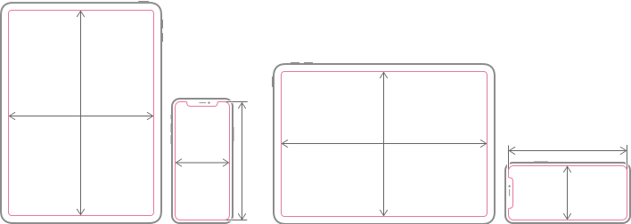

# HelloUITraitCollection

[TOC]

## 1、Size Classes

Size Classes（大小类别），定义2个大小类型：Regular（表示伸展空间）和Compact（表示约束空间）

官方文档描述[^1]，如下

> The system defines two size classes, *regular* (denotes expansive space) and *compact* (denotes constrained space), which describe the height and width of a view.

| Device            | Portrait orientation          | Landscape orientation         |
| :---------------- | :---------------------------- | :---------------------------- |
| 12.9" iPad Pro    | Regular width, regular height | Regular width, regular height |
| 11" iPad Pro      | Regular width, regular height | Regular width, regular height |
| 10.5" iPad Pro    | Regular width, regular height | Regular width, regular height |
| 9.7" iPad         | Regular width, regular height | Regular width, regular height |
| 7.9" iPad mini    | Regular width, regular height | Regular width, regular height |
| iPhone 11 Pro Max | Compact width, regular height | Regular width, compact height |
| iPhone 11 Pro     | Compact width, regular height | Compact width, compact height |
| iPhone 11         | Compact width, regular height | Regular width, compact height |
| iPhone XS Max     | Compact width, regular height | Regular width, compact height |
| iPhone XS         | Compact width, regular height | Compact width, compact height |
| iPhone XR         | Compact width, regular height | Regular width, compact height |
| iPhone X          | Compact width, regular height | Compact width, compact height |
| iPhone 8 Plus     | Compact width, regular height | Regular width, compact height |
| iPhone 8          | Compact width, regular height | Compact width, compact height |
| iPhone 7 Plus     | Compact width, regular height | Regular width, compact height |
| iPhone 7          | Compact width, regular height | Compact width, compact height |
| iPhone 6s Plus    | Compact width, regular height | Regular width, compact height |
| iPhone 6s         | Compact width, regular height | Compact width, compact height |
| iPhone SE         | Compact width, regular height | Compact width, compact height |

## References

[^1]:https://developer.apple.com/design/human-interface-guidelines/ios/visual-design/adaptivity-and-layout/

