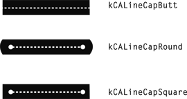
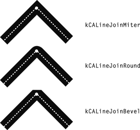
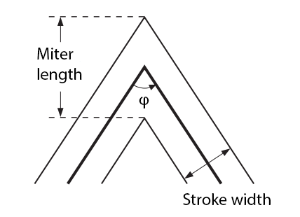

# 使用UIView和CALayer

[TOC]

## 1、UIView


### （1）常用知识点介绍


#### a. 区分Transparent, Transluncent and Opaque 

- transparent，指的是完全透明的，光穿过物体没有多少损失。
- translucent，指的是部分透明，光穿过物体有一部分损失，而且看起来像毛玻璃的效果
- opaque，指的是完全不透明，光无法穿过物体。


#### b. 关于AVMakeRectWithAspectRatioInsideRect函数

​      AVFoundation.framework提供的`AVMakeRectWithAspectRatioInsideRect`函数，签名如下

```objective-c
CGRect AVMakeRectWithAspectRatioInsideRect(CGSize aspectRatio, CGRect boundingRect);
```

* aspectRatio参数，需要缩放对象的实际大小。
  * 如果是CGSizeZero，则返回的是(NaN, NaN, NaN, NaN)，把这个值赋值给UIView的frame会导致Crash，例如“Terminating app due to uncaught exception 'CALayerInvalidGeometry', reason: 'CALayer position contains NaN: [nan 300]'”

* 返回值是指定rect中按比例尺缩放view后的rect。


​     `AVMakeRectWithAspectRatioInsideRect`函数一般用于缩放UIImageView或者AVPlayerLayer（图片或者视频）。举个例子，如下

```objective-c
CGSize screenSize = [[UIScreen mainScreen] bounds].size;

// bounding view
UIView *view = [[UIView alloc] initWithFrame:CGRectMake((screenSize.width - BoundingSize.width) / 2.0, y, BoundingSize.width, BoundingSize.height)];

// 根据实际image的size按比例尺缩放
UIImage *image = UIImageInResourceBundle(imageName, @"");
CGRect aspectScaledRect = AVMakeRectWithAspectRatioInsideRect(image.size, view.bounds);

UIImageView *imageView = [[UIImageView alloc] initWithImage:image];
// 设置缩放后的imageView
imageView.frame = aspectScaledRect;

[view addSubview:imageView];
```


鉴于上面存在crash问题，有两种方式可以安全使用AVMakeRectWithAspectRatioInsideRect

1）对AVMakeRectWithAspectRatioInsideRect进行保护

>  见`+[WCViewTool safeAVMakeAspectRatioRectWithContentSize:insideBoundingRect:]`实现

2）为了避免只使用一个函数，而引入AVFoundation.framework，可以自己实现AVMakeRectWithAspectRatioInsideRect

> 见`+[WCViewTool makeAspectRatioRectWithContentSize:insideBoundingRect:]`实现


### （2）UIView使用技巧


#### a. UIView指定某个圆角

基本原理：UIView的CALayer有mask属性，支持指定一个mask layer用于对CALayer进行遮罩。mask layer的形状、大小和alpha决定CALayer如何显示。


以只有左上角和右上角的圆角的UIView为例，基本步骤，如下

第一步，使用UIBezierPath确定一个封闭矩形，而且左上角和右上角是圆角。

```objective-c
UIBezierPath *maskPath = [UIBezierPath bezierPathWithRoundedRect:view.bounds byRoundingCorners:(UIRectCornerTopLeft | UIRectCornerTopRight) cornerRadii:CGSizeMake(30, 30)];
```

> 矩形大小应该和对应的UIView大小一致。

第二步，使用CAShapeLayer创建mask layer

```objective-c
CAShapeLayer *maskLayer = [CAShapeLayer layer];
maskLayer.frame = view.bounds;
maskLayer.path = maskPath.CGPath;
maskLayer.backgroundColor = [[UIColor redColor] colorWithAlphaComponent:0.2].CGColor;
```

> mask layer虽然指定path，但是这个path不会截取layer的矩形形状，因此CAShapeLayer分为了两个区域：path区域和非path区域（path以外的部分）。

- path区域（opaque部分）没有指定颜色，所以是黑色不透明alpha=0
- 非path区域（translucent部分）则指定了backgroundColor而且alpha=0.2，这里指定red颜色没有关系，但是一定要指定alpha（0<= alpha < 1）

第三步，将mask layer赋值到mask属性

```objective-c
UIView *view = [[UIView alloc] initWithFrame:CGRectMake(10, 100, 100, 100)];
view.backgroundColor = [UIColor greenColor];
view.layer.mask = maskLayer;
```

mask属性决定如何将layer和mask layer进行合成

1. mask layer在layer中的位置和大小，如果超过layer部分，则被截取掉
2. mask layer中opaque部分（即上面的path区域），layer使用自己的backgroundColor填充；mask layer中translucent部分（即上面的非path区域），layer使用mask layer的alpha值，结合自己backgroundColor，进行填充。如果alpha值是0，则这部分是透明的

参考代码：`ViewWithTwoCornersViewController`


#### b. UIView处理是否处理touch事件

UIView提供`- (BOOL)pointInside:(CGPoint)point withEvent:(UIEvent *)event;`方法给子类实现。

如果touch点落在view的父视图，而且父视图没有设置userInteractionEnabled为NO。touch事件会向子视图传递，子视图的pointInside:withEvent:方法会被调用（当然子视图的userInteractionEnabled为NO，则该方法也不会被调用）。如果touch点落在子视图上，则子视图的pointInside:withEvent:方法返回YES，否则返回NO。

通过在pointInside:withEvent:方法中，进一步判断touch点是否落在特定区域，决定是否返回YES或者NO，让子视图的pointInside:withEvent:方法是否被调用。

示例见，TouchThroughPartRegionViewController。黄色区域（overlay）在红色框按钮前面，蓝色框按钮在overlay中。overlay需要处理落在蓝色框的touch点让蓝色框按钮响应，而落在红色框的touch点让红色框按钮响应。


### （3）关于-convertRect:toView:和-convertRect:fromView:方法

基本转换关系，如下

```objective-c
[sourceView convertRect:<someRect> toView:targetView];
[targetView convertRect:<someRect> fromView:sourceView];
```

以[sourceView convertRect:<someRect> toView:targetView]为例

将someRect视为在sourceView中的坐标，然后将someRect映射到在targetView中的坐标。


## 2、Safe Area（安全区域）[^1]

​        Safe Area这个概念是在iOS 11+支持的，含义是view中没有被导航栏、tab bar或者tool bar（实际上也包含状态栏、iPhone X开始出现Home Indicator）的区域，称之为**安全区域（Safe Area）**。当视图层级（View Hierarchy）构成后，这个安全区域是可以继承的，即子视图可以继承自父视图的Safe Area。


​       在UIView的`safeAreaInsets`属性文档注释，这样解释Safe Area，如下

> The safe area of a view reflects the area not covered by navigation bars, tab bars, toolbars, and other ancestors that obscure a view controller's view.


​       Safe Area推出的意义，个人认为在于，规范自定义控件和系统控件之间，避免遮挡冲突，尤其在取消实体Home按键后，出现虚拟的Home Indicator。


iOS 11+增加下面多种属性用于支持实现Safe Area

| 控件                                           | 属性                           |
| ---------------------------------------------- | ------------------------------ |
| UIView                                         | safeAreaInsets                 |
| UIView                                         | safeAreaLayoutGuide            |
| UIViewController                               | additionalSafeAreaInsets       |
| UIScrollView                                   | contentInsetAdjustmentBehavior |
| UIScrollView                                   | adjustedContentInset           |
| UITableView                                    | insetsContentViewsToSafeArea   |
| UICollectionViewFlowLayout（UICollectionView） | sectionInsetReference          |


### （1）safeAreaInsets

UIView的safeAreaInsets属性，针对下面两种不同的View分区来计算它的值。

* View Controller中root view的safeAreaInsets，即self.view的safeAreaInsets，通过状态栏、其他visible bar（导航栏、工具栏等）以及`additionalSafeAreaInsets`属性，一起计算出无遮挡的安全区域。
* 普通View的safeAreaInsets，仅计算它本身是否被遮挡的安全区域，一般继承自父视图的遮挡。如果它没有被遮挡，则它的safeAreaInsets是UIEdgeInsetsZero

> For the view controller's root view, the insets account for the status bar, other visible bars, and any additional insets that you specified using the [`additionalSafeAreaInsets`](dash-apple-api://load?topic_id=2902284&language=occ)property of your view controller. For other views in the view hierarchy, the insets reflect only the portion of the view that is covered.


#### 获取safeAreaInsets的值

​      UIView的safeAreaInsets属性的值，是系统在布局完成后，自动计算出来的。因此，需要在UIKit完成某个布局后，再获取这个safeAreaInsets属性值。


* 对于View Controller中root view的safeAreaInsets
  * **viewDidLayoutSubviews**方法，可以获取self.view.safeAreaInsets[^3]，以及self.view所有子视图的safeAreaInsets
  * **viewWillLayoutSubviews**方法，也可以获取self.view.safeAreaInsets，但self.view所有子视图还没有完成布局，因此它们的safeAreaInsets都是UIEdgeInsetsZero


> 关于View Controller的root view生命周期几个回调方法的顺序，如下
>
> viewDidLoad（仅一次）
>
> viewWillAppear（仅一次）
>
> viewWillLayoutSubviews（存在多次，如横竖旋转、viewWillLayoutSubviews或viewDidLayoutSubviews中修改了self.view本身的布局）
>
> viewDidLayoutSubviews（存在多次，如横竖旋转、viewWillLayoutSubviews或viewDidLayoutSubviews中修改了self.view本身的布局、self.view调用setNeedsLayout或setNeedsDisplayInRect方法[^2]）
>
> viewDidAppear（仅一次）


​       为了避免viewWillLayoutSubviews和viewDidLayoutSubviews调用多次，一般不建议在这两个方法中修改self.view的frame。


> 处于不同容器（UINavigationController、UITabBarController等）中View Controller的root view，显示它的safeAreaInsets，示例代码见UseSafeAreaInsetsViewController


* 对于普通View的safeAreaInsets
  * 在layoutSubview方法中获取当前View的safeAreaInsets。这个safeAreaInsets值来自父视图的safeAreaInsets。值得注意的是，子视图的safeAreaInsets不会超出父视图的safeAreaInsets（例如，当子视图拖拽移出到父视图的安全区域外一定范围时，子视图的safeAreaInsets总是等于父视图的safeAreaInsets）

> 示例代码见ShowCustomViewSafeAreaViewController


### （2）additionalSafeAreaInsets

​       UIViewController的additionalSafeAreaInsets属性，实际上针对UIViewController的view，额外增加insets。因此，UIViewController的view的**safe area insets = self.view.safeAreaInsets + self.additionalSafeAreaInsets**。additionalSafeAreaInsets属性默认为UIEdgeInsetsZero。


#### 如何设置additionalSafeAreaInsets属性

* 在self.view布局之前，设置additionalSafeAreaInsets属性
* 在self.view布局之后，设置additionalSafeAreaInsets属性，同时调用setNeedsLayout和layoutIfNeeded方法。

> 示例代码见UseSafeAreaInsetsViewController


### （3）safeAreaLayoutGuide

​       UIView的safeAreaLayoutGuide属性，适用于Auto Layout的场景。和safeAreaInsets属性作用一样，只不过safeAreaLayoutGuide属性使用UILayoutGuide对象来定义安全区域（Safe Area）。


### （4）contentInsetAdjustmentBehavior

​       UIScrollView的`contentInsetAdjustmentBehavior`属性和UIViewController的`automaticallyAdjustsScrollViewInsets`属性作用是一样的，都是用于设置UIScrollView的insets。


但是区别如下

| 控件             | 属性                                 | 默认值                                      | 起始版本 |
| ---------------- | ------------------------------------ | ------------------------------------------- | -------- |
| UIViewController | automaticallyAdjustsScrollViewInsets | YES                                         | iOS 7+   |
| UIScrollView     | contentInsetAdjustmentBehavior       | UIScrollViewContentInsetAdjustmentAutomatic | iOS 11+  |


* contentInsetAdjustmentBehavior是UIScrollView上的属性，而automaticallyAdjustsScrollViewInsets是UIViewController上的属性，却用于影响UIScrollView的insets。显然contentInsetAdjustmentBehavior属性更加贴切，容易理解。
* contentInsetAdjustmentBehavior是枚举值，而automaticallyAdjustsScrollViewInsets是布尔值。contentInsetAdjustmentBehavior属性表意范围更广一些。
* contentInsetAdjustmentBehavior属性在iOS 11+使用，而automaticallyAdjustsScrollViewInsets属性在iOS 11上不推荐使用。
* contentInsetAdjustmentBehavior属性调整的是UIScrollView的adjustedContentInset属性，并不会修改UIScrollView的contentInset，而automaticallyAdjustsScrollViewInsets属性设置为YES，是直接修改的UIScrollView的contentInset。


#### 介绍automaticallyAdjustsScrollViewInsets的实际作用

​       当设置`automaticallyAdjustsScrollViewInsets`为YES，系统自动调整ViewController中UIScrollView的contentInset，但是官方对此属性的描述比较模糊，而且和实际情况不符合。

​       网上这篇文档[^4]对automaticallyAdjustsScrollViewInsets详细分析比较到位。这里摘要文章的几个结论，如下


1）automaticallyAdjustsScrollViewInsets属性仅设置在UINavigationController中UIViewController才生效，其他情况并不生效。（见**presentAutomaticallyAdjustsScrollViewInsetsViewController1**方法）

2）在1）的条件下，UIScrollView必须是viewController.view的第一个subview，即vc.view.subviews[0]是UIScrollView，或者vc.view.subviews[0]....subviews[0].subviews[0]是UIScrollView，这样automaticallyAdjustsScrollViewInsets=YES才生效。或者UIScrollView是vc.view，即UITableViewController这种情况。

3）automaticallyAdjustsScrollViewInsets属性的作用并不是Safe Area那样，即使UIScrollView没有被status bar或者nav bar遮挡，automaticallyAdjustsScrollViewInsets=YES生效后，依然会调整UIScrollView的contentInset（见**presentAutomaticallyAdjustsScrollViewInsetsViewController4**方法）


> 鉴于automaticallyAdjustsScrollViewInsets属性有许多隐晦的生效条件，最好将其设置NO，在iOS 11+使用contentInsetAdjustmentBehavior属性。


#### contentInsetAdjustmentBehavior的作用

​       UIScrollView的contentInsetAdjustmentBehavior属性的作用，是基于Safe Area对UIScrollView的adjustedContentInset属性进行调整。只有当设置UIScrollViewContentInsetAdjustmentNever值，才完全忽略UIScrollView的Safe Area。


​       UIScrollView的contentInsetAdjustmentBehavior属性有4个枚举值，默认值是UIScrollViewContentInsetAdjustmentAutomatic。


根据UIScrollViewContentInsetAdjustmentBehavior的代码注释，可以总结如下

* UIScrollViewContentInsetAdjustmentScrollableAxes

​         可以滚动的轴方向（竖直或水平）上，对UIScrollView的adjustedContentInset属性调整，即滚动的轴方向不超出Safe Area的范围。如果轴方向不能滚动（contentSize.width/height <= frame.size.width/height或者alwaysBounceHorizontal/Vertical = NO），则不会调整。

* UIScrollViewContentInsetAdjustmentAutomatic

​        UIScrollViewContentInsetAdjustmentAutomatic值和UIScrollViewContentInsetAdjustmentScrollableAxes值一样，但是多了一个作用：向下兼容，即当automaticallyAdjustsScrollViewInsets=YES时，UINavigationController中的UIViewController所持有的UIScrollView不管是否能滚动，都对UIScrollView调整contentInset。

* UIScrollViewContentInsetAdjustmentNever

​       总是不对UIScrollView的adjustedContentInset属性调整。此时UIScrollView不会遵照Safe Area。

* UIScrollViewContentInsetAdjustmentAlways

​       总是对UIScrollView的adjustedContentInset属性调整，即竖直或水平方向，UIScrollView的content都不会超出Safe Area。和UIScrollViewContentInsetAdjustmentScrollableAxes区别，在于如果轴方向上不能滚动，UIScrollViewContentInsetAdjustmentAlways也会调整adjustedContentInset属性，有可能经过调整后，轴方向上变得可以滚动。


> 示例代码，见ShowScrollViewContentInsetAdjustmentBehaviorViewController


如果完全不需要系统自动调整UIScrollView的inset，则使用下面的Swift代码[^5]设置

```swift
if #available(iOS 11.0, *) {
    scrollView.contentInsetAdjustmentBehavior = .never
} else {
    vc.automaticallyAdjustsScrollViewInsets = false
}
```

或者Objective-C代码

```objective-c
if (@available(iOS 11.0, *)) {
    scrollView.contentInsetAdjustmentBehavior = UIScrollViewContentInsetAdjustmentNever;
}
else {
#pragma GCC diagnostic push
#pragma GCC diagnostic ignored "-Wdeprecated-declarations"
    vc.automaticallyAdjustsScrollViewInsets = NO;
#pragma GCC diagnostic pop
}
```


### （5）adjustedContentInset

​        UIScrollView的`adjustedContentInset`属性和`contentInset`属性的区别，在于`adjustedContentInset`属性是通过`contentInset`属性和安全区域一起计算出来的，即`adjustedContentInset` = `contentInset` + safe area insets。

* 在iOS 11-上，UIScrollView的content是基于contentInset属性来放置的。
* 在iOS 11+上，UIScrollView的content是基于adjustedContentInset属性来放置的。


​       UIScrollView的contentInsetAdjustmentBehavior属性，总是影响adjustedContentInset的值，不影响contentInset的值。


> 示例代码，见ShowScrollViewContentInsetAdjustmentBehaviorViewController


为了取到UIScrollView真实的content inset，代码如下

```objective-c
+ (UIEdgeInsets)actualContentInsetsWithScrollView:(UIScrollView *)scrollView {
    if (![scrollView isKindOfClass:[UIScrollView class]]) {
        return UIEdgeInsetsZero;
    }
    
#pragma GCC diagnostic push
#pragma GCC diagnostic ignored "-Wunguarded-availability-new"

    if (IOS11_OR_LATER) {
        return scrollView.adjustedContentInset;
    }

#pragma GCC diagnostic pop
    
    return scrollView.contentInset;
}
```


当UIScrollView的`adjustedContentInset`属性被调整时，可以使用实例方法`adjustedContentInsetDidChange`（子类继承方式重写该方法）或者通过delegate方法`scrollViewDidChangeAdjustedContentInset`，来取得事件通知。

```swift
//UIScrollView
@available(iOS 11.0, *)
open func adjustedContentInsetDidChange()

//UIScrollViewDelegate
@available(iOS 11.0, *)
optional public func scrollViewDidChangeAdjustedContentInset(_ scrollView: UIScrollView)
```


## 3、CALayer

### （1）CALayer

​       CALayer主要管理图像内容和动画，一般CALayer是UIView的backing store，即UIView基于CALayer做了一层封装，但是CALayer也可以单独使用。CALayer的动画是基于CAMediaTiming协议来实现的。

这里介绍CALayer的常用属性。


### （2）CAGradientLayer


### （3）CAShapeLayer

CAShapeLayer也是CALayer的子类。这里介绍CAShapeLayer的常用属性。


| 属性            | 默认值                  | 作用                                                         | 说明                                                         |
| --------------- | ----------------------- | ------------------------------------------------------------ | ------------------------------------------------------------ |
| fillColor       | [UIColor black].CGColor | path的填充色                                                 | 如果path是直线，fillColor无效果                              |
| fillRule        |                         |                                                              |                                                              |
| lineCap         | kCALineCapButt          | 决定线条末端的形状，如下<br/> | 如果path是closed，不存在线条的末端，则设置lineCap是无效的    |
| lineDashPattern | nil                     | 决定线条的dash模式                                           | 数组的按照[(painted segment length), (unpainted segment length), ...]顺序依次决定实线和虚线的长度，当数组匹配完成后，再重新从头开始匹配。（备注：如果是nil，则一直是实线） |
| lineDashPhase   | 0                       | lineDashPattern起始的偏移量                                  | 举个例子，lineDashPattern = [10, 5, 5, 5], lineDashPhase = 10，则起始匹配按照5-5-5-10-5-5-5-...，但不影响实线-虚线-实线-虚线-...的顺序。如果lineDashPhase = 2，则起始匹配按照8-5-5-5-10-5-5-5-... |
| lineJoin        | kCALineJoinMiter        | 决定两个线条交接的形状，如下 | kCALineJoinMiter<br/>kCALineJoinRound<br/>kCALineJoinBevel   |
| miterLimit      | 10                      | 当设置kCALineJoinMiter时，决定是否变成kCALineJoinBevel       | 当lineJoin设置kCALineJoinMiter时，miterLimit才生效。具体见“miterLimit”一节。 |
| strokeColor     | nil                     | path的线条颜色                                               |                                                              |
| strokeStart     | 0.0                     | stroke的百分比起始位置                                       | 如果path从头到尾是100%，则strokeStart指定起始点按照百分比算的位置。比如0.5，则起始点在path的中间。 |
| strokeEnd       | 1.0                     | stroke的百分比结束位置                                       | 如果path从头到尾是100%，则strokeEnd指定结束点按照百分比算的位置。比如0.5，则结束点在path的中间。 |


#### a. miterLimit[^6]

miterLimit实际是一个阈值，理解它还需要如下图的两个概念，miter length和stroke width。



* miter length，是指两条线条相交，构成两个衔接点之间的距离
* stroke width，是指线条的宽度

当比例miter length/stroke width大于miterLimit时（而且lineJoin=kCALineJoinMiter），尖角太尖，CAShapeLayer自动将尖角画成kCALineJoinBevel类型。公式如下


说明

> ratio比例miter length/stroke width，实际和角度φ有关，当φ=60°，ratio=2；当φ=90°，ratio=1.414


## 4、关于WCViewTool

检测UIView的frame被修改的事件


## References

[^1]:https://medium.com/rosberryapps/ios-safe-area-ca10e919526f
[^2]:https://stackoverflow.com/a/27050776
[^3]:https://stackoverflow.com/a/46290400

[^4]: https://medium.com/@wailord/the-automaticallyadjustsscrollviewinsets-rabbit-hole-b9153a769ce9
[^5]:https://stackoverflow.com/a/45242206

[^6]:https://wiki.esko.com/pages/viewpage.action?pageId=184729203

