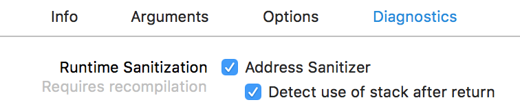

## 使用Xcode相关技巧

[TOC]

---

### 1、Xcode环境变量[^1]

| Environment variable | 作用 | 说明 |
|----------------------|-----|------|
| DYLD\_PRINT\_LIBRARIES | 输出image加载日志 | |
| DYLD\_PRINT\_ENV | 输出环境变量 | 通过C函数getenv也可以获取环境变量 |

### 2、Code Diagnostics[^2]

#### （1）Address Sanitizer

Xcode打开Address Sanitizer（简称ASan）设置，如下

Address Sanitizer支持检查的类型，如下

* Use of Deallocated Memory
  * Detects when memory is used after being deallocated. （销毁后的内存被使用）
* Deallocation of Deallocated Memory
  * Detects when memory is freed after being deallocated.（销毁后的内存被销毁）

* Deallocation of Nonallocated Memory
  * Detects when nonallocated memory is freed.（销毁不能被释放的内存，一般是栈上的内存）

* Use of Stack Memory After Function Return
  * Detects when stack variable memory is accessed after its declaring function returns.
  * 开启这个功能，需要单独打开下面这个Detect use of stack after return设置

* Use of Out-of-Scope Stack Memory
  * Detects when variables are accessed outside of their declared scope.（访问栈上作用域之外的变量）

* Overflow and Underflow of Buffers
  * Detects when memory is accessed outside of a buffer’s boundaries.（缓冲区上溢或下溢，一般是数组越界的情况）

* Overflow of C++ Containers
  * Detects when a C++ container is accessed outside its bounds.（C++容器的越界情况，例如vector）
  * 开启这个功能，需要单独打开下面这个编译设置

### Reference

[^1]: https://developer.apple.com/library/content/documentation/DeveloperTools/Conceptual/DynamicLibraries/100-Articles/LoggingDynamicLoaderEvents.html
[^2]: https://developer.apple.com/documentation/code_diagnostics 

