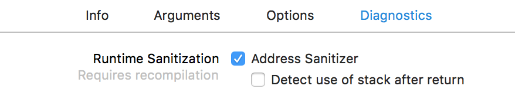
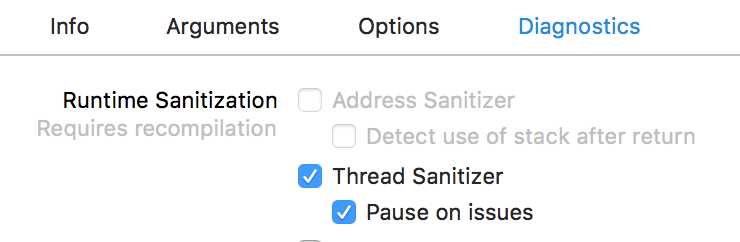
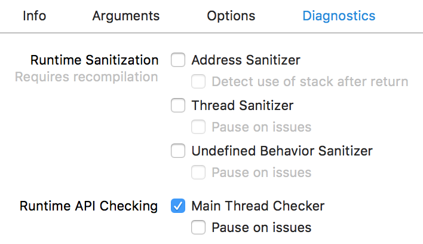
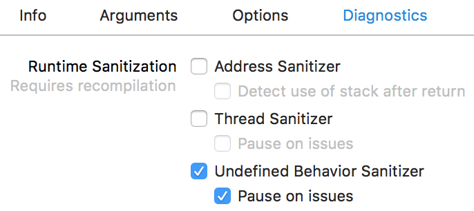

# 使用Xcode相关技巧

[TOC]

## 1、Xcode环境变量[^1]

| Environment variable | 作用 | 说明 |
|----------------------|-----|------|
| DYLD\_PRINT\_LIBRARIES | 输出image加载日志 | |
| DYLD\_PRINT\_ENV | 输出环境变量 | 通过C函数getenv也可以获取环境变量 |


## 2、Code Diagnostics[^2]

### （1）Address Sanitizer

Xcode打开Address Sanitizer（简称ASan）设置，如下




Address Sanitizer支持检查的类型，如下

* Use of Deallocated Memory
  * Detects when memory is used after being deallocated. （销毁后的内存被使用）
* Deallocation of Deallocated Memory
  * Detects when memory is freed after being deallocated.（销毁后的内存被销毁）

* Deallocation of Nonallocated Memory
  * Detects when nonallocated memory is freed.（销毁不能被释放的内存，一般是栈上的内存）

* Use of Stack Memory After Function Return
  * Detects when stack variable memory is accessed after its declaring function returns.
  * 开启这个功能，需要单独打开下面这个Detect use of stack after return设置


* Use of Out-of-Scope Stack Memory
  * Detects when variables are accessed outside of their declared scope.（访问栈上作用域之外的变量）

* Overflow and Underflow of Buffers
  * Detects when memory is accessed outside of a buffer’s boundaries.（缓冲区上溢或下溢，一般是数组越界的情况）

* Overflow of C++ Containers
  * Detects when a C++ container is accessed outside its bounds.（C++容器的越界情况，例如vector）
  * 开启这个功能，需要单独打开下面这个编译设置


### （2）Thread Sanitizer

Xcode打开Thread Sanitizer（简称TSan）设置，如下



目前TSan仅支持模拟器，不支持设备。

> TSan is supported only for 64-bit macOS and 64-bit iOS and tvOS simulators (watchOS is not supported). You cannot use TSan when running apps on a device.


Thread Sanitizer支持检查的情况，如下

* Data Races
  * Detects unsynchronized access to mutable state across multiple threads.（一般指存在多线程访问可读写的变量）

* Swift Access Races
  * Detects when multiple threads call a mutating method on the same structure, or pass a shared variable as `inout` without synchronization.

* Races on Collections and Other APIs
  * Detects when a thread accesses a mutable object while another thread writes to that object, causing a data race.（容器类mutable版本，存在多线程访问的问题）

> 上面三种情况，都可以归纳为Data Races。文档定义Data Races的行为是，multiple threads access the same memory without synchronization and at least one access is a write，即存在多个线程读访问相同的内存，并且至少有一个线程是写访问。


* Uninitialized Mutexes
  * Detects when a mutex is used before it's initialized.（一般指mutex使用前没有初始化）

* Thread Leaks
  * Detects when threads aren't closed after use.

> 经测试，Xcode 9.4.1 (9F2000)，没有检测到上面两种情况。


### （3）Main Thread Checker

Xcode默认打开Main Thread Checker设置，如下



​        文档上描述，Main Thread Checker设置，用于检测非主线程中更新UI的操作，同时指出非主线程中更新UI，会导致视图错误、数据损坏以及crash等问题。

> Updating UI on a thread other than the main thread is a common mistake that can result in missed UI updates, visual defects, data corruptions, and crashes.

​        注意：这里只是禁止非主线程更新UI，但是非主线程绘图还是可以的。异步刷新方式，就是采用非主线程绘图，然后主线程更新UI。

​       `libMainThreadChecker.dylib`提供Main Thread Checker功能，由于是动态库，不要重新编译，就可以使用Main Thread Checker功能。`libMainThreadChecker.dylib`位于**/Applications/Xcode.app/Contents/Developer/usr/lib/libMainThreadChecker.dylib**

> lipo -info libMainThreadChecker.dylib，检查发现libMainThreadChecker.dylib只有模拟器架构的。


### （4）Undefined Behavior Sanitizer

Xcode打开Undefined Behavior Sanitizer（简称UBSan）设置，如下




UBSan支持检查的类型以及对于编译器flags，如下

| UBSan check                                                  | Compiler flags                                               |
| ------------------------------------------------------------ | ------------------------------------------------------------ |
| [Misaligned Pointer](dash-apple-api://load?topic_id=2872636&language=occ) | `-fsanitize=alignment`                                       |
| [Invalid Boolean](dash-apple-api://load?topic_id=2872637&language=occ) | `-fsanitize=bool`                                            |
| [Out-of-Bounds Array Access](dash-apple-api://load?topic_id=2880310&language=occ) | `-fsanitize=bounds`                                          |
| [Invalid Enumeration Value](dash-apple-api://load?topic_id=2881022&language=occ) | `-fsanitize=enum`                                            |
| [Dynamic Type Violation](dash-apple-api://load?topic_id=2872638&language=occ) | `-fsanitize=vptr`                                            |
| [Invalid Float Cast](dash-apple-api://load?topic_id=2872639&language=occ) | `-fsanitize=float-cast-overflow `                            |
| [Division by Zero](dash-apple-api://load?topic_id=2872666&language=occ) | `-fsanitize=integer-divide-by-zero `<br/>`-fsanitize=float-divide-by-zero` |
| [Nonnull Variable Assignment Violation](dash-apple-api://load?topic_id=2891419&language=occ) |                                                              |
| [Nonnull Argument Violation](dash-apple-api://load?topic_id=2872667&language=occ) | `-fsanitize=nonnull-attribute `<br/>`-fsanitize=nullability-arg` |
| [Nonnull Return Value Violation](dash-apple-api://load?topic_id=2872668&language=occ) | `-fsanitize=returns-nonnull-attribute `<br/>`-fsanitize=nullability-return` |
| [Nonnull Variable Assignment Violation](dash-apple-api://load?topic_id=2891419&language=occ) | `-fsanitize=nullability-assign`                              |
| [Null Reference Creation and Null Pointer Dereference](dash-apple-api://load?topic_id=2872669&language=occ) | `-fsanitize=null `                                           |
| [Invalid Object Size](dash-apple-api://load?topic_id=2872670&language=occ) | `-fsanitize=object-size `                                    |
| [Invalid Shift](dash-apple-api://load?topic_id=2872671&language=occ) | `-fsanitize=shift `                                          |
| [Integer Overflow](dash-apple-api://load?topic_id=2872672&language=occ) | `-fsanitize=signed-integer-overflow`                         |
| [Reaching of Unreachable Point](dash-apple-api://load?topic_id=2872673&language=occ) | `-fsanitize=unreachable`                                     |
| [Invalid Variable-Length Array](dash-apple-api://load?topic_id=2872674&language=occ) | `-fsanitize=vla-bound`                                       |


* Misaligned Pointer

​        通过指针来存取值，一般需要按照值的类型来对齐内存地址。例如int32_t的大小是4 bytes，该值存放的内存地址应该是4的倍数。如果代码中指针指向的地址不遵守这种对齐规则，则称为Misaligned Pointer。

​       举个Misaligned Integer Pointer Assignment in C的例子，如下

```objective-c
- (void)test_Misaligned_Integer_Pointer_Assignment_in_C {
    int8_t *buffer = malloc(64);
    printf("%s: %p\n", [NSStringFromSelector(_cmd) UTF8String], buffer);
    int32_t *pointer = (int32_t *)(buffer + 1);
    *pointer = 42; // Error: misaligned integer pointer assignment
    printf("%d\n", *pointer); // Error: misaligned integer pointer access
}
```

​     buffer是分配64 bytes的首地址，malloc保证返回内存对齐的地址[^3]，因此buffer是内存对齐的，而pointer是buffer+1，并不是内存对齐的。使用pointer指针来存整型值42，以及取值，都会触发UBSan的警告。

> 尽管打印的值也是正确的，但这种内存不对齐会影响性能，而且会有Undefined Behavior

​     如果明确要存取不对齐的内存地址，可以直接使用`memcpy`函数。另外，结构体指针还可以使用`__attribute__((packed))`来允许不对齐的地址。

​     举个Misaligned Structure Pointer Assignment in C的例子，如下

```objective-c
- (void)test_Misaligned_Structure_Pointer_Assignment_in_C {
    struct A {
        int32_t i32;
        int64_t i64;
    } /* __attribute__((packed)) */;
    
    int8_t *buffer = malloc(32);
    printf("%s: %p\n", [NSStringFromSelector(_cmd) UTF8String], buffer);
    struct A *pointer = (struct A *)(buffer + 1);
    pointer->i32 = 7; // Error: pointer is misaligned
    pointer->i64 = 8; // Error: pointer is misaligned
}
```

​        比较明显，pointer也是Misaligned Pointer。这里i32字段，编译器会自动按照8对齐并且4 byte后面再增加4个byte padding，这样保证i64能满足按8对齐。但是pointer地址没有对齐，导致pointer->i32和pointer->i64都是misaligned。

​        在结构体定义处，标记`__attribute__((packed))`，可以禁止编译器在结构体成员之间增加padding，这样i32内存大小是4 bytes，对于pointer->i32和pointer->i64的内存地址不对齐，UBSan不会再报错提示。


## 3、Xcode编译配置


### （1）Compile Sources As

Compile Sources As配置位于

`Build Settings > Apple Clang - Language > Compile Sources As`

一般不做改动时，如下


缺省属性值，如下

```properties
GCC_INPUT_FILETYPE=automatic
```

根据文件类型，决定编译的语言。一般来说，选择默认方式，是最优的编译方式。

举个例子，.m文件一般是按照Objective-C编译，如果选择Objective-C++编译则产生的二进制体积会变大。


### Reference

[^1]: https://developer.apple.com/library/content/documentation/DeveloperTools/Conceptual/DynamicLibraries/100-Articles/LoggingDynamicLoaderEvents.html
[^2]: https://developer.apple.com/documentation/code_diagnostics 

[^3]: https://stackoverflow.com/questions/8575822/which-guarantees-does-malloc-make-about-memory-alignment 