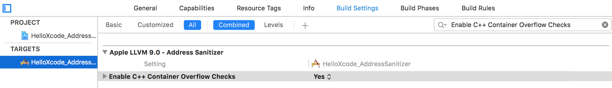
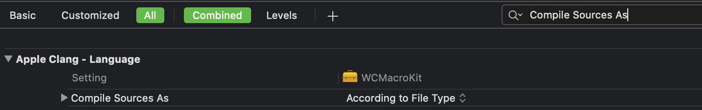
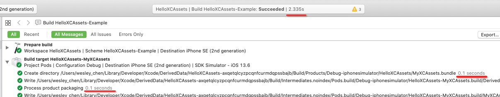

# 使用Xcode相关技巧

[TOC]

## 1、Xcode环境变量[^1]

`⌘ + ⇧ + ,`打开弹出框，Arguments > Environment Variables，输入环境变量。


常用环境变量，如下

| Environment variable | 作用 | 说明 |
|----------------------|-----|------|
| DYLD\_PRINT\_LIBRARIES | 输出image加载日志 | |
| DYLD\_PRINT\_ENV | 输出环境变量 | 通过C函数getenv也可以获取环境变量 |
| OBJC_PRINT_REPLACED_METHODS | 检测分类方法是否重复[^14] | 设置值为YES |


### （1）检测分类方法是否重复


```shell
objc[7366]: REPLACED: -[UIView setMultipleTouchEnabled:]  by category Addition  (IMP was 0x7fff24bda842 (/Applications/Xcode.app/Contents/Developer/Platforms/iPhoneOS.platform/Library/Developer/CoreSimulator/Profiles/Runtimes/iOS.simruntime/Contents/Resources/RuntimeRoot/System/Library/PrivateFrameworks/UIKitCore.framework/UIKitCore), now 0x1094b8700 (/Users/wesley_chen/Library/Developer/CoreSimulator/Devices/0F9D6E29-1CE0-43E7-B104-26C2CCD84DAE/data/Containers/Bundle/Application/2309AD94-8BDD-4F42-BC73-F1DDE8FAE81F/HelloXcode_CheckCategroyMethodConflict.app/HelloXcode_CheckCategroyMethodConflict))
```

TODO：脚本提取REPLACED:信息


## 2、Code Diagnostics[^2]

### （1）Address Sanitizer

Xcode打开Address Sanitizer（简称ASan）设置，如下


Address Sanitizer支持检查的类型，如下

* Use of Deallocated Memory
  * Detects when memory is used after being deallocated. （销毁后的内存被使用）
* Deallocation of Deallocated Memory
  * Detects when memory is freed after being deallocated.（销毁后的内存被销毁）

* Deallocation of Nonallocated Memory
  * Detects when nonallocated memory is freed.（销毁不能被释放的内存，一般是栈上的内存）

* Use of Stack Memory After Function Return
  * Detects when stack variable memory is accessed after its declaring function returns.
  * 开启这个功能，需要单独打开下面这个Detect use of stack after return设置


* Use of Out-of-Scope Stack Memory
  * Detects when variables are accessed outside of their declared scope.（访问栈上作用域之外的变量）

* Overflow and Underflow of Buffers
  * Detects when memory is accessed outside of a buffer’s boundaries.（缓冲区上溢或下溢，一般是数组越界的情况）

* Overflow of C++ Containers
  * Detects when a C++ container is accessed outside its bounds.（C++容器的越界情况，例如vector）
  * 开启这个功能，需要单独打开下面这个编译设置




### （2）Thread Sanitizer

Xcode打开Thread Sanitizer（简称TSan）设置，如下


目前TSan仅支持模拟器，不支持设备。

> TSan is supported only for 64-bit macOS and 64-bit iOS and tvOS simulators (watchOS is not supported). You cannot use TSan when running apps on a device.


Thread Sanitizer支持检查的情况，如下

* Data Races
  * Detects unsynchronized access to mutable state across multiple threads.（一般指存在多线程访问可读写的变量）

* Swift Access Races
  * Detects when multiple threads call a mutating method on the same structure, or pass a shared variable as `inout` without synchronization.

* Races on Collections and Other APIs
  * Detects when a thread accesses a mutable object while another thread writes to that object, causing a data race.（容器类mutable版本，存在多线程访问的问题）

> 上面三种情况，都可以归纳为Data Races。文档定义Data Races的行为是，multiple threads access the same memory without synchronization and at least one access is a write，即存在多个线程读访问相同的内存，并且至少有一个线程是写访问。


* Uninitialized Mutexes
  * Detects when a mutex is used before it's initialized.（一般指mutex使用前没有初始化）

* Thread Leaks
  * Detects when threads aren't closed after use.

> 经测试，Xcode 9.4.1 (9F2000)，没有检测到上面两种情况。


### （3）Main Thread Checker

Xcode默认打开Main Thread Checker设置，如下


​        文档上描述，Main Thread Checker设置，用于检测非主线程中更新UI的操作，同时指出非主线程中更新UI，会导致视图错误、数据损坏以及crash等问题。

> Updating UI on a thread other than the main thread is a common mistake that can result in missed UI updates, visual defects, data corruptions, and crashes.

​        注意：这里只是禁止非主线程更新UI，但是非主线程绘图还是可以的。异步刷新方式，就是采用非主线程绘图，然后主线程更新UI。

​       `libMainThreadChecker.dylib`提供Main Thread Checker功能，由于是动态库，不要重新编译，就可以使用Main Thread Checker功能。`libMainThreadChecker.dylib`位于**/Applications/Xcode.app/Contents/Developer/usr/lib/libMainThreadChecker.dylib**

> lipo -info libMainThreadChecker.dylib，检查发现libMainThreadChecker.dylib只有模拟器架构的。


### （4）Undefined Behavior Sanitizer

Xcode打开Undefined Behavior Sanitizer（简称UBSan）设置，如下


UBSan支持检查的类型以及对于编译器flags，如下

| UBSan check                                                  | Compiler flags                                               |
| ------------------------------------------------------------ | ------------------------------------------------------------ |
| [Misaligned Pointer](dash-apple-api://load?topic_id=2872636&language=occ) | `-fsanitize=alignment`                                       |
| [Invalid Boolean](dash-apple-api://load?topic_id=2872637&language=occ) | `-fsanitize=bool`                                            |
| [Out-of-Bounds Array Access](dash-apple-api://load?topic_id=2880310&language=occ) | `-fsanitize=bounds`                                          |
| [Invalid Enumeration Value](dash-apple-api://load?topic_id=2881022&language=occ) | `-fsanitize=enum`                                            |
| [Dynamic Type Violation](dash-apple-api://load?topic_id=2872638&language=occ) | `-fsanitize=vptr`                                            |
| [Invalid Float Cast](dash-apple-api://load?topic_id=2872639&language=occ) | `-fsanitize=float-cast-overflow `                            |
| [Division by Zero](dash-apple-api://load?topic_id=2872666&language=occ) | `-fsanitize=integer-divide-by-zero `<br/>`-fsanitize=float-divide-by-zero` |
| [Nonnull Variable Assignment Violation](dash-apple-api://load?topic_id=2891419&language=occ) |                                                              |
| [Nonnull Argument Violation](dash-apple-api://load?topic_id=2872667&language=occ) | `-fsanitize=nonnull-attribute `<br/>`-fsanitize=nullability-arg` |
| [Nonnull Return Value Violation](dash-apple-api://load?topic_id=2872668&language=occ) | `-fsanitize=returns-nonnull-attribute `<br/>`-fsanitize=nullability-return` |
| [Nonnull Variable Assignment Violation](dash-apple-api://load?topic_id=2891419&language=occ) | `-fsanitize=nullability-assign`                              |
| [Null Reference Creation and Null Pointer Dereference](dash-apple-api://load?topic_id=2872669&language=occ) | `-fsanitize=null `                                           |
| [Invalid Object Size](dash-apple-api://load?topic_id=2872670&language=occ) | `-fsanitize=object-size `                                    |
| [Invalid Shift](dash-apple-api://load?topic_id=2872671&language=occ) | `-fsanitize=shift `                                          |
| [Integer Overflow](dash-apple-api://load?topic_id=2872672&language=occ) | `-fsanitize=signed-integer-overflow`                         |
| [Reaching of Unreachable Point](dash-apple-api://load?topic_id=2872673&language=occ) | `-fsanitize=unreachable`                                     |
| [Invalid Variable-Length Array](dash-apple-api://load?topic_id=2872674&language=occ) | `-fsanitize=vla-bound`                                       |


* Misaligned Pointer

​        通过指针来存取值，一般需要按照值的类型来对齐内存地址。例如int32_t的大小是4 bytes，该值存放的内存地址应该是4的倍数。如果代码中指针指向的地址不遵守这种对齐规则，则称为Misaligned Pointer。

​       举个Misaligned Integer Pointer Assignment in C的例子，如下

```objective-c
- (void)test_Misaligned_Integer_Pointer_Assignment_in_C {
    int8_t *buffer = malloc(64);
    printf("%s: %p\n", [NSStringFromSelector(_cmd) UTF8String], buffer);
    int32_t *pointer = (int32_t *)(buffer + 1);
    *pointer = 42; // Error: misaligned integer pointer assignment
    printf("%d\n", *pointer); // Error: misaligned integer pointer access
}
```

​     buffer是分配64 bytes的首地址，malloc保证返回内存对齐的地址[^3]，因此buffer是内存对齐的，而pointer是buffer+1，并不是内存对齐的。使用pointer指针来存整型值42，以及取值，都会触发UBSan的警告。

> 尽管打印的值也是正确的，但这种内存不对齐会影响性能，而且会有Undefined Behavior

​     如果明确要存取不对齐的内存地址，可以直接使用`memcpy`函数。另外，结构体指针还可以使用`__attribute__((packed))`来允许不对齐的地址。

​     举个Misaligned Structure Pointer Assignment in C的例子，如下

```objective-c
- (void)test_Misaligned_Structure_Pointer_Assignment_in_C {
    struct A {
        int32_t i32;
        int64_t i64;
    } /* __attribute__((packed)) */;
    
    int8_t *buffer = malloc(32);
    printf("%s: %p\n", [NSStringFromSelector(_cmd) UTF8String], buffer);
    struct A *pointer = (struct A *)(buffer + 1);
    pointer->i32 = 7; // Error: pointer is misaligned
    pointer->i64 = 8; // Error: pointer is misaligned
}
```

​        比较明显，pointer也是Misaligned Pointer。这里i32字段，编译器会自动按照8对齐并且4 byte后面再增加4个byte padding，这样保证i64能满足按8对齐。但是pointer地址没有对齐，导致pointer->i32和pointer->i64都是misaligned。

​        在结构体定义处，标记`__attribute__((packed))`，可以禁止编译器在结构体成员之间增加padding，这样i32内存大小是4 bytes，对于pointer->i32和pointer->i64的内存地址不对齐，UBSan不会再报错提示。


## 3、Xcode编译配置


### （1）Compile Sources As

Compile Sources As配置位于

`Build Settings > Apple Clang - Language > Compile Sources As`

一般不做改动时，如下




缺省属性值，如下

```properties
GCC_INPUT_FILETYPE=automatic
```

根据文件类型，决定编译的语言。一般来说，选择默认方式，是最优的编译方式。

举个例子，.m文件一般是按照Objective-C编译，如果选择Objective-C++编译则产生的二进制体积会变大。


### （2）常用编译配置


| Declaration                                   | Value Type | Summary                                                      | Comment                                                      |
| --------------------------------------------- | ---------- | ------------------------------------------------------------ | ------------------------------------------------------------ |
| CLANG_ENABLE_MODULES                          | BOOL       | Enables the use of modules for system APIs. System headers are imported as semantic modules instead of raw headers. This can result in faster builds and project indexing. | 当某个target开启CLANG_ENABLE_MODULES=YES，它依赖的target也必须是module，否则会报下面错误，“error: include of non-modular header inside framework module 'XXX.YYY': 'zzz.h' [-Werror,-Wnon-modular-include-in-framework-module]” |
| CLANG_WARN_QUOTED_INCLUDE_IN_FRAMEWORK_HEADER | TODO       |                                                              |                                                              |


## 4、Xcode安装低版本模拟器

Xcode默认内置一个版本的模拟器运行时文件（后简称simruntime文件），如下

```text
/Applications/Xcode.app/Contents/Developer/Platforms/iPhoneOS.platform/Developer/Library/CoreSimulator/Profiles/Runtimes/iOS.simruntime
```

iOS.simruntime是一个文件夹，里面Contents/Info.plist的Bundle name是显示simruntime文件的当前版本。


通过Xcode的Preferences > Components下载的模拟器，存放在下面路径

```text
/Library/Developer/CoreSimulator/Profiles/Runtimes
```


将事先保存过的simruntime文件，放在上面文件夹下，重启Xcode让读取到，省去重新下载模拟器的麻烦。


## 5、介绍Xcode的Build Settings[^4]

​      Xcode Build Settings文档，之前是[Xcode Build System Guide](https://developer.apple.com/library/archive/documentation/DeveloperTools/Reference/XcodeBuildSettingRef/1-Build_Setting_Reference/build_setting_ref.html)，但是现在已经废弃，官方推出新的[Xcode Build Settings文档](https://help.apple.com/xcode/mac/10.2/#/itcaec37c2a6)。


Xcode的编译系统的底层，使用三个编译工具，分别是

* Clang Cxx编译器（Clang Cxx Compiler），用于编译C/C++和Objective-C
* Swift编译器（Swift Compiler）
* 链接器（Linker），用于链接object文件

Clang编译器和链接器的文档，官方提供在[这里](https://clang.llvm.org/docs/ClangCommandLineReference.html)。Swift编译器的文档，使用`swift --help`命令查看。


​      Xcode的Build Settings上的UI设置，实际上，将设置转成底层编译工具的特定flag参数。例如，设置`GCC_TREAT_WARNINGS_AS_ERRORS=YES`，实际是将`-Werror`flag参数传给Clang Cxx编译器。

又例如，`SWIFT_TREAT_WARNINGS_AS_ERRORS=YES`，实际是将`-warnings-as-errors`flag参数传给Swift编译器。

某些Build Settings设置，会转成三个编译工具的编译选项，例如`CLANG_ENABLE_CODE_COVERAGE = YES`，会添加下面参数到三个编译工具

* `-profile-instr-generate`和`-fcoverage-mapping`给Clang编译器
* `-profile-coverage-mapping`和`-profile-generate`给Swift编译器
* `-fprofile-instr-generate`给链接器


​        Build Settings到编译工具选项的映射，通过`.xcspec`文件来维护的，这些文件位于Xcode.app中。

​        以Xcode 11.2为例，如下表

| 编译工具    | `.xcspec`文件         | 位置                                                         |
| ----------- | --------------------- | ------------------------------------------------------------ |
| Clang编译器 | Clang LLVM 1.0.xcspec | Xcode.app/Contents/PlugIns/Xcode3Core.ideplugin/Contents/SharedSupport/Developer/Library/Xcode/Plug-ins/Clang LLVM 1.0.xcplugin/Contents/Resources/Clang LLVM 1.0.xcspec |
| Swift编译器 | Swift.xcspec          | Xcode.app/Contents/PlugIns/Xcode3Core.ideplugin/Contents/SharedSupport/Developer/Library/Xcode/Plug-ins/XCLanguageSupport.xcplugin/Contents/Resources/Swift.xcspec |
| 链接器      | Ld.xcspec             | Xcode.app/Contents/PlugIns/Xcode3Core.ideplugin/Contents/SharedSupport/Developer/Library/Xcode/Plug-ins/CoreBuildTasks.xcplugin/Contents/Resources/Ld.xcspec |

> `.xcspec`文件实际上是ASCII类型plist文件，修改后缀名或直接用文本工具打开。


​       上面xcspec文件用于描述一个或多个编译工具（xcspec文件中的Name字段），例如Clang LLVM 1.0.xcspec包含Clang编译器（Name=Apple Clang）、分析器（Name=Static Analyzer）、迁移器（Name=ObjC Migrator、XCTest Migrator）和AST工具（Name=AST Builder）


每个工具描述（tool specification）


### （1）常用Build Settings

#### INCLUDED_SOURCE_FILE_NAMES

作用：包含特定的源文件

值类型：数组，元素是pattern（A list of patterns）

示例[^13]

```properties
MACOS_FILES = */macOS/* *~macos.*
IOS_FILES = */iOS/* *~ios.*
TVOS_FILES = */tvOS/* *~tvos.*
WATCHOS_FILES = */watchOS/* *~watchos.*

EXCLUDED_SOURCE_FILE_NAMES = $(MACOS_FILES) $(IOS_FILES) $(TVOS_FILES) $(WATCHOS_FILES)

INCLUDED_SOURCE_FILE_NAMES =
INCLUDED_SOURCE_FILE_NAMES[sdk=mac*] = $(MACOS_FILES)
INCLUDED_SOURCE_FILE_NAMES[sdk=iphone*] = $(IOS_FILES)
INCLUDED_SOURCE_FILE_NAMES[sdk=appletv*] = $(TVOS_FILES)
INCLUDED_SOURCE_FILE_NAMES[sdk=watch*] = $(WATCHOS_FILES)
```


#### EXCLUDED_SOURCE_FILE_NAMES

作用：过滤掉特定的源文件

值类型：数组，元素是pattern（A list of patterns）

示例，见INCLUDED_SOURCE_FILE_NAMES


## 6、Xcode常见问题

### （1）编译问题

#### a. Xcode 12上block签名和实现，参数类型不一致报错

举个例子[^10]，如下

```
Incompatible block pointer types sending 'PINMemoryCacheObjectBlock _Nullable __strong' (aka 'void (^__strong)(PINMemoryCache * _Nonnull __strong, NSString * _Nonnull __strong, id _Nullable __strong)') to parameter of type 'PINCacheObjectBlock _Nonnull' (aka 'void (^)(id _Nonnull __strong, NSString * _Nonnull __strong, id _Nullable __strong)')
```

Xcode 12上将严格校验block签名和实现，上面block实现的第一个参数类型是PINMemoryCache *，而block签名的第一个参数类型是id。


解决方法

1. 修改代码将签名保持一致
2. 在Build Settings的`OTHER_CFLAGS`选项中添加`-Xclang -fcompatibility-qualified-id-block-type-checking`，抑制编译报错

```ruby
s.pod_target_xcconfig = { 
  'OTHER_CFLAGS' => '-Xclang -fcompatibility-qualified-id-block-type-checking',
}
```


### （2）app启动问题

#### a. Expected in: /Library/Developer/CoreSimulator/Profiles/Runtimes/iOS 11.1.simruntime/Contents/Resources/RuntimeRoot/usr/lib/libobjc.A.dylib[^5]


运行时报错：Expected in: /Library/Developer/CoreSimulator/Profiles/Runtimes/iOS 11.1.simruntime/Contents/Resources/RuntimeRoot/usr/lib/libobjc.A.dylib

原因：工程中存在子工程，而子工程的deployment target版本高于主工程的deployment target版本

解决方法：修改所有子工程的deployment target版本，使它低于或等于主工程的deployment target版本


### （3）运行时问题


## 7、Simulator常见问题

### （1）本地图片无法拖拽到Simulator中

本地图片拖拽到iPhone 11 Pro Max 13.1，报错如下

```
One or more media items failed to import:
/Users/dev/Desktop/images/Fotolia_8598911.jpg: The operation couldn’t be completed. (PHPhotosErrorDomain error -1.)
```


#### 解决方法

找到System Preferences > Security & Privacy > Full Disk Access，选择+号，将Simulator添加进来[^6]。

> Simulator的位置可以通过Show in Finder找到


### （2）不支持APNS通知显示

Xcode 11.4的模拟器上，开始支持模拟APNS通知[^7]。

APNS通知数据格式，如下

```json
{
    "Simulator Target Bundle": "np.com.sagunrajlage.TestPushNotifications",
    "aps": {
        "alert": "Push Notifications Test",
        "sound": "default",
        "badge": 1
    }
}
```

这是JSON格式的apns文件，扩展名为apns。


有两种方式模拟APNS推送

* 使用命令行方式

```shell
$ xcrun simctl push <device> com.example.my-app ExamplePush.apns
```

* 拖拽apns文件到模拟器上

注意：这种方式要求apns文件，必须指定`Simulator Target Bundle`字段


### （3）显示touch indicator[^12]

执行下面的命令，如下

```shell
$ defaults write com.apple.dt.Xcode IDEIndexerActivityShowNumericProgress 1
```

当鼠标按下时，模拟器会显示圆形的touch indicator。


## 8、Xcode常用配置

### （1）开启Xcode编译的耗时统计[^8]

```shell
$ defaults write com.apple.dt.Xcode ShowBuildOperationDuration -bool YES
$ defaults read com.apple.dt.Xcode ShowBuildOperationDuration           
1
```

设置成功后重新启动Xcode，编译过程每个操作会显示耗时时间，如下图




## 9、创建常用Target

### （1）iOS Resource Bundle[^9]

​       在TARGETS栏中，点击左下角+号，选择macOS > Bundle，输入bundle的名字，一般以[framework/static library name]-[resource bundle]的规则来命名

相关改动配置

* Base SDK，选择iOS。Bundle结构会按照iOS系统的方式。
* Product Name，换成期望的名字。默认使用Target的名字。
* 去掉Info.plist以及相关文件夹，Info.plist File设置为空，删除Info.plist文件以及所在的文件夹
  * 默认会生成Info.plist，这个文件不大，但是bundle多了之后，也会占用包大小，可以去掉


## 10、Xcode代码特殊注释标记[^11]

TODO


## Reference

[^1]: https://developer.apple.com/library/content/documentation/DeveloperTools/Conceptual/DynamicLibraries/100-Articles/LoggingDynamicLoaderEvents.html
[^2]: https://developer.apple.com/documentation/code_diagnostics 

[^3]: https://stackoverflow.com/questions/8575822/which-guarantees-does-malloc-make-about-memory-alignment 
[^4]:https://heartbeat.fritz.ai/xcode-build-settings-in-depth-733667d01a9a

[^5]:https://stackoverflow.com/questions/39486064/xcode-8-ios-8-simulator-with-crash-dyld-lazy-symbol-binding-failed-symbol-n

[^6]:https://forums.developer.apple.com/thread/126307

[^7]:https://medium.com/better-programming/how-to-send-push-notifications-to-the-ios-simulator-2988092ba931

[^8]:https://chaosky.tech/2020/04/20/optimize-xcode-build-time/

[^9]:https://medium.com/@09mejohn/resource-bundles-in-ios-static-library-beba3070fafd

[^10]:https://github.com/pinterest/PINCache/issues/275

[^11]:https://stackoverflow.com/questions/7600435/what-source-comments-does-xcode-recognize-as-tags

[^12]:https://apple.stackexchange.com/questions/203044/enable-touch-indicator-for-ios-app-demo-video-recording

[^13]:https://davedelong.com/blog/2018/07/25/conditional-compilation-in-swift-part-2/

[^14]:https://developer.apple.com/library/archive/qa/qa1908/_index.html#//apple_ref/doc/uid/DTS40016829-CH1-FIND


