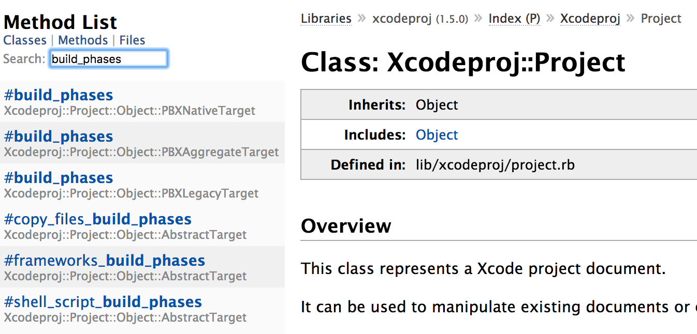

## xcodeproj Tutorial

### 1. 学习材料

* GitHub Home, [https://github.com/CocoaPods/Xcodeproj](https://github.com/CocoaPods/Xcodeproj)
* gem documentation, [http://www.rubydoc.info/gems/xcodeproj](http://www.rubydoc.info/gems/xcodeproj)
* Dash安装xcodeproj文档


### 2. 安装xcodeproj

```
$ gem install xcodeproj
```

### 3. 基本概念

Xcodeproj模块的类结构图，如下

```
Xcodeproj
	Command < Command
	Config < Object
	Constants
	Differ
	Helper
	Informative < PlainInformative
	PlainInformative < StandardError
	Plist
	Project < Object
	UserInterface
	Workspace < Object
	XCScheme < Object
	XcodebuildHelper < Object
```

* xcodeproj是ruby写的gem，gem类似包的概念。
* `Xcodeproj`是Module，它包含的很多类（e.g. `Project`）是对应Xcode工程的配置文件（project.pbxproj等）。对这些Class对象进行配置，然后保存，达到修改Xcode工程的配置文件的目的。
* 一个.xcodeproj文件，实际是一个文件夹，类似bundle。如下

```
XXX.xcodeproj
	project.pbxproj
	project.xcworkspace
	xcuserdata
```

* project.pbxproj是一个plist文件，root对象是NSDictionary，可以用PlistEdit Pro打开。根据.pbxproj的结构，对照`Project`的[方法列表](http://www.rubydoc.info/gems/xcodeproj/Xcodeproj/Project)基本可以了解如何用脚本配置Xcode。



Note: #method是实例方法，method是类方法

### 4. 修改pbxproj文件

基本步骤，如下

* 打开xcodeproj文件

`project = Xcodeproj::Project.open(<path/to/XXX.xcodeproj>)`

* 对`project`对象进行修改，例如设置Other Linker Flags为-ObjC，如下

```ruby
require 'xcodeproj'

project_path = './Sample/Sample.xcodeproj'
project = Xcodeproj::Project.open(project_path)

# loop all targets
project.targets.each do |target|
  # loop Debug/Release/...
  target.build_configurations.each do |config|
    # Output all modified key/values
    puts config.name + ': '
    puts config.build_settings
    # overwrite 'Other Linker Flags'
    config.build_settings['OTHER_LDFLAGS'] = '-ObjC'
  end
  puts '------------'
end

# if not save, modification won't work
project.save()
```

* 对`project`对象进行保存，调用`project.save()`。Note：xcodeproj保存采用xml格式，和Xcode保存NSDictionary打印格式不一样。
